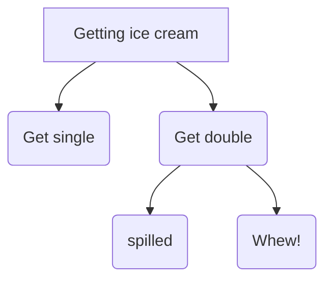
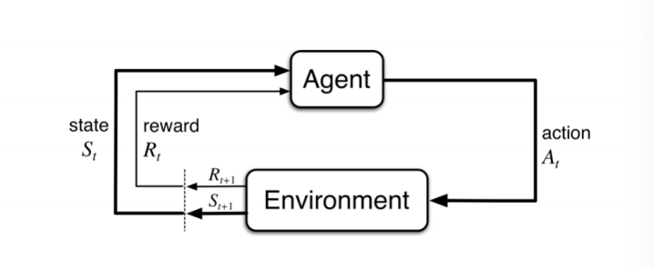
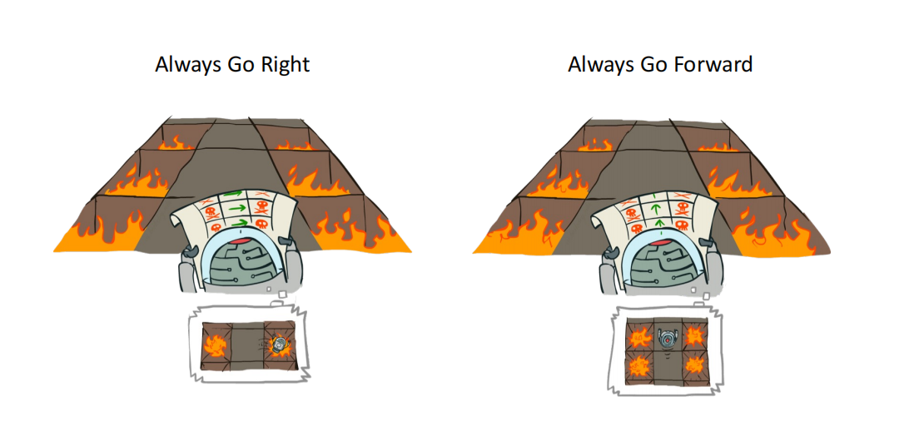
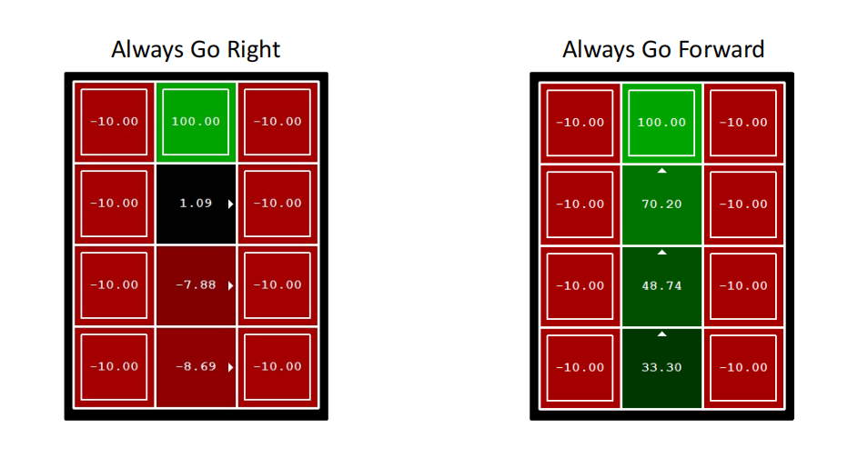
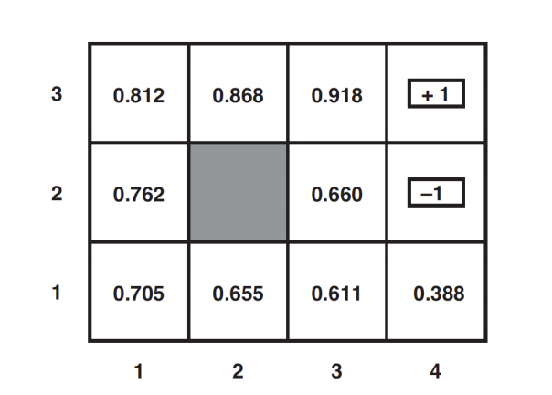
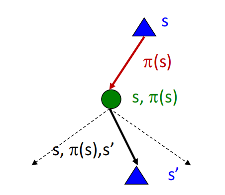

# Decision Making Under Uncertainty

### Motivation 
Uncertainty Everywhere
> Sources of uncertainty:
> - Inherently random process (dice, etc)
> - Insufficient or weak evidence
> - Ignorance of underlying processes
> - Unmodeled variables
> - The world’s just noisy – it doesn’t behave according to plan!

### Utility Function
- Captures an agent's preference between world states
- Assign single number to express desirability of a state
- The utility of state S is denoted by U(S)



### Maximum Expected Utility(MEU)
- Outcome of action is non-deterministic
- Result of action A is $Result_i(A)$ (a state)
- Given evidence **E(measurements)** the probability for each result is: $P(Result_i(A)|Do(A),E)$
- Principle of maximum expected utility:
- A rational agent picks an action that maximizes the expected utility, given its knowledge
 $\arg\max_A\sum_{i}P(Result_i(A)|Do(A),E)\bigcup (Result_i(A))$

### MEU not so easy to apply
- State of the world?(partially observable at best)
- How to compute $P(Result_i(A)|Do(A),E)$ ? Requires a model of the world
- Also need to consider one action (one shot decision) vs. sequential decisions
- Utility of a state?

### The value of information
- Asking for information is one of the most important actions
- Information is acquired through "sensing actions"
- Information typically has a cost
- Agent must ask itself, what information to ask for?   

- Information has **value** if it might change your action
- Value = difference between **expected value with and without the information**

### Sequential Decisions
- A one step horizon (one action) often not good enough
- Sequential environments!

#### Seq. Decisions example: Grid World

- A maze-like problem
    - The agent lives in a grid
    - Walls block the agent's path
- Noisy movement: actions (Up, Down, Left, Right) do not always go as planned
    - 80% of the time, the intended outcome occurs (if there is no wall there)
    - 20% of the time, the agent moves at right angles to the intended direction
    - If there is a wall in the direction the agent would have been taken, the agent stays put(留在原地)
- The agent receives rewards each time step
    - Small "living" reward each step (can be negative)
    - Big rewards come at the end (good or bad)
- Goal: maximize sum of rewards


#### What is the probability that a predefined pan succeeds?
- Plan: Up, Up, Right, Right, Right
- Probability to succeed: 0.32776


#### Connection to HMM:
- Markov Model: Each square can be regarded as a state
- The transition function defines the probability transitioning from one state to another
- In decision making, each action is associated with its own transition function
    - select action to control the system to behave in some desired way or maximize the chance of achieving some goal
>“Markov” generally means that given the present state, the future and the past are independent

### Markov Decision Process(MDP) Formulation
- Mathematical model: Markov Decision Process($S$, $A$, $T$, $R$, $\gamma$)
    - State Space $S$
    - Action space $A$
    - Environment Transition model $T$
    - Reward Function $R$
    - Discount factor $\gamma$
    - A start state $S_0$
    - Maybe a terminal state



- $T(s,a,s'):p(s_{t+1}=s'|s_t=s, a_t=a)$
- $R(s,a,s')$: immediate reward for transitioning from state $s$ to state $s'$ due to action $a$
> frequently reward depends only on the state, so we usually write R(s)

### Transition Model
- Now function of the action
- $T(s,a,s')$ (First order Markov assumption*)
    - Probability to reach s' starting from s given action a


- T depends only on the previous state s and not the rest of the history

### Solution to MDP
- In deterministic single-agent search problems, we wanted an optimal **plan**, or sequence of actions, form start to a goal
- A solution to an MDP cannot be a fixed plan(non-determinstic world, need to sense state)
- For MDPs, we want an optimal policy $\pi^*:S\to A$
    - A policy $\pi$ gives an action for any state
    - An optimal policy is one that maximizes expected utility if followed

- stationary vs nonstationary policies:
    - a stationary policy will always choose the same action in the same state, independent of time, while a non-stationary policy can choose different action in the same state, depending on time.

### How good is a policy?
- How to measure the quality of a policy?
- $\to$ Measure expected utility over the history (Stochastic Env means that we need to use expectations)
- Optimal policy: $\pi^*$: highest possible expected utility

#### Utility of sequences:
- Additive rewards: $U_h([s_0, s_1, ... s_n]) = R(s_0)+ R(s_1)+...+ R(s_n)$
- What about infinite sequences?
    - Might get $\infty$ without terminal state
    - How to compare $\infty$ and $\infty$?

### Discounted rewards
- Idea: Give less weight to future rewards (e.g. rewards decay exponentially)
- Captures that rewards "tomorrow" is less certain
- Use discount factor $\gamma$, $0<\gamma<1$
    - $$U_h([s_0, s_1, ... s_n]) = R(s_0)+ \gamma R(s_1)+ \gamma^2 R(s_2) ...$$

- Gives bounded utility: $$R(s)\le R_{max} \Rightarrow U_h\le \sum_{i=0}^{\infty}\gamma^iR_{max} = R_{max}\frac{1}{1-\gamma}$$ 
>The formula for the sum of an infinite geometric progression (or series) is as follows: S = a / (1 - r) 

### Selecting the best policy
- How do we select the best policy?
    - i.e. choice of action for each state
- Many state sequences to compare…
- As before, maximize expected utility
$$\pi^* = \arg\max_{\pi}E[\sum_{t=0}^{\infty }\gamma^tR(s_t)|\pi]$$
The following is the sum of discounted rewards:
$$[\sum_{t=0}^{\infty }\gamma^tR(s_t)|\pi]$$ 

### Policy Evaluation





### Utilities of states
- The utilities of the states in the 4X3 world, calculated with $\gamma=1$ and $R(s)=-0.04 for nonterminal states.



### Bellman Equation
- How to be optimal:
    - Step 1: Take correct first action
    - Step 2: Keep being optimal
- Bellman Equation:
$$U_{i+1}(s)\gets R(s)+\gamma \max_{a}\sum_{s'}T(s,a,s')U_i(s')$$
- $R(s)$: immediate reward
- $\gamma \max_{a}\sum_{s'}T(s,a,s')U_i(s')$ :discounted expected utility of the next state, assunming optimal action

- Converges to unique optimal solution
- Stop iterations when largest change in utility for any state is small enough 
- Can show that:
$$\left\| U_{i+1}-U_i \right\|\lt \epsilon \frac{1-\gamma}{\gamma} \Rightarrow \left\| U_{i+1}-U_i \right\|\lt \epsilon$$

### Value Iteration
- Key insight: Utility of a state is immediate reward plus discounted expected utility of next states(assuming that we choose the optimal policy)
$$U(s)=R(s)+\gamma\max_{a}\sum_{s'}T(s,a,s')U(s')$$
-Idea: Iterate
    - Calculate utility of each state
    - Use utilities to select optimal decision in each state

#### Algorithm: Value iteration
```
Initialize U(s) arbitrarily for all s
Loop until policy has converfed
    loop over all states, s
        loop over all actions, a
            Q(s,a):=R(s)+γΣ_(s')[T(s,a,s')*U(s')]
        end
        U(s):=\max_a Q(s,a)
    end
end
```

#### Problems with Value Iteration
- Value iteration repeats the Bellman updates:
$$U(s)=R(s)+\gamma\max_{a}\sum_{s'}T(s,a,s')U(s')$$

- Problem 1: It's slow - $O(S^2A)$ per iteration
- Problem 2: The "max" at rach state rarely changes
- Problem 3: The policy often converges long before the values

#### Algorithm: Policy iteration
- Choose an arbitrary policy
- Loop until the policy does not change any more
    - Policy evaluation: Compute the value function $V(s)$ until convergence , given the fixed policy(not optimal values):
$$V(s)=\sum_{s'\in \mathcal{S}}T(s,\pi(s),s')[R(s,\pi(s),s')+\gamma V(s')],\forall s \in \mathcal{S}$$
        - $T(s,a,s'):p(s_{t+1}=s'|s_t=s, a_t=a)$
        - $R(s,a,s')$: immediate reward for transitioning from state $s$ to state $s'$ due to action $a$




- Policy improvement: Given this value function, improve the policy for each state

$$\pi(s)\gets \arg \max_a \sum_{s'\in \mathcal{S}}T(s,a,s')[R(s,a,s')+\gamma V(s')]$$