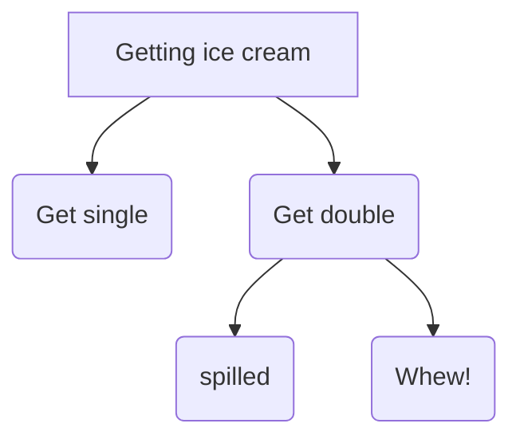

# Decision Making Under Uncertainty

### Motivation 
Uncertainty Everywhere
> Sources of uncertainty:
> - Inherently random process (dice, etc)
> - Insufficient or weak evidence
> - Ignorance of underlying processes
> - Unmodeled variables
> - The world’s just noisy – it doesn’t behave according to plan!

### Utility Function
- Captures an agent's preference between world states
- Assign single number to express desirability of a state
- The utility of state S is denoted by U(S)

### Maximum Expected Utility(MEU)
- Outcome of action is non-deterministic
- Result of action A is $Result_i(A)$ (a state)
- Given evidence **E(measurements)** the probability for each result is: ** $P(Result_i(A)|Do(A),E)$ **
- Principle of maximum expected utility:
- A rational agent picks an action that maximizes the expected utility, given its knowledge
> $\arg\min_A\sum_{i}P(Result_i(A)|Do(A),E)\bigcup (Result_i(A))$