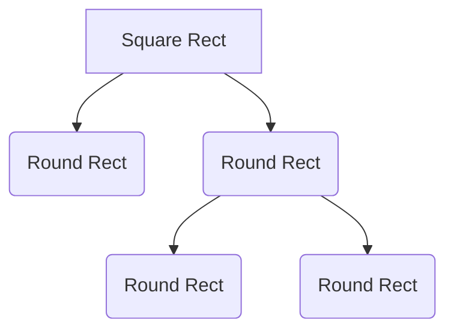

# Decision Making Under Uncertainty

### Motivation 
Uncertainty Everywhere
> Sources of uncertainty:
> - Inherently random process (dice, etc)
> - Insufficient or weak evidence
> - Ignorance of underlying processes
> - Unmodeled variables
> - The world’s just noisy – it doesn’t behave according to plan!

### Utility Function
- Captures an agent's preference between world states
- Assign single number to express desirability of a state
- The utility of state S is denoted by U(S)

