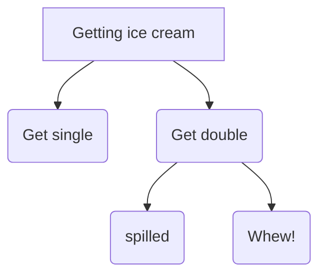

# Decision Making Under Uncertainty

### Motivation 
Uncertainty Everywhere
> Sources of uncertainty:
> - Inherently random process (dice, etc)
> - Insufficient or weak evidence
> - Ignorance of underlying processes
> - Unmodeled variables
> - The world’s just noisy – it doesn’t behave according to plan!

### Utility Function
- Captures an agent's preference between world states
- Assign single number to express desirability of a state
- The utility of state S is denoted by U(S)

### Maximum Expected Utility(MEU)
- Outcome of action is non-deterministic
- Result of action A is $Result_i(A)$ (a state)
- Given evidence **E(measurements)** the probability for each result is: $P(Result_i(A)|Do(A),E)$
- Principle of maximum expected utility:
- A rational agent picks an action that maximizes the expected utility, given its knowledge
 $\arg\max_A\sum_{i}P(Result_i(A)|Do(A),E)\bigcup (Result_i(A))$

 ### MEU not so easy to apply
 - State of the world?(partially observable at best)
 - How to compute $P(Result_i(A)|Do(A),E)$ ? Requires a model of the world
 - Also need to consider one action (one shot decision) vs. sequential decisions
 - Utility of a state?

 ### The value of information
 - Asking for information is one of the most important actions
 - Information is acquired through "sensing actions"
 - Information typically has a cost
 - Agent must ask itself, what information to ask for?
 - Information has **value** if it might change your action
 - Value = difference between **expected value with and without the information**

  ### Sequential Decisions
  - A one step horizon (one action) often not good enough
  - Sequential environments!

  #### Seq. Decisions example: Grid World
  ##### A maze-like problem
  - The agent lives in a grid