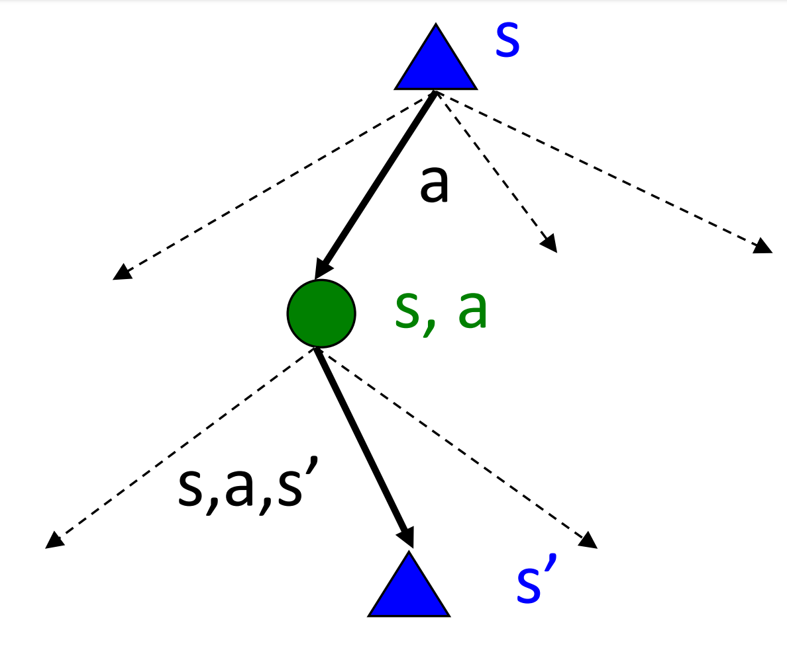

# Decision Making Under Uncertainty

### Motivation 
Uncertainty Everywhere
> Sources of uncertainty:
> - Inherently random process (dice, etc)
> - Insufficient or weak evidence
> - Ignorance of underlying processes
> - Unmodeled variables
> - The world’s just noisy – it doesn’t behave according to plan!

### Utility Function
- Captures an agent's preference between world states
- Assign single number to express desirability of a state
- The utility of state S is denoted by U(S)

### Maximum Expected Utility(MEU)
- Outcome of action is non-deterministic
- Result of action A is $Result_i(A)$ (a state)
- Given evidence **E(measurements)** the probability for each result is: $P(Result_i(A)|Do(A),E)$
- Principle of maximum expected utility:
- A rational agent picks an action that maximizes the expected utility, given its knowledge
 $\arg\max_A\sum_{i}P(Result_i(A)|Do(A),E)\bigcup (Result_i(A))$

### MEU not so easy to apply
- State of the world?(partially observable at best)
- How to compute $P(Result_i(A)|Do(A),E)$ ? Requires a model of the world
- Also need to consider one action (one shot decision) vs. sequential decisions
- Utility of a state?

### The value of information
- Asking for information is one of the most important actions
- Information is acquired through "sensing actions"
- Information typically has a cost
- Agent must ask itself, what information to ask for?   

- Information has **value** if it might change your action
- Value = difference between **expected value with and without the information**

### Sequential Decisions
- A one step horizon (one action) often not good enough
- Sequential environments!

#### Seq. Decisions example: Grid World

- A maze-like problem
    - The agent lives in a grid
    - Walls block the agent's path
- Noisy movement: actions (Up, Down, Left, Right) do not always go as planned
    - 80% of the time, the intended outcome occurs (if there is no wall there)
    - 20% of the time, the agent moves at right angles to the intended direction
    - If there is a wall in the direction the agent would have been taken, the agent stays put(留在原地)
- The agent receives rewards each time step
    - Small "living" reward each step (can be negative)
    - Big rewards come at the end (good or bad)
- Goal: maximize sum of rewards

#### What is the probability that a predefined pan succeeds?
- Plan: Up, Up, Right, Right, Right
- Probability to succeed: 0.32776

#### Connection to HMM:
- Markov Model: Each square can be regarded as a state
- The transition function defines the probability transitioning from one state to another
- In decision making, each action is associated with its own transition function
    - select action to control the system to behave in some desired way or maximize the chance of achieving some goal
>“Markov” generally means that given the present state, the future and the past are independent

### Markov Decision Process(MDP) Formulation
- Mathematical model: Markov Decision Process($S$, $A$, $T$, $R$, $\gamma$)
    - State Space $S$
    - Action space $A$
    - Environment Transition model $T$
    - Reward Function $R$
    - Discount factor $\gamma$
    - A start state $S_0$
    - Maybe a terminal state

- $T(s,a,s'):p(S_t+1=s'|s_t=s, a_t=a)$
- $R(s,a,s')$: immediate reward for transitioning from state $s$ to state $s'$ due to action $a$
> frequently reward depends only on the state, so we usually write R(s)

### Transition Model
- Now function of the action
- $T(s,a,s')$ (First order Markov assumption*)
    - Probability to reach s' starting from s given action a

- T depends only on the previous state s and not the rest of the history

### Solution to MDP
- In deterministic single-agent search problems, we wanted an optimal **plan**, or sequence of actions, form start to a goal
- A solution to an MDP cannot be a fixed plan(non-determinstic world, need to sense state)
- For MDPs, we want an optimal policy $\pi^*:S\to A$
    - A policy $\pi$ gives an action for any state
    - An optimal policy is one that maximizes expected utility if followed

### How good is a policy?
- How to measure the quality of a policy?
- $\to$ Measure expected utility over the history (Stochastic Env means that we need to use expectations)
- Optimal policy: $\pi^*$: highest possible expected utility

#### Utility of sequences:
- Additive rewards: $U_h([s_0, s_1, ... s_n]) = R(s_0)+ R(s_1)+...+ R(s_n)$
- What about infinite sequences?
    - Might get $\infty$ without terminal state
    - How to compare $\infty$ and $\infty$?
    