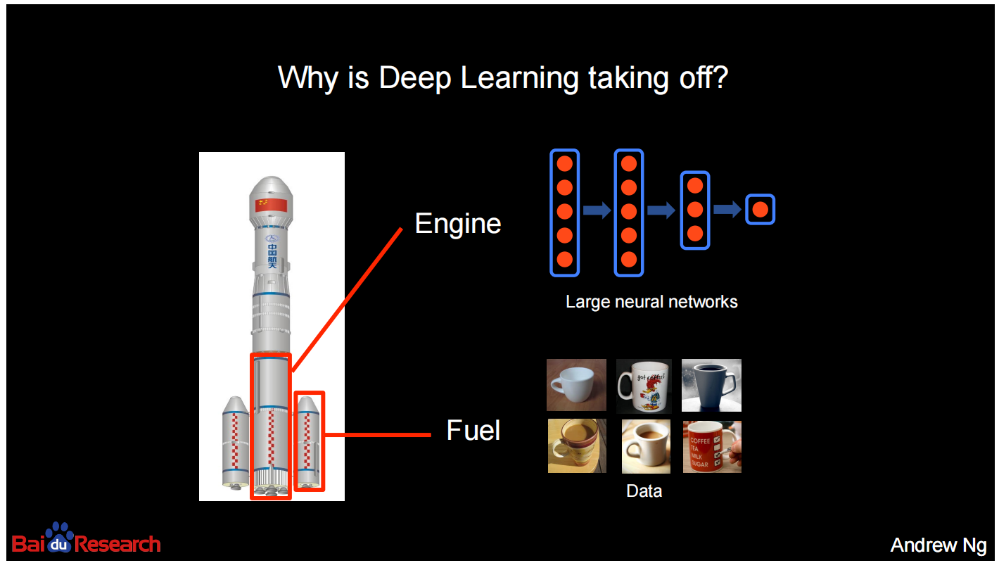
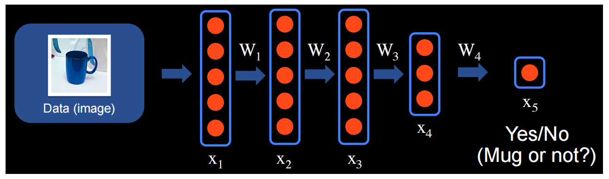
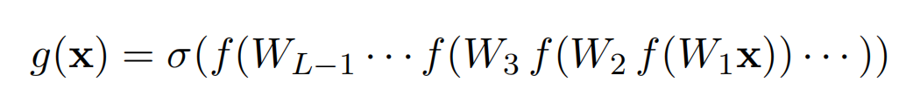
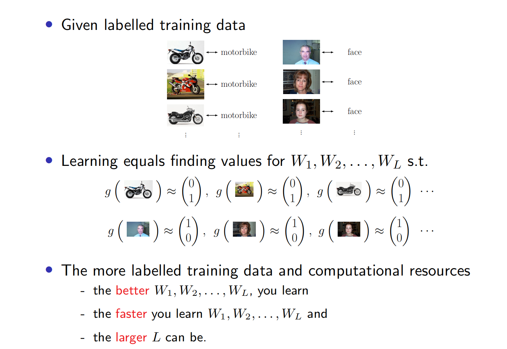
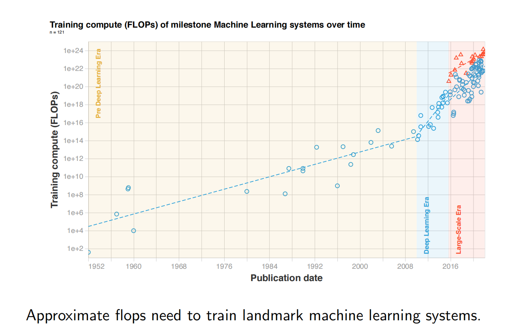
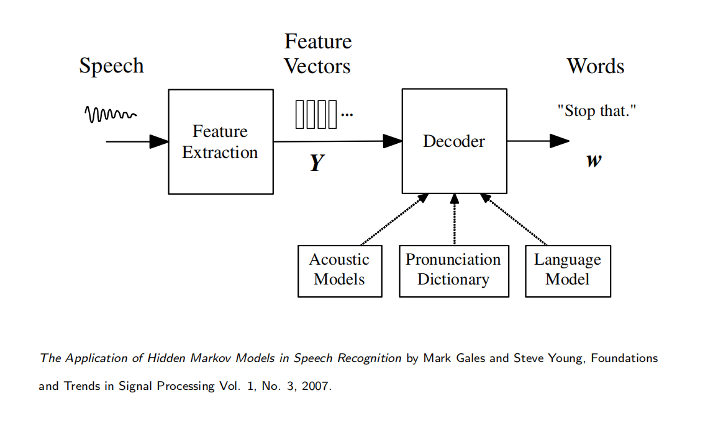
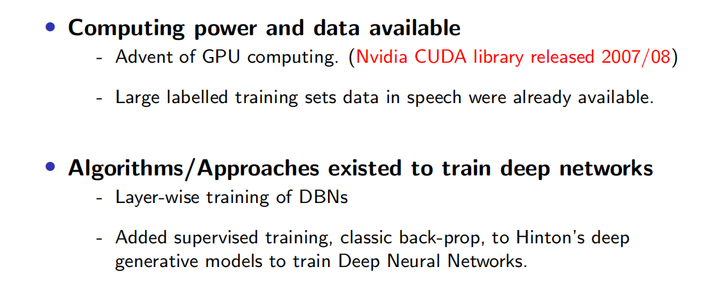
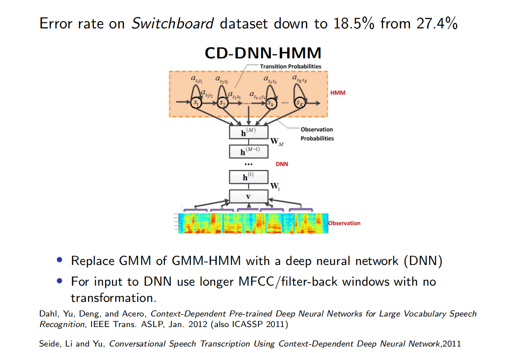

# The deep learning revolution

- What is driving this rapid progress of AI development (like GPT, sora, etc. )
- Deep Learning at massive scales 深度学习的大规模运用

- Progress also driven by:
    - Similar solutions for different tasks in different domains （相似任务在不同领域的解决方案：许多AI任务在不同的领域都存在相似的解决方案。一旦在一个领域中取得了进展，这些解决方案就可以迁移到其他领域，并进行相应的调整和优化。这种跨领域的知识共享和技术转移加速了AI技术的发展速度。）
    - General formula for improving results:（在深度学习中，一般的方法是通过增加神经网络的规模、提供更多的训练数据以及增加计算资源来改进结果）
        - bigger networks
        - more training data
        - more compute

- Which methods are producing these results?
- At the start Neural Networks trained with lots of （labelled） data
- （Luckily many of the training mechanisms for “unlabelled” data are similar totraining in the labelled regime. Self-supervised learning covered later on in course.）

## Most successful example of self-supervision

- Self-supervised learning for Large Language Models: GPT-3, BERT variations, etc...
- How:
    - **Unlabelled data** :  Collect many valid sentences.
        - The man went to the shop to buy a pint of milk.
        - The rain in Spain falls mainly in the plain.
    - **Task** : 
        - Mask out input words in each sentence
            - The man went to the [MASK] to buy a pint of [MASK].
        - and train network to predict masked words:
            - The man went to the [shop] to buy a pint of [milk].

## What is a neural network?

- Represents non-linear function from input to output space.

- Neural network functions have a deceptively simple form:

- Repeatedly apply:
    - linear transformation + simple non-linear function

## Deep Learning approach to supervised learning

- "FLOPS" 指的是“每秒浮点运算次数”（Floating Point Operations Per Second），是衡量计算机性能的一种常见指标，特别是在涉及大规模计算的场景下，比如训练机器学习模型。

## Example of modern networks
- GoogLeNet (2014): Trained using ImageNet to perform image classification.
    - GoogLeNet是Google于2014年提出的一个深度卷积神经网络模型，旨在解决传统深度神经网络模型中参数数量庞大、计算资源消耗高的问题。该模型采用了一种称为"Inception"的模块化结构，通过并行地使用不同大小的卷积核和池化操作来捕获不同尺度的特征，从而在减少参数数量的同时提高了模型的性能。
- ResNet
    - ResNet（Residual Network）是一种卷积神经网络结构，其中包含了“跳跃连接”（skip connections）的创新设计。跳跃连接允许网络在信息传递过程中跳过一些层，直接将输入信息传递到较远的层，从而减轻了深度神经网络训练中的梯度消失问题，并且有助于加速训练过程。
    - 传统的深度神经网络可能会遇到梯度消失（gradient vanishing）的问题，即在网络较深的层次，梯度可能会变得非常小，导致训练过程缓慢甚至停滞。ResNet通过引入跳跃连接来解决这个问题。具体来说，跳跃连接允许输入信号直接跳过一个或多个层，与后面的层相连接，使得在网络中的信息流不会因为层数的增加而变得不稳定。
    - Trained for image classification, but similar structures have been transferred to image generation, speech recognition, NLP, .
- Google's Multilingual Neural Machine Translation system
- Transformer networks

## Quick review of deep learning history

### Basic algorithms/networks have been around for decades
- 反向传播（Backpropagation）算法: 
    - 1986年由David E. Rumelhart、Geoffrey E. Hinton和Ronald J. Williams等人提出反向传播（Backpropagation）算法。这个算法是深度学习中最重要的基础之一，它解决了如何有效地训练多层神经网络的问题。
    - 在神经网络中，通过使用训练数据来更新网络参数以最小化预测输出与真实输出之间的误差。反向传播算法通过计算误差梯度，沿着网络中的连接将误差逐层反向传播，然后使用梯度下降等优化方法来更新参数，从而使网络的预测结果逐渐接近真实值。
- LeNet-1: 
    - LeNet-1是由Yann LeCun等人于1990年提出的神经网络模型，是最早用于手写字符识别的卷积神经网络之一。它被设计用于处理手写数字图像，并在美国邮政服务（USPS）中的邮政编码识别任务中取得了成功。
    - LeNet-1是一个相对简单的神经网络模型，它包含了卷积层和池化层，以及全连接层。与现代的卷积神经网络相比，LeNet-1的结构相对较浅，但它提出了一些重要的概念，如卷积和池化操作的使用，以及通过训练参数来学习图像特征。
- But in 1980’s and 1990’s the following did not exist
    - Large scale digital data for training.
    - GPUs => not able to train large/deep networks on large datasets in a “reasonable” time.
    - Reliable software for automatic differentiation. 自动微分（Automatic Differentiation，AD）软件是一种用于计算导数的工具，它可以在计算机程序中自动计算复杂函数的导数，而无需手动推导。自动微分在优化、机器学习和科学计算等领域中广泛应用。
        - 自动微分软件通常提供两种主要的方法来计算导数：前向模式和反向模式。前向模式适用于计算导数个数比函数输入变量的数量少的情况，而反向模式适用于计算导数个数比函数输入变量的数量多的情况，例如在神经网络训练中常见的情况。
        以下是一些可靠的自动微分软件：
        - TensorFlow / TensorFlow Probability：由Google开发的开源机器学习框架，提供了强大的自动微分功能，支持前向和反向模式。
        - PyTorch：由Facebook开发的开源深度学习框架，也提供了灵活且高效的自动微分功能

### First Success Story of Deep Learning: Speech Recognition

- GMM + HMM approach to Automatic Speech Recognition.
    - Gaussian Mixture Model - Hidden Markov Model
    - 在建模阶段，使用GMM-HMM方法来对语音信号进行建模。具体地，使用高斯混合模型（GMM）来对每个语音单元（例如音素或子词）进行建模，用于表示该语音单元在不同特征空间上的概率分布。然后，使用隐马尔可夫模型（HMM）来建模语音单元之间的转移关系，表示语音信号中的时间序列结构。在GMM-HMM中，每个HMM状态与一个GMM模型相关联，用于描述该状态对应的特征向量的生成概率。
- Efficient algorithms exist for training the HMM models from training utterances. (forward-backward algorithm)在训练语音识别系统时，使用了前向-后向算法（forward-backward algorithm），这是一种有效的算法，用于根据训练语句来训练HMM模型。
- Efficient algorithms exist for finding the most likely word sequence given trained HMMs by efficiently computing the likelihoods (Viterbi algorithm).
- Models of this form had brought great improvements to ASR in the 90’s
- But in the naughties performance had stagnated. (even when including state-of-the-art techniques such as discriminative training, speaker adaptive training, triphone modelling etc.)

#### Exciting results

### Image Recognition & Computer Vision