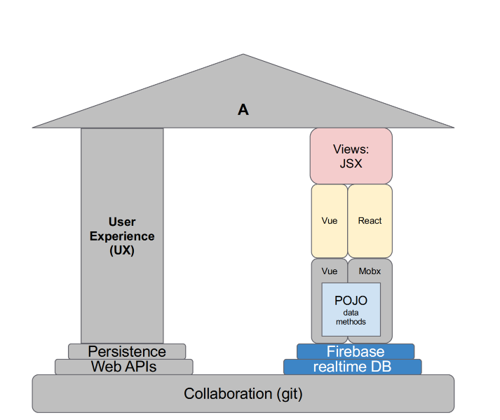

# TW 01



- 此图表展示了一个用于网络开发实验室的架构，特别关注前端开发组件和技术在协作环境中的应用。
This diagram represents a structure for a web development lab setup, focusing on frontend development components and technologies within a collaborative environment.

###  屋顶（标注为 "A"） | Roof (Labelled "A")
- 可能代表整个应用或项目的结构，由两个主要支柱支持：用户体验 (UX) 和特定的前端技术栈。
Likely represents the overall application or project structure that is supported by two main pillars: User Experience (UX) and a specific frontend technology stack.

### 左侧支柱（用户体验 - UX） | Left Pillar (User Experience - UX)
- 该支柱强调用户体验在应用中的重要性。它表明 UX 是实验室或项目的基础部分，确保用户界面和用户体验是开发过程的核心。
This pillar emphasizes the importance of user experience in the application. It suggests that UX is a foundational aspect of the lab or project, ensuring that the user interface and experience are central to the development process.

### 右侧支柱（前端技术栈） | Right Pillar (Frontend Stack)**  
- 这一侧基于各种前端技术构建：  
  This side is built upon various frontend technologies:
  - **视图 (JSX) | Views (JSX)**: 指的是使用 JSX（JavaScript XML）来渲染视图层，通常用于像 React 这样的库中，用于创建 UI 组件。  
    Refers to the use of JSX (JavaScript XML) for rendering the view layer, commonly used in libraries like React for creating UI components.
  - **Vue 和 React**：这些是流行的前端框架，用于构建动态的、基于组件的用户界面。  
    Vue and React are popular frontend frameworks for building dynamic, component-based user interfaces.
  - **POJO（Plain Old JavaScript Object）**：代表数据模型或对象，以简单的方式管理数据和方法。该层负责数据的处理和管理，没有复杂的抽象。  
    Represents data models or objects that contain data methods, managed in a straightforward way, handling data manipulation and management without heavy abstraction.
  - **Mobx**：一种状态管理库，与 React 配合良好（也可以适配 Vue），帮助管理和同步应用状态。  
    A state management library that works well with React (and can be adapted for Vue), helping to manage and synchronize application state.
  - **Firebase Realtime Database**：用于作为后端服务，为应用提供实时的数据同步和存储。  
    Used as a backend service, providing real-time data synchronization and storage for the application.

### 基础层（持久化 & 协作） | Base Layer (Persistence & Collaboration)
- **持久化 (Web APIs) | Persistence (Web APIs)**：表明实验室包含用于数据持久化的 API 交互。Web APIs 允许前端与外部服务或后端服务器通信，发送请求并接收响应。  
  Indicates that the lab includes API interactions for data persistence. Web APIs allow the frontend to communicate with external services or backend servers, making requests and receiving responses.
- **协作 (Git) | Collaboration (Git)**：强调使用 Git 进行版本控制，支持团队协作、代码共享以及变更跟踪。  
  Emphasizes the use of Git for version control, enabling team collaboration, code sharing, and tracking of changes over time.


# JavaScript Basics: Object | JavaScript 基础：对象

在 JavaScript 中，对象（Object）是一种数据结构，类似于字典（Dictionaries），用键值对（Key-Value Pairs）来存储数据和方法。  
In JavaScript, an object is a data structure similar to a dictionary, storing data and methods using key-value pairs.

---

## 1. 对象是字典 | Objects as Dictionaries

JavaScript 中的对象类似于字典，可以通过键来映射到值。  
Objects in JavaScript are similar to dictionaries, mapping keys to values.

```javascript
const car = { doors: 2, make: "Ferrari", model: "Testarossa", };
```

- 在声明对象的最后一个属性后可以加逗号，这是一种合法的语法。  
  Adding a comma after the last property in an object declaration is allowed in JavaScript.

---

## 2. 属性访问和修改 | Accessing and Modifying Properties

可以使用点语法或方括号语法来访问对象的属性值。  
Properties of an object can be accessed using dot notation or bracket notation.

```javascript
car.doors; // -> 2
car["doors"]; // -> 2
```

- **修改属性**：可以直接赋值来修改对象的属性。  
  **Modifying Properties**: You can directly assign a new value to modify an object property.

```javascript
car.doors = 3; // 将 car.doors 修改为 3
```

---

## 3. 使用变量作为键 | Using Variables as Keys

可以通过变量来访问或修改对象的属性。  
You can use a variable as a key to access or modify an object property.

```javascript
const x = "make";
car[x]; // -> "Ferrari"，读取字典中的值
car[x] = "Porsche"; // 修改字典中的值
```

---

## 4. 未定义属性的处理 | Handling Undefined Properties

- **访问不存在的属性**：访问对象中不存在的属性会返回 `undefined`。  
  **Accessing Non-Existent Properties**: Accessing a non-existent property returns `undefined`.

```javascript
car.someProp; // -> undefined
```

- **嵌套属性的安全访问**：尝试访问嵌套属性时（例如 `car.someProp.wheels`），会报错，因为 `someProp` 是 `undefined`。可以使用 **可选链操作符** `?.` 来安全访问。  
  **Safe Access to Nested Properties**: Attempting to access nested properties (e.g., `car.someProp.wheels`) causes an error because `someProp` is `undefined`. You can use the **optional chaining operator** `?.` for safe access.

```javascript
car.someProp?.wheels; // -> undefined
```

---

## 5. 调用不存在的方法 | Calling Non-Existent Methods

- 如果调用对象中不存在的方法（例如 `car.inexistentMethod()`），会引发 TypeError。可以使用 `?.` 来避免错误。  
  If you call a non-existent method on an object (e.g., `car.inexistentMethod()`), it raises a TypeError. Using `?.` can prevent this error.

```javascript
car.inexistentMethod?.(); // -> undefined
```

---

## 6. 全局变量的隐式声明 | Implicit Declaration of Global Variables

- **警告**：避免隐式声明全局变量（例如 `neverUse = 27`），这种做法会导致不良的编码习惯。应始终显式声明变量，避免不必要的全局作用域污染。  
  **Warning**: Avoid implicitly declaring global variables (e.g., `neverUse = 27`), as it leads to poor coding practices. Always declare variables explicitly to avoid global scope pollution.


**始终使用 `let`、`const` 或 `var`** 来显式声明变量，例如：

```javascript
let neverUse = 27; // 正确的声明方式
```

这样做不仅可以避免将变量添加到全局作用域，还能提高代码的可维护性和可读性，防止意外错误的发生。

---

## 数据类型 | Data Types

右上角列出了一些 JavaScript 的基础数据类型供参考。  
The top right corner lists basic JavaScript data types for reference:

- **整数 (Integer)**: `3`
- **浮点数 (Float)**: `3.14`
- **字符串 (String)**: `"my string here"`
- **布尔值 (Boolean)**: `true, false`

# JavaScript Basics: Array | JavaScript 基础：数组

JavaScript 中的数组（Array）是一种用于存储有序数据集合的数据结构。数组可以包含各种数据类型，甚至可以是对象。  
Arrays in JavaScript are data structures used to store ordered collections of data. They can contain various data types, including objects.

---

## 1. 数组字面量 | Array Literals

数组可以通过字面量（literals）创建，使用方括号 `[]` 并用逗号分隔元素。  
Arrays can be created using literals, with square brackets `[]` and elements separated by commas.

```javascript
const numbers = [6, 5, 1];
```

- 数组可以包含对象作为元素，例如：
  Arrays can contain objects as elements, for example:

  ```javascript
  const cars = [
    { doors: 2, make: "Ferrari", model: "Testarossa" },
    { doors: 4, make: "Porsche", model: "Cayenne" },
    { doors: 2, make: "Ferrari", model: "Dino" },
  ];
  ```

  - 在数组的最后一个元素后可以加逗号，这是合法的语法。
    Adding a comma after the last element in an array is allowed in JavaScript.

---

## 2. 属性访问和数组长度 | Accessing Elements and Array Length

- **访问数组元素**：可以通过索引访问数组中的元素。例如：
  **Accessing Elements**: You can access array elements using their index. For example:

  ```javascript
  cars[0]; // -> 返回第一个对象 { doors: 2, make: "Ferrari", model: "Testarossa" }
  ```

  - 数组的索引可以是数字或字符串形式，例如 `cars["0"]` 和 `cars[0]` 都指向第一个元素。
    Array indices can be accessed as numbers or strings, so `cars["0"]` and `cars[0]` refer to the same element.

- **数组长度**：`length` 属性返回数组的长度（元素数量）。
  **Array Length**: The `length` property returns the number of elements in an array.

  ```javascript
  cars.length; // -> 3
  ```

---

## 3. 数组扩展运算符 | Array Spread

- JavaScript 提供了**扩展运算符 `...`**，用于克隆或扩展数组。  
  JavaScript provides the **spread operator `...`** for cloning or extending arrays.

  - 例如，可以将数组 `cars` 的所有元素复制到 `cars2` 中，并附加一个新元素 `oneMoreCar`：
    For example, you can copy all elements from the `cars` array into `cars2` and add a new element `oneMoreCar`:

    ```javascript
    const cars2 = [...cars, oneMoreCar];
    ```

  - 也可以使用扩展运算符创建数组的克隆：
    You can also create a clone of the array using the spread operator:

    ```javascript
    const carsClone = [...cars];
    ```

  - 使用扩展运算符不会改变原数组 `cars`，这是不可变的操作。  
    Using the spread operator does not alter the original `cars` array, making this an immutable operation.

---

## 4. 数组方法 | Array Methods

JavaScript 数组提供了多种方法，用于操作和处理数组数据。例如：

JavaScript arrays provide various methods for manipulating and processing array data. For example:

- **`Array.filter`**: 创建一个新数组，包含所有通过测试的元素。  
  **`Array.filter`**: Creates a new array with all elements that pass a test.

- **`Array.map`**: 创建一个新数组，其中包含每个元素经过函数转换后的结果。  
  **`Array.map`**: Creates a new array with the results of calling a function on every element.

虽然可以直接使用索引来访问数组元素，但这些方法更适合用于数据处理。  
While you can access array elements directly by index, these methods are more suitable for data processing.

---

## 注意 | Note

- 数组实际上是对象，因此可以通过键值对方式访问元素。  
  Arrays are actually objects in JavaScript, so elements can be accessed in a key-value manner.

- 由于数组是对象，它们具有 `length` 属性和其他内置方法，可以方便地对数组进行各种操作。  
  Since arrays are objects, they have a `length` property and various built-in methods for convenient manipulation.
