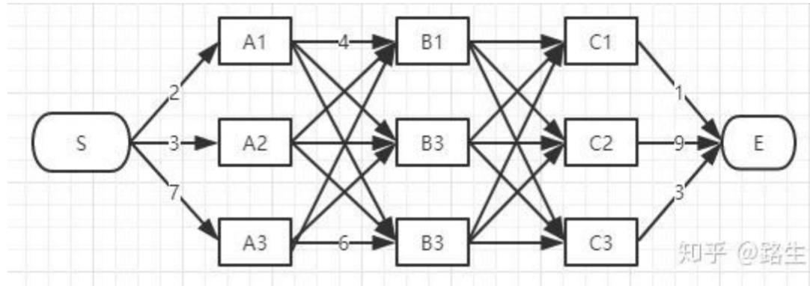

# Hidden Markov Model

### What is Markov Model?
- A Markov model is a stochastic method for randomly changing systems that possess the Markov property. This means that, at any given time, the next state is only dependent on the current state and is independent of anything in the past.

### Two commonly applied types of Markov model
- **Markov chains**: These are the simplest type of Markov model and are used to represent systems where all states are observable. Markov chains show all possible states, and between states, they show the transition rate, which is the probability of moving from one state to another per unit of time. 
- **Hidden Markov Model**：
    - A hidden Markov model (HMM) is a statistical Markov model in which the system being modeled is assumed to be a Markov process (referred to as X) with unobservable ("hidden") states. As part of the definition, HMM requires that there be an observable process Y whose outcomes are "influenced" by the outcomes of X in a known way.
    - Given the knowledge of the hidden state $X_{t-1}$, the current hidden state $X_t$ is independent of all past hidden states $X_{\tau}$, with $\tau\lt t-1$. Similarly, given the current state $X-t$ the current observation $O_t$ is independent of all past states and observations. 
    - Equiped with this notation, we can define the joint probability of a sequence of made observations $o_{1:T}$ and all hidden states in the time interval $[1, T]$ as:
    
    $$P(O_{1:T}=o_{1:T}, X_{1:T})=P(X_1)P(O_1=o_1|X_1)\prod_{t=2}^{T}P(X_t|X_{t-1})P(O_t=o_t|X_t)$$

    - Since the hidden states are unknown to use, they must be modeled under uncertainty. This is achieved by modeling the probability distribution over the transition from one state to another and the probability distribution over the observations given the current state. 
    - Thus, $P(X_t = x_t|X_{t−1} = x_{t−1})$ denotes the probability of being in a specific state at time t given that the system was in a specific state at time $t-1$. $P(O_t = o_t | X_t = x_t)$ is the probability of observing $o_t$ given that the system is in hidden state $x_t$.

    - At each time step $t\in[1,T]$ in the interval from 1 to $T$ an HMM can be characterized by the following components:
        - $X_t = x_i$, $i\in${1,2,...N}: N possible hidden states
        - $O_t = o_k$, $k\in${1,2,...N}: K possible observations
        - $\pi_{i}=P(X_1=i)$: The initial probability vector $\pi\in\mathbb{R}^{1,N}$ with elements $\pi_{i}$
        - $a_{i,j}=P(X_{t+1}=j|X_{t}=i)$: The transition probability matrix $A\in\mathbb{R}^{N,N}$ with elements $a_{i,j}$
        - $b_{i}(k)=P(O_t=k|X_t=i)$:the observation probability matrix $B\in\mathbb{R}^{N,K}$ with elements $b_{i,k}=b_i(k)$
        - The transition probability matrix A describe the probability of being in state j at time t+1 given that the system has been in state i at time t. Equivalently, the observation probability matrix B describes the probability of observing k at time t given that the system is in state i at time t. 

### HMMs can be cast into different problem settings
- Evaluating/Filtering: Compute likelihood $p(O_{1:t}|\lambda)$ of observation sequence $(O_{1:T}={O_1, O_2,...O_t,...,O_T})$ given $\lambda$. 
    - **Forward Algorithm**
- Decoding: Most likely state sequence $X_{1:T}^*$ given $O_{1:T}$ and $\lambda$.
    - **Viterbi algorithm**
- Learning: Estimate model parameters $\Lambda={\lambda}$ given $O_{1:T}$ such that $P(O_{1:T}|\lambda)$ is maximized. $\to$ A and B matrices and $\pi$. 
    - **Baum–Welch Algorithm**

- In general terms, let $O\sim P(O)$ and $X\sim P(X)$ be random variables in a discrete space that can take values $O\in \{o_1,o_2,...o_k\}$ and $X\in \{x_1,x_2,...x_k\}$ respectively. The joint probability distribution over O and X is denoted by P(O,X) and the conditional distribution of O given X by P(O|X).

- The marginal probability mass distribution of $P(O=o_i)$ is given by 
$$P(O=o_i)=\sum_{j=1}^{m}P(O=o_i,X=x_j)=\sum_{j=1}^{m}P(O=o_i|X=x_j)P(X=x_j)$$

### HMM 1 - Probability of Observation Sequence
- We want to estimate what the probability of the made observation sequence $O_{1:t} = [O_1 = 0_1, O_2=o_2, ..., O_T=o_T]$ is . In order to solve this problem, we can make use of the so-called forward algorithm or α-pass algorithm. This procedure iteratively estimate the probability to be in a certain state i at time t and having observed the observation sequence up to time t for t∈[1, ..,T]

- Brute-force method
$$P(O_1:t)=\sum_{X_1:t}P(O_1:t,X_1:t)=\sum_{X_1:t}P(O_1:t|X_1:t)P(X_1:t)$$
$$=\sum_{X_1:t}\pi a_{1,2}a_{2,3}...a_{T-1,T}b_{x_1}(O_1)b_{x_2}(O_2)...b_{x_T}(O_T)$$

- Time Complexity
    - We need to summing over all possible permutations of $X_{1:T}$
    - Evaluating this requires $O(TN^T)$ multiplications:
        - Exhaustively enumerate all state chains (t time steps)
        - In every step, there are N possible hidden states
        - There are totally $N^T$ possiblities
        - When you calculating every possible state chain, there are T steps(You need to calculate from the beginning to the end for every chain), and the complexity is O(T).
        - Totally: $O(TN^T)$

### Forward Algorithm:

- Introduce $\alpha$
- Given hidden state x=i, we call the probability of the observation sequence is ${0_q, o_2,..., o_t}$ forward probability. 
$$\alpha_1(i) = p(O_{1:t},x_t=i|\lambda)=P(O_1=o_1|X_1=x_i)P(X_1=x_i)=b_i(o_i)\pi_i$$

- At time t, we need to marginalize over the probability of having been in any other state at t-1 and multiply this estimate the matching observation probability as follows:

$$\alpha_t(i)=P(O_{1:t},X_t=x_i)$$

$$=P(O_{t}=o_t|X_t=x_i,O_{1:t-1})P(X_t=x_i, O_{1:t-1})$$

(Given the current state $X-t$ the current observation $O_t$ is independent of all past states and observations.)

$$=P(O_t=o_t|X_t=x_i)P(X_t=x_i, O_{1:t-1})$$

$$P(O_t=o_t|X_t=x_i)[\sum_{j=1}^{N}P(X_t=x_i|X_{t-1}=x_j)P(X_{t-1}=x_j, O_{1:t-1})]$$

$$=b_i(o_t)[\sum_{j=1}^{N}a_{i,j}\alpha_{t-1}(j)]$$

> Maginalization is a method that requires summing over the possible values of one variable to determine the marginal contribution of another. 

- This step has to be computed iteratively for every $t\in [1,...,T]$. Finally, we can compute the probability of having observed the given observation sequence $O_1:T$. For this, we again have to marginalize over the hidden state distribution such that
$$P(O_{1:T}=o_{1:T})=\sum_{j=1}^{N}P(O_{1:T}=0_{1:T}, X_T=x_j)$$
$$=\sum_{j=1}^{N}\alpha_T(j)$$

```python
# Define the forward algorithm for Hidden Markov Models (HMMs)
def forward_algorithm(A, B, pi, O):
    # N: Number of hidden states
    N = len(A)
    
    # T: Number of time steps in the observation sequence
    T = len(O)
    
    # Initialize the matrix to store forward probabilities
    forward_probs = [[0.0] * T for _ in range(N)]
    
    # Initialization step: Calculate the initial forward probabilities
    for j in range(N):
        forward_probs[j][0] = pi[j] * B[j][O[0]]
    
    # Recursion step: Calculate forward probabilities for each time step
    for t in range(1, T):
        for j in range(N):
            # Calculate the forward probability for state j at time t
            forward_probs[j][t] = sum(forward_probs[i][t-1] * A[i][j] for i in range(N)) * B[j][O[t]]
    
    # Termination step: Sum up the forward probabilities at the last time step
    # to obtain the total probability of observing the sequence O
    probability = sum(forward_probs[i][T-1] for i in range(N))
    
    # Return the total probability of the observed sequence
    return probability
```

- The forward algorithm use a matrix to store the forward probabilities of each step. So every time, we only need to calculate from the last step(t-1) to current step(t). 
- We do not need to calculate from the very begining. In every time step, there are $N^2$ possibilities. (from j to i, j and i both have N possibilities). 
- There are totally T time steps. 
- So the time complexity of the forward algorithm is $O(N^{2T})$.

### HMM 2 - Estimate Sequence of States
- The forward algorithm marginalizes over the hidden state distribution. 
- In contrast, we can also compute the most likely sequence of hidden states given the observations.
- Let use denote this sequence with $X^*=\{ X_1, X_2, ...X_t \}$


- Given:
    - Emission Sequence $O=\{ O_1, O_2, ...O_t \}$
    - A, B, $\pi$
- To find:
    - Hidden state sequence  that most likely produce O.
    - Probability of occurrence of $X^*=\{ X_1, X_2, ...X_t \}$

#### Viterbi Algorithm

- Goal: To find the shortest path from S to E.

- Start from S to A
    - There are 3 paths S-A1、S-A2、S-A3. 
    - But now we cannot arbitrarily say which path is the shortest under global conditions.
    - So we move to B.
    - There are three path passing B1.
        - S-A1-B1
        - S-A2-B1
        - S-A3-B1
    - Suppose S-A3-B1 is the shortest in the above three paths, the other two cannot be the final result, so we can delete them directly. 
    - Similarly, we can find the shortest path passing B2 and B3, and delete the other paths. 
    - We can store the length of the shortest path in a matrix, like:
        - B1: length of S-A3-B1
        - B2: length of S-A2-B2
        - B3: length of S-A2-B3
    - When we move forward, we can directly use it. 
    - We can also calculate the distance of the following points like this. 
    - In terms of efficiency, compared to roughly traversing all paths, the Viterbi algorithm will delete paths that do not meet the shortest path requirements when reaching each column, greatly reducing the time complexity.

- In HMM:
    - At first, we need to compute the probability of having observed $O_{1:t}=o_{1:t}$ and being in a state $X_t=x_i$ for each t.
$$\delta_t(i)=P(O_1=o_1,X_1=x_i)=b_i(o_1)\pi_{i}$$
    - The subsequent steps update the $\delta_t$ as follows:
$$\delta_t(i)=\max_{j\in[1,2,...,n]}a_{j,i}\delta_{t-1}(j)b_i(o_t)$$

- In order to be able to trace back the most likely sequence later on, it is convenient to store the indices of the most likely states at each step. 
$$\delta_t^{idx}(i)=\arg\max_{j\in[1,2,...,n]}a_{j,i}\delta_{t-1}(j)b_i(o_t) $$
for i $\in$ [1,..N]

- So if the algorithm determined $\delta_t(i)$ for state i at time t and have been preceded by state k, then $\delta_t^{idx}(i)=k$

- When arriving at the end of the observing sequence, T, the probability of the most likely hidden state sequence is given by 
$$P(X^_{1:T}, O_1:T=o_1:T)=\max_{j\in [1,...,N]}\delta_T$$

- In the second step, we can back track the sequence ${X^*}$ by setting
$$X_T= \arg\max_{j\in[1,...,N]}\delta_T(j)$$
$$X_t=\delta_{t+1}^{idx}(X_{t+1})$$

```python
def run_viterbi(O, A, B, delta, max_id):
    """
    Run the Viterbi algorithm to find the most likely sequence of hidden states given observations.

    Args:
    O (list): List of observations (sequence of observed data).
    A (list): State transition probabilities (N x N matrix).
    B (list): Observation probabilities given states (N x M matrix).
    delta (list): List to store the Viterbi path and accumulated probabilities.
    max_id (list): List to track the most likely state at each time step.

    Returns:
    None: The function prints the most likely sequence of hidden states.
    """
    if len(O) == 0:
        # Termination step: Track back the most probable hidden states and print them
        state_list = []
        last_state = delta.index(max(delta)) 
        state_list.append(last_state) 
        # Iterate backward through the 'max_id' list to backtrack and find the most likely hidden states.
        for i in range(len(max_id) - 1, 0, -1):
            state_list.insert(0, max_id[i][last_state])
            last_state = max_id[i][last_state]
        print(' '.join([str(x) for x in state_list]))
        return 0
    
    # Calculate probabilities for all possible state transitions
    all_probs = [[delta[pre] * A[pre][curr] * B[curr][O[0]] for pre in range(len(A))] for curr in range(len(A))]
    possible_delta = [max(probabilities_curr_state) for probabilities_curr_state in all_probs]
    
    # Update the state tracking list for backtracking
    max_id.append([max_idx.index(possible_delta[i]) for i, max_idx in enumerate(all_probs)])
    
    # Recursively call the Viterbi algorithm for the remaining observations
    run_viterbi(O[1:], A, B, possible_delta, max_id)
```

### HMM3 - Estimate Model Parameters
- Recall that the $\alpha$ - pass algorithm determined the joint probability of each state at time t and all observations up to t. In order to be able to determine the probability of any state at any time point given all observations, we need to assess the probability of a state at time t and all future observation [t+1 : T ].

##### $\beta$ -pass algorithm
- The $\beta$ is defined as

$$\beta_{t}(i)=P(O_{t+1:T}=o_{t+1:T}|X_t=x_i)$$

i.e. the probability of observing all future observations $O_{t+1:T}$ given the current state $X_t=x_i$. Again, we need to determine $\beta$ values for all time steps and all states. For this, we initialize:

$$\beta_{T}(i)=1$$

for i $\in$ [1,2,...N]

as we do not intend to favour any final state over the other. In the following, we iterate backward through the observation sequence and compute the $\beta$ values, defined in the following equation:

$$\beta_{t}(i)= P(O_{t+1:T}=o_{t+1:T}|X_t=x_i)$$

$$=\sum_{j=1}^{N}\beta_{t+1}(j)b_j(o_{t+1})a_{i,j}$$

Now we have computed both $\alpha$ and $\beta$, we can estimate the probability of being in state i at time t and being in state j at time t+1 given all made observations and the probability of being in state i at time t given all made observations. These probabilites are given by the di-gamma function

$$\gamma_t(i,j)=P(X_t=x_i, X_{t+1}=x_j|O_{1:T}=o_{1:T})$$

$$=\frac{\alpha_t(i)a_(i,j)b_j(O_{t+1})\beta_{t+1}(j)}{\sum_{k=1}^N\alpha_T(k)}$$

###### The derivation process
- Bayes Formula
$$P(A|B)=\frac{P(B|A)P(A)}{P(B)}$$

    - $P(B)=P(O_{1:T}=o_{1:T})$

$$P(O_{1:T}=o_{1:T})=\sum_{j=1}^{N}P(O_{1:T}=0_{1:T}, X_T=x_j)$$

$$=\sum_{j=1}^{N}\alpha_T(j)$$

$$P(B|A)P(A)=P(A,B)= P(O_{1:T}=o_{1:T} | X_t=x_i, X_{t+1}=x_j)P(X_t=x_i, X_{t+1}=x_j)
$$= P(O_{1:T}=o_{1:T}, X_t=x_i, X_{t+1}=x_j)$$

$$=P(X_t=x_i, O_{1:t}=o_{1:t})P(O_{t+2:T}=o_{t+2:T}|X_{t+1}=x_j)P(X_{t+1}=x_j|X_t=x_i)P(O_{t+1}=o_{t+1}|X_{t+1}=x_j)$$

$$=\alpha_t(i)\beta_{t+1}(j)P(X_{t+1}=x_j|X_t=x_i)P(O_{t+1}=o_{t+1}|X_{t+1}=x_j)$$

$$=\alpha_t(i)a_(i,j)b_j(O_{t+1})\beta_{t+1}(j)$$

define: $\gamma_t(i)=P(x_t=q_i|O_{1:T}=0_{1:T})$
Since $\alpha_t(i)$ measures the relevant probability up to time t and $\beta_t(i)$ measures the relevant probability after time t,

$$\gamma_t(i)=\frac{\alpha_t(i)\beta_t(i)}{P(O_{1:T}=o_{1:T})}$$

The $\gamma_t(i，j)$ is the probabilty of being in state i at time t and transiting to state j at time t+1. 

$$\gamma_t(i,j)=\frac{\alpha_t(i)a_(i,j)b_j(O_{t+1})\beta_{t+1}(j)}{\sum_{k=1}^N\alpha_T(k)}$$

and the gamma function

$$\gamma_t(i)=P(X_t=x_i|O_{1:T}=o_{1:T})=\sum_{j=1}^N\gamma_t(i,j)$$

Finally, we can estimate $\lambda = (A, B,\pi)$ by determining the expected value of the probabilites. We have the transition estimates given by 

$$a_{i,j}=\frac{\sum_{t=1}^{T-1}\gamma_t(i,j)}{\sum_{t=1}^{T-1}\gamma_t(i)}$$

for i,j $\in$ [1,..N]

The observation estimates given by

$$b_j(k)=\frac{\sum_{t=1}^{T-1}1(O_t=k)\gamma_t(j)}{\sum_{t=1}^{T-1}\gamma_t(j)}$$

for j $\in$ [1,..N], k $\in$ [1,..K]

where $1(O_t=k)$ is the indicator function that is 1, when the argument is true and o otherwise. 

At last, the initial probabilites are given by 

$$\pi_i = \gamma_{1}(i)$$

Now we have everything in place in order to learn the parameters of our HMM with the Baum-Welch Algorithm:
1. Initialize $\lambda=(A,B,\pi)$
2. Compute all $\alpha_t(i)$, $\beta_t(i)$, $\gamma_t(i,j)$,$\gamma_t(i)$ values
3. Re-estimate $\lambda=(A,B,\pi)$
4. Repeat from 2 until convergence

```python
import sys
import math
import fileinput

# Function to create a matrix from a line of space-separated values
def create_matrix(line):
    values = list(map(float, line.split()))
    height, width = map(int, values[:2])
    values = values[2:]
    matrix = [values[i:i+width] for i in range(0, len(values), width)]
    return matrix

# Function to print a matrix with specified formatting
def print_matrix(matrix):
    num_rows, num_cols = len(matrix), len(matrix[0])
    dimensions = f"{num_rows} {num_cols}"
    formatted_matrix = " ".join(" ".join(f"{round(e, 6)}" for e in row) for row in matrix)

    result = f"{dimensions} {formatted_matrix}"

    print(result)


# Backward algorithm for Hidden Markov Models
def backward_algorithm(A, B, O, pi, c):
    # Initialize the beta matrix
    beta = []

    # Initialization step: Initialize the last row of the beta matrix with c[T-1]
    beta.extend([[c[len(O) - 1]] * len(A)])

    # Recursion step: Compute the beta values for each time step in reverse order
    for t in range(len(O) - 2, -1, -1):
        state = []  # Store the beta values for each state at time step t
        for s in range(len(A)):
            # Calculate the backward path probabilities for each state s
            backward_path = [beta[0][k] * A[s][k] * B[k][O[t + 1]] for k in range(len(A))]
            # Compute the beta value for state s at time step t
            state.append(c[t] * sum(backward_path))
        # Insert the computed beta values at the beginning of the beta matrix
        beta.insert(0, state)

    # Termination step: Return the computed beta matrix
    return beta

# Forward algorithm for Hidden Markov Models
def forward_algorithm(A, B, O, pi):
    c = []      # Scaling factors
    alpha = []  # Forward probabilities
    alpha_n = []  # Scaled forward probabilities

    # Initialization step: Compute alpha[0] and scaling factor c[0]
    alpha.append([pi[s] * B[s][O[0]] for s in range(len(A))])
    c.append(1 / sum(alpha[0]))  # Compute scaling factor c[0]
    alpha_n.append([c[0] * alpha[0][s] for s in range(len(A))])

    # Recursion step: Compute alpha values and scaling factors for each time step
    for t in range(1, len(O)):
        state = []  # Store the alpha values for each state at time step t
        for s in range(len(A)):
            # Calculate the forward path probabilities for each state s
            forward_path = [alpha_n[t - 1][k] * A[k][s] * B[s][O[t]] for k in range(len(A))]
            # Compute the alpha value for state s at time step t
            state.append(sum(forward_path))
        # Compute the scaling factor c[t] for time step t
        c.append(1 / sum(state))
        alpha.append(state)  # Store alpha values at time step t
        alpha_n.append([c[t] * alpha[t][i] for i in range(len(A))])  # Scale alpha values

    # Termination step: Return the scaled alpha values, scaling factors, and the final probability
    return alpha_n, c, sum(alpha[len(O) - 1])
# Estimation step: Compute gamma and digamma values
def estimator(A, B, O, alpha, beta):
    gamma = []  # Initialize gamma values
    digamma = []  # Initialize digamma values

    # Calculate gamma and digamma for each time step except the last one
    for t in range(len(O) - 1):
        g = []  # Initialize gamma values for the current time step
        dg = []  # Initialize digamma values for the current time step
        for s in range(len(A)):
            # Calculate the probabilities for each state transition
            prob = [alpha[t][s] * A[s][k] * B[k][O[t + 1]] * beta[t + 1][k] for k in range(len(A))]
            g.append(sum(prob))  # Sum of probabilities for the current state s
            dg.append(prob)  # Store individual probabilities in digamma
        gamma.append(g)  # Store gamma values for the current time step
        digamma.append(dg)  # Store digamma values for the current time step

    gamma.append(alpha[len(O) - 1])  # Add gamma for the last time step

    return gamma, digamma  # Return gamma and digamma values


# Maximization step: Update initial state probabilities (pi)
def update_pi(n, gamma):
    return [gamma[0][i] for i in range(n)]  # Update pi based on gamma values


# Maximization step: Update state transition probabilities (A)
def update_A(n_state, n_obs, gamma, digamma):
    A = []  # Initialize the updated state transition matrix A

    for i in range(n_state):
        i_trans = sum(gamma[t][i] for t in range(n_obs))  # Calculate the sum of gamma values for state i

        A_new = []  # Initialize the row for state i in the updated A matrix
        for j in range(n_state):
            ij_trans = sum(digamma[t][i][j] for t in range(n_obs))  # Calculate the sum of digamma values for states i and j
            A_new.append(ij_trans / i_trans)  # Update the probability for transitioning from state i to state j
        A.append(A_new)  # Add the updated row to the updated A matrix

    return A  # Return the updated state transition matrix A


# Update emission probabilities (B)
def update_B(B_est, O, n_state, n_obs, gamma):
    B = []  # Initialize the updated emission matrix B

    for i in range(n_state):
        i_trans = sum(gamma[t][i] for t in range(n_obs))  # Calculate the sum of gamma values for state i

        B_new = []  # Initialize the row for state i in the updated B matrix
        for j in range(len(B_est[0])):
            ij_trans = sum(gamma[t][i] for t in range(n_obs) if O[t] == j)  # Calculate the sum of gamma values for state i and observation j
            B_new.append(ij_trans / i_trans)  # Update the probability of emitting observation j from state i
        B.append(B_new)  # Add the updated row to the updated B matrix

    return B  # Return the updated emission matrix B


# Baum-Welch algorithm for Hidden Markov Models
def baum_welch(A, B, O, pi, max_iters=100, tol=1e-4):
    iter = 0  # Initialize the iteration count
    log_prob = float('-inf')  # Initialize the log probability to negative infinity

    while iter <= max_iters:
        # Forward and backward probabilities
        alpha, c, _ = forward_algorithm(A, B, O, pi)  # Calculate forward probabilities
        beta = backward_algorithm(A, B, O, pi, c)  # Calculate backward probabilities

        # Calculate the new log probability based on the convergence of scaling factors
        new_log_prob = compute_convergence(c, len(O))

        # Check for convergence or reaching the maximum number of iterations
        if log_prob >= new_log_prob or iter > max_iters:
            break

        # Expectation step: Estimate gamma and digamma using the forward and backward probabilities
        gamma, digamma = estimator(A, B, O, alpha, beta)

        # Maximization step: Recompute A, B, and pi using the estimated gamma and digamma
        pi = update_pi(len(A), gamma)  # Update initial state probabilities
        A = update_A(len(A), len(O) - 1, gamma, digamma)  # Update state transition probabilities
        B = update_B(B, O, len(A), len(O), gamma)  # Update emission probabilities

        iter += 1  # Increment the iteration count
        log_prob = new_log_prob  # Update the log probability

    # Return the updated state transition matrix A and emission matrix B
    return A, B


# Function to compute the convergence measure of the algorithm
def compute_convergence(c, n):
    # Initialize the log probability to zero
    log_prob = 0

    # Calculate the sum of logarithms of scaling factors
    for ct in c:
        log_prob += math.log(ct)

    # Calculate and return the negative log probability as the convergence measure
    convergence_measure = -log_prob
    return convergence_measure


A  = create_matrix(sys.stdin.readline())
B  = create_matrix(sys.stdin.readline())
pi = create_matrix(sys.stdin.readline())[0]
O  = [int(i) for i in sys.stdin.readline().split()[1:]]

# learn transition and emission probabilities
A, B = baum_welch(A, B, O, pi)

print_matrix(A)
print_matrix(B)
```

### HMM Scaling
- The three HMM problems all requires computations involving products of probabilities. It is easy to see, that $\alpha_t(i)$ tends to 0 exponentially as T increases. Therefore, any teempt to implement the formula as given above will inevitably result in underflow. 
- The solution to this underfow problem is to scale the numbers. However, care must be taken to insure that, for example, the re-estimation formulae remain valid.
- The basic recurrence is:
$$\alpha_i(t)=b_i(o_t)[\sum_{j=1}^{N}a_{i,j}\alpha_{t-1}(j)]$$
- It seems sensible to normalize each $\alpha_t(i)$ by dividing by the sum(over j) of $\alpha_t(j)$. However, we must verify that the re-estimation formula hold. 

- For t = 0, let $\alpha‘_0(i) = \alpha_0(i)$ for i = 0, 1,..., N-1. Then let $c_0=\frac{1}{\sum_{j=0}^{N-1}\alpha’_0(j)}$, and finally, $\alpha‘_0(i) = c_0\alpha’_0(i) for i = 0,1,...N. Then for each t=1, 2,..., T-1, do the following. 
    - 