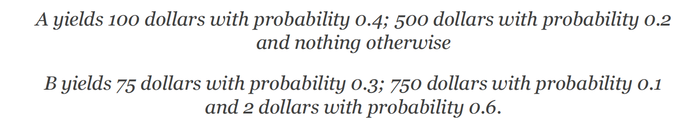
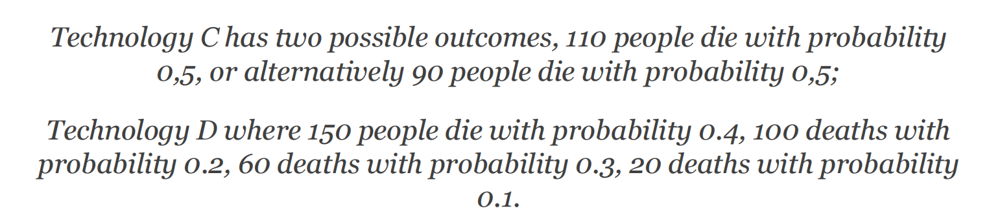

# Anticipating risk in science and engineering

### Defining Risk

##### 1st definition

Risk = df_an unwanted event which may ot may not occur. 

##### 2nd definition

Risk = df_the cause of an unwanted event which may or may nor occur. 

- Primary prevention: eliminating the cause of an unwanted event.
- Secondary prevention: providing means of mitigating an unwanted event. 

>  Primary risk prevention is about the elimination of a cause of an 
unwanted event, for example preventing a fire hazard by using only inflammable materials in a building. Secondary risk prevention is about finding a means to mitigate the unwanted consequences of such a primary risk. For example, by installing fire extinguishers in a building.

##### 3rd definition

Risk = df_the spread of possible(good & bad) outcomes that might occur. 

### Quantitative Notions of Risk

##### 4th definition

Risk = df_the probability of an unwanted event which may or may not occur.

##### 5th definition

Risk = df_the severity of an unwanted event which may or may not occur. 

##### Objective or Subjective?

Quantification of severity also can be distinguished along this objective/subjective line. We might say that if all outcomes are in terms of one dimension of value, let us say only in terms 
of money, or only in terms of days in hospital or number of people killed, then we can compare different options that are thus quantified by reference to such an objective dimension. But often what we have is that we get different dimensions in the outcomes. We 
might have to compare monetary costs with a number of people we save and now we are comparing two very different things. How do we find a common currency that makes all of these things comparable? This often refers back to subjective evaluations. We are either individuals or groups that impose a common evaluative dimension over these – objectively very different – kind of values. So, we have this objective-subjective dimension both with respect to probabilities and of severities.

### Decision making

- Decision making under certainty: Action has only one outcome

- Decision making under risk: Action has more than one possible outcome; results of each outcome is known; probability of each outcome is known 
- Decision making under ignorance: Action has more than one possible outcome; each outcome is known; probabilities of some outcomes are not known.
- Decision making under deep uncertainty: Action has more than one possible outcome; not all of these outcomes are known, nor are their probabilities

> Donald Rumsfeld who talked about the difference between what he called "known knowns" –things that we know we know – and "known unknowns" – things that we know that we do not know.  This in contrast to the unknown unknowns, where we did not even know that we did not know something and therefore wrongly categorize the decision problem. In contrast to the unknown unknowns, where we did not even know that we did not know something and therefore wrongly categories the decision problem. For example, we thought we knew everything about the probabilities and therefore described the situation in a certain way, but we were in fact wrong.

##### Different disciplinary approaches:
- Nuclear Engineering: quantitative notions of risk predominante. 
- Software engineering: scenarios with undesired event chains. 
- Civil Engineering: Rules of thumb(经验法则), e.g. numerical safety factors. 
- Climate Science: Multiple model set

#### Summary:
- causes vs. effects
- qualitative vs. quantitative
- objective vs. subjective
- qualitative differences about what is unkown

## Value Modes of Risk

- The expected value of a discrete random variable is the probability weighted average of all its possible values.

- Expected value models of risk: Models of risk with a quantifiable probability and a quantifiable severity of each outcome.

- Consider this example. You have two lottery tickets:

Now you calculate the probability weighted average by multiplying each possible outcome by the probability with which it can occur and then sum over this. For A you get an expected monetary value of 140 dollars and for B you get an expected monetary value of 98.7 dollars.

##### 6th definition

Risk = df_the statistical expected value of an uncertain event. 

### Arguments for using EV for Risk Modelling

- Allows to include risk considerations into optimization calculations. 

- **Contrast** : safety factors

- The further argument is that the expected value modelling of risk allows for a separation between risk assessment and risk management.

- In risk assessment we are collecting and assessing the relevant information about risks, and we are characterizing the nature and magnitude of the risk based on this information. That is the scientist’s job, it is about information gathering, evidence, making inferences based on evidence, drawing conclusions, all of which scientists and engineers are particularly good at. 
    - Sciecne(value free)

- Risk management, in contrast, takes this risk assessment and combines it with economic, technological political and social consideration.
    - policy(value laden)（受主观价值影响的）

- Helps in the attempt to keep science value free
- Constrast with Eurocodes.
    - 欧洲规范为建筑结构、机械设备等提供了在机械强度、稳定性和火灾安全方面的要求。这里的风险不仅由专家评估；专家们还决定了为避免这些风险所需的技术规范。他们积极参与风险管理。

## Problems of the expected value model of risk

They have the same expected value: EV(D)=100

-  That seem implausible, many people have the intuition that these technologies have different risks.
- One way to cash this out is to calculate the variance.

#### Risk Preferences:
- Risk-loving: putting more weight on potentials gains than potential lossess.
- Risk-averse: putting more weight on potential losses than potential gain.

### St. Petersbutg Game
- Rules:
    - A fair coin is tossed at each stage
    - Initial stake 2 dollars
    - Stake doubled every time heads appears
    - Game ends as soon as tails appears, player wins latest stakes. 

EV calculation:
E=1/2*2+1/4*4+...
= 1+1+1...
= +∞
- This yields an infinite sequence of 1 which are added together, which means that the expected value of this game is infinite!
- What is wrong with it?
- 伯努利认为，随着金钱数额的增加，人们对其的价值会减少。大多数人可能会觉得以1/10的概率赢得一百万的前景远不如肯定能获得1000美元来得有价值。这与期望值模型相矛盾。为解决这个问题，伯努利通过引入效用的概念消除了这个矛盾。虽然在比较金钱时这变得悖论重重，但在计算金钱的主观估值时，这个悖论就消失了。通过这种改变，我们不再计算期望金钱价值，以货币价格作为数值结果，而是将主观评估（通常称为效用函数）强加于这些金钱总额上。这个函数将您获得的金额作为输入，并产生效用，即这笔钱为一个人带来的价值。这允许引入一个递减函数，创造出人们在某些情况下不会将获得1万美元的价值视为百分之一的一百万美元的情况。由于这些金钱的评估随着金额的增加而减少，你会得到一条凹曲线，也称为边际递减效用曲线。它代表了一个现象，随着人们变得更富有，他们对额外的一美元的价值比在贫穷时少。这解释了为什么人们不愿意为圣彼得堡博弈支付无限的金额：游戏提供的不确定的巨大财富无法抵消大多数人已经拥有的较小、确定的金额。这解释了为什么他们在圣彼得堡博弈中提供的金额远低于期望值模型的预测。

### Other Subjective Risk Evaluation

- Psychological Findings
    - Involuntary risks worse than voluntary risks
    - Risks where one lacks control are worse
    - Novel risks worse than accustomed risks
    - Large risks are underestimated: smalk risks overestimated

- Subjective dimensions of risk: The real-life risk assessment of humans, which may or may not correspond to actual risks.

### Summary 
- EV model
- Allows economica optimization & fact-value distinction
- EV as measurement or definition of risk?
- Risk preferences
- Problem of subjective evaluations

## Deciding under ignorance & Deep Uncertainty

#### Managing Ignorance

- Principle of Insufficient Reason
When one does not know the probabilities of outcomes, each outcome is assigned the same probability.

#### MaxiMin
- Identify the worst outcome of each option and choose that option with the least worst outcome
- Minimax: Choosing the action where the worst possible outcome is the least bad, compared to the other actions

#### Managing Deep Uncertainty
- What if not all possibilities are known?

- Safety factos in engineering
    - 比如说，一座桥必须承受负载X。然后我们规定物体结构能够承受的最大预期负载的倍数。所以，如果我们假设安全系数为2，那么它应该能够承受两倍的负载X。它必须抵抗它在实际中将面临的最大负载的两倍。
- Why safety factors:
    - Intended to compensate for five major types of sources of failure
        - Higher loads than those foreseen
        - Worse material properties than foreseen
        - Inperfect theory of the failure mechanism in question
        - Possibily unkown failure mechanisms
        - Human error

#### Precautionary Principle

- Precautionary principle: if an action or policy has the suspected risk of causing harm, in the absence of scientific consensus whether this action is harmful or not, the burden of proof that it is not harmful in the way that some people claim, lies with those that intend to take action or to propose to perform this particular action or policy. 

#### Arguments for qualitative risk modelling
- Computational costs
- simplicity
- lack of accuracy
- Security

### Summary: qualitative model of risk
- Motivated by lack of information
- Strategies for ignorance
- Strategies for deep uncertainty
- Probabilistic risk models only one tool of several for risk assessment. Not a sure source of final answers!
- Choice of models produce different results, thus have a substantial influence on risk assessment. Choice requries justification!

## Ethical Dimensions of Risk Management

#### Utilitarian Approach 
- Actualist: the goodness of an action with uncertain outcomes is defined as the utility of the outcome tha actually materializes.

- EU Maximization: the goodness of an action with uncertain outcomes is defined as the probability-weighted average of the utilites of these outcomes. 

- Utilitarianism is a particular version of consequentialism which says that the moral value of an action is determined exclusively by the moral value of its outcome.

#### Critique of the Utilitarian Approach to Risk
- Disallow disproportionate avoidance of large disasters.
- Disallows disproportionate avoidance of high-probability risks for particular individuals. 

-  To summarize, because they insist of proportionality, expected utility-utilitarians prohibit what might be morally reasonable standpoints on risk taking and risk distribution.
