## Experiments

##### Three Chatacteristic Features of Experiments

- Experimenting is an observation process characerised by:
    - Control of background variables through manipulation
    - Intervention on target variable through manipulation
    - Observation of difference produced by intervention

### What makes experiments special?

- Mill's Method of Difference
    1. We ask: what causes phenomenon E?
    2. We conjecture: C causes R (hypothesis)
    3. We produce two situations S1 and S2, in which neither C nor E occur and in which all causally relevant factors are the same. (successful control)
    4. We activate C in S1 but not in S2. (successful intervantion)
    5. We observe that E occurs in S1 but not in S2.(observation of differences)
    6. In S1, something causes E(from 5)
    7. In S2, nothing causes E(from 3)
    8. The only differences between S1 and S2 are C and E (from 3 and 4)

- **Conlusion: C causes E**

- In actual experiment, we might fail to control all causally relevant factors. (C might not be the only causal factor)
- We might fail to activate C in S1, or inadvertently activateit in S2. 
- We might be wrong in observing a difference between S1 and S2
- We assume that E is caused, it that it is part of a deterministic system, or that it doesn't cause itself. 

#### Summary

- Experiments are observational process
- Experiments are characterised by manipulation, intervention, control and observation
- Experimental observations often offer a justification for accepting or rejecting a hypothesis
- The argument from experimental observation to causal claims is fallible: it might contain errors
- In order to minimize these potential errors we need to design experiments carefully

## Experiments vs. Other Observational Practices

- Not all areas can conduct experiments; for example, in astronomy, we cannot manipulate the stars.
- observational studies are not experiments.

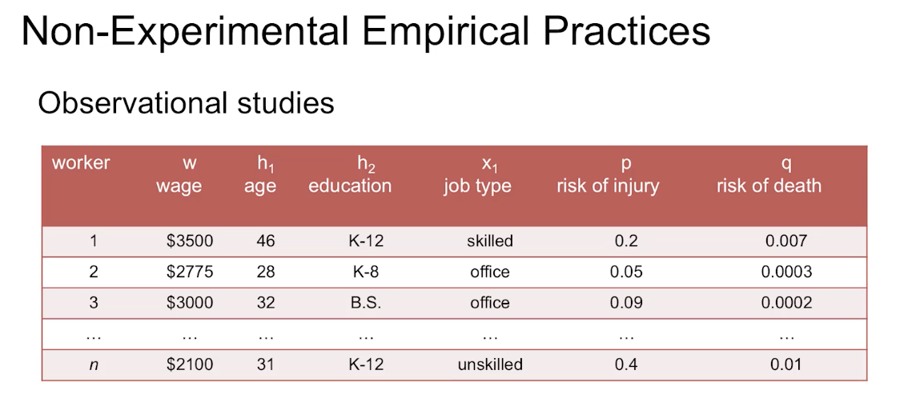

### Non-experimental Empirical Practices

- Observational studies:
    - no manipulation
    - no intervention on target varibale
    - no control of background variable

- Observational study: An observational process characterized by control of the background factors and observation of an outcome, lacking an intervention.

- Natural Experiments:
    - no manipulation
    - no intervention on target varibale
    - control of background variable (not achieved through manipulation)

- Natural experiment: An observational study where circumstances are organized as if there had been manipulation for intervention and control but no manipulation is in fact done.

#### Field Experiments
- Maintain the same found conditions in both treatment(also called the experimental group) and control group varying only the intervention on the factor of interest. 

- no manipulation
- no intervention on target variable
- control of background variable(not achieved through manipulation)

- Field experiment: An experiment where there is manipulation for intervention, but where several background variables are not controlled, in particular not controlled through manipulation.

#### Laboratory Experiments
- Construct the same background conditions in both treatment and control group(through manipulating the environment) varying only the intervention on the factor of interest. 

- Laboratory experiment: An experiment where there is manipulation for intervention and where all or most relevant variables are controlled.

> The difference between the lab and the field would then be how much we are engaged in manipulating the background conditions.

#### Simulation Experiments

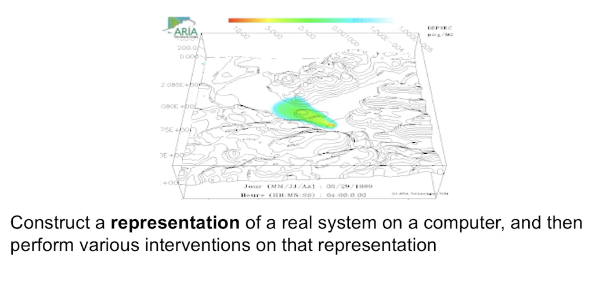

Simulation experiment: A model study where the model is created as to mimic an experiment, but where the variable that is intervened on is only represented, rather than actually present.

> An experiment is a controlled observation in which the observer manipulates the real variables that are believed to infulence the outcome, both for the purpose of intervention and control. 

## Errors in experiment

- Failed Experiments?

- The Michelson-Morley experiment(1887)
    - 迈克尔逊－莫雷实验(Michelson-Morley Experiment)，是1887年迈克尔逊和莫雷在美国克利夫兰做的用迈克尔逊干涉仪测量两垂直光的光速差值的一项著名的物理实验。但结果证明光速在不同惯性系和不同方向上都是相同的，由此否认了以太（绝对静止参考系）的存在。

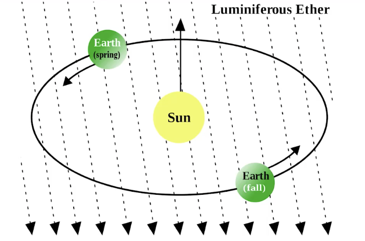

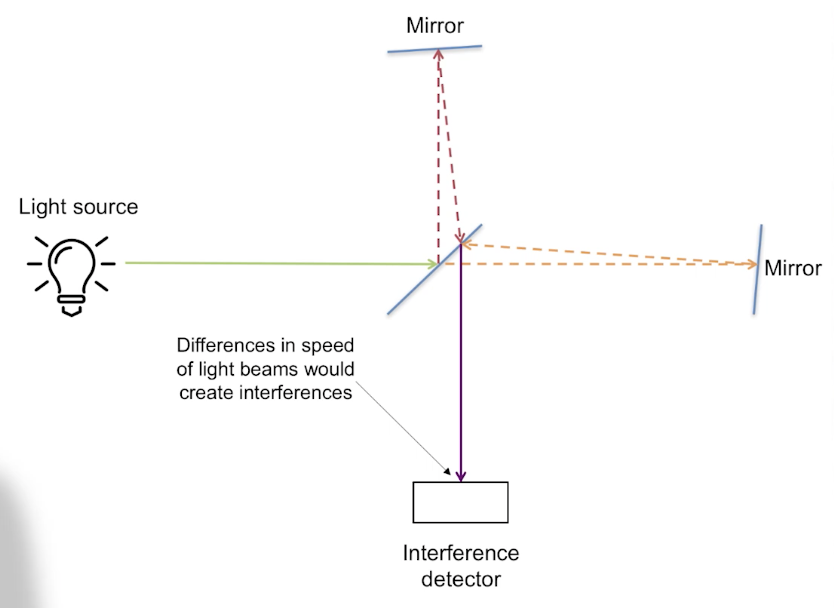

- Productive “failure”

- Non-Productive "failure"
    - Experimental observations are powerful evidence only if the process is designed correctly
    - Mill's Method of Difference: justifies conclusion only if assumptions about process are correct 
    - Most important: all relevant factors are controlled
    - Confirmation bias / interpretation problem: The observation is registered incorrectly due to psychological properties of the observer.
    - Observer effect / influence problem: The act of observation changes what is observed.
    - Placebo Effect: The therapeutic effect that an inert substance or treatment, designed to have no therapeutic value, has on a patient.
    - Selection Bias:  A factor influences the selection of the sample, or the division into test and control group, which one did not aim to create.

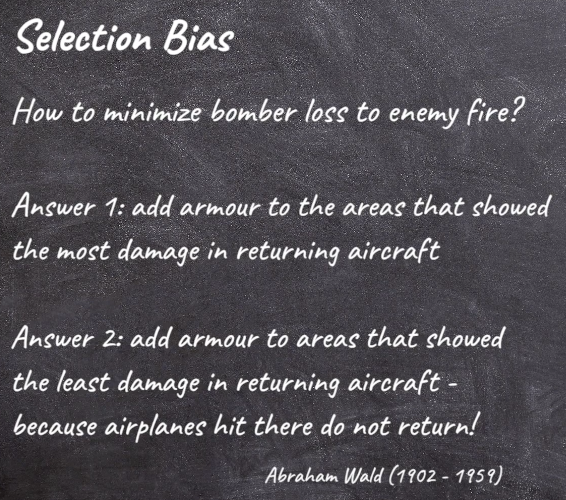

#### Internal Validity:
- The above errors compromise the process of experimentation:
    - Control of background variable
    - Intervention only on target variable
    - Correct observation
- Only if such errors are absent can an experimental observation justify accepting or rejecting a hypothesis. In that cases: conclusion from experimental observation are internally valid. 

### Detecting Experimental Errors:

- apply all the relevant knowledge we know
- investigate previously performed experiments
- Repetition:
    - An experiment is repeatable if there is enough information available about an experiment so that a component person other than the original experimenter can repeat the experimental procedures. 
- Reproduction:
    - An experimental result is reproduces if a competent repetition of the original experiment yields the same result. 
- Replication:
    - An experimental result is replicated if a comptetent independent experimrnt, in the spirit of the original experiment, with independent data, analytical methods, laboratories, and instruments, yields the same result. 

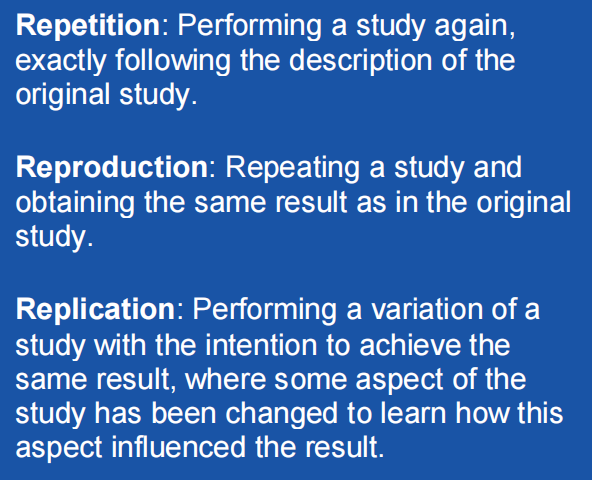

## How to implement experimental control?

- Experimental control consist in 
    - accurately identifying the features that are relevant for an experimental result
    - being able to infulence these features in such a way that alternative explanations of the experimental result can be ruled out. 

1. Divide experimental sujects/objects into treatment and control group

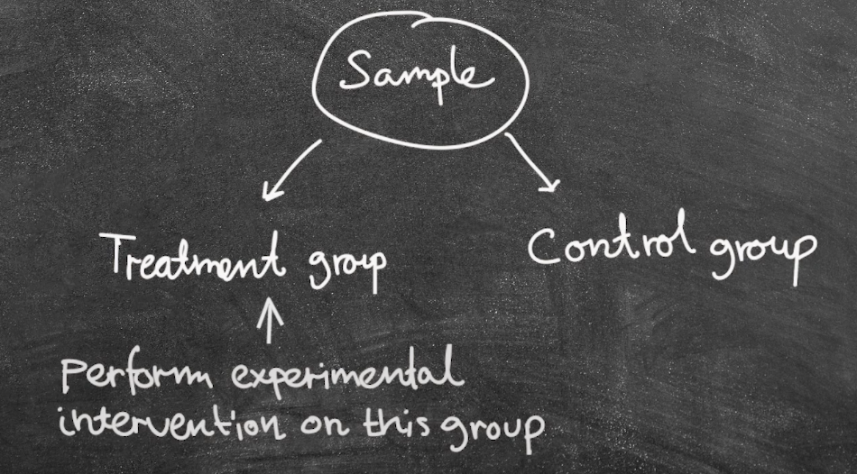

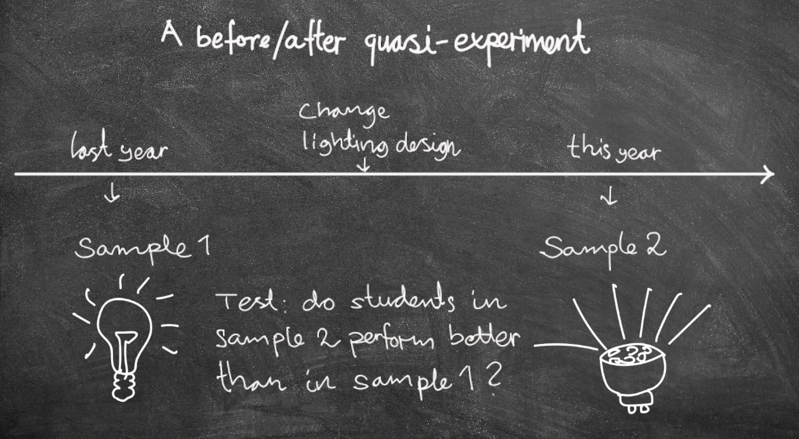

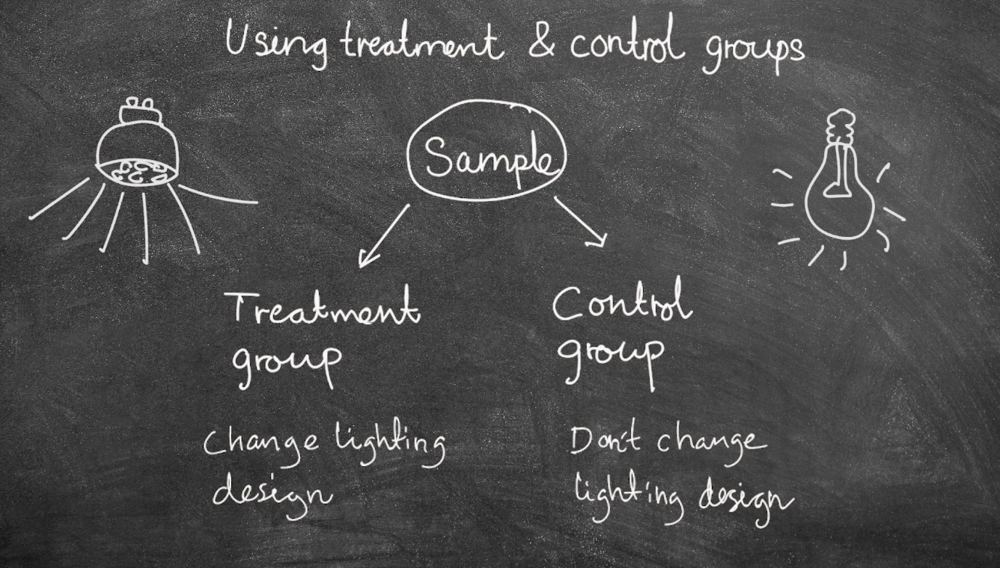

2. Holding things constant
    - Finding situations with same background variables.
    - Constructing situations with same background variables

3. Eliminating disturbing factors
    - vacuum
    - faraday cage
    - outer space

### Special case of elimination: Blinding

- Blinding: Eliminating observer effect or the influence problem through limiting information about the study to participants 
or observers.

- Single blinding / subject blinding: Blinding the participants in a study, for instance about whether they are in the test or control group. (Sujects do not know which treatment they are getting)

- Experimenter blinding: Blinding the observers in a study, for instance about which subjects are in the test and control group.

- Double blinding: A study is double blind if both subject blinding and experimenter blinding are implemented.(Experimenters do not know which treatments are administered to what subjects.)

4. Separating factors

- "separation" refers to the technique of isolating or distinguishing the influence of a specific factor from other factors in an experiment. The idea is that while it may not always be possible to completely eliminate the impact of a certain factor, researchers can deliberately separate it from other variables and observe its effects independently. The example provided involves the Gravity Probe experiment, where the intervention (placing a hydrogen maser in a weaker gravitational field) introduced an unavoidable Doppler shift in the treatment group. Despite this, the researchers were able to separately measure the Doppler Effect and then statistically account for it in their analysis, allowing them to isolate the impact of the weaker gravitational field (time dilation) as the main result of the experiment.

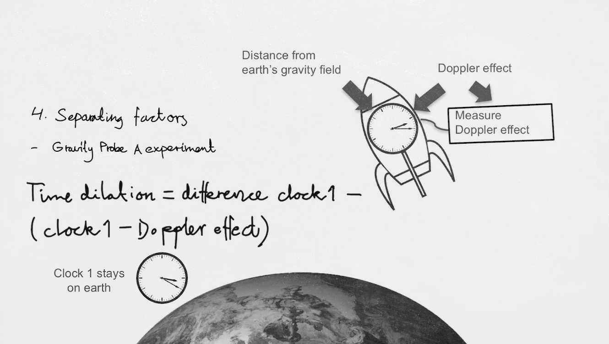

## Ramdomised Experiments

#### Randomised Controlled Trial(RCT)

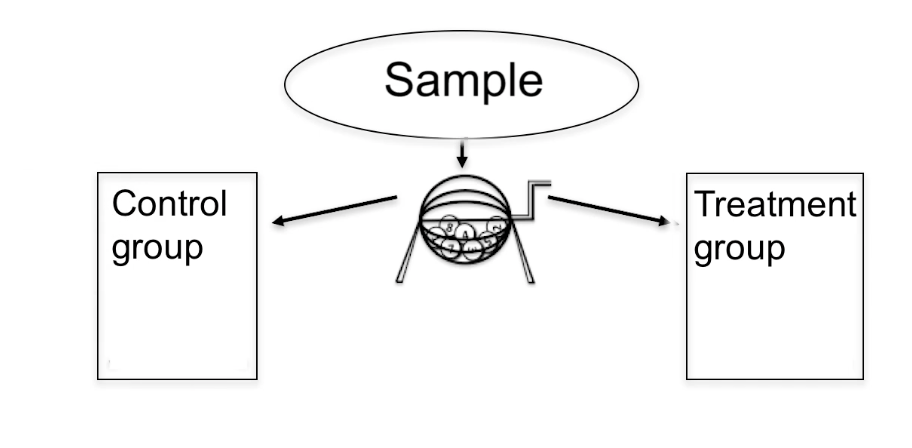

- Randomization: Using a random process to divide into test and control, for instance by flipping a coin.
- Random sampling: Using a random process to collect a sample from the population. Not to be confused with randomization.
- Note that randomization in RCTs refers only to the division process, not the sampling process.
- That is, an experiment is randomized if the division of the sample relies on a random process, even though the way you sampled from the population might be non-random and even highly biased!

#### Importance of RCTs

"Hierarchy of Evidence" 

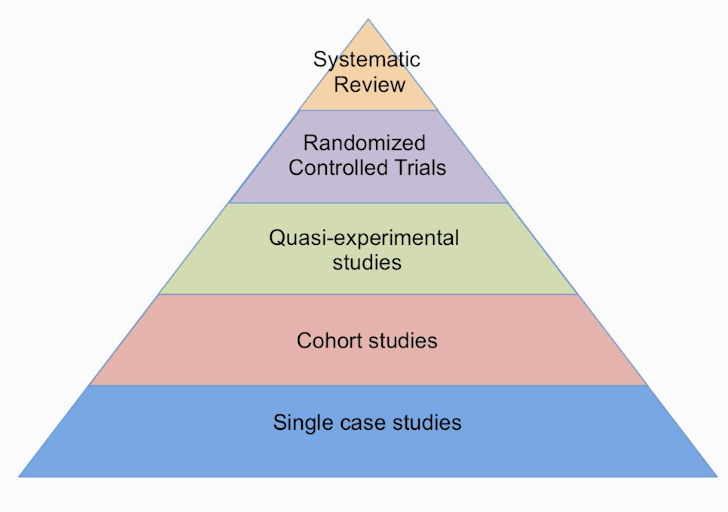

Evidential hierarchies: A ranking of types of evidence based on the processes that produced this evidence.

- Randomization eliminate selection bias. (eliminate bias in the control/treatment assignments.)
- Randomization helps convince others that you have not rigged the treatment/control division in favor of the outcome you want
- Randomization facilitate blinding og the identity of treatments from investigators, participants and assessors. 

#### Ramdomizatio helpful, but not necessary. 
- Avoid selection bias by other controlled assignment procedures
- Other controlled assignment procedures are also arguments against rigging selection
- Many other available blinding procedures that do not require randomization

#### Debunking stronger claims for RCTs
- Claim: Randomization ensures that background factors are equally distibuted in treatment and control group. (False)
    - We must therefore conclude that RCTs do not guarantee equal distributions of background factors in the control and the treatment groups.

> "Most experimenters on carrying out a random assignment will be shocked to find how far form equally the plots distribute themselves. Fisher(1926)

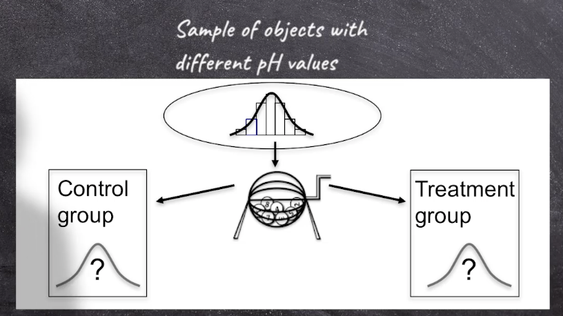

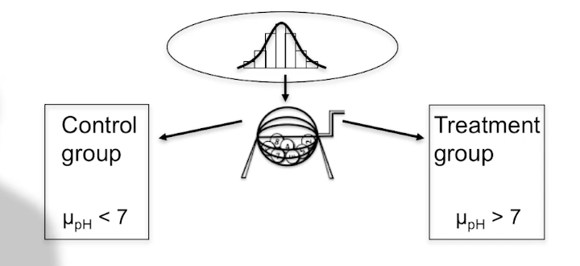

- Any particular randomization might yield differing dstributions in treatment and control
- Claim only true in infinite sequence
- But experimenters only randomize once, not repeatedly

### How to avoid such imbalances?

1. Check for imbalances in known factors post-randomization
2. Stratified randomization

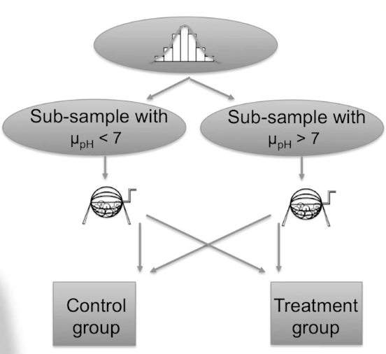

- For the above two balancing strategies, factors to be balanced need to be known
- Consequence: randomization does not guarantee control of unkown factors

#### Transfering RCT Results

- we cannot apply the RCT Results to another sample drawn from this population. 

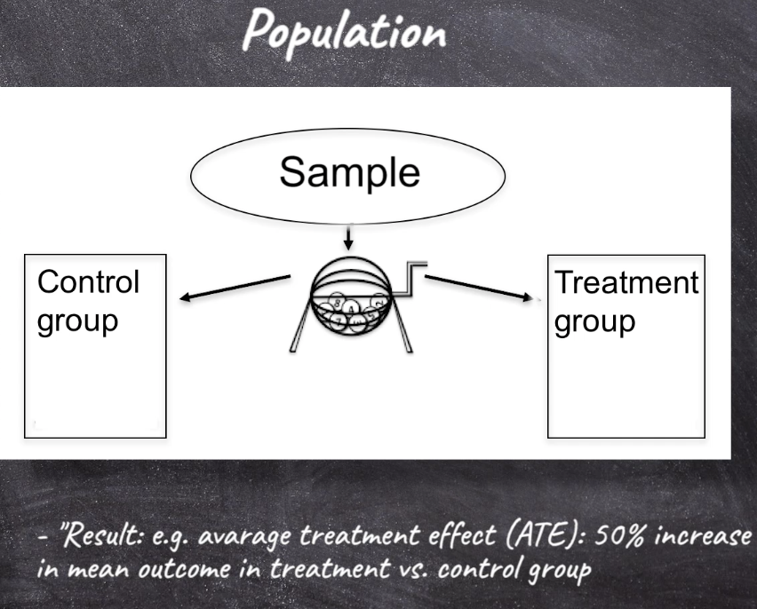

- Randomization is not random sampling from population. 

#### Summary
- Good reasons for randomization 
- Randomizing not necessary for these objectives
- Randomization not a guaratee for control of known or unknown background factors
- RCT results cannot be generalized without further argument
- Good RCTs require background knowledge
- RCTs not better evidence in principle than other experiment

### Exercise 1
1. The term validity applies to experimental designs: an experiment is either valid or invalid. 
    - False: inference or result is valid or invalid, not the experiment iteself. 
2. Certain inferences about an experiment might be valid, while others, about the same experiment, are not valid.
    - True
3. One can be more or less confident in the internal and external validity of an inference.
    - True(experiment provides evidence for the validity of the inference)
4. External validity concerns the inference about the experiment alone, excluding its application to any target system.
    -  False: When determining the external validity, we typically consider the similarity between the test setup and the real target we are interested in, for instance if we have a sample that is representative of the population, if the intervention made in the study is similar to the intervention in the real case, and if the control of the background variables have made the test situation different from the real case in an important sense.
5. Internal validity is improved through improved control.
    - True
6. Improving internal validity also improves external validity. 
    - False

### Exercise 2:
1. What is the defining distinction between experiment and observational studies?
    - intervention(active manipulation of variables)
2. Why did snow(the doctor in Soho) not perform an experiement?
    - cannot perform manipulation and cannot intervene on the target variable
    - background factors: found equally distributed
3. Why is that distinction so important? Is there something that we can learn from experiment that is difficult to learn from observational studies?
    - 
4. What property would an observational study have to have so one could learn as much form it as form an experiment?

- intervention: change a variable in the environment
- manipulation: we might perform to change or maintain factors(including background factors)

