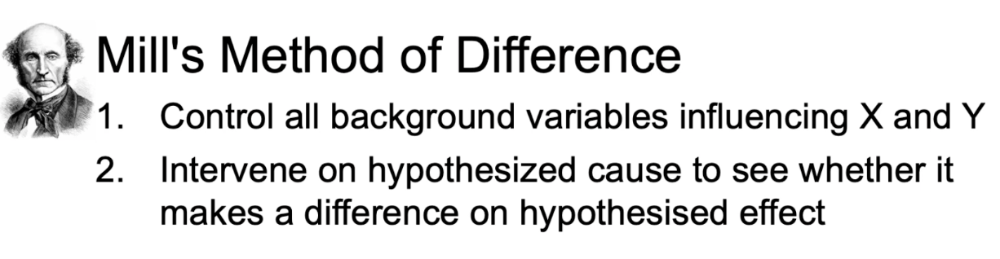
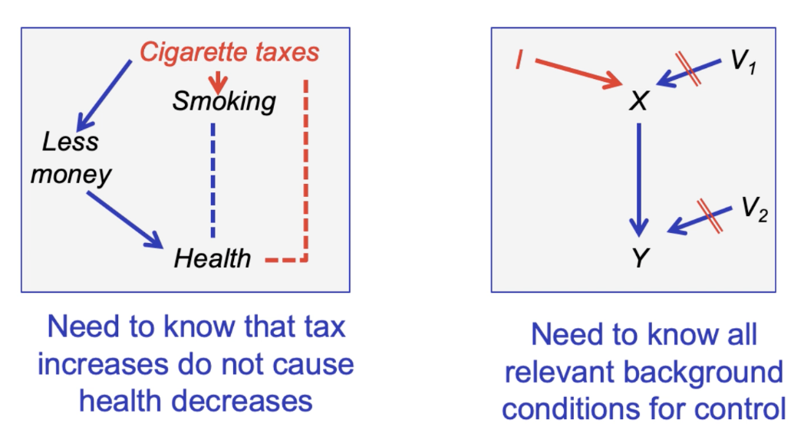

## Explanations and Causes

### Explanation as an Aim of Science

- Scientific Knowledge
    - Prediction
        - Forecasts
        - Reasons for expecting a phenomenon to occur in a paricular way
    - Design
        - Functioning artifacts
        - Reasons for expecting that a manipulation satisfies certain functions
    - Explanation
        - Understanding
        - Reasons for why the phenomenon to be explained is expected on a lawful basis

- In explanation the same as prediction, just applied to phenomena already observed. 

### The Deductive-Nomologival Account

- Natural law: A scientific law, usually thought to capture fundamental relationships in the natural world.

- Law-like generalization: A generalization based on empirical evidence which appears to capture regularities in a way similar to how a law does.

- Deductive-Nomological account of explanation: An account of what an explanation is that is based on deduction from natural laws or law-like generalizations, and initial conditions.

### Summary:
- Explanation as one aim of science
- Explanation provides understanding
- DN Account: Understanding a phenomenon achieved through deducing it from laws of nature

## Achieving Understanding

- Answer: B (The falgepole's height produce the shadow)

- such what-if questions can be answered by tracing productive relationships 
- Explanations help us understand by identifying the productive relationships - i.e. the relevant causes

- Note that this account offers an alternative proposal for what understanding is, compared to the one provided by the DN-account: understanding of an explanandum is not achieved by deducing it from laws of nature, but by showing how it was produced, and by answering how this productive relationship would change under counterfactual conditions. 

##### Cause: 
A change in one object or event which produces a change in another object or in another event.

- Causal account of explanation: An account of explanation where causes are the main component of the explanans (that which provides the explanation).

#### Singular Causal Explanation:
- Singular causal explanation: The explanation of a singular phenomenon or event by stating particular events as causes in the explanans.

##### why the vase broke?

- When explaining a specific event, at least in everyday contexts, we seem to do without laws. 

- To explain phenomenon E id to identify the contributing cause of E that makes a difference in the situation to be explained. 

- Identifying the difference-making contributing causes is sufficient to answer what if things had been different questions - i.e. sufficient to provide understanding. 

- We build models in different ways while doing explanations and predictions. 

### The formative of explanations

- Why did the vase break?
    - **Explanandum**: Features of phenomenon to be explained.
- Because it was dropped. 
    - **Explanans**: Statements that increase understanding of explanandum.

- Singular explanandum: A singular event, phenomenon or property that is to be explained.
- General explanandum: A general event, phenomenon or property that is to be explained.
- Singular explanans: The explanation is provided by a number of particular events, phenomena and properties.
- General explanans: The explanation is provided by a regularity or a law.

#### Contrastive Explanandum:

- Why did the vase break into fragments rather than just show fissures?

#### Contrastive Explanans:
- Because it was dropped from height X onto a floor with stiffness Y rather than form height < X onto floor with stiffness < Y. 

- The Explanans need to repsond to the difference/contrast in the explanandum. 

- We now have a situation where two people are asked the same question, come up with different answers and both answers are considered factually correct.

- What this example is intended to illustrate, is that the police officer and the engineer actually answered different questions even though it appeared they answered the same one. This is because they assumed different implicit contrasts.

### What makes explanations powerful?
1. Accuracy - whether the explanans describes the actual state/properties of the world. 
    - Explanation needs to identify only the difference-making contributing cause(s).
    - Accuracy (explanations): The explanans is true in the relevant respects.
2. Precision(of the Explanandum)
    - The more pecise the contrst is stated in the explanandum, the better the explanation. 
3. Difference-making(of the Explanans)
    - The explanans must identify all the contributing causes that produced the difference asked for in the explanandum. 
    - Precision in the explanans: The contrast featured in the explanandum is reflected in the explanans.
4. Non-sensitivity(of the Explanans)
    - Some explanans causes are more sensitive to background causes than others. 
    - Non-sensitivity: The causal chain in the explanans is sufficiently short so that the explanans is not sensitive to small changes in circumstances.
5. Cognitive Salience - The more easily a given explanantion can be grapsed, the more powerful it is 
    - Cognitive salience: The explanation is easy to understand for a target subject.

### Summary
- Causal explanations, i.e. those that identify difference-making contributing causes of an explanandum , can be better or worse
- 5 dimensions of making them better

### What is causation?

- X is a direct cause of Y with repect to a background variable set V. 
- There is a possible intervention on X that will change Y when all other variables in V are held fixed. 

Summary:
- Manipulability account of direct cause
- Derived form that: account of contributing cause. 

### How to learn about causes?

- Correcation is not causation. 
- Correlation: measures the association between two variables. 
- Causation: measures the productive influence of one variable on another. 

> David Hume: We only observe correlation but never causation. 

> Judea Pearl: Observing correlation is an important kind of evidence for causation.

##### Correlation Not Necessary for causation

In this case, we have causal relationship without any correlations. 

##### Correlation not sufficient for causation

- Many different causal models are copatible with correlation data！ How to determine the correct one?

##### Strategy 1: Controlled Experiments

##### Strategy @: Instrumental Variable Analysis
- For detecting causes for observational data

#### These strategies require causal knowledge

### Summary
- Causes is not correlations
- Correlations as evidence for causes
- Experimental & observational strategies for generating that evidence
