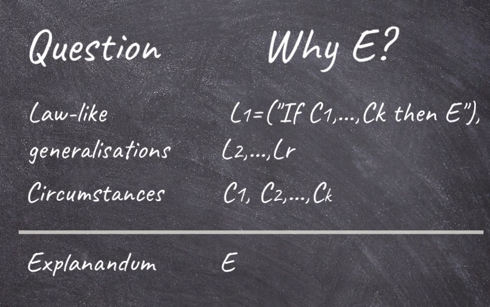

## Explanations and Causes

### Explanation as an Aim of Science

- Scientific Knowledge
    - Prediction
        - Forecasts
        - Reasons for expecting a phenomenon to occur in a paricular way
    - Design
        - Functioning artifacts
        - Reasons for expecting that a manipulation satisfies certain functions
    - Explanation
        - Understanding
        - Reasons for why the phenomenon to be explained is expected on a lawful basis

- In explanation the same as prediction, just applied to phenomena already observed. 

### The Deductive-Nomologival Account

- Natural law: A scientific law, usually thought to capture fundamental relationships in the natural world.

- Law-like generalization: A generalization based on empirical evidence which appears to capture regularities in a way similar to how a law does.

- Deductive-Nomological account of explanation: An account of what an explanation is that is based on deduction from natural laws or law-like generalizations, and initial conditions.

### Summary:
- Explanation as one aim of science
- Explanation provides understanding
- DN Account: Understanding a phenomenon achieved through deducing it from laws of nature

## Achieving Understanding

- Answer: B (The falgepole's height produce the shadow)

- such what-if questions can be answered by tracing productive relationships 
- Explanations help us understand by identifying the productive relationships - i.e. the relevant causes

- Note that this account offers an alternative proposal for what understanding is, compared to the one provided by the DN-account: understanding of an explanandum is not achieved by deducing it from laws of nature, but by showing how it was produced, and by answering how this productive relationship would change under counterfactual conditions. 

##### Cause: 
A change in one object or event which produces a change in another object or in another event.

- Causal account of explanation: An account of explanation where causes are the main component of the explanans (that which provides the explanation).

#### Singular Causal Explanation:
- Singular causal explanation: The explanation of a singular phenomenon or event by stating particular events as causes in the explanans.

##### why the vase broke?

- When explaining a specific event, at least in everyday contexts, we seem to do without laws. 