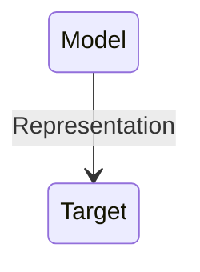

## Models

#### What are models?
Models as ...
- representations
- idealisations
- purpose dependent
- things to manipulate

- Representation:Something is a representation of something else if it stands in for that thing, meaning we use or investigate that thing instead of what we are really interested in.

- Target: A target is that which a model aims to represent.

##### Why represent targets with models, instead of investigating the target itselt?

- Answer: we cannot handle the target directly. 
    - **Physically impossible or too costly** : Perhaps there are physical limitations such that it is in effect impossible to investigate the target directly. It might also be economically unfeasible to do such investigations.(For example, we would have to build a wind tunnel for testing an actual jet. That would involve enormous resources that we typically do not have, so instead we build a scale model that we can fit into a much smaller wind tunnel.)
    -  **legally or morally prohibited** : we are morally or legally restricted in what we can do with or to the target.
    -  **cognitively too demanding** : targets are often very complex. They are so complex that investigating them in all their detail would be very difficult to process cognitively.