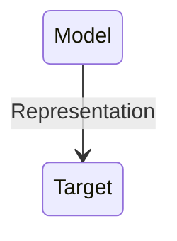

## Models

#### What are models?
Models as ...
- representations
- idealisations
- purpose dependent
- things to manipulate

- Representation:Something is a representation of something else if it stands in for that thing, meaning we use or investigate that thing instead of what we are really interested in.

- Target: A target is that which a model aims to represent.

##### Why represent targets with models, instead of investigating the target itselt?

- Answer: we cannot handle the target directly. 
    - **Physically impossible or too costly** : Perhaps there are physical limitations such that it is in effect impossible to investigate the target directly. It might also be economically unfeasible to do such investigations.(For example, we would have to build a wind tunnel for testing an actual jet. That would involve enormous resources that we typically do not have, so instead we build a scale model that we can fit into a much smaller wind tunnel.)
    -  **legally or morally prohibited** : we are morally or legally restricted in what we can do with or to the target.
    -  **cognitively too demanding** : targets are often very complex. They are so complex that investigating them in all their detail would be very difficult to process cognitively.

##### Models as idealisation

- Idealization: The fact that a model is an idealization of its target means that it does not have all the properties that the target has, and vice versa.

> "Bohr Theory" (1913) "One has reasons to believe that theory is not false", "Object of theory is indeed governed by principles stated in theory"

> "Bohr Theory" (1925) "Provides approximation of object in question" "Alternative representations of the same object useful for other purposes exist. 

- A model has certain properties, and a target has certain properties. Despite models being representations of targets, there are always differences between a model and its corresponding target. **This is what is meant by idealization: a model is an idealization of a target if the model is supposed to represent that target, but model and target differ in some of their properties.**

- Idealization is a characteristic of models that distinguish them from theory.

### Models are Purpose-dependent

- **Purpose dependence**: A model can only be justified on the basis of how useful it is for fulfilling a certain purpose

- Same target, two different models

- quantum mechanic model
    - more precise
    - more similar in relevant properties
- Structure Model
    - simpler
    - more transparent(easier to work with and understand)
    - theoretically more tractable(functional group analysis)

#### Models as things to be manipulate

- Analogy: Inference by analogy is to state that a conclusion in one case applies to another case due to there being relevant similarities between the cases.

- Positive Analogy: Similarity between model and target.

- Negative analogy: Dissimilarity between model and target.(idealisations)

- Neutral analogy: Property of model, whose occurrence in target is not known.

-  The positive analogies between rats and humans include similar basic physiology, similar organs, and similar hormones.
-  The negative analogies between rats and humans include the difference in size and in lifespan between humans and rats.
- One neutral analogy between humans and rats is the rats’ reaction to a newly synthesized drug. 
    - let’s say rats are capable of ingesting it, it doesn’t poison them, and it cures a particular kind of cancer, while scientists don’t know how humans react to it (because they are not legally allowed to test it directly on humans, say). (This is just hypothese, until the condidence grows to make it a posive hypotheses--need extraexperimental evidence). By analogy, one then infers from the rat model that humans will react similarly to this new drug.

- we must choose our material models not just with respect to the positive analogies that they offer to the desired target, but also with respect to the interesting ways we can manipulate them and learn about new model properties that provide the material for new neutral analogies. Pretty much the same reasoning can be applied also to computational and mathematical models.

### Models vs. Experiments

- Similarities
    - In a model & parameters - cf. experimental control 

### Exercise
1. When is a model robust?
2. What model problem is robustness trying to address? Think of an example.
3. If some apsects of a model are changed and yield the same results, would that not imply that the model is imprecise or inaccurate rather than robust?

1. A model is robust with respect to an assumption if changing this assumption does not change the model result. (changing the parameters, the result remains unchanged).

2. Robustness in the context of modeling is primarily addressing the problem of overfitting and the potential lack of generalization to new, unseen data.

3. It might indicate that the model lacks sensitivity to those particular changes, but it doesn't necessarily imply that the model is imprecise or inaccurate. This situation could be a characteristic of robustness, especially if the changes pertained to elements that the model is designed to handle or is inherently insensitive to.