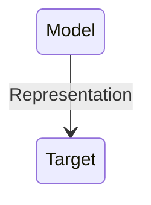
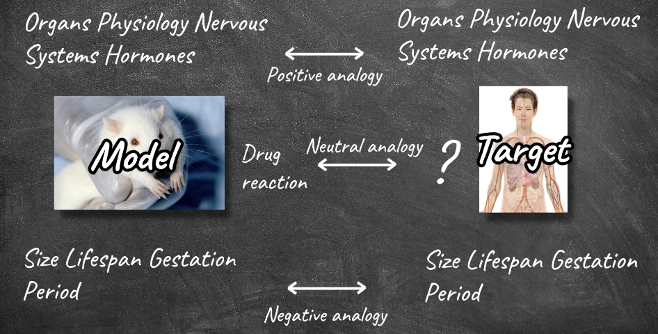
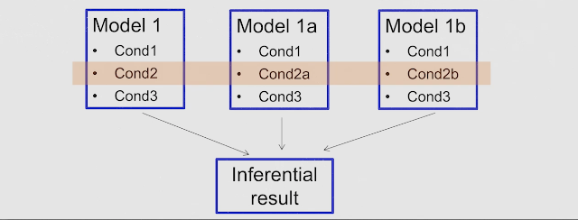
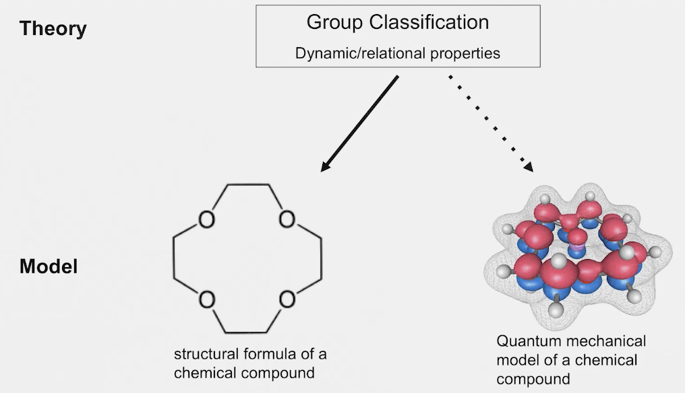
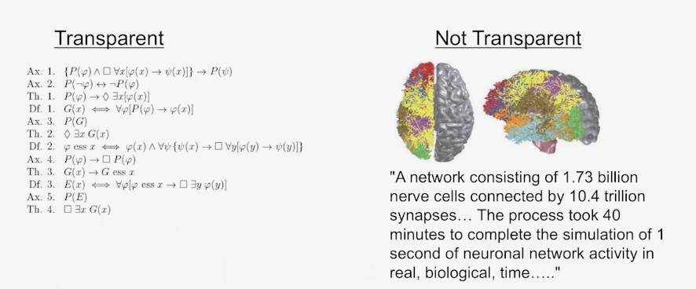
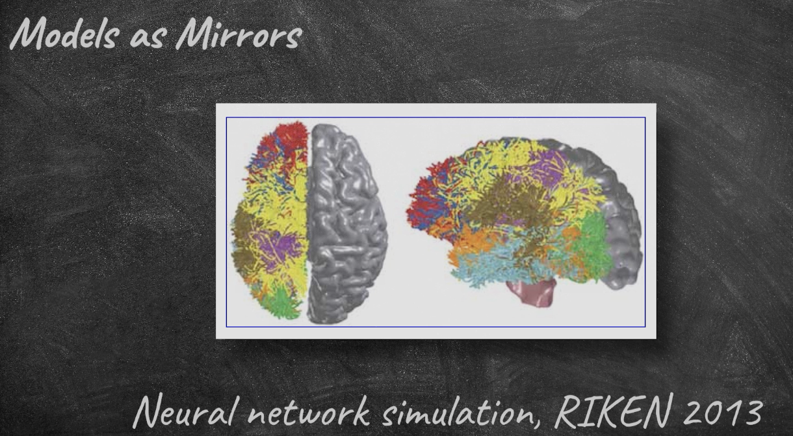
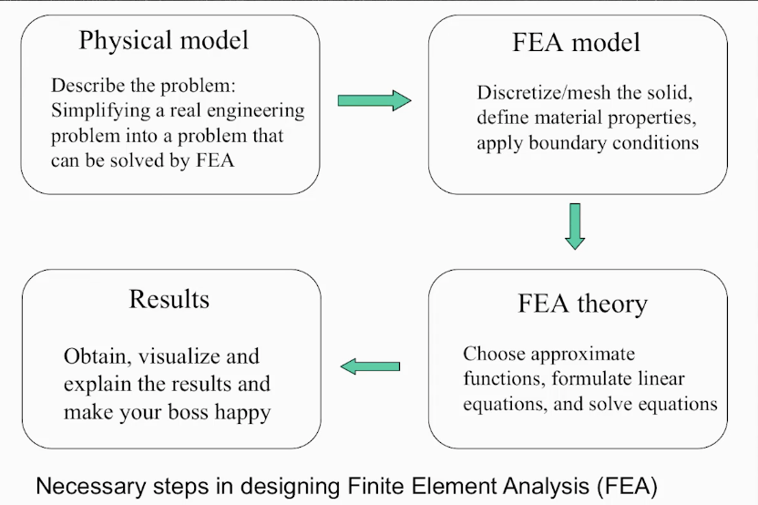
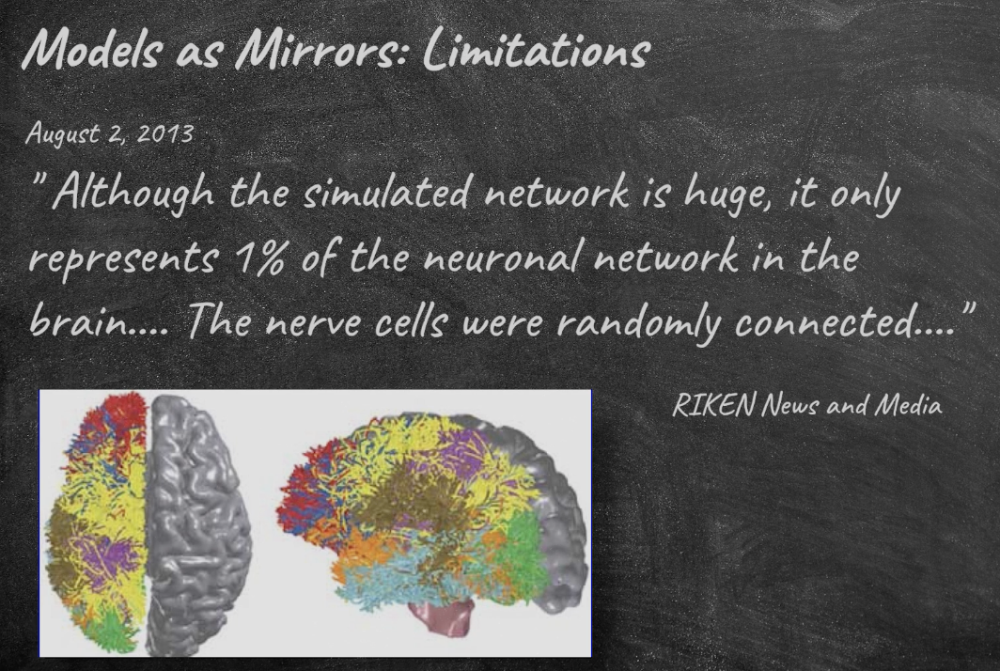
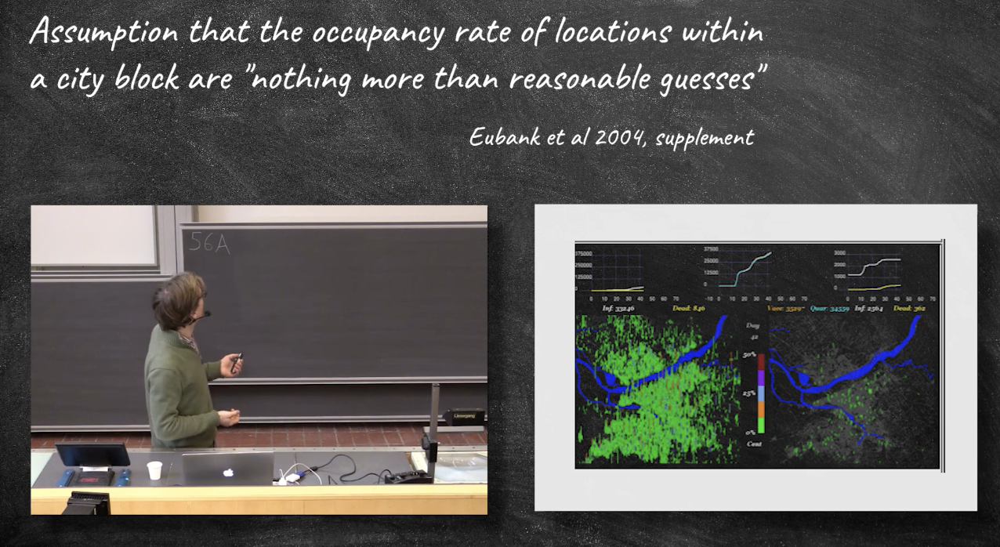

## Models

#### What are models?
Models as ...
- representations
- idealisations
- purpose dependent
- things to manipulate

- Representation:Something is a representation of something else if it stands in for that thing, meaning we use or investigate that thing instead of what we are really interested in.

- Target: A target is that which a model aims to represent.

##### Why represent targets with models, instead of investigating the target itselt?

- Answer: we cannot handle the target directly. 
    - **Physically impossible or too costly** : Perhaps there are physical limitations such that it is in effect impossible to investigate the target directly. It might also be economically unfeasible to do such investigations.(For example, we would have to build a wind tunnel for testing an actual jet. That would involve enormous resources that we typically do not have, so instead we build a scale model that we can fit into a much smaller wind tunnel.)
    -  **legally or morally prohibited** : we are morally or legally restricted in what we can do with or to the target.
    -  **cognitively too demanding** : targets are often very complex. They are so complex that investigating them in all their detail would be very difficult to process cognitively.

##### Models as idealisation

- Idealization: The fact that a model is an idealization of its target means that it does not have all the properties that the target has, and vice versa.

> "Bohr Theory" (1913) "One has reasons to believe that theory is not false", "Object of theory is indeed governed by principles stated in theory"

> "Bohr Theory" (1925) "Provides approximation of object in question" "Alternative representations of the same object useful for other purposes exist. 

- A model has certain properties, and a target has certain properties. Despite models being representations of targets, there are always differences between a model and its corresponding target. **This is what is meant by idealization: a model is an idealization of a target if the model is supposed to represent that target, but model and target differ in some of their properties.**

- Idealization is a characteristic of models that distinguish them from theory.

### Models are Purpose-dependent

- **Purpose dependence**: A model can only be justified on the basis of how useful it is for fulfilling a certain purpose

- Same target, two different models

- quantum mechanic model
    - more precise
    - more similar in relevant properties
- Structure Model
    - simpler
    - more transparent(easier to work with and understand)
    - theoretically more tractable(functional group analysis)

#### Models as things to be manipulate

- Analogy: Inference by analogy is to state that a conclusion in one case applies to another case due to there being relevant similarities between the cases.

- Positive Analogy: Similarity between model and target.

- Negative analogy: Dissimilarity between model and target.(idealisations)

- Neutral analogy: Property of model, whose occurrence in target is not known.

-  The positive analogies between rats and humans include similar basic physiology, similar organs, and similar hormones.
-  The negative analogies between rats and humans include the difference in size and in lifespan between humans and rats.
- One neutral analogy between humans and rats is the rats’ reaction to a newly synthesized drug. 
    - let’s say rats are capable of ingesting it, it doesn’t poison them, and it cures a particular kind of cancer, while scientists don’t know how humans react to it (because they are not legally allowed to test it directly on humans, say). (This is just hypothese, until the condidence grows to make it a posive hypotheses--need extraexperimental evidence). By analogy, one then infers from the rat model that humans will react similarly to this new drug.

- we must choose our material models not just with respect to the positive analogies that they offer to the desired target, but also with respect to the interesting ways we can manipulate them and learn about new model properties that provide the material for new neutral analogies. Pretty much the same reasoning can be applied also to computational and mathematical models.

### Models vs. Experiments

- Similarities
    - In a model we set variables & parameters - cf. experimental control
    - We manipulate a model - cf. experimental manipulation
    - we observe results of model manipulation - cf. exp. Observation

- Differences
    - Internal validity less of a problem for models than for experiment
    - Justifying neutral analogies is a problem for all models but only for some experiments

### Summary
- Models are things to manipulate 
- They provide neutral analogies
- Source of errors distinguished modelling from experimenting

### Must models be Similar to their targets?

#### What are potential quality criteria for good modeling?

- What makes a good model?
    - No fixed scheme... but many ingredients that need to be balanced/
- Similarity to target
- Robustness
- Precision
- Simplicity
- Theoretical tractability
- Transparency

### Similarity
- How similar is the model to the target

- A model M is a good representation of a target X if and only if M is similar to X with repect to properties P to the degree $d^P$

- Similarity: The degree to which the model has several properties which the target also has (there are multiple positive analogies) that are relevant for the modelling purpose.

- According to the above definition, can we ever exclude any model as a bad representation of any given target?
- Reduce the question of good representation to the question of similarity
- That's not what suffices to say that it is a good representation.

- Similarity: The degree to which the model has several properties which the target also has (there are multiple positive analogies) that are **relevant for the modelling purpose.**

- similarity itself is not a criterion of good representation. We should consider the modelling purpose

### Model Virtues: what makes a good model?

- Epistemic virtues of models: Types of properties of models that determine the quality of a model, given a specific purpose

#### Robustnes
- A model result is robust (with repect to some condition) if changing this condition does not change the model result.

#### Precision
- A model M1 is more precise(with respect to a parameter P) than another model M2 if the parameter specifications of M1 imply the parameter specifications of M2. (Parameter Precision)

- Parameter precision: One model has higher parameter precision than another model, if the specifications of the parameters of the first model implies the parameter specifications of the second.

- Consider the following examples. Model 1 describes the rate of change only as a function of N: M1=f(N). Model 2, in contrast, describes this as a linear function of N: M2=a+b*N. Clearly, the description of M2 implies the description of M1. If something is a linear function of N, then it is also a function of N. Therefore, M2 is more precise than M1 in its parameter.

#### Simplicity

- Simplicity: One model is simpler than another model if it contains less parameters than another model.(Contains less details)

- The map of the London Underground is an excellent example. Through numerous iterations, its makers have honed the map to only those details that are relevant for the purpose of assisting traveling the city underground. Details like distance between metro stations, curvature of the rail lines, locations of streets and monuments are all omitted. This makes the map easier to use and helps to quickly and correctly apply it for its intended purpose. However, these simplifications simultaneously make the map useless for other purposes, such as if, for example, hapless tourists try to use it to find their way around the city on foot.

- A Model M1 is simpler than another model M2 if (i)M1 processes less varibales than M2 (ii) M1 contains less parameters than M2, and (iii) M1 uses fewer operations than M2

- Simplicity is only about the model, not the target. 

#### Tractability

- A model is tractable (with repsect to some general set of rules), if the relevant model result can be obtained by applying these principles to the model. 

- Tractability: A model is computationally tractable only if its result can be computed in polynomial time. A model is analytically tractable only if the model result can be obtained through valid deduction, from the model assumptions alone. A model is theoretically tractable only if the model is either computationally or analytically tractable, and some of the necessary 
computational or deductive steps are justified with reference to a background theory.

模型的可处理性指的是在特定的约束或规则下，通过将这些原则应用于模型，可以获得模型相关结果的可管理性和可解性。

**可处理性的类型：**
1. **计算可处理性：**
   - 如果模型的结果可以在多项式时间内计算，则该模型在计算上是可处理的。这意味着获取结果所需的计算资源最多与输入规模呈多项式关系。例如，如果运行一个天气模拟模型所需的时间与模拟的复杂性成比例，那么它在计算上是可处理的。

2. **分析可处理性：**
   - 如果模型的结果仅基于模型假设通过有效的推导获得，则该模型在分析上是可处理的。这涉及通过逻辑推理在不需要大量计算工作的情况下得出结论。例如，如果经济模型对市场行为的预测可以从一组明确定义的假设中逻辑推导出来，那么它在分析上是可处理的。

3. **理论可处理性：**
   - 如果模型在计算上或分析上是可处理的，并且一些必要的计算或推导步骤是基于背景理论合理的，那么该模型在理论上是可处理的。这确保了模型的解与已建立的理论原则一致。例如，如果物理模型预测粒子行为的计算基于已建立的物理定律，那么它在理论上是可处理的。

总之，在建模中，可处理性涵盖了通过计算方法、分析推导或两者的结合高效获取结果的能力，同时通过与相关理论框架的合理步骤来保证模型解的可靠性。

#### Transparency
- A model is epistemically transparent if the model user is cognitively capable of understanding how the model result is produced.

#### Trading off Virtues

- Increasing one epistemic virtue in a model often means decreasing another one.
- e.g. precision - transparency, similarity - simplicity
- Buidling a model means finding the trade-off best for **your purpose**!

## learning from and with models: models as mirrors
- as mirrors of the real world 
- as isolations

Mirror models: A model with high similarity to target

- FEA Model:  Finite Element Analysis (FEA).

#### models as mirrors: limitation

Models as mirrors might function as ideal, but comes at a cost
- high similarity to a target, precision
- lack of simpkicity, tractability, transparency
- ...but not sufficient to avoid external validity issues

### Learning from models: models as isolations

- Isolation model: A model with high simplicity.

Can a model be similar to its target and still be simple
- Isolating models pick out some aspect of the  target, ignoring all the others
- They represent the workings of that factor accurately

#### Isolating Models: Limitations

- System must be dividable this way
    - component must be truly independent
- Difficult to validate isolated models
    - Result of valid isolating models might not look like anything in the real world - because real-world phenomena are combination of effects, while isolating model only represent one such effect.
    - Validation either through sythesis - but that gives rise to a new version of Duhem-Quine problem
    - Or by carefully construcing isolating experiments

### Exercise
1. When is a model robust?
2. What model problem is robustness trying to address? Think of an example.
3. If some apsects of a model are changed and yield the same results, would that not imply that the model is imprecise or inaccurate rather than robust?

1. A model is robust with respect to an assumption if changing this assumption does not change the model result. (changing the parameters, the result remains unchanged).

2. Robustness in the context of modeling is primarily addressing the problem of overfitting and the potential lack of generalization to new, unseen data.

3. It might indicate that the model lacks sensitivity to those particular changes, but it doesn't necessarily imply that the model is imprecise or inaccurate. This situation could be a characteristic of robustness, especially if the changes pertained to elements that the model is designed to handle or is inherently insensitive to.
