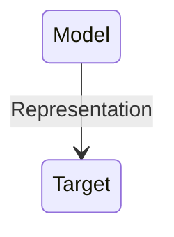
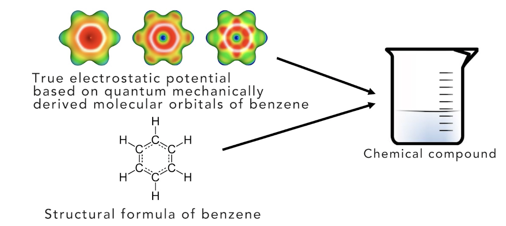
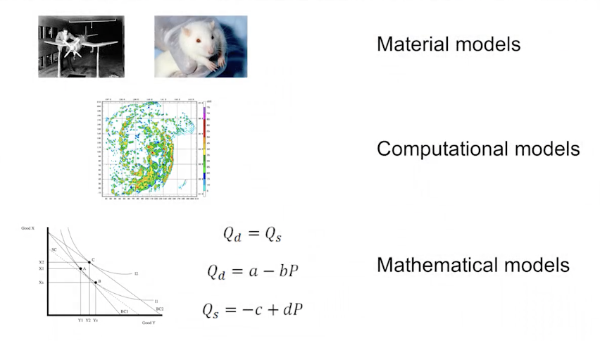

## Models

#### What are models?
Models as ...
- representations
- idealisations
- purpose dependent
- things to manipulate

- Representation:Something is a representation of something else if it stands in for that thing, meaning we use or investigate that thing instead of what we are really interested in.

- Target: A target is that which a model aims to represent.

##### Why represent targets with models, instead of investigating the target itselt?

- Answer: we cannot handle the target directly. 
    - **Physically impossible or too costly** : Perhaps there are physical limitations such that it is in effect impossible to investigate the target directly. It might also be economically unfeasible to do such investigations.(For example, we would have to build a wind tunnel for testing an actual jet. That would involve enormous resources that we typically do not have, so instead we build a scale model that we can fit into a much smaller wind tunnel.)
    -  **legally or morally prohibited** : we are morally or legally restricted in what we can do with or to the target.
    -  **cognitively too demanding** : targets are often very complex. They are so complex that investigating them in all their detail would be very difficult to process cognitively.

##### Models as idealisation

- Idealization: The fact that a model is an idealization of its target means that it does not have all the properties that the target has, and vice versa.

> "Bohr Theory" (1913) "One has reasons to believe that theory is not false", "Object of theory is indeed governed by principles stated in theory"

> "Bohr Theory" (1925) "Provides approximation of object in question" "Alternative representations of the same object useful for other purposes exist. 

- A model has certain properties, and a target has certain properties. Despite models being representations of targets, there are always differences between a model and its corresponding target. **This is what is meant by idealization: a model is an idealization of a target if the model is supposed to represent that target, but model and target differ in some of their properties.**

- Idealization is a characteristic of models that distinguish them from theory.

### Models are Purpose-dependent

- **Purpose dependence**: A model can only be justified on the basis of how useful it is for fulfilling a certain purpose

- Same target, two different models

- quantum mechanic model
    - more precise
    - more similar in relevant properties
- Structure Model
    - simpler
    - more transparent(easier to work with and understand)
    - theoretically more tractable(functional group analysis)

#### Models as things to be manipulate

