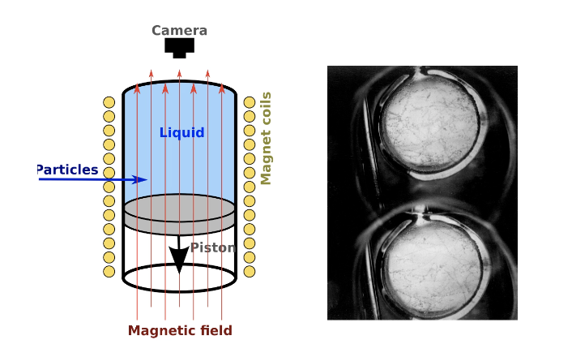
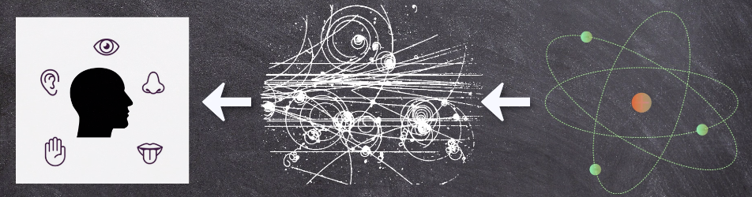
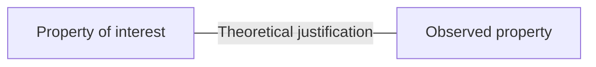
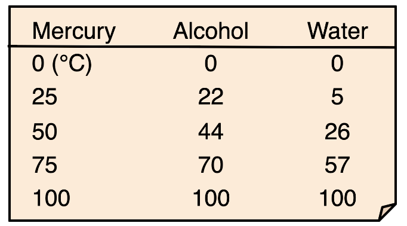
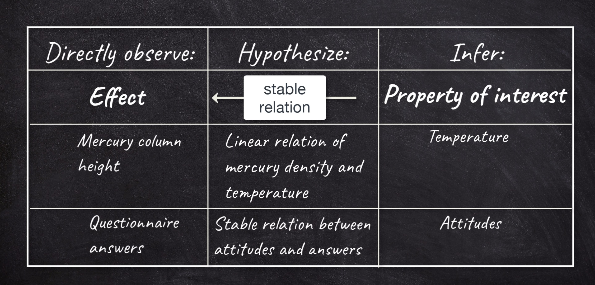
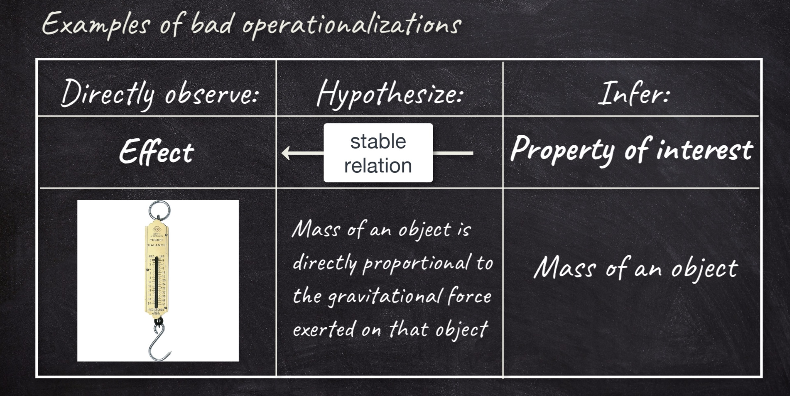
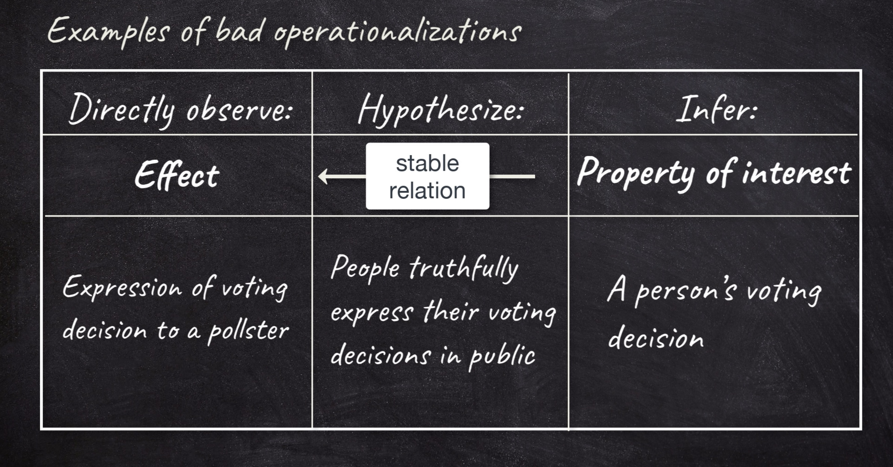
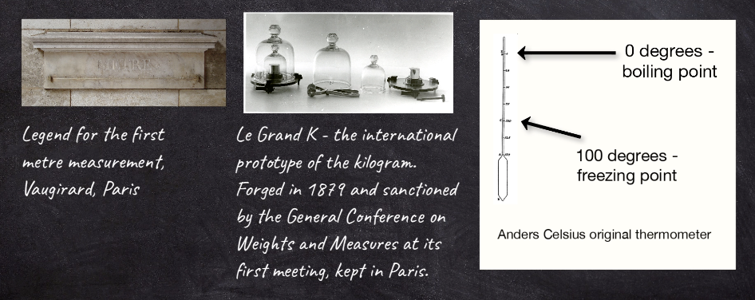
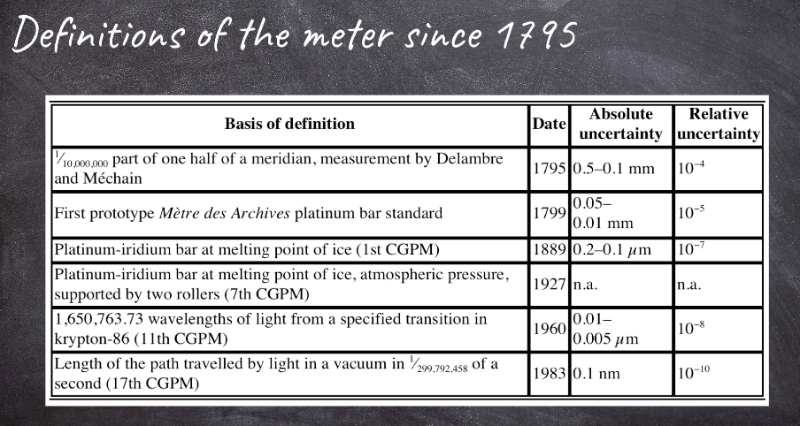
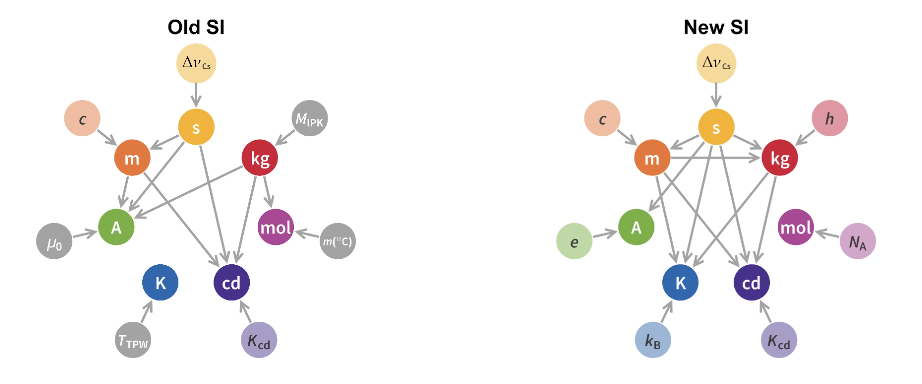

### Observations and Measurements

- observation plays a crucial and fundamental role in science. 
- scienctists are empiricists.
- In Greek, empeiria = sensory experience(ultimate basis of knowledge)

> "Because you have seen me, you have believed, blessed are those who have not seen and yet have believed." John 20:29

### Direct observation: by unaided sense experience

### Aided direct observation: to amplify sense experience

Examples of aided observation:
- optical microscope
- optical telescope

there is still direct connection between your sense and the objects

### Indirect observation: sense experience of the effect of an event, but not the event itself.

- e.g. we cannot directly observe atomic particles. 

- the objects are not observable, but we can observe their effects.

- bubble chamber
    - 气泡室（Bubble Chamber）是1952年美国物理学家唐纳德·格拉泽（Donald A. Glaser）发明，用以探测高能带电粒子径迹的一种有效的仪器
    - 气泡室是由一密闭容器组成，容器中盛有工作液体，液体在特定的温度和压力下进行绝热膨胀，由于在一定的时间间隔内（例如50ms）处于过热状态，液体不会马上沸腾，这时如果有高速带电粒子通过液体，在带电粒子所经轨迹上不断与液体原子发生碰撞而产生低能电子，因而形成离子对，这些离子在复合时会引起局部发热，从而以这些离子为核心形成胚胎气泡，经过很短的时间后，胚胎气泡逐渐长大，就沿粒子所经路径留下痕迹 。如果这时对其进行拍照，就可以把一连串的气泡拍摄下来，从而得到记录有高能带电粒子轨迹的底片。

##### Summary:
- Different kinds of sensory experience
- DIffernt relations between observed object and senses
- Instruments play different roles

### The Theory-Dependence of Observation

- logical Empiricism(1920s-1950s)
    - 逻辑实证主义 逻辑实证主义是一个哲学流派，以经验为根据，以逻辑为工具，进行推理，用概率论来修正结论。 它认为，科学的方法是研究人类行为的唯一正确的方法，因此，它虽然以感性的经验为依据，但却否认了感性认识的积极作用，是不折不扣的理性主义。
    - Separation of Observational Sentences and Theoretical Knowledge:
        - In logical empiricism, there is a distinction made between two types of statements or sentences:
            - Observational Sentences: These are statements that describe direct observations of the world, often based on sensory experiences. Observational sentences are considered basic empirical data, such as "The apple is red" or "The thermometer reads 25 degrees Celsius." They are supposed to be objective and verifiable through empirical evidence.
            - Theoretical Knowledge: In contrast, theoretical knowledge includes statements or theories that go beyond direct observations. These are generalizations, hypotheses, and theories that are constructed to explain and interpret observational data. For example, in physics, the theory of gravity is a part of theoretical knowledge.
        - The separation of observational sentences and theoretical knowledge is based on the idea that empirical science should rely on a foundation of empirical observations as the starting point. Theories are then built upon these observations, and their validity is tested and justified by empirical evidence.

##### Indirect Observation Requires Theory
- e.g. bubble chamber
    - some requireed background assumptions:
        - properties of liquids in superheated phase
        - relation particle charge - ionization
        - relation bubble density - particle's energy loss
    - Without these assumptions, it would be unjustifiable to claim, "I observe particles."
    - relation between property of interest and observed property

- Indirect Observation is always theory-dependent. (We should believe the theory is true while doing indirect observation)

##### Aided Direct Observation Requires Theory

- Galileo and telescope: 
    - 月球表面的山脉和坑洞： 伽利略观察到月球表面并注意到了山脉、撞击坑以及其他特征，这证明了月球并不是完全光滑的天体。
    - 木星的卫星： 伽利略发现了木星的四颗大型卫星，后来被称为伽利略卫星，这证明了天体不必围绕地球运转。
    - 金星存在阴晴圆缺的位相变化： 这表明金星绕太阳运转，而不是绕地球。
    - 他把新的发现写成《星界的报告》一书，这本书的出版引起了巨大的反响。然而，神学家们却咒骂望远镜是“魔鬼的发明”，伽利略也因宣传日心说而受到教会的迫害。

- The telescope exhibit optical aberrations
- When observing known objects("on earth"), telescope users can correct for these mistakes.
- But when looking at unkown objects in unknown contexts("in the heaven"), it is uncertain what is phenomenon and what is aberration. (we can't really check whether the telescope depicts the right pictures of the heavenly bodies.)
- To distinguish them, we need a theory of optics that explains abberations. Galileo did not have that, 

$\Rightarrow$ At least some aided direct observations are theory-dependent.

- we need to explain why optical abberation happens and how to divide abberations from the actual phenomenons. 
    

- We can't have observations as the foundations of theory, because some observations are theory-dependent. 

#### Circularity in temperature measurement

- Indirect observation: temperature - (cause)density of liquid
- Assume: Linear relationship
- What evidence do we have this relationship? Temperature measurements.

#### Problem of Nomic Measurement
1. We want to measure quantity X
2. Quantity X is not directly observable, so we infer it from another quantity Y, which is direcly observable.
3. For this inference we need an empirical regulariy that expresses X as a function of Y: X=f(Y)
4. The form of this function f cannot be discovered or tested empirically, because that would involve knowing the value of both Y and X, and X is the unknown variable that we are trying to measure. 

#### Henri Victor Regnault(1810-1878)

- Compare stability of observation from thermometers filled with same liquids under varying conditions. 
- Certain kinds of thermometers generate more consistent measurements than others.

- He aims to avoid the circularity problem, which requires regularities or laws behind the measurement.

#### Summary
- Indirect observation always theory-dependent
- Aided direct observation sometimes theory-dependent
- Theory-dependence complicates empiricism
- Threat of circularity of indirect observation

### Operationalization

Only a few of the examples we discussed earlier were not directly observable in principle:

A. Comparative speed of two cars - timer & distance measrue
B. Comparative speed of impulses traveling through a motor nerve
C. Bacteria
D. Temperature of a liquid -  Mercury column of thermometer
E. Happiness of a person
F. Stars of the Milky Way
G. Acidity of a liquid - PH indicator

- but we often prefer indirect observations
    - direct observation is prone to error
    - Direct observation typically gives only qualitative properties

- To operationalize a property of interest is to provide a way of linking it to a directly observable effect. 
    - Operationalization: To operationalize a property of interest is to provide a way of linking it to a directly observable effect through a correlational relationship or a hypothesised causal chain.
    - Property of interest: The property that is to be measured.
    - Hypothesized causal chain: The supposed link between the property of interest and what can be directly observed.

-  Using a spring scale to measure the mass of an object
    -  on this spring scale it says kilograms. This is even imprinted on this device; it claims that it indicates mass.
    - a direct proportionality between the mass of the object and the gravitational force exerted on the object is needed. That spring scale goes terribly wrong if we use it on the moon. Nor will that spring scale work if you use it on an accelerating train.

- people will sometimes try to conceal their true decisions and lie to the pollster.

#### Conditions of good operationalizations:

- Property of interest: Must be well defined to allow for valid inference
    - properly define what the property of interest is
        - e.g. happiness of an individual human, a emotional state, a judgement, a number of physical properties?
- Valid relationship between the property and the effect(Must be valid according to our best knowledge)
    - we must sure that there are not too many disturbing factors involved. e.g. the spring scales, there are too many factors disturb the proportionality between the mass and the behaviour of the spring scale
    - Must be sufficently stable for practical purposes
- Effect: Must be publicly observable with sufficent precision

### Operationalism

- definition: Operationalism is the view that even the most basic concepts are defined through the operations by which we observe/measure them.

- Some arguments against Operationalism:
    - We understand(empirical) concepts although for some measurement techniques are enormously complex (e.g. very small lengths) or impractical(large distances like light years)
        - temperature measured with a mercury thermometer is not thesame concept as temperature measured with resistance thermometer
        - length, measured on the nanoscale, with particular operations is not the same as length between galaxies, measured in very different operationalizations.So instead of length as one concept, we now need to differentiate length_nano, length_galaxy, length_mid-size, and so on.
    - Often want to criticize a measurement for not capturing the intended concept
        - by embracing operationalism, we lose an important ability to critically evaluate operationalisations. If we agree on a common (non-operationalist)definition of happiness, then there might be multiple ways how to operationalize the measurement of this property; and because they all aim to measure the same property, we can compare these variants with one another. The operationalists, in contrast, can always say, “Well, if you measure it this way, then that is just a different concept of happiness”. Then, we have as many happiness concepts as we have measurement processes, and no way to compare them.
    - quality criteria for operationaliztions
    - operationalism does not help crafting good operationalizations

### Measurement
- What is measurement?
    - measurement expresses the result of an observation quantitatively i.e. represented by numbers
    - a measurement process consists of four main steps
        - Definition of concept to be measured
        - Specification of measurement operations
        - Specification of a measure and definition of a unit
        - Representation by numbers

- In order to represent the results of measurement operation with numbers, we need a comparison that provides a unit. 

- Requirements for good measures:
    - The comparison unit must realize the relevant property (e.g, extension, mass, etc.)
    - How much of the property is in a unit is set conventionally
    - The measure must be sufficiently stable over time
    - Everybody should be able to have access to the same measure

#### Internation system of Units(SI)
- Since 2018, all seven SI base unit (in color) were defined by reference to natural constants. Until November last year, the kg was still defined by reference to an artifact - the international prototype. 

