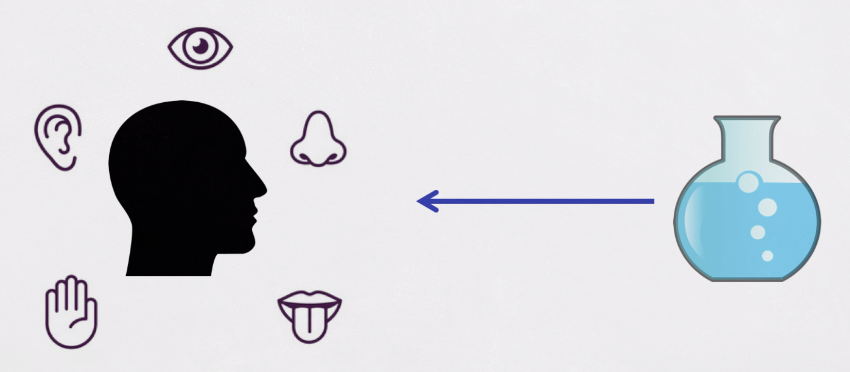

### Observations and Measurements

- observation plays a crucial and fundamental role in science. 
- scienctists are empiricists.
- In Greek, empeiria = sensory experience(ultimate basis of knowledge)

> "Because you have seen me, you have believed, blessed are those who have not seen and yet have believed." John 20:29

### Direct observation: by unaided sense experience

### Aided direct observation: to amplify sense experience

Examples of aided observation:
- optical microscope
- optical telescope

there is still direct connection between your sense and the objects

### Indirect observation: sense experience of the effect of an event, but not the event itself.

- e.g. we cannot directly observe atomic particles. 

- the objects are not observable, but we can observe their effects.

- bubble chamber
    - 气泡室（Bubble Chamber）是1952年美国物理学家唐纳德·格拉泽（Donald A. Glaser）发明，用以探测高能带电粒子径迹的一种有效的仪器
    - 气泡室是由一密闭容器组成，容器中盛有工作液体，液体在特定的温度和压力下进行绝热膨胀，由于在一定的时间间隔内（例如50ms）处于过热状态，液体不会马上沸腾，这时如果有高速带电粒子通过液体，在带电粒子所经轨迹上不断与液体原子发生碰撞而产生低能电子，因而形成离子对，这些离子在复合时会引起局部发热，从而以这些离子为核心形成胚胎气泡，经过很短的时间后，胚胎气泡逐渐长大，就沿粒子所经路径留下痕迹 。如果这时对其进行拍照，就可以把一连串的气泡拍摄下来，从而得到记录有高能带电粒子轨迹的底片。

    

##### Summary:
- Different kinds of sensory experience
- DIffernt relations between observed object and senses
- Instruments play different roles

### The Theory-Dependence of Observation

- logical Empiricism(1920s-1950s)
    - 逻辑实证主义 逻辑实证主义是一个哲学流派，以经验为根据，以逻辑为工具，进行推理，用概率论来修正结论。 它认为，科学的方法是研究人类行为的唯一正确的方法，因此，它虽然以感性的经验为依据，但却否认了感性认识的积极作用，是不折不扣的理性主义。
    - Separation of Observational Sentences and Theoretical Knowledge:
        - In logical empiricism, there is a distinction made between two types of statements or sentences:
            - Observational Sentences: These are statements that describe direct observations of the world, often based on sensory experiences. Observational sentences are considered basic empirical data, such as "The apple is red" or "The thermometer reads 25 degrees Celsius." They are supposed to be objective and verifiable through empirical evidence.
            - Theoretical Knowledge: In contrast, theoretical knowledge includes statements or theories that go beyond direct observations. These are generalizations, hypotheses, and theories that are constructed to explain and interpret observational data. For example, in physics, the theory of gravity is a part of theoretical knowledge.
        - The separation of observational sentences and theoretical knowledge is based on the idea that empirical science should rely on a foundation of empirical observations as the starting point. Theories are then built upon these observations, and their validity is tested and justified by empirical evidence.

##### Indirect Observation Requires Theory
- e.g. bubble chamber
    - some requireed background assumptions:
        - properties of liquids in superheated phase
        - relation particle charge - ionization
        - relation bubble density - particle's energy loss
    - Without these assumptions, it would be unjustifiable to claim, "I observe particles."
    - relation between property of interest and observed property

