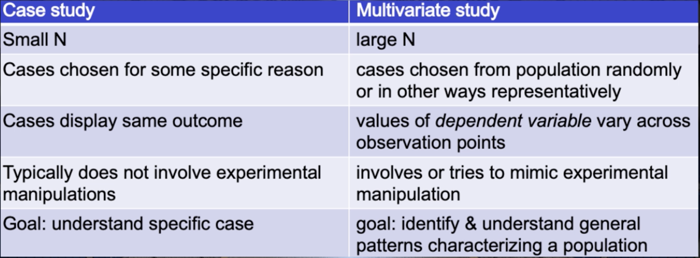

## Qualitive Methods

### Studying human behavior

- Design often requires studying human behavior

- What function should the device satisfy?
- Design Validation:
    - Does design fulfill client's, users; and customers' functional requirements, under specified operating conditions?

#### Social Science use different methods

Methodology Questions:
- How to assess these methods?
- How to justify choosing between them?

Social Science:
- Qualitative
- Interpretation
- Focus on specific

Natural Science:
- Quantitative
- Causal regularities
- nomological

Some claim that:
- Because social science are different ... Social science methodology must be different, too. 

We argues that:
- Although these methods are different from those used in the natural science, the reasons/quality critera for choosing between them are the seem. 

### Interpretation

Folk psychology
- Simulation theory
    -  We reuse our own cognitive mechanisms to simulate other people’s mental states
- Theory theory
    - We construct a theory of mind just like a scientific theory, using collecting evidence and revising hypotheses

#### Belief-Desire Explanation
- Individual i desired state X more than state Y
- Individual i believed that action A brought about X but not Y, and B Y but not X. 
- THerefore, individual i chose action A over action B. 

- **Belief-desire explanation**: An agent’s action A (instead of B) is explained by her desiring some result X (and not Y), and her believing that A will bring about X (andthat B will bring about Y).

##### What are mental states?

- Wilhelm Wundt(Intropective psychology):
    -  tried to systematize this notion of introspection by arguing that one could train one’s own conscious thoughts and feelings in such a way as to observe one’s mental states under controlled conditions. Wundt sat up a number of routines on how to perform this systematic and controlled experimental introspective psychology. 
- Methodological behaviourism:
    - psychology is really only in the business of observing public events. That is, motor behaviours of an individual. Only those can be objectively observed while thoughts and feelings, which may or may not exist, are not part of the science of behaviour, hence they should be put aside. So, what now becomes important is to develop regularities according to these methodological behaviourists, in order to discover and develop regularities between stimuli and responses. E.g. Pavlov and his dog
-  cognitive Science:
    - methodological behaviourism could not explain how humans can know so much even though they have relatively little input.
    - Chomsky in particular developed this argument based on the example of children learning languages. He argued that humans must have some kind of innate learning mechanism that processes inputs in a very effective way, and that these mechanisms must be domain specific and innate.
    - connect interptration and people's cognitive process. Not the same as Intropective psychology. 

#### Interpretation as Adopting the Intentional Stance

The intentional stance: Attributing mental states like beliefs and desires to an agent A (a human, an animal or even a machine),assuming A to be rational, and using this to predict the actions of A.
    - Decide to treat the object whose behavior is to be predicted as a rational agent.
    - Figure out what belief & desires that agent ought to have, given its place in the world and its purpose. 
    - Decide what the agent ought to do, given the attributed beliefs and desires. 

### Qualitative Methods

- Are qualitative and quantitative data types fundamentally different?
    - Data types share at least some information content
    - qualitative data often can be quantified

#### Quantification often narrows focus

- Go back to our three stones. If I were to ask you (which I have done in the classroom) what sort of properties you are observing, someone usually comes up with an altogether new property that they are observing in these stones. Something interesting, exotic, an unusual perspective on them. If I start out by asking you to quantify certain properties, then I am focusing you on these properties, and that narrows what we can extract from your responses.
-  let us say in a focus group, is that people can freely express their evaluative or attitudinal perspective. We again can gather that into a qualitative data set and then we might identify a number of separable properties, each of which we might then proceed to quantify. So here, you see another rationale for a mixed method that first focuses on the qualitative and then proceeds to the quantitative.

#### Construct validity

#### COnditions for good operationalization:
1. The concept to be observed is defined
2. The property of interst is connected with an observable property
3. The connection between property of interest and observable pproperty is valid according to our best knowledge
4. The connection between property of interest and observable property is sufficiently stable for practical purpose
5. The observable property is observable with sufficient precision in practice

#### Can the validity of qualitative data be evaluated?

### Ensure repeatability - Procedural rigor
- Document techniques of data collection
- Make forms of data analysis transparent

### Control observer effect
- CANNOT: control group, blinding(qustioning in interview/survey is the only intervention)
- minimize/eliminate effect observer on subject

### Control observer bias - Reflexivity
- Describe the influence of relation between researcher, topic & subjects
- Describe researchers' sociocultural position

### Robustness - Triangulation
- Use multiple methods of observation
- e.g. combine revealed and stated preference analysis

### Quality Criteria for interpretative methods

##### The problem

- Interpreting a single case: one input, one behavior, many mental states assignments
- Multiplicity of plausible models
- ad hoc and hence not science?

#### Avoiding interpretation
- Be a (Methodological) Behaviorist where you can!
    - Stimulus-reponse relations
    - Relations between social not individual properties
    - Relations between physiological properties(brain states, hormonal levels) and behavior

#### Improving Interpretation
- Minimize scope of interpretation
- Find more evidence for uncovering mental states and process
- Ensure observer competence
- Check for coherence
    - attention check(some one pick the choices in the survey randomly)
    - Repeat questions
    - Respondent validation
- use intersubjective checks

### Conclusion
- Interpretation is a fallible method
- Interpretation is widely practiced outside of science
- Interpretation studies can be more or less reliable
- Interpretation results can be more or less valid
- The more systematically we employ the strategies, the more confidence we have in the validity of the interpretation

## Case studies

Case study: A study characterized by using a small number of cases that are chosen for some specific reason and display the same outcome. The study typically does not involve experimental manipulations. The goal of the study is to understand a specific case.

### Why perform case studies?
- Falsification(when doing falsification, a single case is enough)
- Analytical narratives(some phenomenons are sufficiently complex)
- Qualitative comparative analyses
- Process tracing(How a cause operate an effect)(This kind of questions cannot be answered by population studies)

### Analytic narratives

- Analytical narrative: A kind of case study where a narrative is presented to clarify the important actors and main decision points.
- The method involves:
    - Make explicit research question
    - select cases
    - the use of narrative to elucidate the principal players, their preferences, rhe key decision points and possibilities
    - The evaluation of the model through the testable implications the model generates
    - consider alternative narratives

### Qualitative comparative analysis: 
Analysis of cases performed in order to learn about necessary causes and thus better understand the boundaries of the underlying population. The results can be applied in a multivariate analysis.

### Process Tracing

Process tracing: A kind of case study that emphasises cause-effect relations in a single case vs. Cause-effect relations as mean effect size in the population

- Formulate hypotheses about alternative mechanisms.
- Work out differences in empirical implications.
- Check case data for these mechanistic fingerprints.
- Conclude which mechanisms it is. 

### How to select cases?
- Information-oriented vs. representative sampling

### How to generalise from case studies?

Ways to imprive upon this transferability?
- Does the model yield other predictions that can be tested on this case?
- Out-of-sample tests: perform another case study and check whether model from first study applies.

#### How to improve case studies?
- Specify research question
- Specify theory background and hypothesis
- Clarify: What constitutes a case unit?
- Make case slection explicit.
- If multiple cases: what makes cases comparable?
- Investigate all implications of your theo