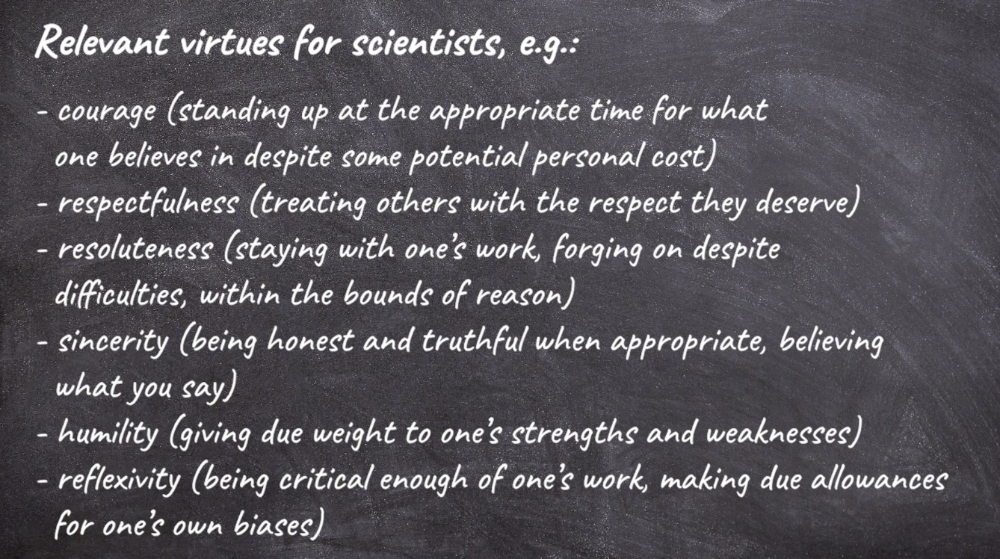

## Research Ethics

#### Moral Questions in Science
- May I perform experiments that might harm human subjects?
-  Must I reject data if I suspect it to be falsified?What do I do if I suspect that my colleague is either falsifying data himself or is using such falsified data?
- Who should be counted as an author of a scientific manuscript?
- What kind of research topics should I choose?

##### Moral Answers

- Permission
    - e.g. "You may perform this experiment"
- Obligation
    - e.g. "You should count your collaborator as a co-author."
- Prohibition
    - e.g. "You must not falsify data."

These forms do not fully characterize moral judgements. 

#### What is Morality?

- Descriptive View
    - A code of conduct that is put forward by a society, group, or individual, that is accepted as a guide to behaviour by its members, ot by that individual. 

- Normative view:
    - The code of conduct that all rational persons, under certain specified condtions, would endorse. 
- Distinguish Morality from:
    - Convention(e.g. You should drive at the right side of the road. )
    - Etiquett(礼节，规矩)
    - Law
    - (self-interested)instrumental rationality

- Examples of scientific codes of conduct:
    - Swedish Association of Graduate Engineers -  honor code for engineers
    - APS (American Physical Society) Guidelines for Professional Conduct

- Descriptive ethics: Descriptive ethics studies what people consider to be right and wrong.

- Normative ethics: Normative ethics studies what people should do (irrespective of what people actually think).

- Universal rational endorsement condition: The moral code that all rational persons, under certain specified conditions, would endorse.

### Ethics vs. Morality

- Ethics:
    - A theory that offers normatively valid reasons for rationally endorsing a code of behaviour. 
- Research Ethics:
    - why should I endorse a certain code of behavior?
    - Why is it rational for all scientists to endorse certian codes of behavior?
    - Add to reasons for method choice.(pro and con for each method)
- Even if we agree on a code of conduct, we might not agree on why we agree on it. 

- Moral vs. ethical / morals vs. ethics: One distinction between morals and ethics is that morals are properties of actions, intentions or decisions (being good or bad), where ethics is providing justification for why actions, intentions or decisions have this moral property. However, in many usages this distinction is not maintained, for instance the same behaviour might be described as immoralor as unethical, without any clear difference being intended.

### Different Ethical Intuitions:
- To behave morally might mean:
    - Bring about the best consequences
    - Following relevant rules and duties
    - Exemplifying relevant character traits or virtues

### Three Ethic Frameworks

##### Part 1: consequentialism(效果论) and deontology(道义论)

- Consequentialism:
    - Choices are to be morally assesed only by their consequences. 
- Deontology:
    - To choose morally is to fulfill relevant rules and duties. 
- Virtue ethics:
    - Morality consists in having exemplifying good character traits. 

### Consequentialism

- How to evaluate consequences?
    - e.g. utilitarians: pleasure, happiness, desire satisfaction, or "welfare"

> Morality consists in "the rules and precepts for human conduct, by the observance of which [a haapy existence] might be, to the greatest extent possible, secured." (J.S.Mill 1861)

- Relevant for scientists:
    - Consequences for the epistemic goal of science(good prediction, explanations, ..)
    - Consequences for the institution of science(impartiality, trust, ...)
    - Consequences for the use of scientific results(technological progress, new risk, policies, ... )

##### Problem 1
"extreme demandingness": there is no realm of moral permissions, no realm of going beyond one's moral duty(supererogation), no realm o f moral indifference. All acts are seemingly either required or forbidden. 那么道德是无处不在的，涵盖了生活中的每一个可能的选择。对于每个行动的选择，你不仅需要考虑对自己的后果，还需要考虑对每个人的后果。

##### Problem 2
Permitting intuitively wrong acts - e.g. killing one for the benefit of many. 

### Deontology
To choose morally is to fulfill relevant rules and duties. 

- "deontology" - from Greek, deon. (duty)
- Some choices cannot be justified by their effects - no matter how good their consequences are, some choices are fobidden and others mandated(强制性的). 

- People have certain rights, which must be repected. 
- Certain intentions are not permissable. (e.g, intending to harm or deceive)

- The categorical imperative: An action is right if it is in accord with a generally defensible principle.绝对命令

##### Relevant for scienctists, e.g.:

- Treating humans as autonomous ends, not as instruments for some other purpose. 
- Probition to intend or cause harm, inrespective of other benefits. 
- Speaking truthfully and defending the truth
- Interllectual property rights. 

##### Advantages over consequentialism:

- Use of chechlist - no need to consider all possible consequences
- For the deontologist, there are acts that are neither morally wrong demanded, or praiseworthy. ( Not everything is a moral question. There seem to be areas where we just do not worry about morality.)

- Leaves space for agents to give special concerns to their projects. 

##### Problems

- Problem 1: compliance with deontological norms might bring about disastrous consequences. 
- Problem 2: all rights and duties are categorical. No systematic way of distinguishing degrees of wrongness. 

### Virtue Ethics
- Virtue ethics: Morality consists in having and exemplifying good character traits (i.e. virtues)

#### Advantages:
- Over consequentialism: avoids "overdemandingness"(no need to consider moralty in every action)
- Over deontology: explains what motivates people to behave morally.

#### Problems:
- Doesn't give clear guidence how to behave in particular situation. 
- Difficult to resolve moral conflicts. 

### Summary:
- Consequentialism:
    - CHoices are to be morally assessed solely by their consequences.
- Deontology:
    - To choose morally is to fulfill relevant rules and duties.
- Virtue ethics:
    - Morality consits in having and developing good character traits.

## Morality and experimental design

-  Morally Permissible Experiments

#### Informed Consent
Informed consent: a prospective participant is (i) informed, (ii) participating voluntary, and (iii) decision-capacitated.

- Informed: a research subject is informed if she has recieved all relevant information about the purpose of the research project, how it will be carried out, and in what way it will affect her. 

- Voluntary: her consent is voluntary if she is not forced to participate, and if her choice is sufficiently free from negative influences such as social and economic pressure. 

- Desisionally-capacitated consent: the subject has decisional capacity to assess the information provided, appreciate in what way it concerns her, as well as make and communicate a decision in facor of participating. 

### Why informed consent?

- Consequentialism:
    - Individuals know best what is good for them
    - establish and maintain trust in science
- Deontology:
    - don't lie
    - treat others as autonomous beings
- Virtue ethics:
    - sincerity
    - reflexivity
    - respectfulness

### Morality and scientific misconduct

##### Scientific Incompetence vs. Misconduct

- Why is scientific misconduct not admissible?

##### Scientific Misconduct - Main Instances

- Fabrication: making up data or results
- Falsification: manipulating research materials, equipment, or processes, ot changing or omitting data or results such that the research is not accurately represented in the research record.
- Plagiarism: the appropriation of another person's ideas, processes, results, ot words. without giving appropriate credit.  