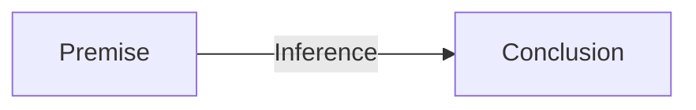

## Scientific Interference

- Particular experiment or observation is just a part of science. 
- Science is not generally interested in particular, but scientists wants to generalize. They want to say something that beyond the particular example they observe. 
- Predict something they don't know yet. 

#### Inference:

> They act or process of reaching a conclusion about something from known facts or evidence. (Merriam-Webster)

##### Direct Inference

- "Direct inference" refers to the process of drawing conclusions or making inferences directly from available data or evidence without the need for additional modeling or intermediate steps.
    - Data-driven: Direct inference relies on the data itself. It involves making conclusions based on the information contained in the data without making predictions or extrapolations.
    - Simplicity: It typically does not involve complex modeling or statistical methods. Instead, it focuses on straightforward analysis and interpretation of the data.
    - Conclusions: Direct inference may result in conclusions or estimates about a specific variable, parameter, or relationship within the data. For example, calculating the mean or median of a dataset, conducting hypothesis tests, or estimating the proportions of a population are forms of direct inference.

##### Projecting

- "Projecting" refers to the process of making predictions or estimating future values or outcomes based on existing data, historical patterns, or trends. It involves using available information to create a model or method that can forecast future values or events.
    - Future Estimation: The primary goal of projecting is to estimate what will happen in the future based on the information available in the present or the past. 
    - Modeling: Projecting often requires the use of mathematical models or statistical techniques to capture patterns and relationships in historical data. These models can be used to make predictions or extrapolations into the future.
    - Trends and Patterns: Projecting relies on the assumption that historical trends or patterns will continue into the future, allowing for the creation of predictive models. These trends may be linear, exponential, cyclic, or follow other patterns.
    - Data-Driven: While projecting involves forecasting future values, it is still heavily data-driven. 

##### Generalization

finite number of examples have such a property ---> all of them have such a property

##### Modus Ponens

Modus ponens is a valid deductive argument form in classical logic. It is often expressed as follows:

- If P, then Q. (P → Q)
- P is true.
- Therefore, Q is true.

In this argument form, P and Q are propositions or statements. Modus ponens is used to infer the truth of proposition Q based on the truth of proposition P and the conditional statement "If P, then Q." If P is true, and the conditional statement holds, then it follows logically that Q must also be true.

##### Modus Tollens

Modus tollens is another valid deductive argument form in classical logic. It is a way to establish the truth of a proposition by showing that its negation leads to a contradiction. Modus tollens is often expressed as follows:

- If P, then Q. (P → Q)
- Not Q. (¬Q)
- Therefore, Not P. (¬P)

In this argument form, P and Q are propositions or statements, and ¬P and ¬Q represent their negations. Modus tollens is used to conclude that if the consequent Q is not true (¬Q), then the antecedent P must also not be true (¬P), based on the conditional statement "If P, then Q."

##### Inductive Inference Rules 归纳推理

- Methods:
    - Direct Inference
    - Projection
    - Generalization
- Amplify knowledge: extend conclusions beyond knowledge we already have
- Conlusions from good inductive inferences and true premises are fallible - they might be false

##### Deductive Inference Rules 演绎推理

- Methods:
    - Modus Ponens
    - Modus Tollens
- Explicate knowledge: order or rearrange our knowledge without adding to its content
- Conclusion from good ("valid") deductive inferences and true premises are necessarily true