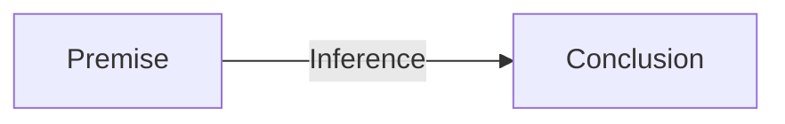
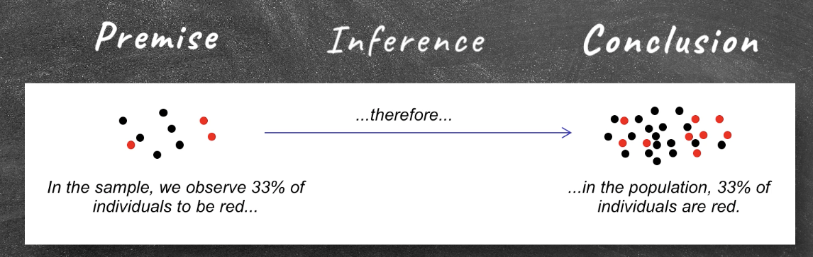
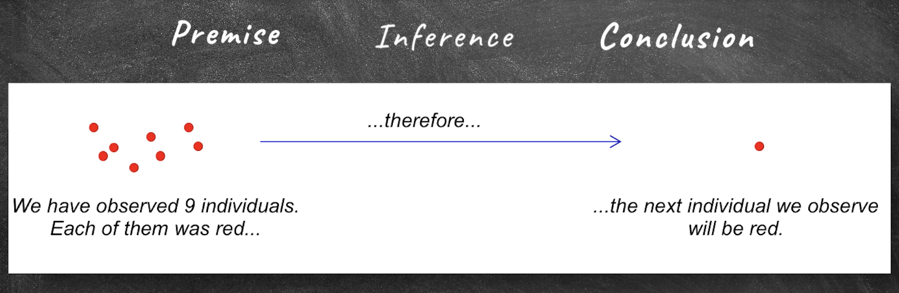
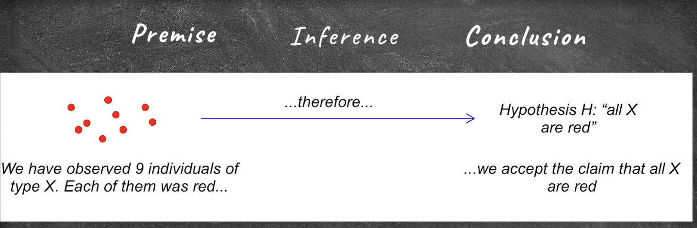
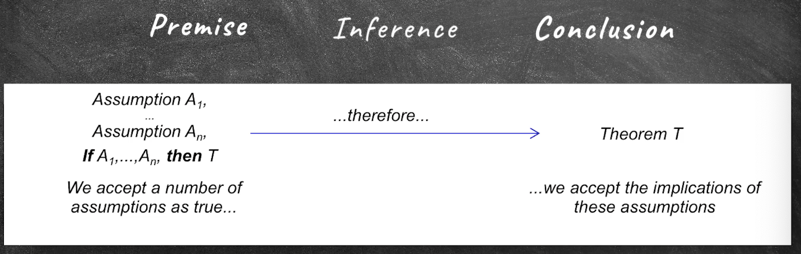
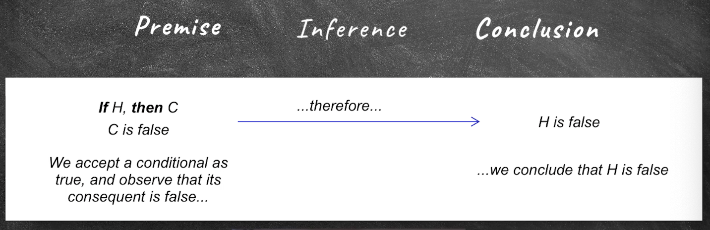

## Scientific Interference

- Particular experiment or observation is just a part of science. 
- Science is not generally interested in particular, but scientists wants to generalize. They want to say something that beyond the particular example they observe. 
- Predict something they don't know yet. 

#### Inference:

> They act or process of reaching a conclusion about something from known facts or evidence. (Merriam-Webster)



##### Direct Inference



- "Direct inference" refers to the process of drawing conclusions or making inferences directly from available data or evidence without the need for additional modeling or intermediate steps.
    - Data-driven: Direct inference relies on the data itself. It involves making conclusions based on the information contained in the data without making predictions or extrapolations.
    - Simplicity: It typically does not involve complex modeling or statistical methods. Instead, it focuses on straightforward analysis and interpretation of the data.
    - Conclusions: Direct inference may result in conclusions or estimates about a specific variable, parameter, or relationship within the data. For example, calculating the mean or median of a dataset, conducting hypothesis tests, or estimating the proportions of a population are forms of direct inference.

##### Projecting



- "Projecting" refers to the process of making predictions or estimating future values or outcomes based on existing data, historical patterns, or trends. It involves using available information to create a model or method that can forecast future values or events.
    - Future Estimation: The primary goal of projecting is to estimate what will happen in the future based on the information available in the present or the past. 
    - Modeling: Projecting often requires the use of mathematical models or statistical techniques to capture patterns and relationships in historical data. These models can be used to make predictions or extrapolations into the future.
    - Trends and Patterns: Projecting relies on the assumption that historical trends or patterns will continue into the future, allowing for the creation of predictive models. These trends may be linear, exponential, cyclic, or follow other patterns.
    - Data-Driven: While projecting involves forecasting future values, it is still heavily data-driven. 

##### Generalization



finite number of examples have such a property ---> all of them have such a property

##### Modus Ponens



Modus ponens is a valid deductive argument form in classical logic. It is often expressed as follows:

- If P, then Q. (P → Q)
- P is true.
- Therefore, Q is true.


In this argument form, P and Q are propositions or statements. Modus ponens is used to infer the truth of proposition Q based on the truth of proposition P and the conditional statement "If P, then Q." If P is true, and the conditional statement holds, then it follows logically that Q must also be true.

##### Modus Tollens



Modus tollens is another valid deductive argument form in classical logic. It is a way to establish the truth of a proposition by showing that its negation leads to a contradiction. Modus tollens is often expressed as follows:

- If P, then Q. (P → Q)
- Not Q. (¬Q)
- Therefore, Not P. (¬P)


In this argument form, P and Q are propositions or statements, and ¬P and ¬Q represent their negations. Modus tollens is used to conclude that if the consequent Q is not true (¬Q), then the antecedent P must also not be true (¬P), based on the conditional statement "If P, then Q."


##### Inductive Inference Rules 归纳推理

- Methods:
    - Direct Inference
    - Projection
    - Generalization
- Amplify knowledge: extend conclusions beyond knowledge we already have
- Conlusions from good inductive inferences and true premises are fallible - they might be false

##### Deductive Inference Rules 演绎推理

- Methods:
    - Modus Ponens
    - Modus Tollens
- Explicate knowledge: order or rearrange our knowledge without adding to its content
- Conclusion from good ("valid") deductive inferences and true premises are necessarily true

### Paricular Inference Rules

e.g. generalization type:


Example of particular inference rules:
- Whenever you have observed at least 9 objects of kind X to have property R, then conclude that all objects of that kind have property R.
- Whenever the probability of observing R, given that H is true, is smaller than a significance level of 0.05, then reject H. (use more frequently in scientific research)

### Example:

> Whenever the probability of observing R, given that H is true, is smaller than a significance level of 0.05, then reject H.

- Suppose you are a researcher studying the effectiveness of a new drug (let's call it Drug X) in treating a specific medical condition. You have a null hypothesis (H₀) and an alternative hypothesis (H₁ or Ha) as follows:
    - Null Hypothesis (H₀): Drug X has no effect or is no more effective than a placebo in treating the medical condition.
    - Alternative Hypothesis (H₁): Drug X is effective in treating the medical condition, and it is significantly better than a placebo.

- You set your significance level (α) at 0.05, which is a common choice in many scientific studies.

- Now, you conduct a clinical trial to test the effectiveness of Drug X. You gather data from the trial, and your analysis leads to a probability, represented as P(R|H), which is the probability of observing the results (R) under the assumption that the null hypothesis (H) is true. In this context, "R" might represent the observed improvement in patients' conditions or some other relevant measure.

- Here's how the inference rule works in this scenario:

1. Calculate P(R|H): This probability quantifies how likely you would observe the results you obtained (R) if the null hypothesis (H₀) were true. In other words, it represents the probability of getting your data assuming that the drug has no effect (H₀ is true).

2. Compare P(R|H) to the Significance Level (α): If the calculated probability (P(R|H)) is smaller than your pre-defined significance level (0.05), it means that the observed results are unlikely to occur by random chance alone under the assumption that the null hypothesis is true. In statistical terms, this is often represented as p < α.

3. Decision: Since the probability of observing the results (R) under the null hypothesis is smaller than your significance level (p < α), you have evidence to reject the null hypothesis (H₀). This suggests that there is enough statistical evidence to conclude that Drug X is effective in treating the medical condition, and it is significantly better than a placebo (supporting the alternative hypothesis, H₁).

In summary, the inference rule states that if the probability of observing the results (R) under the assumption that the null hypothesis (H) is true is smaller than your chosen significance level (0.05), then you should reject the null hypothesis. This approach helps researchers make decisions based on the strength of evidence in their data and determine whether there is enough statistical support to accept an alternative hypothesis in favor of the null hypothesis.

#### Distinguish:
- Justification with an inference rule:
    - Justifying the **conclusion** by pointing to the premise and the empolyed inference rule
- Justification of an inference rule:
    - What makes B a good inductive inference? Why not choose a lower significance level? or a higher one? 

### Hume's Problem of Induction

An argument against the justifiability of induction
1. every inference is either an induction or a deduction
2. to justify an inductive inference rule **I**, the rule itself has to be inferred from some premises.
3. **I** cannot be inferred deductively, because there are no necessary connection between past and future inferences. 
4. Thus, **I** must be inferred inductively. 
5. When inferring I inductively, we must appeal to another (inductive) inference rule **J** to justify this induction. But that raises the issue of how to justify **J**, which would require appealing to another inference rule K ... [infinite regress]

- Consequently, no inductive inference rule can be justified. 

##### Explaination:

- Hume's problem of induction is a significant philosophical challenge that was introduced by the Scottish philosopher David Hume in the 18th century. It raises questions about the rational justification for making inductive inferences and the reliability of induction as a method for acquiring knowledge.

- Induction is the process of generalizing from specific observations or experiences to make more general conclusions or predictions about the future. For example, if you have observed the sun rising every day of your life, you might inductively infer that the sun will rise again tomorrow. However, Hume's problem of induction challenges the philosophical foundation of such inferences.

- Hume's central argument can be summarized as follows:

    1. All inductive reasoning relies on the assumption that the future will resemble the past. In other words, it assumes that the laws of nature will continue to hold in the future as they have in the past.
    2. However, we have no logical or deductive reason to believe that the future will resemble the past. No matter how many times you've observed the sun rising, you cannot logically prove that it will rise again tomorrow.
    3. Therefore, the inference from past observations to future predictions (induction) is not based on reason or strict logical necessity. It is based on a habit of the mind, custom, or instinct rather than a rationally justified principle.

- Hume's solution to this problem was skeptical in nature. He argued that induction is not based on reason but on custom and habit. We rely on induction because it has worked for us in the past, but we cannot provide a rational justification for its reliability in the future.


#### Is Hume right?

- Are we irrational when we e.g. generalize in sceince, because our inductive inferences are not justified?

- Scientists employ inductive inferences rules to justify their conclusions. 
- These inducitve inferences rules themselves are not justified, because any search for a foundation leads to an infinite regress. 
- scientistis employ unjustifed methods & Scinece is irrational. 

### What Offeres Justification?

- Foundationalism
    - Identifying the **basic claims** from which the claims to be justified can be inferred. 
- Coherentism
    - The claims to be justified form a coherent system with the set of other claims already accepted.

- Coherentist Anser to Hume's Problem

- Less severe inductive rules might not be the foundation of inductive practices, but could be the abstract descriptions of such practices. They may also solve as tools to connect the practices with each other. 

```mermaid
stateDiagram
    s1--->s2
```