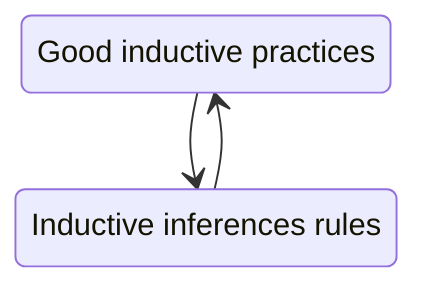
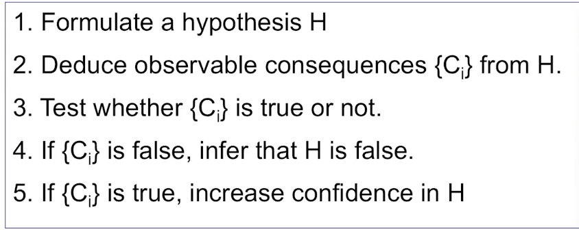
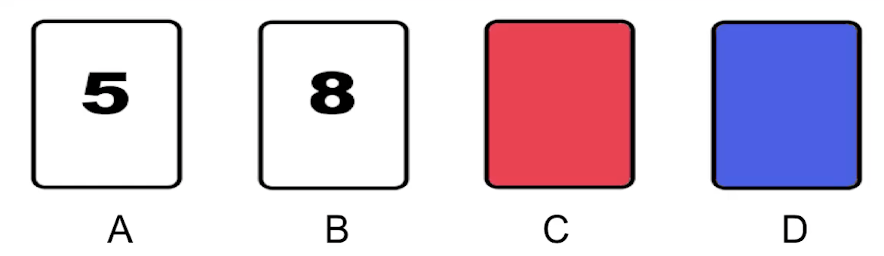
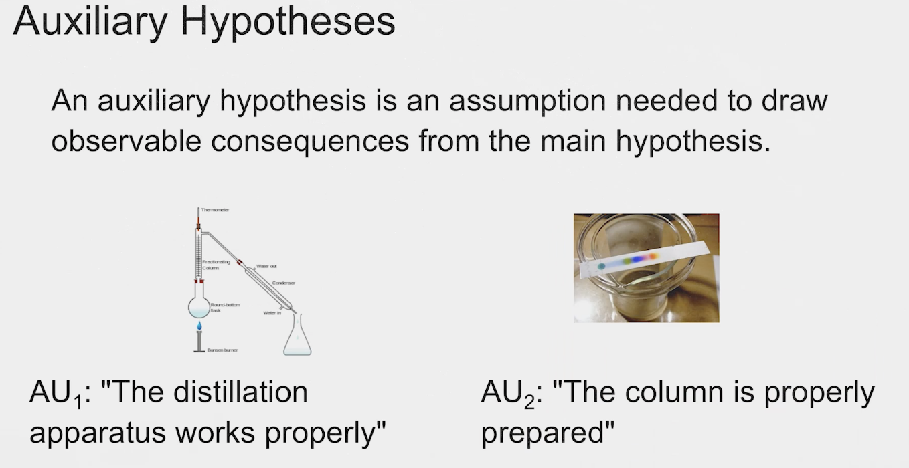
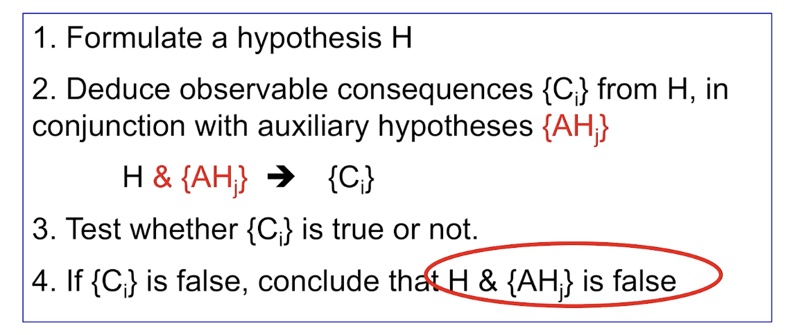
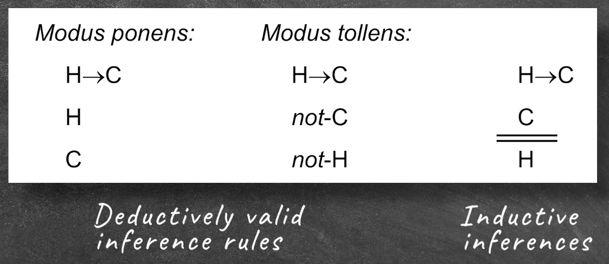
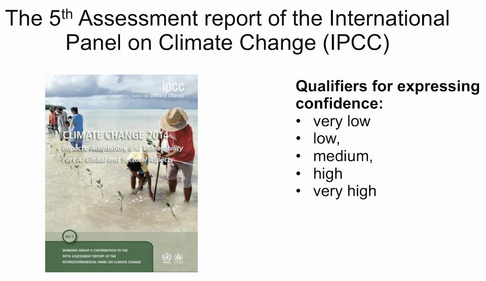
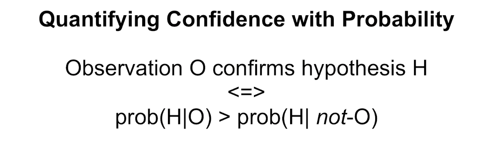
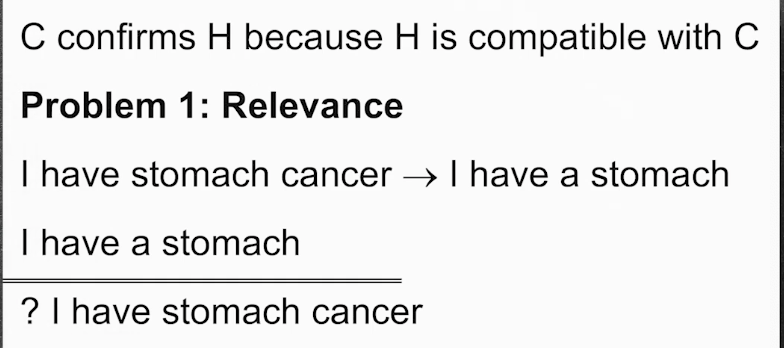
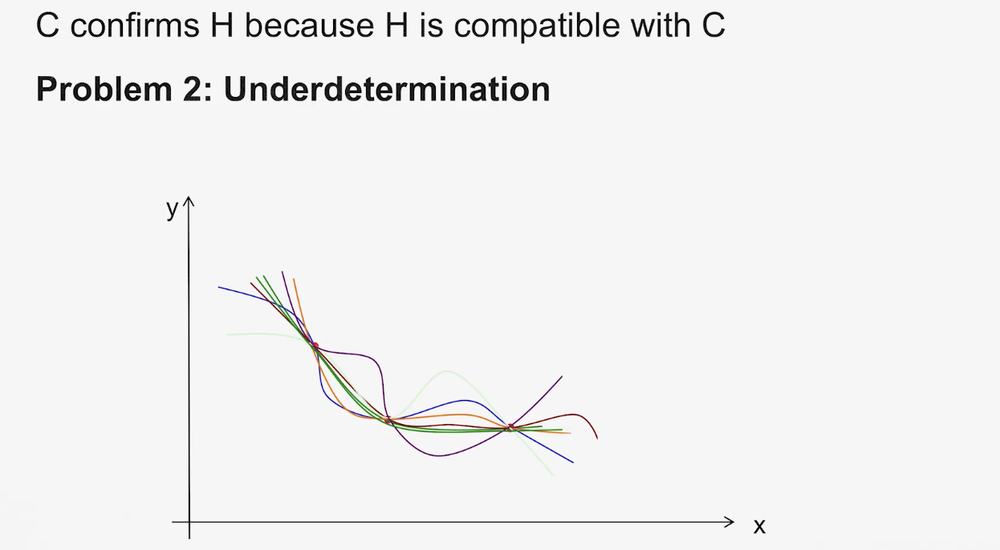

## Scientific Interference

- Particular experiment or observation is just a part of science. 
- Science is not generally interested in particular, but scientists wants to generalize. They want to say something that beyond the particular example they observe. 
- Predict something they don't know yet. 

#### Inference:

> They act or process of reaching a conclusion about something from known facts or evidence. (Merriam-Webster)

##### Direct Inference

- "Direct inference" refers to the process of drawing conclusions or making inferences directly from available data or evidence without the need for additional modeling or intermediate steps.
    - Data-driven: Direct inference relies on the data itself. It involves making conclusions based on the information contained in the data without making predictions or extrapolations.
    - Simplicity: It typically does not involve complex modeling or statistical methods. Instead, it focuses on straightforward analysis and interpretation of the data.
    - Conclusions: Direct inference may result in conclusions or estimates about a specific variable, parameter, or relationship within the data. For example, calculating the mean or median of a dataset, conducting hypothesis tests, or estimating the proportions of a population are forms of direct inference.

##### Projecting

- "Projecting" refers to the process of making predictions or estimating future values or outcomes based on existing data, historical patterns, or trends. It involves using available information to create a model or method that can forecast future values or events.
    - Future Estimation: The primary goal of projecting is to estimate what will happen in the future based on the information available in the present or the past. 
    - Modeling: Projecting often requires the use of mathematical models or statistical techniques to capture patterns and relationships in historical data. These models can be used to make predictions or extrapolations into the future.
    - Trends and Patterns: Projecting relies on the assumption that historical trends or patterns will continue into the future, allowing for the creation of predictive models. These trends may be linear, exponential, cyclic, or follow other patterns.
    - Data-Driven: While projecting involves forecasting future values, it is still heavily data-driven. 

##### Generalization

finite number of examples have such a property ---> all of them have such a property

##### Modus Ponens

Modus ponens is a valid deductive argument form in classical logic. It is often expressed as follows:

- If P, then Q. (P → Q)
- P is true.
- Therefore, Q is true.

In this argument form, P and Q are propositions or statements. Modus ponens is used to infer the truth of proposition Q based on the truth of proposition P and the conditional statement "If P, then Q." If P is true, and the conditional statement holds, then it follows logically that Q must also be true.

##### Modus Tollens

Modus tollens is another valid deductive argument form in classical logic. It is a way to establish the truth of a proposition by showing that its negation leads to a contradiction. Modus tollens is often expressed as follows:

- If P, then Q. (P → Q)
- Not Q. (¬Q)
- Therefore, Not P. (¬P)

In this argument form, P and Q are propositions or statements, and ¬P and ¬Q represent their negations. Modus tollens is used to conclude that if the consequent Q is not true (¬Q), then the antecedent P must also not be true (¬P), based on the conditional statement "If P, then Q."

##### Inductive Inference Rules 归纳推理

- Methods:
    - Direct Inference
    - Projection
    - Generalization
- Amplify knowledge: extend conclusions beyond knowledge we already have
- Conlusions from good inductive inferences and true premises are fallible - they might be false

##### Deductive Inference Rules 演绎推理

- Methods:
    - Modus Ponens
    - Modus Tollens
- Explicate knowledge: order or rearrange our knowledge without adding to its content
- Conclusion from good ("valid") deductive inferences and true premises are necessarily true

### Paricular Inference Rules

e.g. generalization type:

Example of particular inference rules:
- Whenever you have observed at least 9 objects of kind X to have property R, then conclude that all objects of that kind have property R.
- Whenever the probability of observing R, given that H is true, is smaller than a significance level of 0.05, then reject H. (use more frequently in scientific research)

### Example:

> Whenever the probability of observing R, given that H is true, is smaller than a significance level of 0.05, then reject H.

- Suppose you are a researcher studying the effectiveness of a new drug (let's call it Drug X) in treating a specific medical condition. You have a null hypothesis (H₀) and an alternative hypothesis (H₁ or Ha) as follows:
    - Null Hypothesis (H₀): Drug X has no effect or is no more effective than a placebo in treating the medical condition.
    - Alternative Hypothesis (H₁): Drug X is effective in treating the medical condition, and it is significantly better than a placebo.

- You set your significance level (α) at 0.05, which is a common choice in many scientific studies.

- Now, you conduct a clinical trial to test the effectiveness of Drug X. You gather data from the trial, and your analysis leads to a probability, represented as P(R|H), which is the probability of observing the results (R) under the assumption that the null hypothesis (H) is true. In this context, "R" might represent the observed improvement in patients' conditions or some other relevant measure.

- Here's how the inference rule works in this scenario:

1. Calculate P(R|H): This probability quantifies how likely you would observe the results you obtained (R) if the null hypothesis (H₀) were true. In other words, it represents the probability of getting your data assuming that the drug has no effect (H₀ is true).

2. Compare P(R|H) to the Significance Level (α): If the calculated probability (P(R|H)) is smaller than your pre-defined significance level (0.05), it means that the observed results are unlikely to occur by random chance alone under the assumption that the null hypothesis is true. In statistical terms, this is often represented as p < α.

3. Decision: Since the probability of observing the results (R) under the null hypothesis is smaller than your significance level (p < α), you have evidence to reject the null hypothesis (H₀). This suggests that there is enough statistical evidence to conclude that Drug X is effective in treating the medical condition, and it is significantly better than a placebo (supporting the alternative hypothesis, H₁).

In summary, the inference rule states that if the probability of observing the results (R) under the assumption that the null hypothesis (H) is true is smaller than your chosen significance level (0.05), then you should reject the null hypothesis. This approach helps researchers make decisions based on the strength of evidence in their data and determine whether there is enough statistical support to accept an alternative hypothesis in favor of the null hypothesis.

#### Distinguish:
- Justification with an inference rule:
    - Justifying the **conclusion** by pointing to the premise and the empolyed inference rule
- Justification of an inference rule:
    - What makes B a good inductive inference? Why not choose a lower significance level? or a higher one? 

### Hume's Problem of Induction

An argument against the justifiability of induction
1. every inference is either an induction or a deduction
2. to justify an inductive inference rule **I**, the rule itself has to be inferred from some premises.
3. **I** cannot be inferred deductively, because there are no necessary connection between past and future inferences. 
4. Thus, **I** must be inferred inductively. 
5. When inferring I inductively, we must appeal to another (inductive) inference rule **J** to justify this induction. But that raises the issue of how to justify **J**, which would require appealing to another inference rule K ... [infinite regress]

- Consequently, no inductive inference rule can be justified. 

##### Explaination:

- Hume's problem of induction is a significant philosophical challenge that was introduced by the Scottish philosopher David Hume in the 18th century. It raises questions about the rational justification for making inductive inferences and the reliability of induction as a method for acquiring knowledge.

- Induction is the process of generalizing from specific observations or experiences to make more general conclusions or predictions about the future. For example, if you have observed the sun rising every day of your life, you might inductively infer that the sun will rise again tomorrow. However, Hume's problem of induction challenges the philosophical foundation of such inferences.

- Hume's central argument can be summarized as follows:

    1. All inductive reasoning relies on the assumption that the future will resemble the past. In other words, it assumes that the laws of nature will continue to hold in the future as they have in the past.
    2. However, we have no logical or deductive reason to believe that the future will resemble the past. No matter how many times you've observed the sun rising, you cannot logically prove that it will rise again tomorrow.
    3. Therefore, the inference from past observations to future predictions (induction) is not based on reason or strict logical necessity. It is based on a habit of the mind, custom, or instinct rather than a rationally justified principle.

- Hume's solution to this problem was skeptical in nature. He argued that induction is not based on reason but on custom and habit. We rely on induction because it has worked for us in the past, but we cannot provide a rational justification for its reliability in the future.

#### Is Hume right?

- Are we irrational when we e.g. generalize in sceince, because our inductive inferences are not justified?

- Scientists employ inductive inferences rules to justify their conclusions. 
- These inducitve inferences rules themselves are not justified, because any search for a foundation leads to an infinite regress. 
- scientistis employ unjustifed methods & Scinece is irrational. 

### What Offeres Justification?

- Foundationalism
    - Identifying the **basic claims** from which the claims to be justified can be inferred. 
- Coherentism
    - The claims to be justified form a coherent system with the set of other claims already accepted.

- Coherentist Anser to Hume's Problem

- Less severe inductive rules might not be the foundation of inductive practices, but could be the abstract descriptions of such practices. They may also solve as tools to connect the practices with each other. 

### A Model of Scientific Inference Practice
- The Hypothetico-Deductive(HD) Method (假设演绎法)
    - Scientists begin by proposing(unproven) hypotheses
    - They derive observable implication from these hypotheses
    - Thet test these implications and consequently revise their condidence in thses hypotheses.

##### HD Step 1: hypothesis formulation

- Formulate a hypothesis H

- Criteria for a goood hypotheses:
    - A statement that can be either true or false
    - A statement that is not necessarily true or false
    - A statement that either has some generality(e.g, "All X in domain D...") or that is about some unobservable(exclude statements like "this table is red")

##### HD Step 2: Deduction

- Deduce observable consequences $[C_i]$ from H

- Requirements:
    - $[C_i]$ must be observable directly or with the help of accurate measurements(e.g microscope, X-ray, etc.)
    - Deduction must be valid
    - $[C_i]$ must be relevant for H

##### Quiz Question:

- Hypothesis H:"If a card shows an even number on one face, then its opposite face is red".
- Test whether H is *false*. Which consequences of H do you need to consider? - i.e. which cards do you need to turn over?

- H: "If a card shows an even number on one face, then its opposite face is red".
- If E, then R.
- When is this statement false?
    - When E is true and when R is false. 
        - H is falsified by observing a blue even-number card.
    - need to turn over even-number cards and blue cards!

##### HD Step 3: Test

- Determine whether $[C_i]$ is true or not.

### Hypothesis falsification

- asymmetry between confirmation and falsification
    - If $[C_i]$ is false, infer that H is **false**. 
    - If $[C_i]$ is true, **increase confidence** in H. (we cannot infer that it is definitely true.)

> No amount of experimentation can ever prove me right; a single experiment can prove me wrong. (Einstein)

- Karl Popper's falsification
    - Conjecture falsifiable hypotheses
    - Seek to falsify these hypotheses with observable evidence
    - Reject any falsified hypothesis as false
    - Never accept any hypothesis as true - only maintain on-falsified hypotheses as so far not rejected.

- Falsifiability: （可证伪性）
    - Quality of a hypothesis: A good hypothesis has more observable consequences that sets it apart from rival hypothesis. (can determine it is true or false from observation)
    - an indicator of "scientific"
- Falsification:
    - An event - the observation that an implication of a hypothesis is not true, which by modus tollens then implies the falsity of the hypothesis. 

- Falsifibable hypotheses need not be falsified but hypotheses can only be falsified if they are falsifiable. 

### Problems of Popper's falsification

##### Problem 1: Hypotheses without confidence?
- Many non-falsfified hypotheses at the same time (may include contradction, or observations that scientists made less)
- can one reasonably treat them all as mere conjectures, without distinguishing some as morelikely to be true, and others less so ?
- At odds with scientific practice: sciencts consider some non-falsified hypotheses as more confirmed than others. 

##### Problem 2: Modus Tollens for Rejecting Hypotheses?
- (observation may not be immediate, but may include experiment or measurement)
- e.g.
    - Hypotheses: this liquid contains 2 chemical substances
    - Observable consequences:
        - Distillation
        - Chromatography

Duhem-Quine Thesis:
- We never test a single hypothesis alone, byt only in conjunction with various auxilliary hypothesis.
- For falsifying the hypothesis: be confident that it's not the auxiliary hypotheses responsible for the falsity of the consequence
- **No asymmetry** between falsification and confirmation

##### Problem 3: Ad hoc Modification

- Example: Phlogiston Theory（燃素说）
    - The phlogiston theory is a superseded scientific theory that postulated the existence of a fire-like element called phlogiston contained within combustible bodies and released during combustion. 
    - 托勒密的本轮模型，采用了复杂的几何形状来描述行星的运动，包括了"差动" 和 "子午线轮"等概念，以解释观察到的行星逆行运动。The parameters for the sizes, positions, and speeds of epicycles and deferents were often adjusted to fit observational data without a clear physical explanation for why they had those specific values.
- An ad-hoc hypothesis is a hypothesis added to a theory in order to save it from being falsified.
- A modification is ad hoc if it reduces the falsifiability of the hypotheses in question

### Hypothesis Confirmation

- modus ponens and modus tollens are deductively valid inference rules
- but they do not tell us what to so if C is true

- The degree of confirmation, also known as the degree of support, is a concept used in the philosophy of science and the philosophy of probability to quantify how much evidence or data supports a particular hypothesis or theory. It is a measure of the strength of the evidence in favor of a hypothesis, indicating the extent to which the evidence makes the hypothesis more likely or probable.

##### Problems
- can we meaningfully assign probabilities to hypotheses
    - Frequentist statistics does not directly assign probabilities to hypotheses or make statements about the probability that a hypothesis is true or false. Instead, it quantifies the probability of observing data under the conditions specified by a hypothesis. The focus is on evaluating the evidence in terms of the data, rather than assessing the intrinsic probability of a hypothesis.
    - Bayesian probability, on the other hand, allows for the direct assignment of probabilities to hypotheses, as it incorporates subjective beliefs and prior knowledge into the assessment of hypotheses. Bayesian methods enable the updating of beliefs about hypotheses based on observed data, providing a different approach to hypothesis testing and decision-making.

- distinguish uncertainty and condidence
    - Uncertainty: Uncertainty refers to the inherent lack of knowledge or predictability about an event or outcome. In the context of a fair coin toss, there is uncertainty because, even if the coin is fair, we can't predict the outcome of a specific toss. There is a degree of unpredictability or randomness associated with it. Uncertainty is a fundamental part of probabilistic events.
    - Confidence: Confidence, on the other hand, relates to how much trust or assurance you have in a particular claim or statement. In the case of a fair coin, you can have a high level of confidence in the 50% probability of landing on tails because it's based on the principles of fairness and symmetry. However, this confidence does not eliminate the inherent uncertainty of any individual coin toss.

C confirms H because H is compatible with C

- Solution: Introduce some criterion to measure this relevance. 

- many hypothesis are compatible with the observations.
- Solution: select the simplist.(e.g. The polynomial curve of least degree that passes through the given data points while minimizing the error)
- Not suitable for all circumstances. 

- ~~C confirms H because H is compatible with C~~

- C confirms H because
- C would have been very unlikely if H had been fasle 

- Deborah mayo - "severe test"

- Problem 2: Double-counting evidence
    - Double-counting evidence is a potential issue in statistical or scientific reasoning where the same evidence is counted or used more than once in support of a hypothesis or a claim. This can lead to an overestimation of the strength of the evidence and result in misleading or incorrect conclusions.

- The police are issued new breathalyzers displaying false drunkenness in 5% of the cases in which the driver is sober However, the breathalyzers never fail to detect a truly drunk person. 0.1% of the population is driving drunk.

- Suppose a police officer stops a driver at random, and force  the driver to take a breathalyzer test. It indicates that the driver is drunk. How confident should the officer be that the driver is drunk?

- Correct answer: the probability that the stopped driver is actually drunk is about 2%.

Let's define the following:

- $A$: The event that the driver is drunk.
- $B$: The event that the breathalyzer test indicates the driver is drunk.
- $\neg A$: The event that the driver is sober (complement of $A$).
- $\neg B$: The event that the breathalyzer test indicates the driver is sober (complement of $B$).

We are given the following probabilities:

- $P(\neg B | \neg A)$: The probability of a false negative (breathalyzer test indicates sober when the driver is drunk) is $0$ (the breathalyzer never fails to detect a truly drunk person).
- $P(B | \neg A)$: The probability of a false positive (breathalyzer test indicates drunk when the driver is sober) is $0.05$ (5%).
- $P(A)$: The prior probability that a driver is drunk is $0.001$ (0.1% of the population).

We want to find $P(A | B)$, the probability that the driver is truly drunk given the positive breathalyzer result.

Using Bayes' Theorem:

$$P(A | B) = \frac{P(B | A) \cdot P(A)}{P(B)}$$

We can calculate $P(B)$ using the law of total probability:

$$P(B) = P(B | A) \cdot P(A) + P(B | \neg A) \cdot P(\neg A)$$

Plugging in the values:

$$P(B) = (1 \cdot 0.001) + (0.05 \cdot (1 - 0.001))$$

$$P(B) = 0.001 + 0.04995$$

$$P(B) = 0.05095$$

Now we can calculate $P(A | B)$:

$$P(A | B) = \frac{P(B | A) \cdot P(A)}{P(B)}$$

$$P(A | B) \approx 0.0196$$

So, the police officer should be approximately $1.96\%$ confident that the driver is truly drunk given the positive breathalyzer result. This low level of confidence reflects the fact that false positives can occur, and the prior probability of a driver being drunk is relatively low in the general population.
