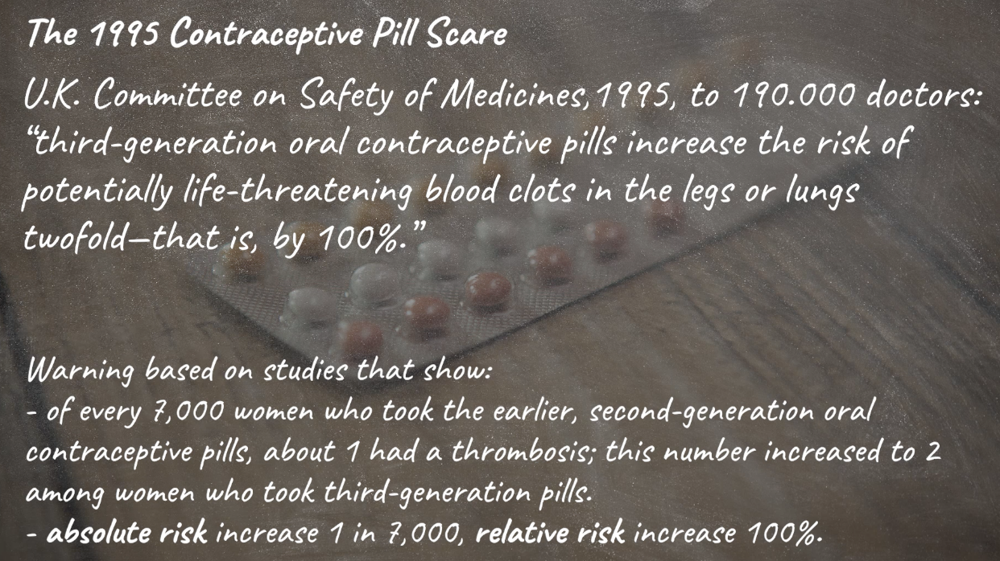

## Statistics

> There are three kinds of lies: lies, damned lies, statistics. (Mark Twain)

- Lie: an intentionally false statement.

- Lying with statistics:
    - based on genuine, good quality data
    - employs proper statistical tools
    - yield claims that are false - or at least what most people understand them to say is false

- Lying with statistics: The intentional misapplication of statistical methods.

> Statistics offers a toolbox with many tools, applicable to the same data, but yielding different results.

- Inferential statistics: - e.g. assess hypotheses 
    - by significance test
    - Error probability
    - Bayesian inference

- Statistics offers various methods.
- Methodology: choose the right tool for one's purpose, and justify why this tool is the right one, rather some other, equally applicable one.

- Statistical methodology: Justification of the choice of using a particular statistical method.

### Choosing Statistical Concepts

Alternative Purpose: arguding for claim that Germany is the country with the most unequal wealth distribution in the Eurozone.v. 

- Choosing the statistical depends on the purpose. 

### Choosing Statistical Format

Methodology of descriptive statistics
- choosing statistical concepts
- choosing statistical formats

- "我们的医学干预导致心肌梗死的发生率相对减少了33%。"

- "我们的医学干预导致心肌梗死的发生率减少了1.3个百分点，从3.9%降至2.6%。"

- "我们需要治疗77人才能预防1例致命或非致命的心肌梗死。"

- They are different descriptions of the same risk.

#### Choosing Descriptive Statistical Tools:
- Statistics offers a differenct precise notions to disambiguate commonsense concepts: median, mean, mode...
- Statistics offers different formats for representing uncertainty: relative risk, absolute risk, natural frequencies..
- Statistics provides a toolbox of sescriptive concepts
- You have to justify the choice from the toolbox
- This depends on what you want to use the concept for 

### Why should one use statistics to evaluate hypotheses?