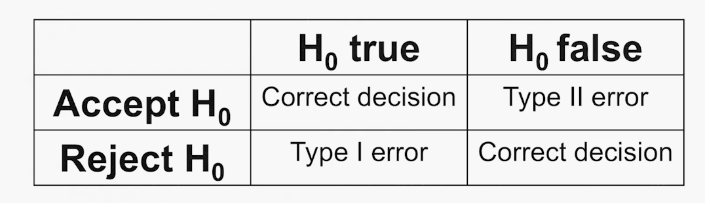

## Statistics

- Descriptive statistics: In descriptive statistics, one aims to display data and conclusions accurately. 

- Inferential statistics: In inferential statistics, one aims to draw a justified conclusion from data. 

> There are three kinds of lies: lies, damned lies, statistics. (Mark Twain)

- Lie: an intentionally false statement.

- Lying with statistics:
    - based on genuine, good quality data
    - employs proper statistical tools
    - yield claims that are false - or at least what most people understand them to say is false

- Lying with statistics: The intentional misapplication of statistical methods.

> Statistics offers a toolbox with many tools, applicable to the same data, but yielding different results.

- Inferential statistics: - e.g. assess hypotheses 
    - by significance test
    - Error probability
    - Bayesian inference

- Statistics offers various methods.
- Methodology: choose the right tool for one's purpose, and justify why this tool is the right one, rather some other, equally applicable one.

- Statistical methodology: Justification of the choice of using a particular statistical method.

### Choosing Statistical Concepts

Alternative Purpose: arguding for claim that Germany is the country with the most unequal wealth distribution in the Eurozone.v. 

- Choosing the statistical depends on the purpose. 

### Choosing Statistical Format

Methodology of descriptive statistics
- choosing statistical concepts
- choosing statistical formats

- "我们的医学干预导致心肌梗死的发生率相对减少了33%。"

- "我们的医学干预导致心肌梗死的发生率减少了1.3个百分点，从3.9%降至2.6%。"

- "我们需要治疗77人才能预防1例致命或非致命的心肌梗死。"

- They are different descriptions of the same risk.

#### Choosing Descriptive Statistical Tools:
- Statistics offers a differenct precise notions to disambiguate commonsense concepts: median, mean, mode...
- Statistics offers different formats for representing uncertainty: relative risk, absolute risk, natural frequencies..
- Statistics provides a toolbox of sescriptive concepts
- You have to justify the choice from the toolbox
- This depends on what you want to use the concept for 

### Why should one use statistics to evaluate hypotheses?

- Stochastic hypothesis: A hypothesis whose implications come in the form of a probability distribution. 
- Deterministic hypothesis: A hypothesis all of whose implications are certain.

- 1st Reason: Stochstic Implications of H

- 2st Reason: Determinstic hypotheses, e.g, "Amyloid plaque is the only cause of Alzheimer's disease". 

- Amyloid Plaque identified through tissue staining with enzymes. These enzymes（酶） are capable of catalyzing reactions that give a colored product. This is detactable by light microscopy（光学显微镜）.

- Measurement error

- Quantifying errors:
    - How probable is it to not observe plaque, even if there is Amyloid plaque?
    - How probable is it to observe plaque, even if ther is no Amyloid plaque?

- 3rd Reasons: Quantifying Confidence
    - Observing truth of any implication of H does not justify conluding that H is true, but only that we are more confident in H. 
    - Bayesian Statistics
    - Statistical tests of deterministic hypotheses are weakening of(non-statistical) accounts of confimation and falsification.

- Often for legitimate reasons:
    - stochastic hypotheses
    - Quantify error
    - Degrees of confirmation

## Error Statistic

- Fisher's Significance Testing

- p值（p-value）是显著性检验中的一个关键概念。它表示观察到的数据或更极端情况出现的概率，当原假设为真时，得到与观察到的结果一样极端或更极端的结果的概率。如果p值很小（通常小于设定的显著性水平，如0.05），则意味着观察到的结果在假设模型下是相对罕见的，我们可能选择拒绝原始假设。反之，如果p值较大，我们可能不拒绝原始假设。

假设我们对一枚硬币进行了一项实验，想要检验该硬币是否是公平的（即正面和反面出现的概率相等）。我们提出原假设（H0）：硬币是公平的，对应的备择假设（H1）：硬币不是公平的。

实验中，我们抛掷硬币20次，记录下正面朝上的次数，假设观察到了15次正面。接下来，我们使用显著性检验来评估观察到的数据。

1. **计算统计量：** 统计量可以是正面出现的次数。在这里，统计量为15。

2. **设定原假设和备择假设：** 
   - 原假设（H0）：硬币是公平的，正面出现的概率为0.5。
   - 备择假设（H1）：硬币不是公平的，正面出现的概率不等于0.5。

3. **计算p值：** 我们需要计算在原假设成立的情况下，观察到15次正面或更极端情况的概率。这个概率即为p值。

4. **做出决策：** 如果p值小于设定的显著性水平（通常为0.05），我们可能会选择拒绝原假设。如果p值较大，我们可能不拒绝原假设。

在这个例子中，如果计算得到的p值很小（比如0.02），我们可能会选择拒绝原假设，认为硬币不是公平的。反之，如果p值较大（比如0.10），我们可能不拒绝原假设，认为观察到的结果在随机波动的范围之内，不能提供足够的证据表明硬币不是公平的。

这是p-value在抛硬币实验中的应用，它帮助我们根据观察到的数据做出关于原假设的统计推断。

- p-value abuse: Changing test setup, statistical method, or sample in order to make the p-value either higher or lower than the significance level (depending on what result is desired).

### Neyman-Pearson Hypothesis Testing

- Neyman-Pearson hypothesis testing: A method of hypothesis testing developed by Jerzy Neyman and Karl Pearson.

- Original hypothesis (Hi): Some claim that you are interested in.

- Alternative hypothesis (Ha): A hypothesis that due to logical necessity has to be true if the original hypothesis is false and vice versa. I.e. Ha is the inverse, or negation, of Hi.
- Type I error: Wrongly rejecting a true hypothesis Hi.
- Type II error: Wrongly accepting a false hypothesis Hi.
- Power of a test: The probability of correctly rejecting a false hypothesis Hi.

