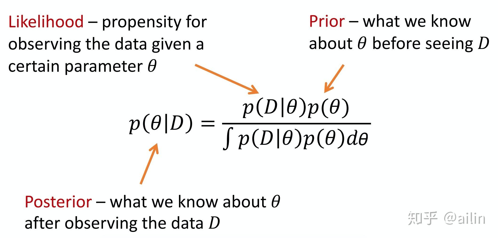
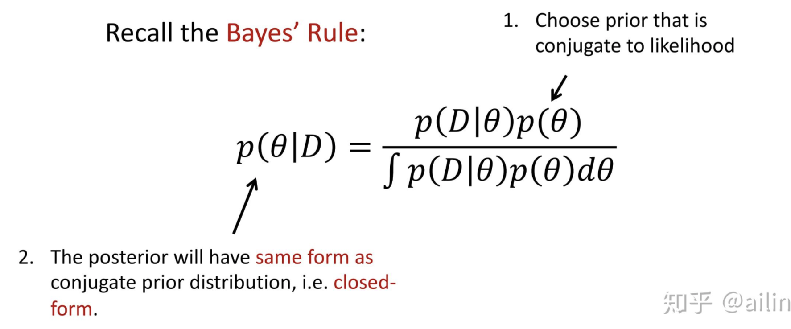

# DD2434 Exercise 1

## 1 Bayesian Statistics - Theory

When conducting probabilistic modelling ,we usually specify a model for how the data was generated. We denote the parameters pf this model as $\theta$. In Bayesiaon statistics, we assume a prior distribution $p(\theta)$ and infer the posterior $p(\theta|X)$ through Bayes’ theorem:

$$p(\theta|X)= \frac{p(X|\theta)p(\theta)}{p(X)}$$

where $p(X|\theta)$ is refereed to as the likelihood function, $p(\theta)$ the prior and $p(X)$ the evidence or marginal likelihood. 

In Bayesian probability theory, if the posterior distribution is in the same family of the prior distribution, then the prior and posterior are called conjugate distributions, and the prior is called the conjugate prior to the likelihood function.

- 共轭分布的定义
    - 在贝叶斯统计中，如果后验分布与先验分布属于同类（分布形式相同），则先验与后验分布被称为共轭分布，而先验分布被称为似然函数的共轭先验。

## Conjugate Priors - Exercise
1.1 Let $X=(X_1, ..., X_N)$ be i.i.d where $X_n|P,m \sim Binomial(m,P)$ and $P\sim Beta(\alpha,\beta)$ . Show that the posterior p(P|X,m) follows a Beta-distribution, i.e. that the Beta is conjugate prior to the Binomial with known m. What are the parameters of the posterior?

