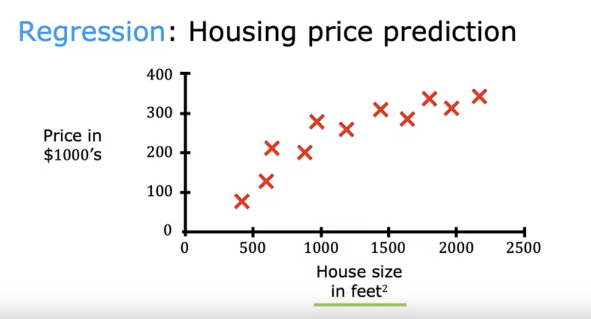
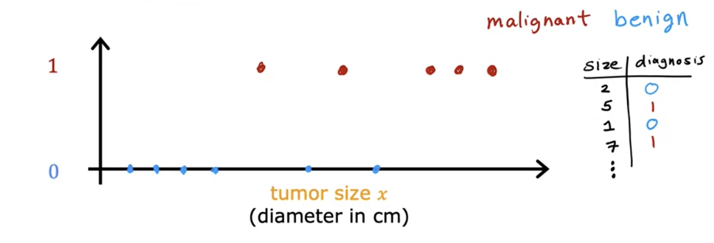
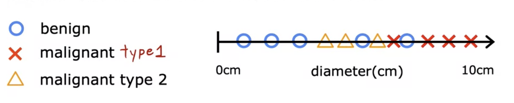
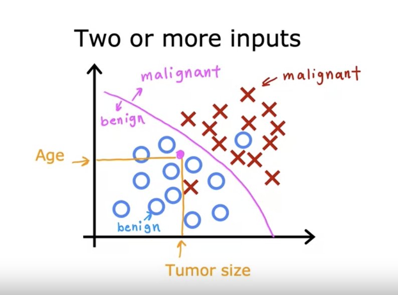
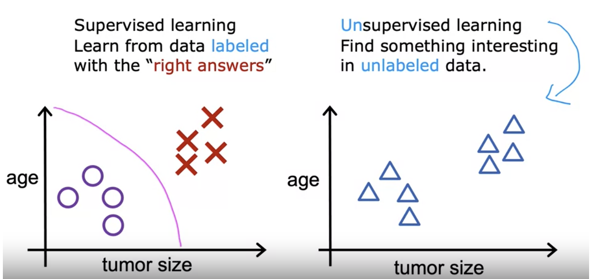

### Week 1

##### Machine Learning
- "Field of study that gives computers the ability to learn without being explicitly programmed." (Arthur Samuel, 1959)
    - In general, the more opportunities you give a learning algorithm to learn, the better it will perform. 

#### Machine Learning Algorithms
- Supervised Learning $\gets$ has been used most in real world applications and seen the most rapid advancements and innovation.
- Unsupervised Learning
- Recommender Systems
- Reinforcement Learning

$\gets$ Practical advice for applyting learning algorithms (tools and skills to apply them effectively)

### Supervised Learning

- X $\to$  y
- input $\to$ output label

- The key characteristic of supervised learning is that you give your learning algorithms examples to learn from. That includes the right answers(The correct lable y for given input x), and is by seeing correct pairs of input x and desired output label y that the learning algorithm eventually learns to take just the input alone without the output label and gives a reasonably accurate prediction or guess of the output. 

| Input(X)          | Output(Y)               | Application         |
| ----------------- | ----------------------- | ------------------- |
| email             | spam?(0/1)              | spam filtering      |
| audio             | text teanscripts        | speech recognition  |
| English           | Spanish                 | machine translation |
| ad, user info     | click?(0/1)             | online advertising  |
| image, radar info | positions of other cars | self-driving car    |

##### Regression: Predict a numnber (infinitely many possible outputs)

##### Classification: Breast Cancer Detection
    - malignant（恶性）
    - benign （良性）

- Classification: predict categories (small number of possible outputs)

- Our goal: to find the boundary

### Unsupervised Learning

