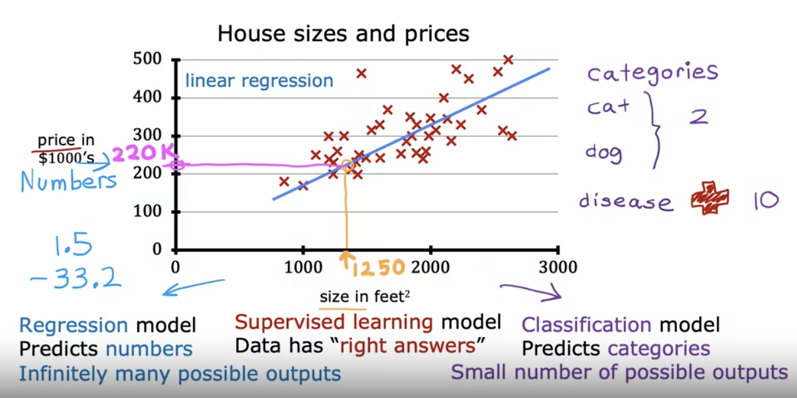
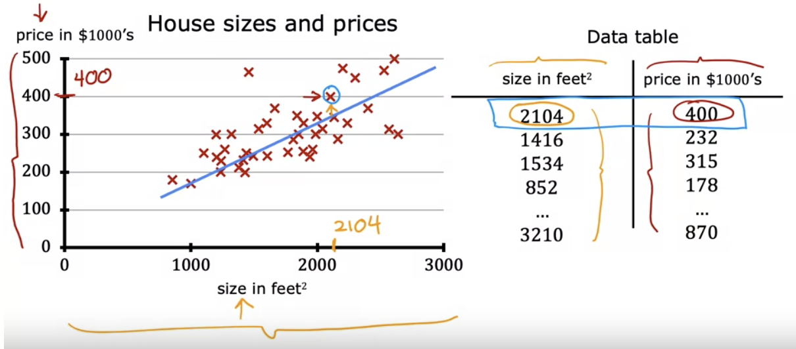
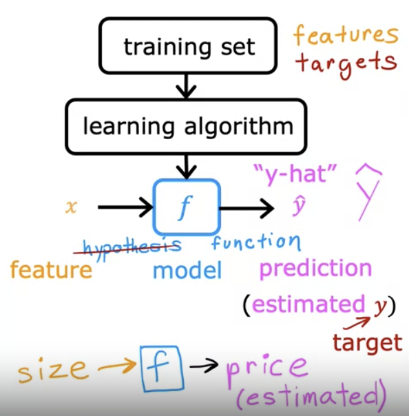
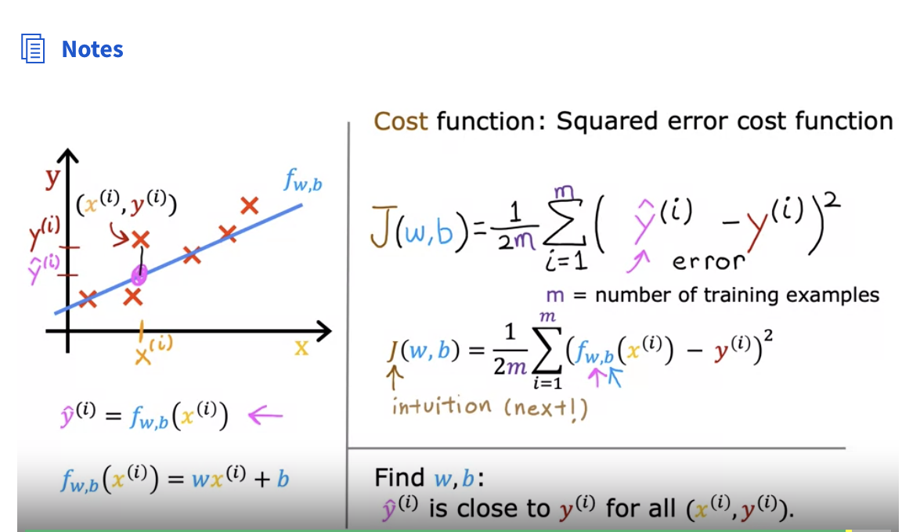
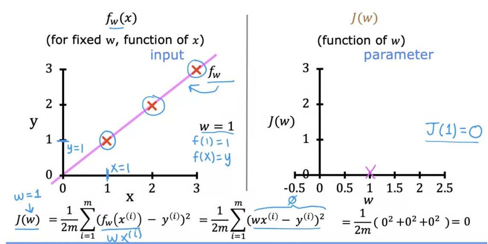
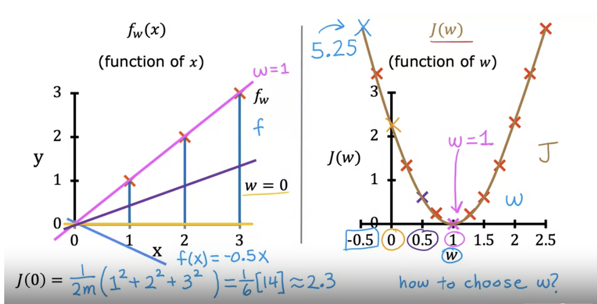
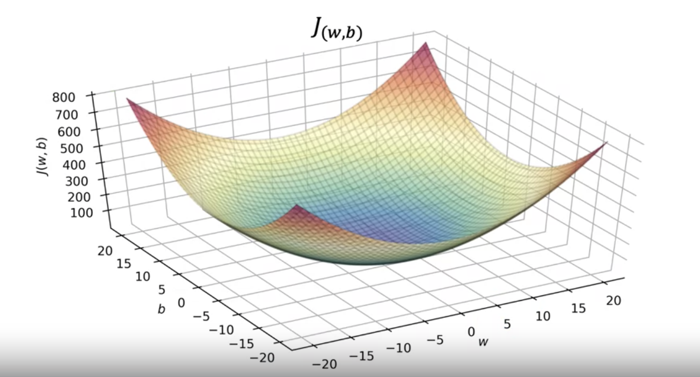

### Week 1

##### Machine Learning
- "Field of study that gives computers the ability to learn without being explicitly programmed." (Arthur Samuel, 1959)
    - In general, the more opportunities you give a learning algorithm to learn, the better it will perform. 

#### Machine Learning Algorithms
- Supervised Learning $\gets$ has been used most in real world applications and seen the most rapid advancements and innovation.
- Unsupervised Learning
- Recommender Systems
- Reinforcement Learning

$\gets$ Practical advice for applyting learning algorithms (tools and skills to apply them effectively)

### Supervised Learning

- X $\to$  y
- input $\to$ output label

- The key characteristic of supervised learning is that you give your learning algorithms examples to learn from. That includes the right answers(The correct lable y for given input x), and is by seeing correct pairs of input x and desired output label y that the learning algorithm eventually learns to take just the input alone without the output label and gives a reasonably accurate prediction or guess of the output. 

| Input(X)          | Output(Y)               | Application         |
| ----------------- | ----------------------- | ------------------- |
| email             | spam?(0/1)              | spam filtering      |
| audio             | text teanscripts        | speech recognition  |
| English           | Spanish                 | machine translation |
| ad, user info     | click?(0/1)             | online advertising  |
| image, radar info | positions of other cars | self-driving car    |

##### Regression: Predict a numnber (infinitely many possible outputs)

##### Classification: Breast Cancer Detection
    - malignant（恶性）
    - benign （良性）

- Classification: predict categories (small number of possible outputs)

- Our goal: to find the boundary

### Unsupervised Learning

 - Clustering: a particular type of unsupervised learning, called a clustering algorithm. Because it places the unlabeled data, into different clusters and this turns out to be used in many applications.

 - Unsupervised Learning: Data only comes with inputs x, but not output lables y. Algorithm has to find structure in the data.
    - Clustering: Group similar data points together
    - Anomaly Detection: Find unusual data points
    - Dimensionality reduction: Compress data using fewer numbers

### Linear Regression with One Variable

Terminology:
- Training set: Data used to train the model
    - Notation: 
        - x = "input" variable feature
        - y = "output" varibale, "target" variable
        - m = number of training examples
        - (x,y) =  single training example
        - $(x^{(i)},y^{(i)})$ = $i^{th}$ training example (1st, 2nd, 3rd,...)
- $x^{(i)}$ is not $x^i$, not exponent. 

How to represent $f$ ?
 - If f is a straight line, $f_{w,b}(x)=wx+b$
- Linear regression with one variable(single feature x)(e.g. size of the house)

- Univariate(one variable) linear regression

#### Cost Function
- Model $f_{w,b}(x)=wx+b$
- w,b: parameters(coefficients, weights)

- We should choose w to minimize J(w)

##### Cost function with 2 parameters

### Gradient Descent
- Have some function $J(w,b)$ (for linear regression or any function)
- Want $\min_{w,b}J(w,b)$ ( $\min_{w_{1},...w_{n},b}J(w_{1},w_{2},...,w_{n},b)$ )
- Outline:
    - Start with some w,b (In linear regression, it doesn't matter much what the initial value are)
        - Initial guess: set w=0,b=0
        - Keep changing w,b to reduce J(w,b)
        - Until we settle at or near a minimum

### Gradient Descent Algorithm

$$w:=w-\alpha \frac{\partial}{\partial b}J(w,b)$$

$$b:=b-\alpha \frac{\partial}{\partial b}J(w,b)$$

- $\alpha$ : Learning rate
- Simultaneously update w and b
- Repeat until convergence
- Learning rate:
    - If $\alpha$ is too small, gradient descent may be slow
    - If $\alpha$ is too large, gradient descent may:
        - Overshoot, never reach the minimum
        - Fail to converge, diverge
