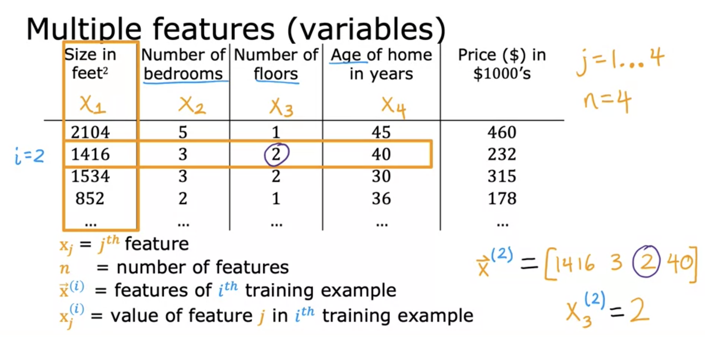
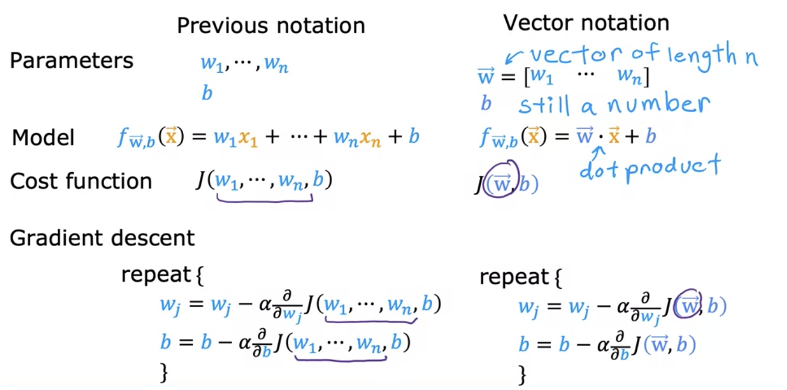
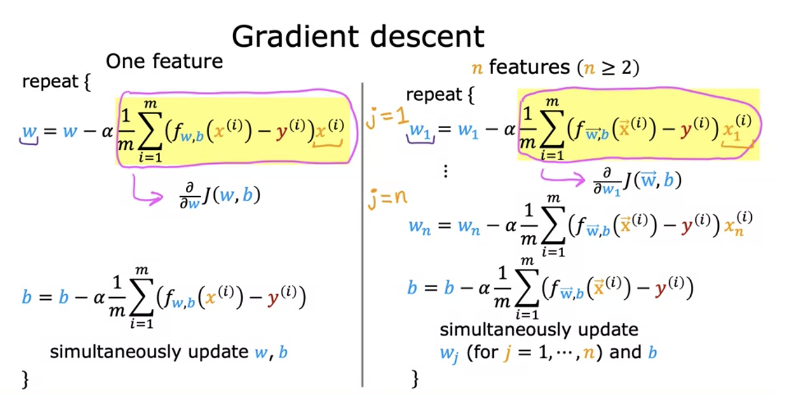
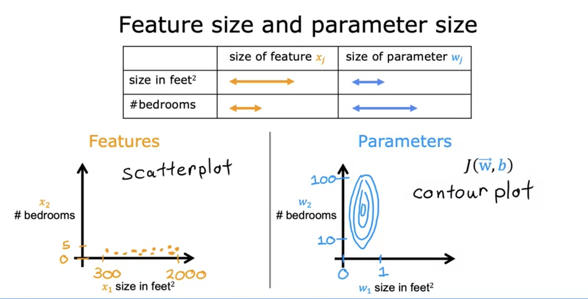
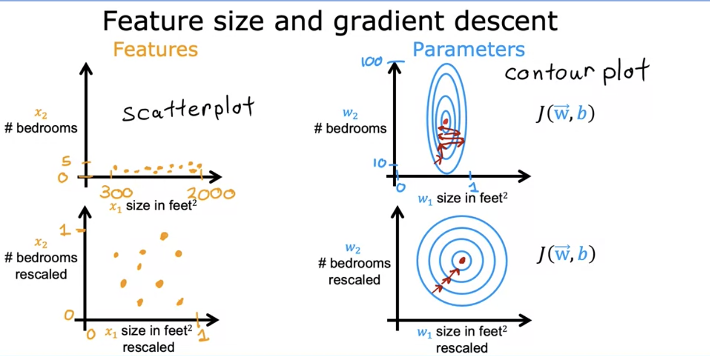
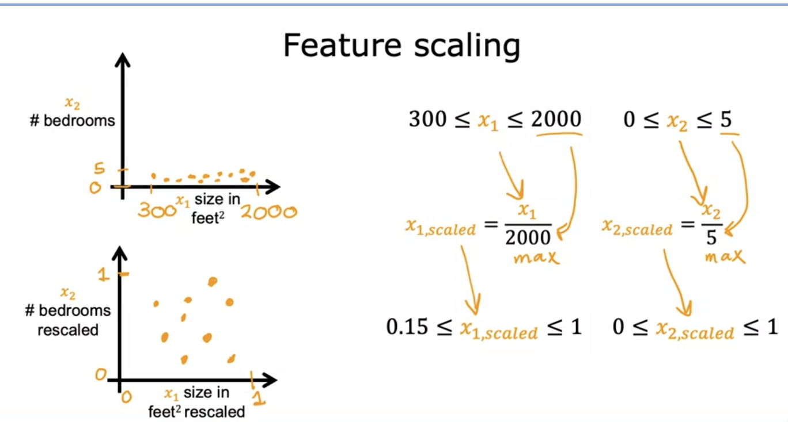
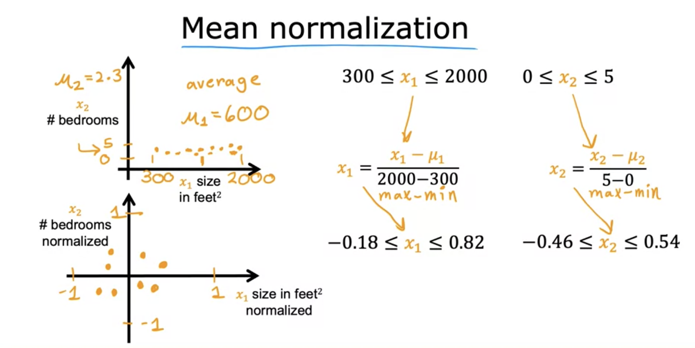
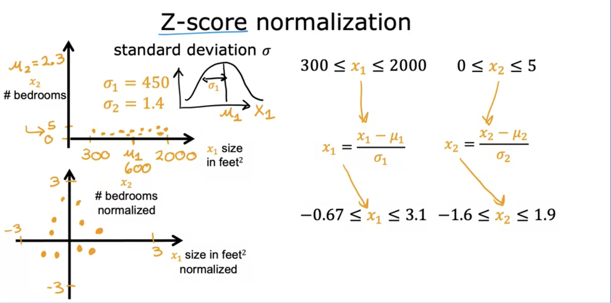
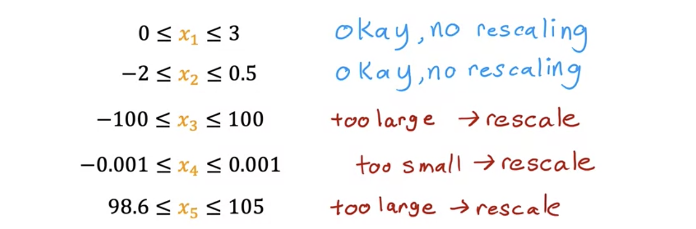
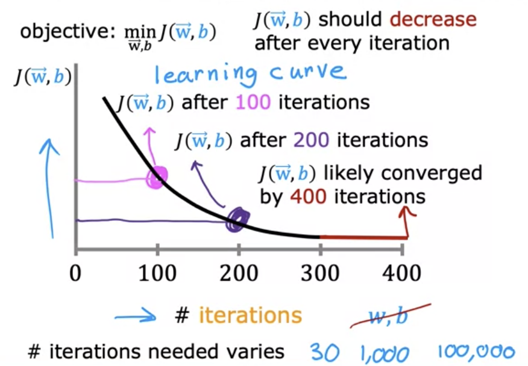

## Week 2

#### Multiple Features

- Model:
    - Previously: $f_{w,b}(x)=wx+b$
    - Now: $f_{w,b}(x)=w_{1}x_{1}+w_{2}x_{2}+...+b$
    - $\overrightarrow{w} = [w_1,w_2,w_3...w_n]$
    - b is a number 
    - $\overrightarrow{w}$ and b are the parameters of the model
    - $\overrightarrow{x} = [x_1,x_2,...x_n]$
    - $f(\overrightarrow{x})=\overrightarrow{w}\cdot \overrightarrow{x}+b$
    - This is multiple linear regression (not multivariate regression)
        - Linear regression with multiple features

### An alternative to gradient descent

- Normal equation
    - Only for linear regression
    - solve for w,b without iterations
    - Disadvantages:
        - Doesn't generalize to other learning algorithms
        - SLow wehn number of features is large(>10000)
    - What you need to know
        - Normal Equation Method may be used in machine learning libraries that implement linear regression
        - Gradient descent is the recommend method for finding parameters w,b

### Feature Scaling

- Feature and parameter values

$$\hat{price}=w_1x_1+w_2x_2+b$$

- $x_1$ : size ( $feet^2$ ) range 300-2000
- $x_2$ : number of bedrooms  range: 0-5

- House: $x_1$ = 2000, $x_2$ = 5, price = $500k - one training example

- size of the parameters $w_1$ and $w_2$ ?
- example 1:
    - $w_1$ = 50, $w_2$ = 0.1, b = 50
    - $\hat{price}$ = 50*2000+0.1*5+50
    - $\hat{price}$ = 100,050.5k
- example 2:
    - $w_1$ = 0.1, $w_2$ = 050, b = 50
    - $\hat{price}$ = 0.1*2000 + 20*5+50
    - $\hat{price}$ = 500k
- Example 2 seems more reasonable. 

#### Feature Scaling
- aim for about $-1\ge x_j\ge 1$ for each feature $x_j$
- acceptable ranges: $-3\ge x_j\ge 3$ , $-0.3\ge x_j\ge 0.3$

#### Checking Gradient Descent for Convergence
- Make sure gradient descent is working correctly 

- By 400 iterations, it looks like the curve has flattened out. This means that gradient descent has more or less converged because the curve is no longer decreasing. Looking at this learning curve, you can try to spot whether or not gradient descent is converging. By the way, the number of iterations that gradient descent takes a conversion can vary a lot between different applications. In one application, it may converge after just 30 iterations. For a different application, it could take 1,000 or 100,000 iterations. 

- Automatic convergence test 
- Let $epsilon$ be $10^{-3}$
- if $J(\overrightarrow{w},b)$ decreases by $\ge \epsilon$ in one iteration, declare convergence. (found parameters $\overrightarrow{w}$ , b to get close to global minimum)
