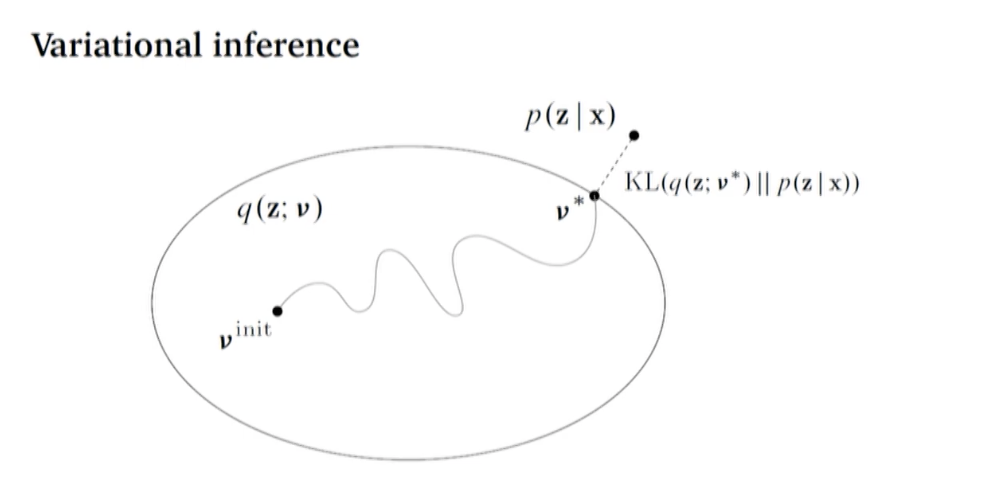
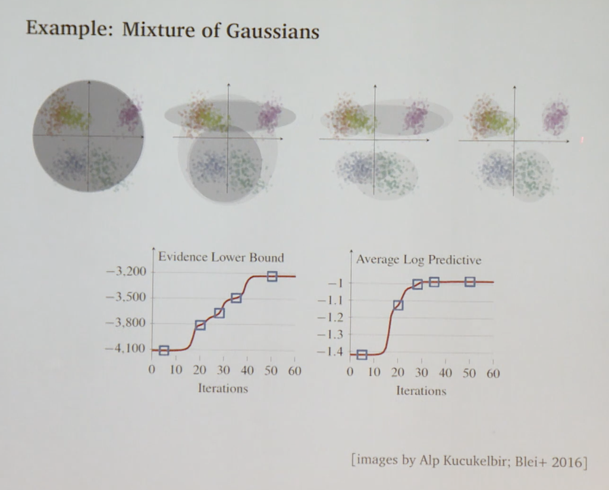
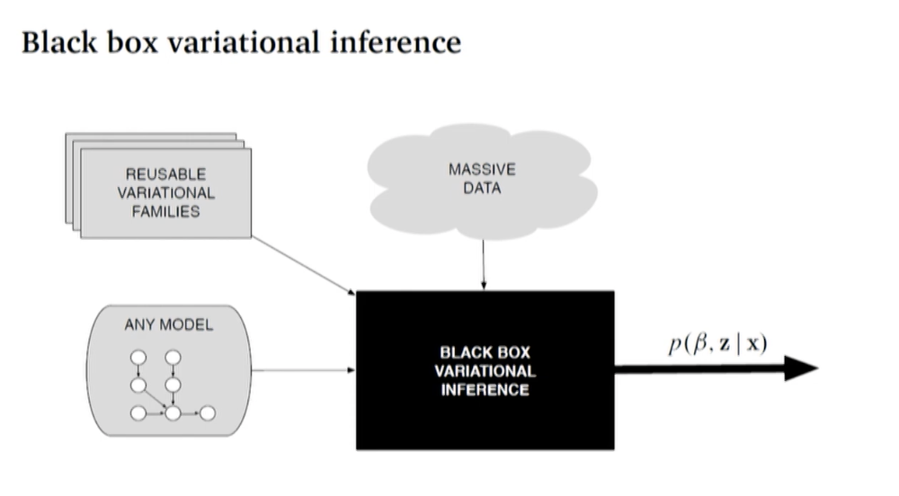
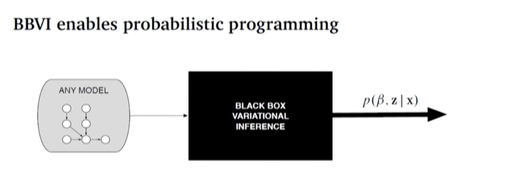

# Black-Box Variational Inference

- Why we care about probablistic programming?
- We have complicated data and we want to make sense of it.

- What is complicate data?
    - many data points, many dimensions.
    - unstructured (e.g. text)(not a matrix)
    - multi-modal（多峰的，多模式的） and interconeected(e.g. images, links, text, clicks)

- Make sense of data?
    - Make predictions about the future
    - Identify interpretable patterns
    - Do science: confirm, elaborate, form causal theories

Probablistic Machine Learning
- ML methods that connect domain knowledge(学科知识) to data
- Provides a computational methodology for scalable modelling
- Goal: A methodology that is expressive, scalable, easy to develop.
    - expressive: encode sth.(like facebook data) as a probability model 
    - scalable: want to be able to then calculate something about model with the data at large scale. 
    - Easy to develop: I don't want to have to develop an inference algorithm for each new model that I develop. Rather, I want it to be easy to go from a model to an inference algorithm. 

- Examples
    - Finding communities in large networks;
    - Looking at finding  topics automatically from large collections of text documents;
    - analyzing large collections of people's genome sequences to understand their ancestral populations and how they mixed;

#### The probablistic pipeline 

- Posterior inference is the key algorithmic problem
- Answers the question: What does this model say about this data
- Goal: General and scalable approaches to posterior inference -- we want to find approaches to easily handle many models

- Probablistic programming represents generative models as programs
- Inference engines compille models/programs to an inference executable.
- We can do this with black box variational infernce 
    - Key Ideas: autodifferentiation and stochastic optimization

- This probablistic pipeline is a loop. 
- check the model and use what we learned in that check to revise it. 

### Probablistic machine learning:

- A probablistic model is a joint distribution of hidden variables $z$ and observed variable $x$

$$p(z,x)$

- Inference about the unknowns is through the posterior, the conditional distribution of the hidden variables given the observations:

$$p(z|x)=\frac{p(z,x)}{p(x)}$$

- For most interesting models, the denominator is not tractable. We appeal to appriximate posterior inference. 
- We appeal to it because we can't actually calculate this posterior through which we're inferring something that we can't observe in the world. 

- Every point on the slide is the distribution of the hidden variables $z$ . 
- Target: $p$ of $z$ given $x$ . 
- every point in this ellipse is a parameterization of q and corresponds to a distribution of z. 
- We start with some initial parameters v, and we optimize following some path to v*, where our hope it that v* is close to the exact posterior that we care about. 

- VI solves inference with optimization. (Contrast with MCMC where you solve inference problem by trying to sample from the distribution you can't calculate. )
- Posit a variational family of distributions over the latent variables,

$$q(z;v)$$

- Fit the **variational parameters v** to be close(in KL) to the exact posterior. (There are alternative diverences, which connect to algorithms like EP, BP, and others. )

- Inference is time-consuming and error-prone. 

- Easily use variational inference with any model; no more appendices. 
- Perform inference with massive data. 
- No mathematical work beyond specifying the model. 

#### BBVI enables probabilistic programming

- Anglican
- Edward/Tensorflow Probability
- PyMC3
- Pyro
- Stan
- Venture
- Web PPL
- (& others ...)