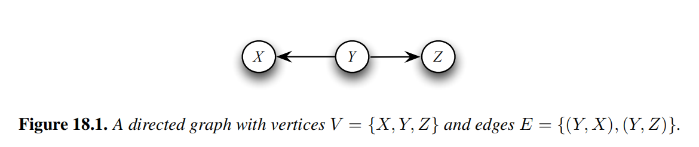
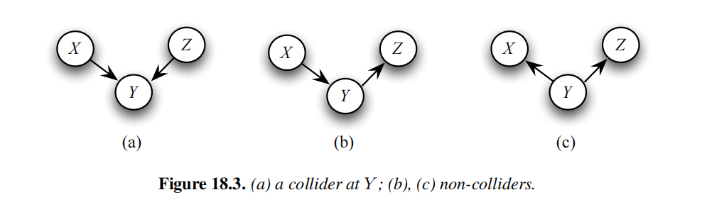
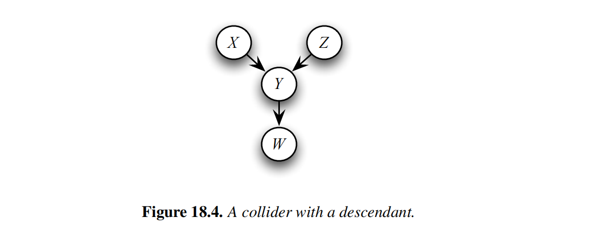
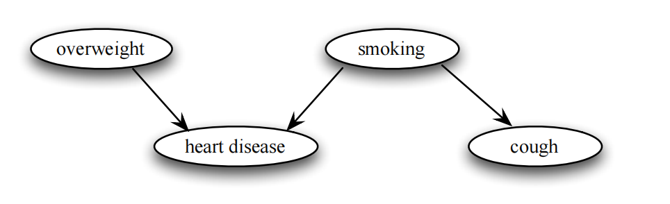
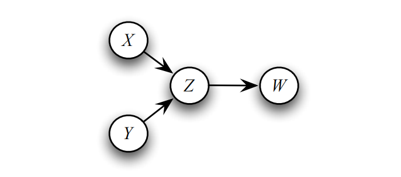
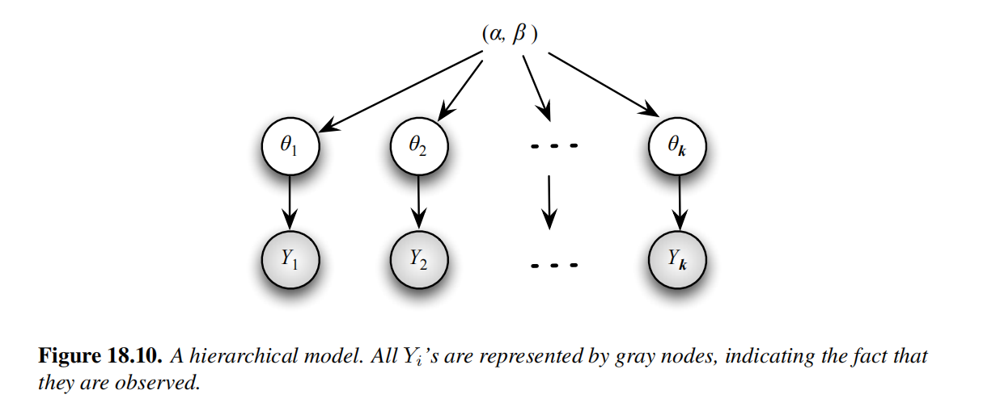
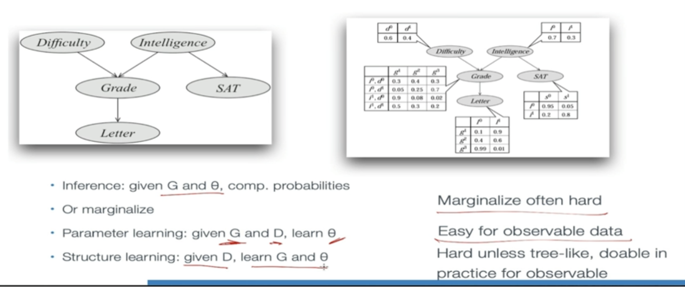

# Directed Graphical Model

## Introduction
- A graphical model is a probabilistic model for which the conditional independence structure in encoded in a graph. In a graphical model, vertices(or nodes) represent randon variables, and the edges encode conditional independence relations among the associated vertices. 
- Directed Graphical Models: the edges of the graph have directions(arrows).

### The definition of conditional independence

Let X, Y and Z be random variables. X and Y are conditionally independent given Z, written X ⫫ Y| Z, if

$$p(x,y|z)=p(x|z)p(y|z)$$

for all x, y and z.

- This means that, once Z is known, Y provided no extra information about X. An equivalent definition is that p(x|y,z)=p(x|y) for all x, y and z. 

## Directed Acyclic Graphs(DAGs)

- A directed graph G consists of a set of vertices V and an edge set E of ordered pairs of vertices. 

- If an arrow connects two variables X and Y (in either direction) we say that X and Y are **adjacent**. If there is an arrow form X to Y then X is a **parent** of Y and Y is a **child** of X. 
- The set of all parents of X is denoted by $\pi_X$ or $\pi(x)$.
- X is an ancestor of Y if there is a directed path from X to Y(or X=Y). We also say that Y is a descendant of X.

- The collider property is path dependent. In Figure 18.4. Y is a collider on the path {X,Y,Z} but it is a non-collider on the path {X,Y,W}

- When the variables pointing into a collider are not adjacent, we say that the collider is **unshielded**. A directed path that starts and ends at the same variable is called a cycle. A directed graph is **acyclic** if it has no cycles. In this case we say that graph is a **directed acyclic** graph or DAG.

### Probability and DAGs

Let G be a DAG with vertices $V=(X_1,..., X_d)$ . For notational simplicity, we sometimes represent V={1,...d}. If P is a distribution for V with probability function p(x), we say that P is Markov to G, or that G represents P, if

$$p(x)=\prod_{j=1}^{d}p(x_j|\pi_{x_j})$$

where $\pi_{x_j}$ is the set of parent nodes of $X_j$ . The set of distributions represented by G is denoted by $\mathcal{M}(G)$ .

### Example

The above figure shows a DAG with four varibales. The probability function takes the following decomposition:

$$p(overweight, smoking, heart disease, cough) = p(overweight)\times p(smoking)\times p(heart disease| overweight,smoking)\times p(cough|smoking)$$

### Example

- For the DAGin Figure 18.6, $P\in \mathcal{M}(G)$ if and only if its probability function p(x) has the form $p(x,y,z,w)=p(x)p(y)p(z|x,y)p(w|z).

- The following theorem says that $P\in \mathcal{M}(G)$ if and only if the Markov condition holds. Roughly speaking, the Markov condition means that every variable W is independent of the "past" given its parents.

### Theorem

Fot a graph G = (V,E), a distribution $P\in \mathcal{M}(G)$ if and only if the Markov condition holds: for every variable W,

$$W ⫫ \widetilde{W}|\pi_W$$

where $\widetilde{W}$ denotes all the other varables except the parents and decendants of W.

### Example

Some statistical models can naturally be written in layers and are called hierarchical models or random effects models. For example, suppose we sample k counties and then we sample $n_i$ people in the i-th county. We count the number $Y_i$ that test positive for some disease. Then $Y_i\sim Binomial(n_i, \theta_i)$ . The $\theta_i$ 's can also be regarded as random variables sampled from some distribution $p(\theta; \phi)$ . For example, we might have $\theta_i \sim Beta(\alpha, \beta)$ so that $phi=(\alpha, \beta)$ . The model can be written as

$$theta_i \sim Beta(\alpha, \beta)$$

$$Y_i|\theta_i \sim Binomial(n_i, \theta_i)$$

### Representing and working with distributions 

- For all but the smallest n, the explicit represrntation of the joint distribution is unmanageable from every perspective.
    - computationally, is is very expensive to manipulate and generally too large to store in memory. 
    - Cognitively, it is impossible to acquire so many numbers from a human expert; Moreover, the numbers are very small and do not correspond to events that people can reasonably contemplate. 
    - Statistically, if we want to learn the distribution form data, we would need ridiculously large amounts of data to estimate this many parameters robustly. 
- These problems were the main barrier to the adoption of probalistic methods or expert system until the development of the methodologies we now will consider.

Terminology
- Parent
- Child
- Family
- Root
- Leaf
- Neighbors
