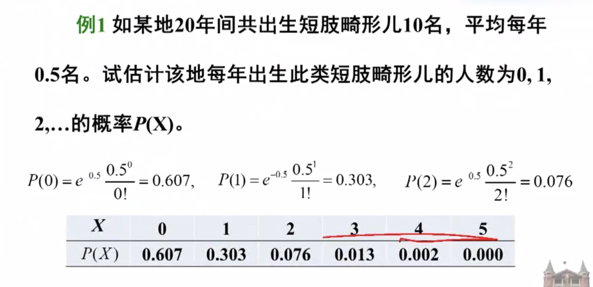

# Probability Distributions

#### Bernoulli and Binomial distribution

Suppose we have a binary variable, $x\in$ {0,1}, which we can think of as representing the outcome of a coin toss. It is common to model such a variable using the Bernoulli distribution, which has the form:

$$P(X = k) = \begin{cases} 
\mu & \text{if } x = 1 \\
 1 - \mu & \text{if } x = 0
\end{cases}$$

where $\mu=\mathbb{E}=p(x=1)$ is the mean. 

If x counts the numner of heads in N trials, we can use the binomial distribution:

$$Bin(x|N,\mu) \triangleq \binom{N}{x}\mu^{x}(1-\mu)^{N-x}$$

where $\binom{N}{k} \triangleq \frac{N!}{(N-k)!k!}$ is the number of ways to choose k items from N(that is known as the binomial coefficient, and is pronounced "N choose k"), if N=1, the binomial distribution reduces to Bernoulli distribution. 

#### Beta Distribution

The Beta distribution is a continuous probability distribution defined on the interval [0,1]. It is often used to model the dsitribution of random variables representing propotions or probabilities.  

###### Probability Density Function (PDF)

The probability density function (PDF) of a Beta distribution with parameters $\alpha$ and $\beta$ is given by:

$$f(x; \alpha, \beta) = \frac{x^{\alpha-1} \cdot (1 - x)^{\beta-1}}{\text{B}(\alpha, \beta)}$$

$$B(\alpha, \beta) = \frac{\Gamma(\alpha) \cdot \Gamma(\beta)}{\Gamma(\alpha + \beta)}$$

Here, $\Gamma$ denotes the gamma function. The gamma function is defined as:

$$\Gamma(n) = (n-1)!$$

Substituting the expression for $B(\alpha, \beta)$ into the PDF, we get:

$$f(x; \alpha, \beta) = \frac{x^{\alpha-1} \cdot (1 - x)^{\beta-1} \cdot \Gamma(\alpha + \beta)}{\Gamma(\alpha) \cdot \Gamma(\beta)}$$

#### Categorical and multinomial distributions

- 将一个小球放入两个桶，记变量x为第一个桶里小球的个数，那么只有0个或1个，所以服从伯努利分布；
- 将n个小球放入两个桶，记变量x为第一个桶里小球的个数，那么最少可能有0个，最多可能有n个，所以服从二项分布；
- 将1个小球放入k个桶，记变量x为第k个桶里小球的个数，所以是一个向量，并且是one-hot形式，因为小球只能放在一个桶里面，所以是服从Categorical分布；
- 将n个小球放入k个桶，记变量x为第k个桶里小球的个数，是一个向量，并且向量元素的和为n，所以是服从多项分布。

- If the variable is discrete-valued, x $\in$ {1,...K}, we can use the categorical distribution:

$$Cat(x|\mathrm{\theta})\stackrel{\Delta}{=} \prod_{k=1}^{K}\theta_k^{\mathbb{I}(x=k)}$$

- theta is a vector
- $\theta_k$ represents the probability associated with category $k$. In the context of a categorical distribution, $\theta_k$ is the probability of the random variable $x$ being equal to category $k$.
- $\mathbb{I}(x=k)$ is an indicator function. It takes the value 1 if the condition $x=k$ is true and 0 otherwise. In this context, $\mathbb{I}(x=k)$ is used to check if the random variable $x$ is equal to category $k$.

- Alternatively, we can represent the K-valued variable x with the one hot binary vector **x**, which lets us write:

$$Cat(x|\mathrm{\theta})\stackrel{\Delta}{=} \prod_{k=1}^{K}\theta_k^{x_k}$$

- $x_k$ is the $k$-th element of the one-hot binary vector **x**. It is equal to 1 if category $k$ is the category represented by $x$, and it is 0 otherwise.

> A one-hot binary vector is a binary vector (a vector of binary values, typically 0s and 1s) where only one element is set to 1 (hot), and all other elements are set to 0 (cold). It is often used to represent categorical variables or labels in machine learning and data analysis. The "hot" element corresponds to the category or label that is being represented.

> e.g. Suppose you have a set of fruits: {Apple, Banana, Orange, Grape}. You can represent each of these fruits using a one-hot binary vector like this: 
    - Apple: [1, 0, 0, 0] (1 in the first position)
    - Banana: [0, 1, 0, 0] (1 in the second position)
    - Orange: [0, 0, 1, 0] (1 in the third position)
    - Grape: [0, 0, 0, 1] (1 in the fourth position)

- If the k'th element of **x** counts the number of time the value k is seen in $N=\sum_{k=1}^{K}x_k$ trials, then we get the **multinomial distribution** :

$$\mathcal{M}(x|N,\theta)\stackrel{\Delta}{=}\binom{N}{x_1....x_k}\prod_{k=1}^{K}\theta_k^{x_k}$$

- $\binom{N}{x_1, x_2, \ldots, x_K}$ represents the multinomial coefficient, which calculates the number of ways to arrange $N$ trials into $x_1$ for category 1, $x_2$ for category 2, and so on, up to $x_K$ for category $K$. It accounts for the different ways these counts can be distributed within the $N$ trials.
- $\prod_{k=1}^{K} \theta_k^{x_k}$ is the product term that specifies the probability of observing category $k$ exactly $x_k$ times in each individual trial.

#### Poisson Distribution

- Now suppose the state space is the set of all non-negative integers, so X $\in$ {0,1,2,...}. We say that a random variable has a **Poisson** distribution with parameter $\lambda >0$ , written $X ~ Poi(\lambda)$ , if its pmf(probability mass function) is 

$$Poi(x|\lambda) = e^{-\lambda} \frac{\lambda^x}{x!}$$

- x为观察单位内某稀有事件的发生次数
- $\lambda = n\mu$  为Poisson分布的总体均数

where $\lambda$ is the mean (and variance) of x. (The first term is just the normalization constant, required to ensure the distribution sum to 1). The Poisson distribution is often used as a model for counts of rare events like radioactive decay and traffic accidents. 

$$Bin(x|N,\mu) \stackrel{\Delta}{=} \binom{N}{x}\mu^x(1-\mu)^{N-x}$$

when $\mu \to 0$ , $n \to \infty$ , $n \mu = \lambda$ , $\mu = \lambda /n$ , binomial distribution becomes Poisson distribution. 

 $$\binom{N}{x}\mu^x(1-\mu)^{N-x} = \frac{N!}{x!(N-x)!} \cdot \frac{\lambda^x}{N^x} \cdot (1 - \frac{\lambda}{N})^{N-x}$$

 $$\lim_{N \to \infty } \frac{N!}{x!(N-x)!} \cdot \frac{\lambda^x}{N^x} \cdot (1 - \frac{\lambda}{N})^{N-x}$$

 $$= \lim_{N \to \infty } \frac{(N-1)(N-2)...(N-x+1)}{x!} \cdot \frac{\lambda^x}{N^x} \cdot (1 - \frac{\lambda}{N})^{N-x}$$

 $$\lim_{N \to \infty } \frac{(N-1)(N-2)...(N-x+1)}{N^x} = \lim_{N \to \infty } 1 \cdot (1-\frac{1}{n})(1-\frac{2}{n})...(1-\frac{x-1}{n}) = 1$$

 As a result:

 $$\lim_{N \to \infty } \frac{(N-1)(N-2)...(N-x+1)}{x!} \cdot \frac{\lambda^x}{N^x} \cdot (1 - \frac{\lambda}{N})^{N-x} = \frac{\lambda^x}{x!}\cdot (1 - \frac{\lambda}{N})^{N-x}$$

Meanwhile:

 $$\lim_{N \to \infty}(1 - \frac{\lambda}{N})^{N-x} = \lim_{N \to \infty}(1 - \frac{\lambda}{N})^{N}(1 - \frac{\lambda}{N})^{-x}=\lim_{N \to \infty}(1 - \frac{\lambda}{N})^{N}$$

 According to 

 $$\lim_{x \to \infty}(1+\frac{1}{x})^x = e$$

Then

$$\lim_{N \to \infty}(1 - \frac{\lambda}{N})^{N} =\lim_{N \to \infty}[(1 + \frac{1}{-\frac{N}{\lambda}})^{- \frac{N}{\lambda}}]^{-\lambda} = e^{-\lambda}$$

$$\lim_{N \to \infty }{\lambda^x}{x!}\cdot (1 - \frac{\lambda}{N})^{N-x} = e^{-\lambda} \frac{\lambda^x}{x!}$$

- 泊松分布式一种离散型分布，用于描述单位时间、空间、面积等的罕见事件发生次数的概率分布。如：
    - 每毫升水中的大肠杆菌数
    - 每1000个新生儿中出现染色体异常等事件的例数
- 泊松分布要求观察结果相互独立，发生的概率 $\pi$ 不变。
    - 如，人群中传染性疾病首例出现后便成为传染源，会增加后续病例出现的概率，所以病例数的分部不能看做是泊松分布。

### Conjugate priors 共轭先验

##### Bayes formula:

$$P(\theta | X) = \frac{P(X | \theta) \cdot P(\theta)}{P(X)}$$

- Prior(先验): $P(\theta)$
- Likelihood(似然): $P(X|\theta)$
- Posterior(后延): $P(\theta|X) \propto P(X | \theta) \cdot P(\theta)$

In Bayesian statistics, a prior distribution is considered conjugate to a likelihood function if the resulting posterior distribution belongs to the same family of distributions as the prior. More formally, if the prior distribution $P(\theta)$ is conjugate to the likelihood function $P(X|\theta)$, then the posterior distribution $P(\theta|X)$ also belongs to the same family of distributions as the prior.

### Exercises

1.1: Let $X = (X_1, ..., X_N)$ be i.i.d. where $X_n|P,m \sim Binomial(m,P)$ and $P \sim Beta(\alpha, \beta)$ . Show that the posterior p(P|X,m) follows a Beta-distribution, i.e. that the Beta is conjugate prior to the Binomial with known m. What are the parameters of the posterior?

Let's denote the observed data as $x = (x_1, \ldots, x_N)$, where $x_n$ is the outcome of the $n$-th trial. The likelihood function is given by the product of the individual Binomial probabilities:

$$P(x | P, m) = \prod_{n=1}^{N} \binom{m}{x_n} P^{x_n} (1 - P)^{m - x_n}$$

The prior distribution on $P$ is given by $P(P) = \text{Beta}(P | \alpha, \beta)$ .

The posterior distribution is proportional to the product of the likelihood and the prior:

$$P(P | x, m) \propto P(x | P, m) \cdot P(P)$$

Now, let's simplify this expression:

$$P(P | x, m) \propto \prod_{n=1}^{N} \binom{m}{x_n} P^{x_n} (1 - P)^{m - x_n} \cdot P^{\alpha - 1} (1 - P)^{\beta - 1}$$

Combining like terms, we get:

$$P(P | x, m) \propto P^{\sum_{n=1}^{N} x_n + \alpha - 1} (1 - P)^{N \cdot \sum_{n=1}^{N} (m-x_n) + \beta - 1}$$

This expression has the form of the kernel of a Beta distribution. By comparing with the probability density function (PDF) of the Beta distribution, we can identify the parameters of the posterior:

$$P(P | x, m) \propto \text{Beta}(P | \alpha + \sum_{n=1}^{N} x_n, \beta + N \cdot m - \sum_{n=1}^{N} x_n)$$

Therefore, the posterior distribution $P(P | x, m)$ follows a Beta distribution with parameters $\alpha + \sum_{n=1}^{N} x_n$ and $\beta + N \cdot m - \sum_{n=1}^{N} x_n$ . This confirms that the Beta distribution is indeed conjugate to the Binomial likelihood with known m.

1.2: Let $D=(d_1,..., d_N)$ be i.i.d with $d_n|\lambda \sim Poisson(\lambda)$ and $\lambda \sim Gamma(\alpha, \beta)$ . Show that the posterior $p(\lambda|D)$ follows a Gamma-distribution, i.e. that the Gamma is conjugate prior to the Poisson distrinbution. What are the parameters of the posterior? 

The probability density function (PDF) of the Gamma distribution is given by:

$$f(x; \alpha, \beta) = \frac{\beta^\alpha x^{\alpha - 1} e^{-\beta x}}{\Gamma(\alpha)}$$

Here, $x$ is the random variable, $\alpha$ is the shape parameter, $\beta$ is the rate parameter, and $\Gamma(\alpha)$ is the gamma function.

The likelihood function is given by the product of the individual Poisson probabilities:

$$P(D | \lambda) = \prod_{n=1}^{N} \frac{e^{-\lambda} \lambda^{d_n}}{d_n!}$$

The prior distribution on $\lambda$ is given by $P(\lambda) = \text{Gamma}(\lambda | \alpha, \beta)$ .

The posterior distribution is proportional to the product of the likelihood and the prior:

$$P(\lambda | D) \propto P(D | \lambda) \cdot P(\lambda)$$

Now, let's simplify this expression:

$$P(\lambda | D) \propto \prod_{n=1}^{N} \frac{e^{-\lambda} \lambda^{d_n}}{d_n!} \cdot \frac{\beta^\alpha}{\Gamma(\alpha)} \lambda^{\alpha - 1} e^{-\beta \lambda}$$

Combining like terms and removing constant factors, we get:

$$P(\lambda | D) \propto \lambda^{\sum_{n=1}^{N} d_n + \alpha - 1} e^{-(N + \beta)\lambda}$$

This expression has the form of the kernel of a Gamma distribution. By comparing with the probability density function (PDF) of the Gamma distribution, we can identify the parameters of the posterior:

$$P(\lambda | D) \propto \text{Gamma}(\lambda | \alpha + \sum_{n=1}^{N} d_n, N + \beta)$$

Therefore, the posterior distribution $P(\lambda | D)$ follows a Gamma distribution with parameters $\alpha + \sum_{n=1}^{N} d_n$ and $N + \beta$ . This confirms that the Gamma distribution is indeed a conjugate prior to the Poisson distribution.

1.3: Let $X=(X_1,..., X_N)$ be i.i.d with $X_n|\mu,\tau \sim Normal(\mu, \frac{1}{\tau})$ and $(\mu, \tau) \sim NormalGamma(\mu_0, \lambda, \alpha, \beta)$ . Show that the posterior $p(\mu, \tau|X)$ follows a NormalGamma-distribution, i.e. that the NormalGamma is conjugate prior to the Normal distribution with unknown mean and precision. What are the parameters of the posterior?

The probability density function (PDF) of the Normal distribution with mean $\mu$ and precision $\tau$ is given by:

$$f(x | \mu, \tau) = \sqrt{\frac{\tau}{2\pi}} \exp\left(-\frac{\tau}{2} (x - \mu)^2\right)$$

Here:
- $x$ is the random variable.
- $\mu$ is the mean of the distribution.
- $\tau$ is the precision, which is the inverse of the variance.

The precision is often denoted by $\tau = \frac{1}{\sigma^2}$, where $\sigma$ is the standard deviation. If you are given the standard deviation directly, you can use $\tau = \frac{1}{\sigma^2}$ in the formula above.

The probability density function (PDF) of the Normal-Gamma distribution for $(\mu, \tau)$ is given by:

$$p(\mu, \tau | \mu_0, \lambda, \alpha, \beta) = \frac{\beta^\alpha}{\Gamma(\alpha)} \sqrt{\frac{\lambda}{2\pi}} \tau^{\alpha - 1/2} \exp\left(-\beta \tau\right) \exp\left(-\frac{\lambda\tau}{2} (\mu - \mu_0)^2\right)$$

Here:
- $\mu$ is the mean of the Normal distribution.
- $\tau$ is the precision (inverse of the variance) of the Normal distribution.
- $\mu_0$ is the mean parameter of the Normal prior.
- $\lambda$ is a precision parameter of the Normal prior.
- $\alpha$ and $\beta$ are shape and rate parameters of the Gamma prior.
- $\Gamma(\cdot)$ is the gamma function.

This formula includes the constant terms necessary for normalization, ensuring that the total probability integrates to 1. The gamma function \(\Gamma(\cdot)\) is used in the normalization, and it accounts for the \(\frac{\beta^\alpha}{\Gamma(\alpha)}\) term. The other terms are as discussed earlier, representing the Normal and Gamma components of the distribution.

Given:
1. Likelihood: $X_n | \mu, \tau \sim \text{Normal}(\mu, \frac{1}{\tau})$
2. Prior: $(\mu, \tau) \sim \text{NormalGamma}(\mu_0, \lambda, \alpha, \beta)$

We want to find the posterior distribution:

$$p(\mu, \tau | X) \propto p(X | \mu, \tau) \cdot p(\mu, \tau)$$

Expanding this using the likelihood and prior:

$$p(\mu, \tau | X) \propto \left(\prod_{n=1}^{N} \frac{\sqrt{\tau}}{\sqrt{2\pi}} \exp\left(-\frac{\tau}{2}(X_n - \mu)^2\right)\right) \cdot \left(\frac{\beta^\alpha}{\Gamma(\alpha)} \sqrt{\frac{\lambda}{2\pi}} \tau^{\alpha - \frac{1}{2}} \exp\left(-\beta \tau\right) \exp\left(-\frac{\lambda \tau}{2} (\mu - \mu_0)^2\right)\right)$$

Taking the logarithm and grouping terms, we get:

$$\log p(\mu, \tau | X) \propto \sum_{n=1}^{N}log[\sqrt{\frac{\tau}{2\pi}} \exp\left(-\frac{\tau}{2} (x - \mu)^2\right)]+log[\frac{\beta^\alpha}{\Gamma(\alpha)} \sqrt{\frac{\lambda}{2\pi}} \tau^{\alpha - 1/2} \exp\left(-\beta \tau\right) \exp\left(-\frac{\lambda\tau}{2} (\mu - \mu_0)^2\right)]$$

$$\log p(\mu, \tau | X) \propto \sum_{n=1}^{N}\frac{1}{2}\log\tau - \frac{\tau}{2}(x_n-\mu)^2 + (\alpha - \frac{1}{2})\log\tau - \beta\tau - \frac{\lambda\tau}{2}(\mu - \mu_0)^2$$

$$=\frac{N}{2}\log\tau - \frac{\tau}{2} \sum_{n=1}^{N}(x_n^2 - 2x_n\mu + \mu^2) + (\alpha - \frac{1}{2})\log\tau - \beta\tau + \frac{\lambda\tau}{2}(\mu^2 - 2\mu\mu_0 + \mu_0^2)$$

$$=(\frac{N}{2} + \alpha - \frac{1}{2})\log\tau - \beta\tau - \frac{\tau}{2}[\mu^2(N+\lambda)-2\mu( \sum_{n=1}^{N}x_n + \mu_0 \lambda) + (\sum_{n=1}^{N} x_n^2 + \lambda\mu_0^2)]$$

$$= (\frac{N}{2} + \alpha - \frac{1}{2})\log\tau - \beta\tau - \frac{\tau}{2}(N+\lambda)[\mu^2-\frac{2\mu}{(N+\lambda)}( \sum_{n=1}^{N}x_n + \mu_0 \lambda) + \frac{(\sum_{n=1}^{N} x_n^2 + \lambda\mu_0^2)}{N+\lambda}]$$

To complete this and show that the posterior follows a Normal-Gamma distribution, we need to simplify it further into the form of the logarithm of a Normal-Gamma distribution. The Normal-Gamma distribution has the form:

$$\text{log Normal-Gamma} \propto (\alpha' - \frac{1}{2})\log\tau - \beta'\tau - \frac{\tau}{2}(\lambda'(\mu - \mu')^2 + \nu')$$

Comparing the two forms, we can identify the parameters for the posterior Normal-Gamma distribution:

$$\alpha' = \frac{N}{2} + \alpha - \frac{1}{2}$$

$$\beta' = \beta$$

$$\lambda' = N + \lambda$$

$$\mu' = \frac{\lambda \mu_0 + \sum_{n=1}^{N}x_n}{\lambda + N}$$

$$\nu' = \frac{1}{2}\left(\sum_{n=1}^{N} x_n^2 + \lambda\mu_0^2 - \frac{\lambda(\sum_{n=1}^{N}x_n + \mu_0\lambda)^2}{\lambda + N}\right)$$

Thus, the posterior distribution $p(\mu, \tau | X)$ follows a Normal-Gamma distribution with parameters $\alpha'$, $\beta'$, $\lambda'$, $\mu'$, and $\nu'$ . This completes the demonstration that the Normal-Gamma distribution is a conjugate prior for the Normal distribution with unknown mean and precision.

#### Dirichlet Distribution

The Dirichlet distribution is a continuous multivariate probability distribution that is often used as a prior distribution in Bayesian statistics, particularly in the context of modeling the distribution of categorical data. 

The Dirichlet distribution is parameterized by a vector of positive real numbers, often denoted as $\boldsymbol{\alpha} = (\alpha_1, \alpha_2, \ldots, \alpha_K)$ is given by:

$$f(\mathbf{x}; \boldsymbol{\alpha}) = \frac{\Gamma(\sum_{i=1}^{K} \alpha_i)}{\prod_{i=1}^{K} \Gamma(\alpha_i)} \prod_{i=1}^{K} x_i^{\alpha_i - 1}$$

