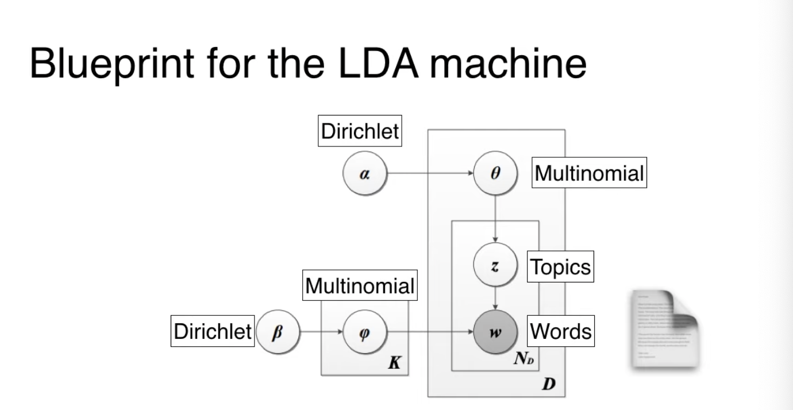
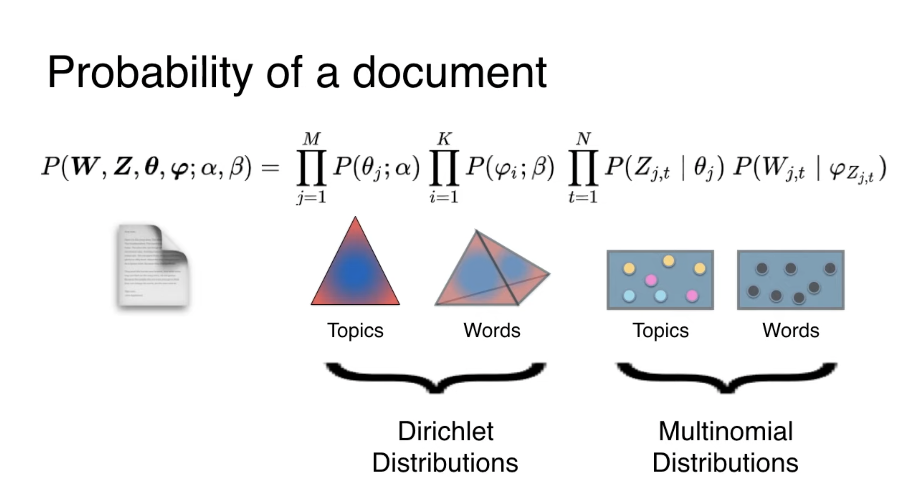

# Variational Inference

## Background

#### Bernoulli and Binomial distribution

- Suppose we have a binary variable, $x\in$ {0,1}, which we can think of as representing the outcome of a coin toss. It is common to model such a variable using the Bernoulli distribution, which has the form:

$$P(X = k) = \begin{cases} 
\mu & \text{if } x = 1 \\
 1 - \mu & \text{if } x = 0
\end{cases}$$

where $\mu=\mathbb{E}=p(x=1)$ is the mean. 

