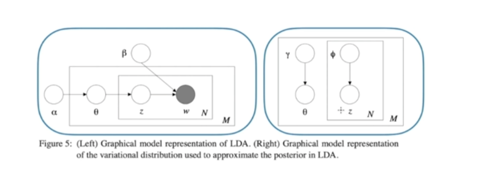

# Variance Inference

### Maximum Likelihood(ML) and Posterior Predictive
- ML
     - Estimate $\theta_{ML}$ from training data D and then use $y(x, \theta_{ML})$
- Bayesian
    - Estimate a posterior distribution over $\theta$ based on D and then use

$$\int y(x,\theta)p(\theta|\mathcal{D})d\theta$$

### Variational Bayes-Mean Field

- Variational Bayes(VB)
    - Technique for approximating a posterior

### KL-Divergence

KL divergence, short for Kullback-Leibler divergence, is a measure of how one probability distribution diverges from a second, expected probability distribution. It is used to quantify the difference between two probability distributions and is a fundamental concept in information theory.

For two discrete probability distributions P and Q over the same sample space, the KL divergence from Q to P is defined as:

$$D_{\text{KL}}(P || Q) = \sum_{i} P(i) \log\left(\frac{P(i)}{Q(i)}\right)$$

For continuous distributions, the sum is replaced by an integral.

For two discrete probability distributions P and Q over the same sample space, the KL divergence from Q to P is defined as:

$$D_{\text{KL}}(P || Q) = \sum_{i} P(i) \log\left(\frac{P(i)}{Q(i)}\right)$$

For continuous distributions, the sum is replaced by an integral.

Key points about KL divergence:

1. **Non-negativity:** $D_{\text{KL}}(P || Q) \geq 0$. It is always non-negative, and it is equal to zero if and only if P and Q are the same distribution.

2. **Not symmetric:** $D_{\text{KL}}(P || Q) \neq D_{\text{KL}}(Q || P)$ . In other words, the order of the arguments matters.

3. **Interpretation:** $D_{\text{KL}}(P || Q)$ can be interpreted as the extra amount of information, in average bits, needed to encode data from P using the optimal code for Q.

4. **Not a metric:** KL divergence is not a true metric because it does not satisfy the triangle inequality.

### Motivation

In modern machine learning, variational(Bayesian) inference, which we will refer to here as variational Bayes, is most often used to infer the conditional distribution over the latent variables given the observations(and parameters). This is also known as the posterior distribution over the latent variables. 
- Posterior Distribution: The posterior distribution is the conditional distribution of the latent variables given the observed data and any known parameters. In Bayesian statistics, this distribution represents our updated beliefs about the latent variables after incorporating the observed data.
- Inference: Inference refers to the process of estimating or making predictions about the latent variables based on the observed data. It involves updating our prior beliefs (expressed as a prior distribution over latent variables) with new evidence from the observed data to obtain the posterior distribution.
- Variational Bayesian inference is an approach that formulates the problem of estimating the posterior distribution as an optimization problem. It introduces a family of parameterized distributions (variational distributions) and seeks the member of this family that is closest to the true posterior distribution. The optimization process involves minimizing the difference (often measured using the Kullback-Leibler divergence) between the variational distribution and the true posterior.

The posterior can be written as,

$$p(z|x,\alpha)=\frac{p(z,x|\alpha)}{\int_{z}p(z,x|\alpha)}$$

**Posterior Distribution $p(z|x, \alpha)$ :**

- This is the distribution of the latent variables z given the observed data x and any additional parameters $\alpha$ .

- As we saw earlier, the posterior links the data and a model. It is used in all downstream analyses, such as for the predi

Why do we often need to use an approximate inference methods(such as variational Bayes) to compute the posterior distribution over nodes in our graphical model? It is because we cannot directly compute the posterior distribtion for many interesting models. (i.e. the posterior density is in an intractable form, often involving integrals) which cannot be easily analytically solved. 

- We cannot compute the posterior for may interesting models. 
- For example for the Bayesian mixture of Gaussian, we draw $z_i \sim Categorical(\pi)$ and $x_i \sim \mathcal{N}(\mu_{z_i}, \sigma^2)$

$$p(\mu_{1:K},z_{1:n}|x_{1:n})=\frac{\prod_{k}p(\mu_k)\prod_{i}p(\z_i)p(x_i|z_i, \mu_{1:K})}{\int_{\mu_{1:k}}\sum_{z_{1:N}}\prod_{k}p(\mu_k)\prod_{i}p(z_i)p(x_i|z_i,\mu_{1:K})}$$

