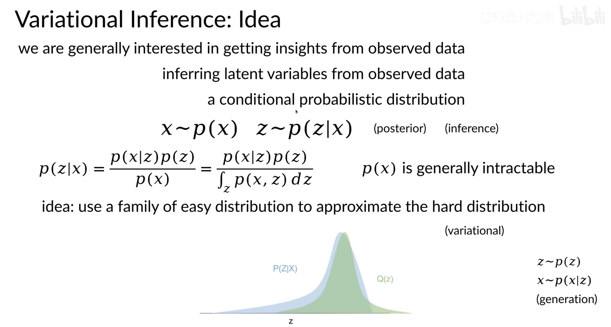

# Variance Inference

### Maximum Likelihood(ML) and Posterior Predictive
- ML
     - Estimate $\theta_{ML}$ from training data D and then use $y(x, \theta_{ML})$
- Bayesian
    - Estimate a posterior distribution over $\theta$ based on D and then use

$$\int y(x,\theta)p(\theta|\mathcal{D})d\theta$$

VI中使用ELBO和EM中使用下界函数解决的是两个完全不一样的问题

- EM算法中，存在“参数”，主要解决的问题是参数估计问题，且假设q(z) 可以直接计算得到。
- VI中，没有“参数”，主要解决的问题是隐变量推断问题，且假设q(z) 不可直接计算得到。

### Variational Bayes-Mean Field

- Variational Bayes(VB)
    - Technique for approximating a posterior

### Motivation

In modern machine learning, variational(Bayesian) inference, which we will refer to here as variational Bayes, is most often used to infer the conditional distribution over the latent variables given the observations(and parameters). This is also known as the posterior distribution over the latent variables. 
- Posterior Distribution: The posterior distribution is the conditional distribution of the latent variables given the observed data and any known parameters. In Bayesian statistics, this distribution represents our updated beliefs about the latent variables after incorporating the observed data.
- Inference: Inference refers to the process of estimating or making predictions about the latent variables based on the observed data. It involves updating our prior beliefs (expressed as a prior distribution over latent variables) with new evidence from the observed data to obtain the posterior distribution.
- Variational Bayesian inference is an approach that formulates the problem of estimating the posterior distribution as an optimization problem. It introduces a family of parameterized distributions (variational distributions) and seeks the member of this family that is closest to the true posterior distribution. The optimization process involves minimizing the difference (often measured using the Kullback-Leibler divergence) between the variational distribution and the true posterior.

The posterior can be written as,

$$p(z|x,\alpha)=\frac{p(z,x|\alpha)}{\int_{z}p(z,x|\alpha)}$$

**Posterior Distribution $p(z|x, \alpha)$ :**

- This is the distribution of the latent variables z given the observed data x and any additional parameters $\alpha$ .

- As we saw earlier, the posterior links the data and a model. It is used in all downstream analyses, such as for the predi

Why do we often need to use an approximate inference methods(such as variational Bayes) to compute the posterior distribution over nodes in our graphical model? It is because we cannot directly compute the posterior distribtion for many interesting models. (i.e. the posterior density is in an intractable form, often involving integrals) which cannot be easily analytically solved. 

- We cannot compute the posterior for may interesting models. 
- For example for the Bayesian mixture of Gaussian, we draw $z_i \sim Categorical(\pi)$ and $x_i \sim \mathcal{N}(\mu_{z_i}, \sigma^2)$

$$p(\mu_{1:K},z_{1:n}|x_{1:n})=\frac{\prod_{k}p(\mu_k)\prod_{i}p(z_i)p(x_i|z_i, \mu_{1:K})}{\int_{\mu_{1:k}}\sum_{z_{1:N}}\prod_{k}p(\mu_k)\prod_{i}p(z_i)p(x_i|z_i,\mu_{1:K})}$$

This expression is derived using Bayes' theorem. The derivation steps are as follows:

Firstly, according to Bayes' theorem:

$$ p(\mu_{1:K},z_{1:n}|x_{1:n}) \propto p(x_{1:n}|\mu_{1:K},z_{1:n}) \cdot p(\mu_{1:K},z_{1:n}) $$

Here, we consider all parameters $\mu_{1:K}$ and latent variables $z_{1:n}$. Using the law of total probability, we can expand the likelihood term $p(x_{1:n}|\mu_{1:K},z_{1:n})$:

$$ p(x_{1:n}|\mu_{1:K},z_{1:n}) = \prod_{i=1}^{n} p(x_i | \mu_{1:K},z_i) $$

Here, $p(x_i | \mu_{1:K},z_i)$ represents the probability density function of observing data point $x_i$ given parameters $\mu_{1:K}$ and latent variable $z_i$.

Now, substituting the above likelihood term and the prior term $p(\mu_{1:K},z_{1:n})$ into Bayes' theorem:

$$ p(\mu_{1:K},z_{1:n}|x_{1:n}) \propto \prod_{i=1}^{n} p(x_i | \mu_{1:K},z_i) \cdot p(\mu_{1:K},z_{1:n}) $$

Here, $p(\mu_{1:K},z_{1:n})$ is the prior probability. Next, we decompose the prior probability into the product of its components:

$$ p(\mu_{1:K},z_{1:n}|x_{1:n}) \propto \prod_{k=1}^{K} p(\mu_k) \cdot \prod_{i=1}^{n} p(z_i) \cdot \prod_{i=1}^{n} p(x_i | \mu_{1:K},z_i) $$

Substituting this expression into Bayes' theorem, we obtain the final expression for the posterior distribution:

$$ p(\mu_{1:K},z_{1:n}|x_{1:n}) = \frac{\prod_{k=1}^{K} p(\mu_k) \cdot \prod_{i=1}^{n} p(z_i) \cdot \prod_{i=1}^{n} p(x_i | \mu_{1:K},z_i)}{p(x_{1:n})} $$

Here, the denominator $p(x_{1:n})$ is a normalization constant ensuring that the posterior distribution sums to 1. This constant is often calculated by integrating or summing over the entire space of the numerator, making it challenging, especially when the dimensions of parameters and latent variables are large.

- The numerator（分子） is easy to compute for any configuration of the hidden variables. The problem is the denominator. 

- This situation arises in most interesting models. This is why approximate posterior inference is one of the central problems in Bayesian statistics.

### Main Idea

- 从被观测变量推测无法观测的隐变量的过程，被乘坐“推理”（Inference）

- x~p(x) 观测变量 evidence

- z~p(z|x) 后验 posterior

- p(x) 通常难以计算(联合概率分布的积分)

- 用一组相似的概率分布区近似它，近似的过程就叫做变分

- 对隐变量z进行采样后，使用似然度对被观测变量x进行采用，是一个生成（generalization）的过程

- 由于被观测变量p(x)是给定的，所以p(z|x)与p(x,y)成正比；经过一系列化简后，后验正比于一个均值为x-1的高斯分布

- The EM-algorithm is used for point estimate for the model parameters; now we want to find the posterior distribution for the unknown model parameters and hidden variables. 

- For a DGM with observations X, hidden variables Z and model parameters $\Theta$ , we want to pick an approximation q(Z, \Theta)$ to the distribution from some tractable family, and then try to make this approximation as close as possible to the true posterior. 

(2)

$$p(Z,\theta |X) \approx q(Z, \theta)$$

- This reduces inference to an optimization problem. We measure the closeness of the two distributions p and q with Kullback-Leibler Divergence.

由于p（z|x）通常非常复杂，难以直接求解，因此变分推断使用分布q(z)来近似p(z|x)，并通过限制q(z)的形式，得到一种局部最优、但句哟确定解的近似后验分布。其中q(z)即为变分分布（variational distribution), q(z)与p(z|x)之间的相似度通过KL散度来衡量。

如下图所示，我们希望在集合Q中找到 $q^{*}(z)$ 使得其与 p(z|x) 只见的KL散度尽可能小。

### Kullback-Leibler Divergence

- We measure the closeness of the two distributions with Kullback-Leibler(KL) divergence. 
- This comes form information theory, a field that has deep links to statistics and machine learning. 

- The KL-divergence for variational inference is 

$$KL(q||p)=E_q[\log\frac{q(Z)}{p(Z|x)}]$$

(3) 

$$\mathbb{KL}(q||p)=\sum_{Z,\Theta}q(Z,\Theta)\log\frac{q(Z,\Theta)}{p(Z,\Theta|X)}$$

Intuitively, there are three cases of importance:
-  If q is high and p is high, then we are happy (i.e. low KL divergence).
- If q is high and p is low then we pay a price (i.e. high KL divergence).
- If q is low then we dont care (i.e. also low KL divergence, regardless of p).

### Evidence Lower Bound

To do variational Bayes, we want to minimize the KL divergence between our approximation q and our posterior p. However, we cant actually minimize this quantity (we will show why later), but we can minimize a function that is equal to it up to a constant. This function is known as the evidence lower bound (ELBO).

To derive the Evidence Lower Bound, we introduce Jensens inequality(applied to random variables X) here:

$$f(\mathbb{E}[X])\ge \mathbb{E}[f(X)]$$

If we call the set of latent variables and parameters, $Psi$ , we can rewrite the equation as:

(4)

$$\sum_{\Psi}q(\Psi)\log\frac{q(\Psi)}{p(\Psi|X)} = - E_{\Psi}[\log_p(X,\Psi)] + E_{\Psi}[\log_q(\Psi)] + \log p(X)$$

We cannot actually minimize KL divergence in Equation 3 but since we have Equation 4, we maximize lower bound of log marginal likelihood, the Evidence Lower Bound(ELBO)

$$ELBO(q)= E_{\Psi}[\log_p(X,\Psi)] - E_{\Psi}[\log_q(\Psi)]$$

Note that we can use ELBO for convergence test at each iteration i.e. the difference of the ELBO of current value and the previous one should be smaller than some small epsilon. 

We often cannot compute posterior, and so we need to approximate them, using variational methods. In variational Bayes, we'd like to find an approximation within some family that minizes the KL divergence to the posterior, but we cannpt directly minimize this. Therefore, we defined the ELBO, which we can mximize, and this is equavalent to minimizing the KL divergence. 

The difference between the ELBO and the KL diveregnce is the log normalizer(i.e. the evidence), which is the quantity that the ELBO bounds. 

- KL散度永远不小于0
- log p(x)是evidence，是固定不变的
- 可以转换思路，最小化KL散度，等同于最大化ELBO
- ELBO证据下界（log p(x)大于等于ELBO，ELBO为其最小值）

### MEan Field Variational Inference

In mean field Variational Inference, we assume that the variational family factorizes,

$$q(Z_1, ..., Z_n)=\prod_{i}q(Z_i)$$

$$q(Z_1, ..., Z_n, \Theta_1, ..., \Theta_K)=\prod_{i}q(Z_i)\prod_{k}q(\Theta_k)$$

We refer to $q(z_j)$ , the variational approximation for a single latent variable, as a "local variational approximation". 

在基于平均场假设得到以下式子后，可以很轻易的得到所谓的Coordinate Ascent Variation Inference（CAVI）算法，其算法的框架如下所示：

$$q^{*}(z_j)\propto exp[E_{\neg j}\log(p(x,z))]$$

在每次更新完一次 $q(z_j)$ 后，函数 $E_{\neg j}\log(p(x,z))$ 都会发生变化，从而使每次优化时，能在原先的角度上更变大一点，使得ELBO不断地被提高，直到收敛。

