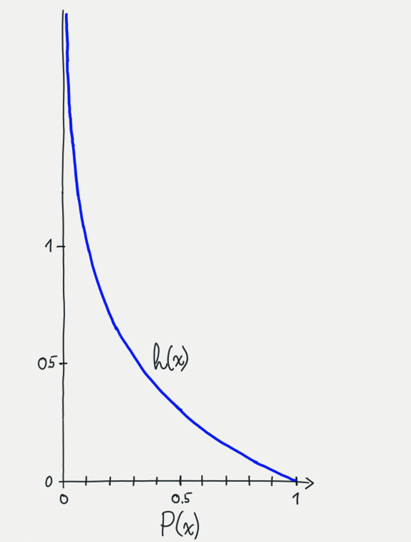

# Machine Learning & Information Theory

### What is Information Theory？
- Information theory is a scientific field that studies the encoding, compression, transmission of digital information.

##### What is information?
- Intuitively, we could describe information as “new knowledge”, an observation of something that we didn’t already know. Moreover, something we already know does not provide any new information.
>  For example, if I tell you that the coin landed either heads or tails, you would probably think that I was wasting your time, since that is something that you probably took for granted. Conversely, a rare event can provide a lot of information: if the coin landed on its edge instead, that would certainly be news to you. 
> Similarly, we usually have a vague expectation of what type of e-mails that may have landed in our mailbox since the last time we checked it. A booking confirmation is a much more boring e-mail than the last-minute announcement of a surprise lecture in this course by a world-class machine-learning researcher.

##### How suprised am I that outcome x happen?
- The **information content** of an outcome $x$ measures this amount of surprise. Formally, it is defined as a function of the probability, as follows:
$$h(x)=log\frac{1}{P(x)}=-logP(x)$$
- The quantity is also known as the **Shannon information**(after its inventor) or the **surprisal**. 

- The mathematical expression above has the following three desirable properties:
    - Property 1: The information content has a monotonic relationship with probability.
    > In particular, less probable things should have more information content, since they are more surprising when they happen.
    - Property 2: A guaranteed event has zero information content.
    > This is also intuitive. As discussed above, we are not surprised at all when an event that has a 100% probability to happen actually happens.
    - Property 3: The information content of a joint outcome $(x,y)$ of two independent random variables $\pmb x, \pmb y$ is the sum of the information content of the two individual outcomes. 
    > This property means that if two events are completely independent from each other, then we don’t gain or lose any extra information by observing them at the same time.
- **There are many functions that satisfy at least one of the above conditions. However, it turns out that the negative logarithm is the only function that satisfies all three of them, making it the perfect choice as a function to represent information content.**

###### Prove property 3 of the Shannon information content:
$$h(x,y) = -logP(x,y)=-log(P(x)\cdot P(y))=-logP(x)-logP(y)=h(x)+h(y)$$

### Entropy
- In practice, we are often more interested in entire distributions rather than single outcomes.For example, it is useful to ask how informative the e-mails in our inbox tend to be, on average. 
- The information entropy (also called the Shannon entropy) is a natural generalisation of the information content to a discrete random variable $\mathrm{\pmb x}$. It is defined as the expected information content across all possible outcomes:
$$H(x) = \mathbb{E}_{x\sim \mathcal{P}_x}[h(x)] = $$

$$= - \sum_{x\in\Omega}P_x(x)\log P_x(x)$$

- In other words, the entropy measures the average surprise in the outcomes of a random variable.
- Note that we often interchangeably talk about the entropy of a probability mass function, $H(P_{\mathrm{\pmb x}})$. This is just the entropy of a random variable distributed according to that probability mass function.
- Probability Mass Function: A probability mass function (pmf) is a function over the sample space of a discrete random variable X which gives the probability that X is equal to a certain value. f(x)=P[X=x]. (概率质量函数（probability mass function，简写为pmf）是离散随机变量在各特定取值上的概率。)

> **The units of entropy:** Depending on the base of the logarithm in the formula, the common units of the entropy are bits (for the base-2 logarithm), nats (for the natural logarithm) and dits (for the base-10 logarithm). In this lesson, we will mostly use bits, since it arguably is the most familiar unit for those who have experience with digital computers. It doesn’t matter so much for the theory, since the principles are the same no matter what units we use.

##### Exercise: 
Prove that $\mathrm{H}(\mathrm{\pmb x}, \mathrm{\pmb y}) = \mathrm{H}(\mathrm{\pmb x}) + \mathrm{H}(\mathrm{\pmb y})$ if $\mathrm{\pmb x}$ and $\mathrm{\pmb y }$ are independent random variables.

    To prove that $H(x, y) = H(x) + H(y)$, we'll use the definition of joint entropy and the properties of entropy.

    The joint entropy $H(x, y)$ is defined as:

$$H(x, y) = -\sum_{x \in \Omega}\sum_{y \in \Omega}P_{xy}(x, y) \log P_{xy}(x, y)$$

        And the individual entropies $H(x)$ and $H(y)$ are defined as:

$$H(x) = -\sum_{x \in \Omega}P_x(x) \log P_x(x)$$
$$H(y) = -\sum_{y \in \Omega}P_y(y) \log P_y(y)$$

    Now, let's work on showing that $H(x, y) = H(x) + H(y)$:

$$
H(x, y) = -\sum_{x \in \Omega}\sum_{y \in \Omega}P_{xy}(x, y) \log P_{xy}(x, y)
$$

    Now, use the definition of conditional entropy:

$$
H(x, y) = -\sum_{x \in \Omega}\sum_{y \in \Omega}P_{xy}(x, y) \log P(x | y)P(y)
$$

    Since the events are independent, $P(x | y) = P(x)$, and the expression becomes:

$$
H(x, y) = -\sum_{x \in \Omega}\sum_{y \in \Omega}P(x)P(y) \log P(x)P(y)
$$

    Now, you can factor out the $P(x)$ and $P(y)$ terms from the summation:

$$
H(x, y) = -\sum_{x \in \Omega}\sum_{y \in \Omega}P(x)P(y) \left(\log P(x) + \log P(y)\right)
$$

    Next, distribute the terms inside the summation:

$$
H(x, y) = -\sum_{x \in \Omega}\sum_{y \in \Omega}P(x)P(y)\log P(x) - \sum_{x \in \Omega}\sum_{y \in \Omega}P(x)P(y)\log P(y)
$$

    Now, use the linearity property of the summation:

$$
H(x, y) = -\sum_{x \in \Omega}P(x)\log P(x) \sum_{y \in \Omega}P(y) - \sum_{y \in \Omega}P(y)\log P(y) \sum_{x \in \Omega}P(x)
$$

    The inner summations are just the probabilities of $x$ and $y$, which sum to 1:

$$
H(x, y) = -1 \cdot \sum_{x \in \Omega}P(x)\log P(x) - 1 \cdot \sum_{y \in \Omega}P(y)\log P(y)
$$

    Therefore:

$$
H(x, y) = -H(x) - H(y)
$$

    So, $H(x, y) = H(x) + H(y)$, which proves the desired result.