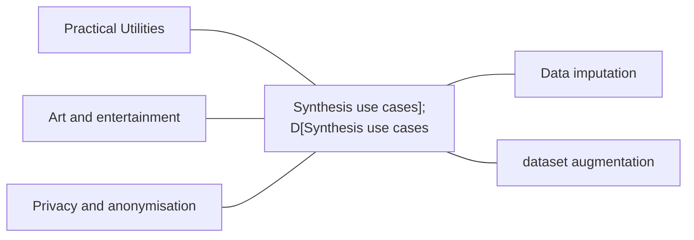

# Machine Learning and Data Generation

### Outline
- What are synthesis problems?
- What does it mean to so;ve synthesis problem?
- How can we solve synthesis problems with ML?

### Part 1: What are synthesis problems?
- Synthesis tasks, generative tasks, or genenrative problems, are problems where the required ouput is defined on the feature space $\Omega$, the same space as the observations $x_i$.
- Solving these problems requires synthesis, a.k.a. data generation. 

