# Machine Learning and Data Generation

### Outline
- What are synthesis problems?
- What does it mean to solve synthesis problem?
- How can we solve synthesis problems with ML?

### Part 1: What are synthesis problems?
- Synthesis tasks, generative tasks, or genenrative problems, are problems where the required ouput is defined on the feature space $\Omega$, the same space as the observations $x_i$.
- Solving these problems requires synthesis, a.k.a. data generation. 

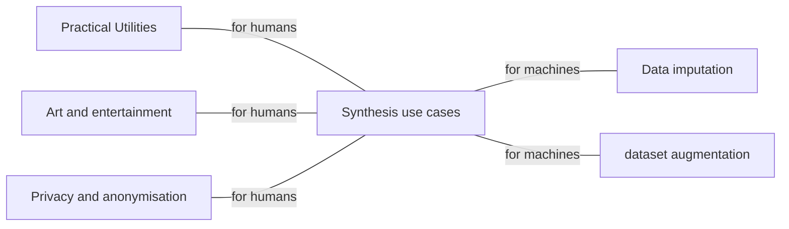

#### Applications
- Practical utilities
    - prosthetic voices for the physical impaired
    - Text and speech synthesis for conversational AI
    - github copilot (AI assisted source code synthesis)
    - drug discovery
    - images synthesised by a deep neutral network(disco diffusion) based on a user provided text prompt
    - AI Dungeon
    - Privacy - Image anonymisation
    - Dataset augmentation - Synthesised images for training automomous driving systems
    - Data imputation: generate reasonable values while filling a form

#### Generative tasks are not generative models
- Generative tasks: can be solved without using generative(probablistic) models, sometimes even without ML
    - Example: recorded voiceover in games
- Generative model: can be used for other problems beyond data generation 
    - [models of the joint pdf $p_{x,y}(x,y)$]
    - Example: classification using Bayes' law

### Categories of synthesis problems
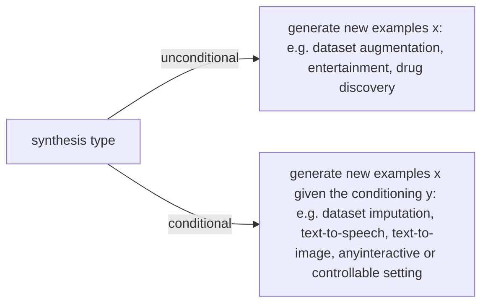
- conditional models are more general: they reduce to unconditional synthesis when y is empty
- Unconditional synthesis has fewer applications, because we lack control!
    - for example, an unconditional speech synthesiser just produces babble(含糊不清)

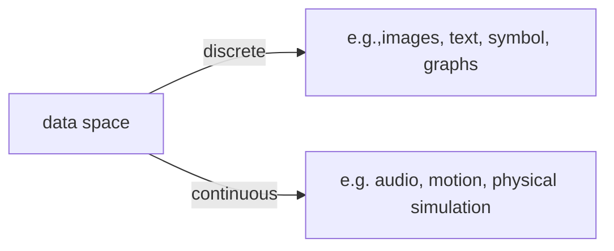

- Continous dataset can be **quantised**(or **binned**, if you imagine a histogram);
    - This happens naturally when we store a photo digitally
- Discrete data can be **dequantised** or **embedded** in continuous spaces
    - This happens naturally when we play music from a computer

- Nevertheless, it may be better to choose a model that is tailored to the domain!

- The data space may be composed of multiple modalities(i.e. communciation channels) - then the problems is called **mutimodal synthesis**
    - Example: video generation(audio and image frames, possibly text captions), social robots(text, speech,motion), or tabular dataset(they can contain any combination of modalities)

- For practical applications, the data is usually very high-dimensional, because it extends in space(e.g.,images), time(e.g. audio), or both(e.g.,video). A 100*100 pixel RGB image is at least 30000-dimensional.

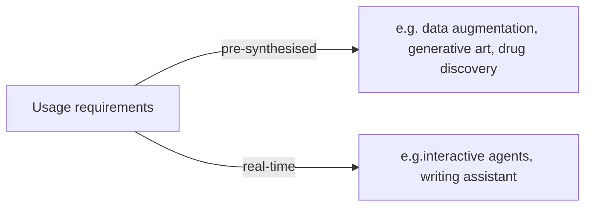

- Also called offline and online synthesis, respectively
- Offline sythesis can leverage big models running on multiple GPUs in parallel(e.g. in a data-centre)
- Online synthesis requires low latency and sequential processing(to react to the input), and it may have to be run on CPUs in monbile devices. 

### Part 2: What does it mean to solve a synthesis problem?
Outline
- synthesis evaluation
- synthesis evaluation
    - objective measures
    - subjective measures

##### Analysis and Synthesis - two sides of the same coin

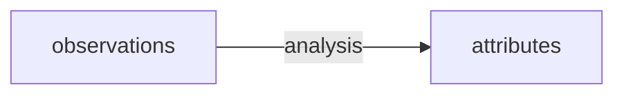

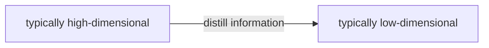
- typically high-dimensional:e.g. pipe.jpg
- typically low-dimensional: e.g,"A painting of a pipe."

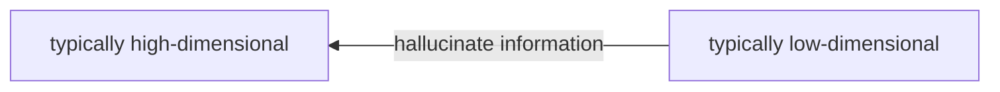
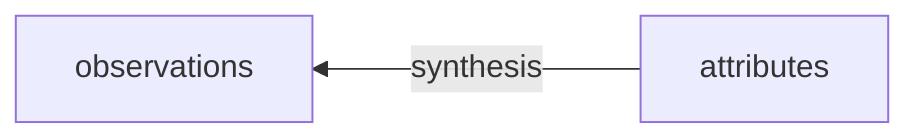

#### Analysis and synthesis can be used together
Analysis: find the one correct anser for diverse inputs(many to one)
Synthesis: generate any realistic sample given the fixed condition(one to many)

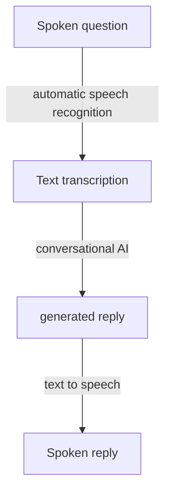

#### But synthesis is more difficult to evaluate

- Analysis: find the one correct anser for the diverse inputs(many-to-one)
    - Goal: Generate predictions that are correct, i.e. march the ground truth
- Synthesis: generate synthetic examples that are convincing, i.e. similar to the dataset
    - Goal: Generate synthesis examples that are convincing, i.e. similar to the dataset.

- Evaluation: Estimate the difference between ground truth and predictions, or real datapoints and synthetic examples.
    - Analysis: Aim for exact match in low dimensions
    - Synthesis: Aim for similarity in high dimensions
- Measuring similarity is difficult, especially in high dimensions

#### Similarity is only the tip of the iceberg
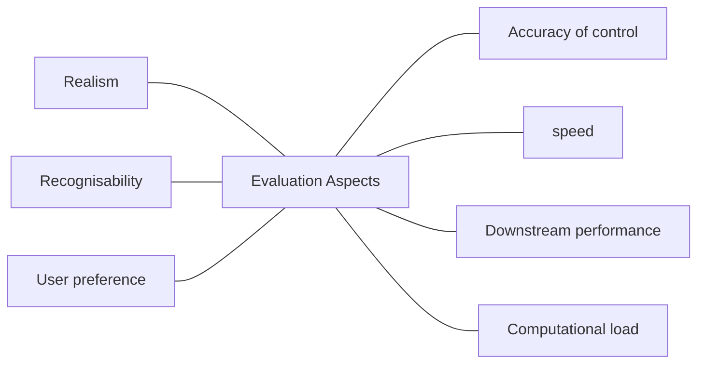
- Realism: human-likeness
- Recognisability: e.g. voice assistant
- User preference: e.g, collaborative synthesis(HCI)
- Accuracy of control: appropriateness for the context
- Speed: latency in real-time interactions
- Downstream performance: e.g. dataset augmentaion
- Computational load: can the model run on my phone?

#### Objective evaluation
- A mathematical approximation
- Quick and cheap
- but often unreliable or even misleading
- Mainly used during development
- examples:
    - MSE
    - Likelihood
    - FID

#### Subjective evaluation
- Asking people to do the work 
- Time-consuming and expensive
- The "gold standard" of evaluation

##### Objective evaluation via MSE
- Mean squared error in data space between real and synthetic is a common -  but bad!-performance measure
- It promotes excessive averaging
    - Example: The MSE-optimal unconditional image model is just a blur
- It penalise diversity
    - It is optimal to always predict the conditional mean every time
    - The true distribution is not MSE optimal!
- Small squared distance in data space does not imply perceptual similarity
    - Example: Nearest neighbours in image databases.

##### Objective evaluation via log-likelihood
- Widely used for benchmarking explicit deep generative methods
    - Example: Bits per dimension(or per pixel)
- Advantages: 
    - Consistent
    - The same idea works for any data space across in invertible transformation. 
- Limitations:
    - Requires the ability to compute probabilites, or ar least a lower bound(ELBO)
        - Dows not work for co-called implicit models(GANs)
    - Has quesionable priorties
        - Bettwe image dequantisation can increase log-likelihood a lot, despite its effects being invisible by definition

- High likelihood is not necessarily better
    - Takeaway: do not rely on objective metrics alone, if you can avoid it

### Objective evaluation via FID
- Fréchet inception distance(FID)
    - Improvements in FID usually correlate well with improvements in perceived quality
        - very common image benchmark
    - Perhapes the best objective metric we have right now
- First introduced for images, but the idea has been ported to other domains
    - Example: Fréchet audio distance
- Usually not used during model development, only for model assessment
    - Too computational expensive

#### How FID works
1. Start form two sets of obervations, real { $x_i$ } and fake { $\hat{x_i}$ }
    - This requires drawing something like 3k-50k samples from your model
2. Map fake and real observations to a learned perceptual space z=f(x) "inception" comes the name of a neutral network used to define $f(\cdot)$
3. fit a (diagnonal covariance) Gaussian to each { $z_i$ } and { $\hat{z_i}$ }
4. Compute a divergence measure between the two Gaussian
    - Use the Wasserstein divergence, which is sensitive to distance and has an analytical soluttion(known as the Fréchet distance)
    - Since the divergence is nonzero unless two distributions are identical, FID is sensitive both to overall appearance and to insufficient or excessive variation

#### "It's easier to notice a presence than an absence"
- Canned speech can be convincing the first time
    - It's only the second time we hear it that we can notice the complete absence of variation
- Something with an obvious artefact can instantly be disregarded artificial and fake

##### This was a simple example of subjective evaluation
- Designing a good user study requires expertise:
    - What question to ask
    - Isolated, paired, or parallel sample resentations
    - Binary preference, rankings, ratings, Likert-scale responses
    - Physiological measures
        - Pupillometry
        - Heart rate
        - Skin conductance
    - Behavioural measures
        - reaction time
        - completion time

### Subjective Evaluation
- Upsides:
    - The gold standard in studying and quantifying what humans think and like
        - Is seen as necessary in some fields(e.g. speech), but not in others(e.g. images)
    - Can measure many different aspectsm to answer many different questions
- Downsides
    - Slow and expensive
        - You have to pay human beings to do tasks for you 
    - require careful design and careful statistical analysis to get reliable results
- Can be crowdsourced online, or performed in the lab
    - "Attention checks" needed to be prevent participants from cheating

### Part 3: How can we solve synthesis problems

- Outline:
    - Deterministic methods
    - Probabilistic methods
        - Deep generative models
            - GANs
        - Generating output

##### Deterministic methods
- You don't  always need machind learning for synthesis
    - Just like you don't always need mahcine learning for all engineering problems
- Playback-based or corpus-based methods
- Example: Pre-recorded voiceover in a video game(canned speech)
    - Has data, but does not learn/generalize from the data in any obvious way
    - Hand-written rules decide when to play back different recordings and how to combine them
    - Highly realistic(since every example is real) but very limited capabilities
        - Anything you want to be able to say/do has to be covered by your database
    - You can build entire synthesis system based on cutting and pasting

- **Regression** is the simplest machine-learning approach to synthesising continuous-valued x from y
    - Only for conditional synthesis
- Main idea: The output x is a function x=f(y) of the condtioning y
    - No randomness(it is deterministic)
        - f(y) is often a neutral network
- The loss function is oftwn mean squared error(a.k.a. L2 loss)（a.k.a. = also known as）
    - This is minimised by the conditional mean f(y)= E[x|y]
        - See the module 6 summary lecture
- Practical consequencesL we get "averaging" artefacts
    - Question: What is the average value of a throw a die?

##### WHen to use regression and not
- Manifold hypothesis: The data sits on a low dimensional manifold
    - Known the context y helps narrow down the range of possible outputs
    - The conditional mean is the center of mass of the data distribution
- The greater the range of outcomes we average over the more noticeably unnatural the result tends to be 
    - Regression methods likely work well when x|y has a narrow, concentrated distribution
    - If x|y exhibits a lot of variety, regression methods are likely show noticeable artefacts - we need something that can describe a range of different outcomes

    ### Probablistic methods
    - Main idea: Use the methods from module 6 to fit a parametric model to the observations and learn their distribution 
        - models can be unconditional, conditional x|y, or joint (x,y)
        - Theoretical advantage: if real observation contain randomness, only a model with randomness can be indistinguishable from reality
            - Example: canned speech can be revealed as fake since it is the same every time
    - In so-called deep generative models, the probabilistic model is defined by the parameters of a neutral network
        - It is straightforward to model the influence of y on x in conditional synthesis
        - A staggering amount of different network architectures are possible
        - MLE(i.e, the negative log-likelihood loss) is the most common, but not universal

#### A hierarchy of deep generative models
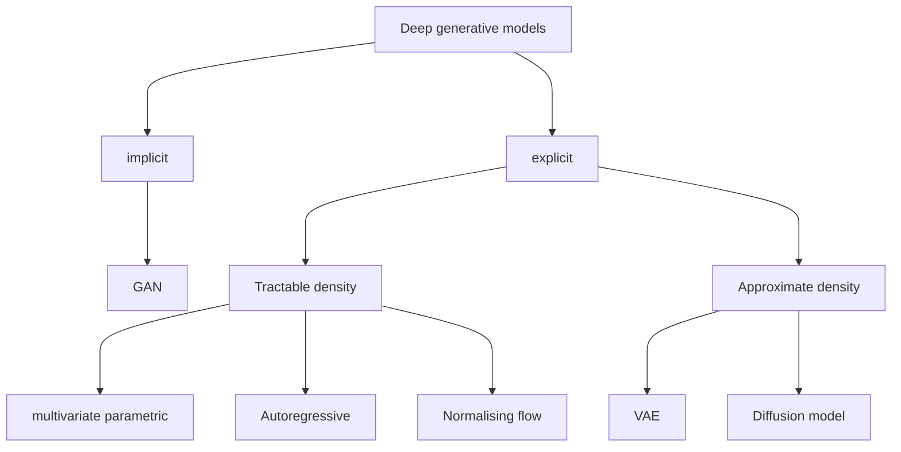

##### Simple parametric models
- Example: "The vector x is distibuted according to a multivariate Gaussian"
    - Implicitly, this says that, e.g."The image distribution is the average image plus Gaussian noise"
- This is too simple
    - Example: For images, we get the blurry pictures from before(but now with added noises)

##### Autoregressive models
- "Given previous elements of x, the next element is distributed accoding to, e.g. a Gaussian".
    - Example: Pixels in an image
    - Use a neutral network to parameterise the dependence on previous pixels
- more powerfulm but we have to generate one element at a time

##### Flows and VAEs
- Normalising flows
    - "The distribution is an invertible nonlinear transformation of a Gaussian."
    - This gives a much more powerful parametric family of distributions
- Variational autonencoders(VAEs)
    - Leverage the manifold hypothesis 
    - "the distribution is a nonlinear transformation of a low dimensional Gaussian, plus Gaussian noise".
- Other methods:
    - Energy-based and diffusion-based models

##### Generative adversarial networks
- Main idea: Simulate a Turing test using machines
- A generator G:
    - "A counterfeiter of fake examples"
    - This will be our synthesiser
- A discriminator D
    - "A policeman trying to spot fakes"
    - Its role is only to help train G
- Both G and D can be conditioned on a input y
    - conditional GAN(CGAN)

##### The idea behind GAN training
- D is trained to distinguish real from synthetic examples
    - Classifier mapping form x to binary label(1:real, 0: fake)
- G is trained to produce a distribution x that fools D
    - Change G to reduce D's performance
    - Needs backpropogation through D
    - Result: Training moves the density towards outcomes D classifies as real
- "Adversarial": because G and D have opposing goals

##### Mathematical Formulation
- Two interacting agents --> the situation can be analysed using game theory
- Let V be the log-likelihood for training D on an even mixture of real an fake examples
    - D wants V to be high
    - G wants V to be low
    - V is called the value function of the game
- This is called a minimax problem

$$\hat{G}=\arg\min_{G}\max_{D}V(D,G)$$

$$V(D,G)=\frac{1}{2}\mathbb{E}_{x\sim P(x)}[ln D(X)]$$

$$+\frac{1}{2}\mathbb{E}_{x\sim G}[ln (1-D(X))]$$

##### Nash equilibria
- Games have Nash equilibria rather than conventional extreme points
    - Points where neither D nor G can improve their respective objectives by changing what they do (i.e., saddle point)
    - Example: it is easy to see that "the generator is perfect" is a Nash equilibrium
- In the case of misspecification, the original GAN game has a Nash equilibrium when G minimises the Jensen-Shannon divergence

$$D_{JS}(P,Q):=\frac{1}{2}D_{KL}(P||\frac{P+Q}{2})+\frac{1}{2}D_{KL}(Q||\frac{P+Q}{2})$$
    - This is less prone to mass-covering than MLE
    - Other GAN formulations can minimise other divergences.

##### Practical aspects of GANs
- Adcantages:
    - Training only requires sampling, not computing probabilities
        - Can be achieved by passing Gaussian noise z through neutral network G(z), which is known as an implicit model
    - GANs are state-of-the-art on most problems
- Training is tricky
    - Gradients can saturate(become close to zero) when fakes are easy to spot
        - Especially in the original GAN formulation
        - Use non-saturating GANs instead; see formula on right
    - Progress need to be monotonic

$$V_D(\phi,\theta)= \frac{1}{2}\mathbb{E}_{x\sim\mathcal{X}}[ln D(x;\phi)]$$