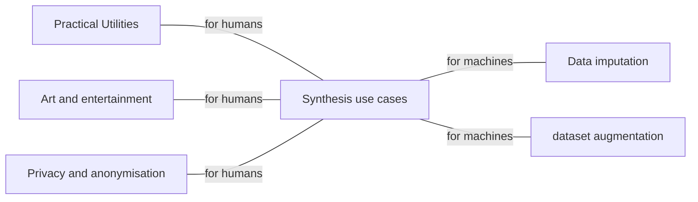
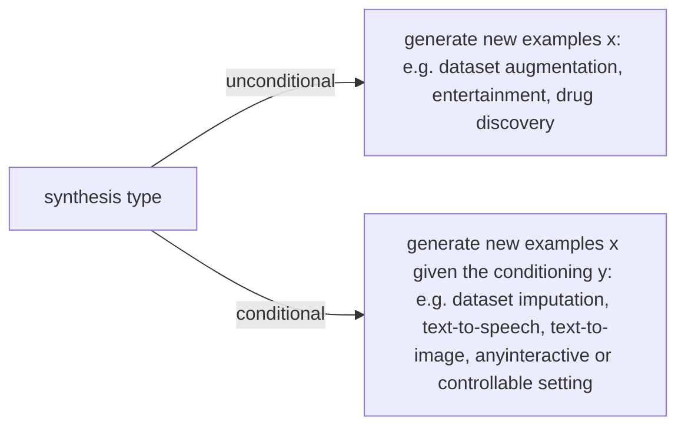
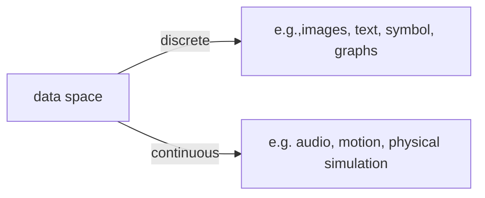
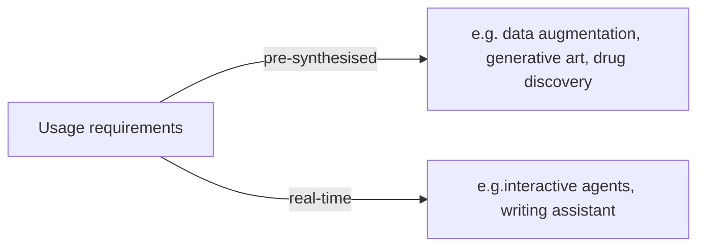
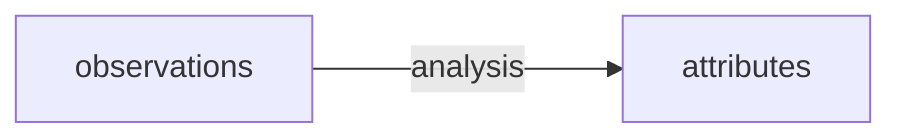
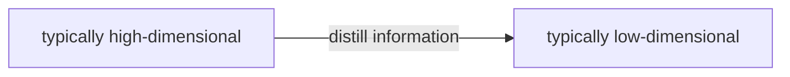
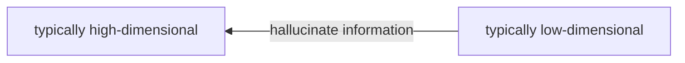
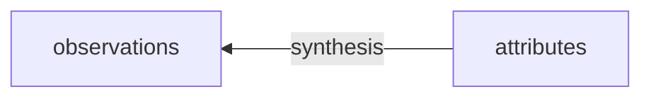
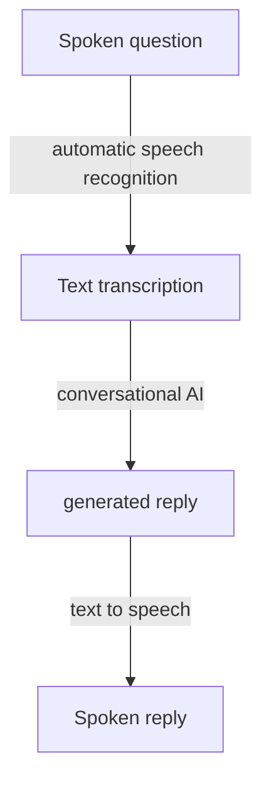

# Machine Learning and Data Generation

### Outline
- What are synthesis problems?
- What does it mean to so;ve synthesis problem?
- How can we solve synthesis problems with ML?

### Part 1: What are synthesis problems?
- Synthesis tasks, generative tasks, or genenrative problems, are problems where the required ouput is defined on the feature space $\Omega$, the same space as the observations $x_i$.
- Solving these problems requires synthesis, a.k.a. data generation. 

#### Applications
- Practical utilities
    - prosthetic voices for the physical impaired
    - Text and speech synthesis for conversational AI
    - github copilot (AI assisted source code synthesis)
    - drug discovery
    - images synthesised by a deep neutral network(disco diffusion) based on a user provided text prompt
    - AI Dungeon
    - Privacy - Image anonymisation
    - Dataset augmentation - Synthesised images for training automomous driving systems
    - Data imputation: generate reasonable values while filling a form

#### Generative tasks are not generative models
- Generative tasks: can be solved without using generative(probablistic) models, sometimes even without ML
    - Example: recorded voiceover in games
- Generative model: can be used for other problems beyond data generation 
    - [models of the joint pdf $p_{x,y}(x,y)$]
    - Example: classification using Bayes' law

### Categories of synthesis problems

- conditional models are more general: they reduce to unconditional synthesis when y is empty
- Unconditional synthesis has fewer applications, because we lack control!
    - for example, an unconditional speech synthesiser just produces babble(含糊不清)

- Continous dataset can be **quantised**(or **binned**, if you imagine a histogram);
    - This happens naturally when we store a photo digitally
- Discrete data can be **dequantised** or **embedded** in continuous spaces
    - This happens naturally when we play music from a computer

- Nevertheless, it may be better to choose a model that is tailored to the domain!

- The data space may be composed of multiple modalities(i.e. communciation channels) - then the problems is called **mutimodal synthesis**
    - Example: video generation(audio and image frames, possibly text captions), social robots(text, speech,motion), or tabular dataset(they can contain any combination of modalities)

- For practical applications, the data is usually very high-dimensional, because it extends in space(e.g.,images), time(e.g. audio), or both(e.g.,video). A 100*100 pixel RGB image is at least 30000-dimensional.

- Also called offline and online synthesis, respectively
- Offline sythesis can leverage big models running on multiple GPUs in parallel(e.g. in a data-centre)
- Online synthesis requires low latency and sequential processing(to react to the input), and it may have to be run on CPUs in monbile devices. 

### Part 2: What does it mean to solve a synthesis problem?
Outline
- synthesis evaluation
- synthesis evaluation
    - objective measures
    - subjective measures

##### Analysis and Synthesis - two sides of the same coin

- typically high-dimensional:e.g. pipe.jpg
- typically low-dimensional: e.g,"A painting of a pipe."

#### ANalysis and synthesis can be used together
Analysis: find the one correct anser for diverse inputs(many to one)
Synthesis: generate any realistic sample given the fixed condition(one to many)

