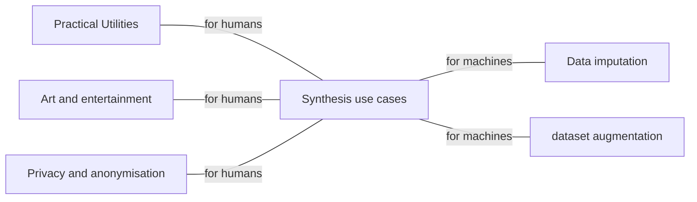
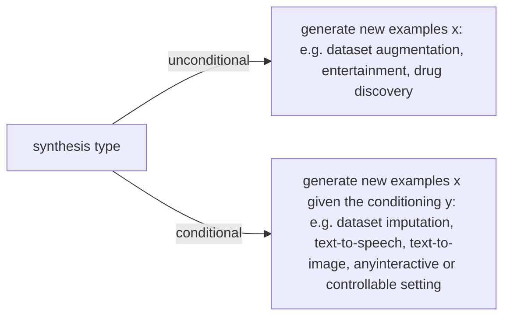

# Machine Learning and Data Generation

### Outline
- What are synthesis problems?
- What does it mean to so;ve synthesis problem?
- How can we solve synthesis problems with ML?

### Part 1: What are synthesis problems?
- Synthesis tasks, generative tasks, or genenrative problems, are problems where the required ouput is defined on the feature space $\Omega$, the same space as the observations $x_i$.
- Solving these problems requires synthesis, a.k.a. data generation. 

#### Applications
- Practical utilities
    - prosthetic voices for the physical impaired
    - Text and speech synthesis for conversational AI
    - github copilot (AI assisted source code synthesis)
    - drug discovery
    - images synthesised by a deep neutral network(disco diffusion) based on a user provided text prompt
    - AI Dungeon
    - Privacy - Image anonymisation
    - Dataset augmentation - Synthesised images for training automomous driving systems
    - Data imputation: generate reasonable values while filling a form

#### Generative tasks are not generative models
- Generative tasks: can be solved without using generative(probablistic) models, sometimes even without ML
    - Example: recorded voiceover in games
- Generative model: can be used for other problems beyond data generation 
    - [models of the joint pdf $p_{x,y}(x,y)$]
    - Example: classification using Bayes' law

### Categories of synthesis problems
