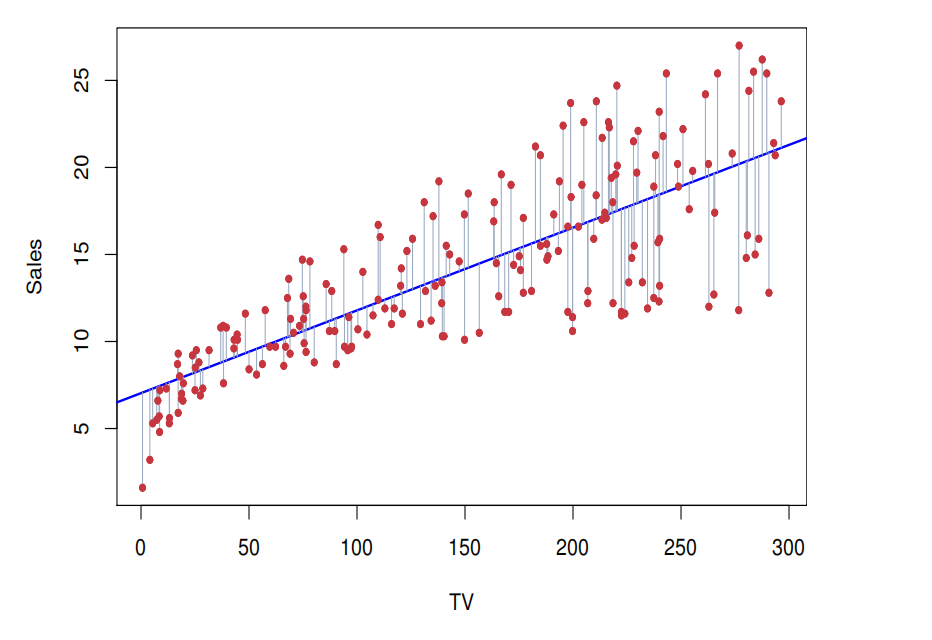
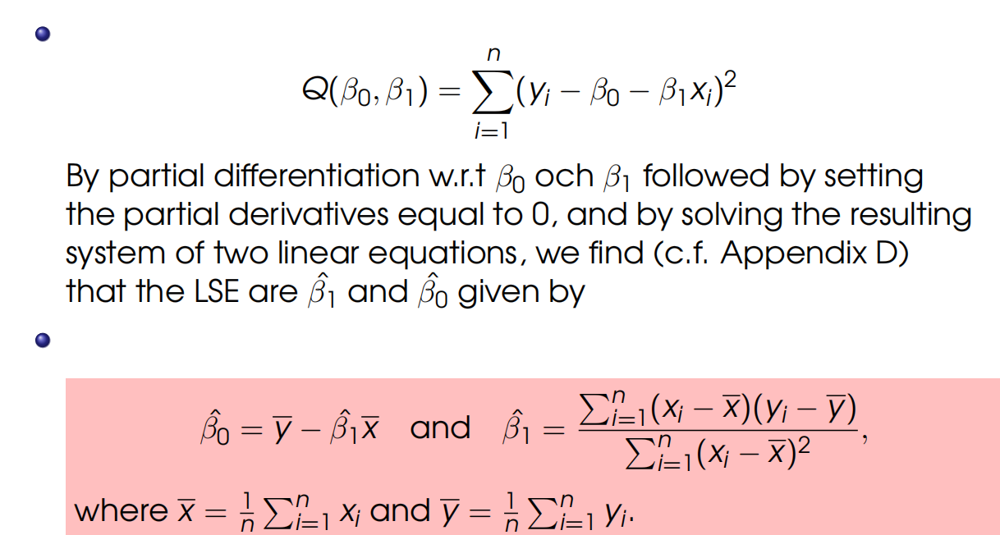
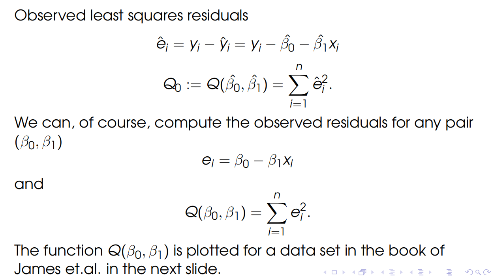
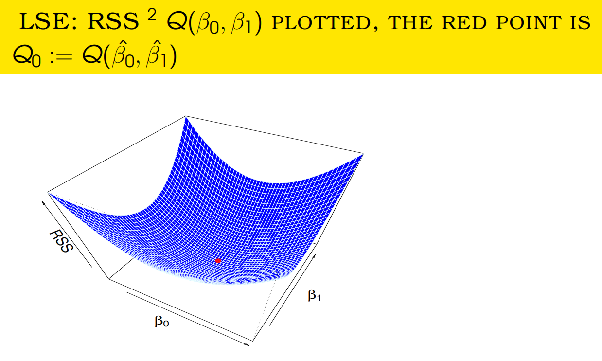
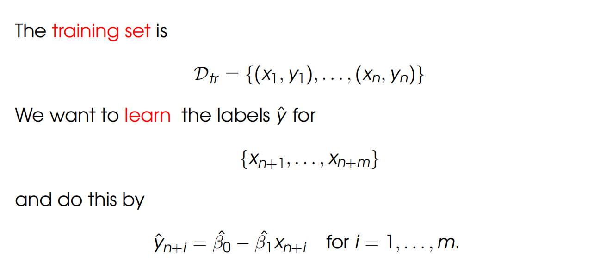
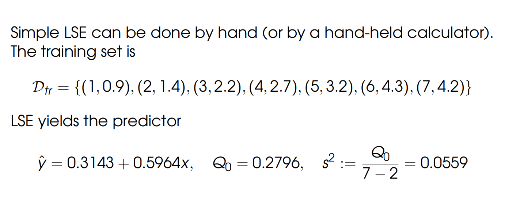
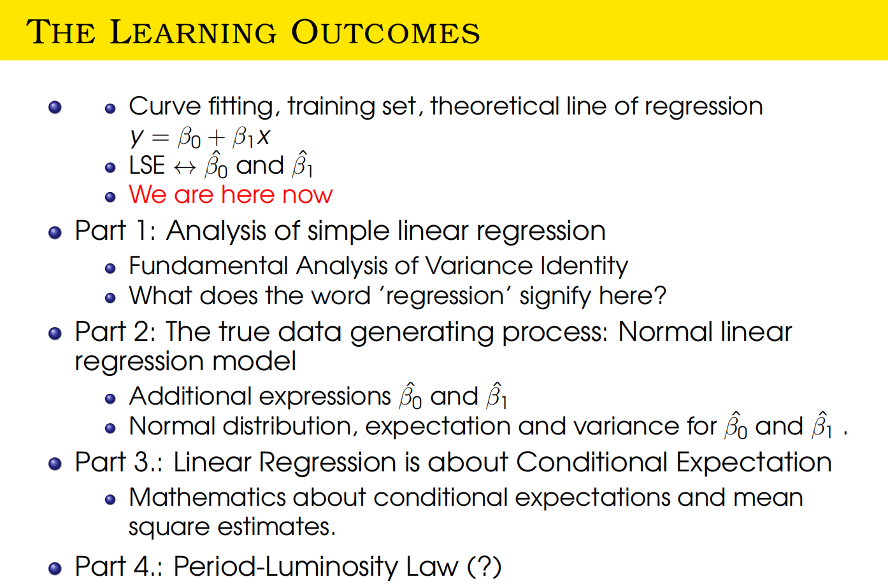
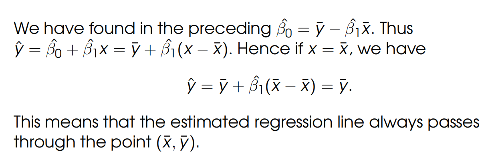

# Introduction

- Regression analysis is regarded as one of the oldest and most time-tested topics in mathematical statistics. The earliest form of the linear regression was the least squares method(最小二乘法).

- Nowadays, linear regression plays an important role, e.g., in machine learning. The linear regression algorithm is one of the fundamental supervised machine-learning algorithms due to its relative simplicity and completeness of theory.

- Multiple Linear Regression can be used as an activation function in a layer of (Deep) Artificial Neural Networks.

### Simple Linear Regression
- The theory and practice of regression deals with the following situation. There are n pairs of values(real numbers)

$$D_{tr}=[(x_1,y_1), ..., (x_n, y_n)]$$

$y_i$ : values of a dependent variable y a.k.a called the "outcome" or "reponse" variable, or a 'label' in machine learning jargon（行话）

$x_i$ : values of an independent variable x a.k.a 'predictor' 'covariate', 'explanatory variable' or feature. 

$$y = \beta_0 + \beta_1 x$$

is called the theoretic line of regression. This line is not likely to hold exactly in D_{tr}. The idea is to fit a line of this kiind to the data in $D_{tr}$ in an approximate sense.

- We fit a line like the theoretic line of regression by estimating the parameters $\beta_0$ and $beta_1$ by the method of least squares. 

- I.e., we minimize the sum of the squared **vertical distances** (the distance between two vertical positions.) between the theoretic line and values of the response y, i.e., we minimize

$$Q(\beta_0, \beta_1)=\sum_{i=1}^{n}(y_i -\beta_0 - \beta_1 x_i)^2$$

##### Vertical Distances

$\beta_0$ in is called the intercept, $\beta_1$ is the slope. The values $\hat{\beta_0}$ and $\hat{\beta_1}$ attaining the minimum are known as the Least Squares-Estimates(LSE) of $\beta_0$ and $\beta_1$ ,  respectively.

The straight line

$$\hat{y} = \hat{\beta_0} + \hat{\beta_1} x$$

is called the **estimated line of regression** or the predictor. The vertical distances $e_i$ from $y_i$ to the estimated line of regression at $x_i$

$\hat{e_i} = y_i - \hat{y_i} =  y_i - \hat{\beta_0} - \hat{\beta_1} x_i$ 

are called observed least squares residuals. $Q_0$ is defined as

$$Q_0:=Q(\hat{\beta_0}, \hat{\beta_1}) = \sum_{i=1}^{n}\hat{e_i}^2$$

and is called the residual sum of squares (RSS).

### Supervised Learning

- In the parlance of machine learning, we have now used the training set $D_{tr}=[(x_1,y_1), ..., (x_n, y_n)]$ to learn the LSE model. 

- THe next step of learning is to use a test set, i.e., data pairs from the same source not used in LSE

$$D_{tr}=[(x_{n+1},y_{n+1}), ..., (x_{n+m}, y_{n+m})]$$

- Compute using the test residual using the learned model predictor $e_i^{t}:=y_{n+i} - \hat{\beta_0} - \hat{\beta_1} x_{n+i}$ for i = 1,...,m. The residual sum of squares $\sum_{m}^{i=1}(e_i^{t})^2$ in order to compare the **coefficient of determination for both training set and the test set. 

### Example

In the context of linear regression, $s^2$ typically refers to the estimated variance of the residuals or the residual standard error. It is a measure of the variability of the observed responses around the fitted regression line.

The formula for calculating \(s^2\) in the context of simple linear regression is as follows:

$$s^2 = \frac{\sum_{i=1}^{n} (y_i - \hat{y}_i)^2}{n-2}$$

Here:
- $n$ is the number of observations.
- $y_i$ is the observed value of the response variable for the i-th observation.
- $\hat{y}_i$ is the predicted value of the response variable for the is-th observation based on the fitted regression line.

The denominator $(n-2)$ accounts for the degrees of freedom lost in estimating the intercept and slope parameters.

- In simple linear regression, we are estimating two parameters: the intercept $\beta_0$ and the slope $\beta_1$ of the regression line. Estimating both the intercept and the slope consumes two degrees of freedom.

- The formula for the estimated variance of the residuals $s^2$ involves dividing the sum of squared residuals by the degrees of freedom, and in this case, $n-2$ is used. 

### Part 1: Analysis

