# Reinforcement Learning

### What is Reinforcement Learning？
- Rewards provide a positive reinforcement to our actions.
- Reinforcement Learning (RL) is the science of decision making. It is about learning the optimal behavior in an environment to obtain maximum reward.

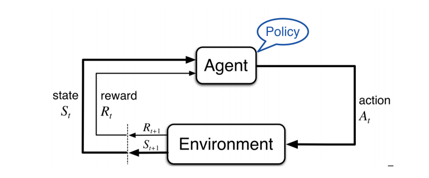

- Goal directed learning from interaction
- Feedback in the form of rewards
- Agent must (learn to) act so as to maximize expected rewards
- Learning is based on observed samples of outcomes

#### Characteristics of Reinforcement Learning

- Unlike other forms of supervised learning
    - No supervisor showing the best action to take
    - Actions affect observations - agent decides based on its past observations

- Sequential decisions - time matters!
- Feedback is often delayed

### RL Applications
- Automated vehicle control (e.g  drones)
- Game playing
    - Playing Atari(雅达利) games, Tetris(俄罗斯方块), etc.
- Medical treatment
    - Planning a sequence of treatments based on the effect of past treatments
- Chat bots(e.g. Siri, Alexa,...)
    - Learning the right thing to say at the right time

### MDP Formulation

### RL Formulation
- Still assume a Markov Decision Process(MDP):
    - State space S
        - all possible states that an RL agent can encounter in the environment. The state space defines the universe of situations or configurations that the agent can perceive and interact with during its decision-making process.
    - Action space A
        - In Reinforcement Learning (RL), the "action space," denoted as "A," is the set of all possible actions that an RL agent can take in a given state of the environment. 
    - Environment Transition model T
    - Reward Function R
        - a "reward" is a numerical value or signal that an RL agent receives from its environment in response to the actions it takes. The reward serves as feedback to the agent, indicating how well it is performing in achieving its goals. The primary purpose of rewards in RL is to guide the learning process and help the agent make decisions that lead to desirable outcomes.
        - A reward function in Reinforcement Learning (RL) is a mathematical function or rule that quantifies the desirability or quality of the outcomes achieved by an RL agent in a specific state of the environment. It assigns a numerical reward value to each state-action pair, indicating how favorable or unfavorable the agent's behavior is in that particular situation.

- Still looking for a policy $\pi(s)$

- In RL, new twist: don't know T or R, so:
    - we don't know which states are good or what the actions do 
    - Agent must actually try actions and states to learn

- Goal: find the optimal policy that maximizes expected rewards
    - Recall the principle of maximum expected utility:

$$\pi^*(s) = \arg \max_a \sum_{s'}p(s'|s,a)U(s')$$

    - Where U(s) satisfies Bellman optimality equation:

$$U(s)=R(s)+\gamma \max_a \sum_{s'}p(s'|s,a)U(s')$$

### Bellman Equation
- "The utility of a state is the immediate reward for that state plus the expected discounted utility of the next state"

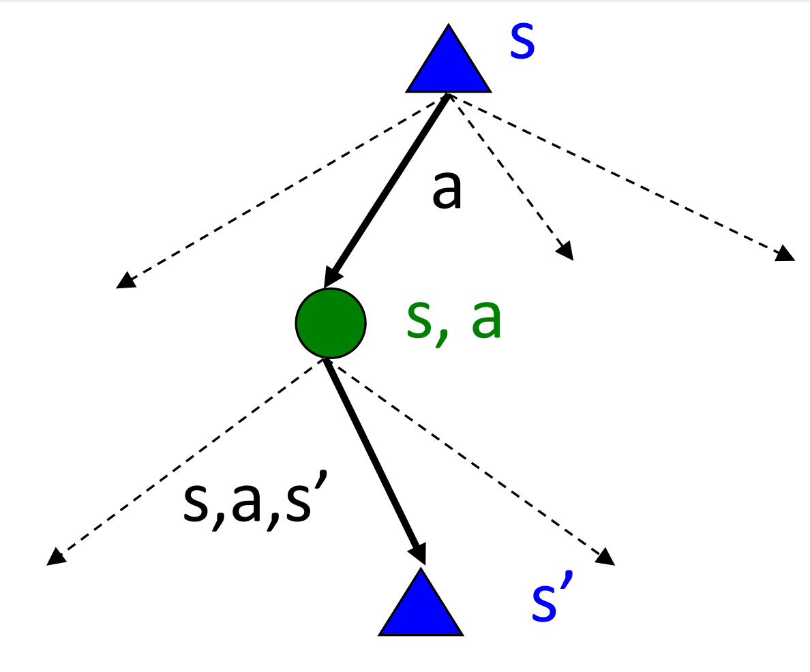

$$U(s)=R(s)+\gamma \max_a \sum_{s'}p(s'|s,a)U(s')$$

- R(S): immediate reward
- $\gamma \max_a \sum_{s'}p(s'|s,a)U(s')$ : discounted expected utility of the next state, assuming optimal action

$$p(s'|s,a)=T(s,a,s')$$

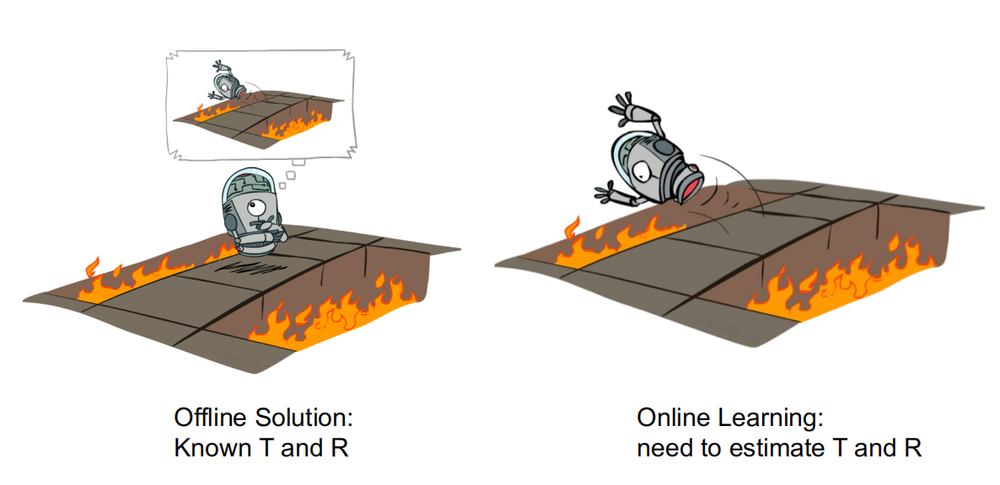

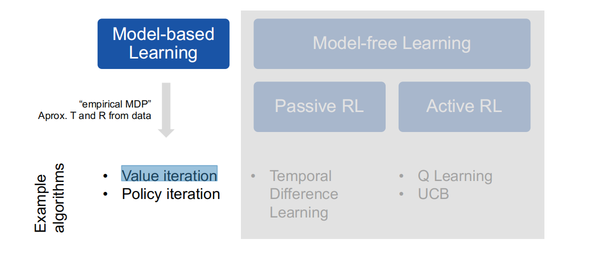

##### The discount factor:
- Future Reward Consideration: The primary purpose of the discount factor is to weigh the importance of future rewards relative to immediate rewards. In RL, agents aim to maximize cumulative rewards over time, and the discount factor helps them decide how much they value rewards in the distant future compared to rewards obtained sooner. A discount factor less than 1 (0 < γ < 1) signifies that future rewards are considered, but they are "discounted" or reduced in value relative to immediate rewards. A discount factor of 1 would mean that all rewards are treated equally, regardless of when they are obtained.
- Control of Agent Behavior: The choice of the discount factor influences the agent's behavior. A higher discount factor (close to 1) encourages the agent to consider long-term consequences and strive for higher cumulative rewards over time. In contrast, a lower discount factor (close to 0) encourages the agent to focus on immediate rewards and may lead to more myopic decision-making.
- Handling Infinite Horizons: The discount factor allows RL to deal with problems that have potentially infinite horizons. In such cases, without discounting, the cumulative sum of rewards may become infinite, making it challenging to work with. The discount factor ensures that the sum of rewards converges to a finite value, facilitating mathematical analysis and convergence guarantees.
- Stochastic Environments: In stochastic environments, where outcomes are uncertain, the discount factor helps agents account for the inherent uncertainty in predicting future rewards. It encourages agents to act robustly and not overvalue risky, high-reward, high-risk actions.

### Model-Based Learning
- Key intuition:
    - Learn an approximate model based on experience
    - Solve for values as if the learned model were correct
    - After learning, the agent can make predictions about **T** and **R** before taking action 

- Step 1: Learn empirical MDP 
    - Count outcomes s' for each s, a $\hat{T}(s,a,s')$
    - Normalize to give an estimate of $\hat{T}$
    - Discover each $\hat{R}(s,a,s')$ when we experience(s,a,s')

- Step 2: Solve the learned MDP
    - For example, use value iteration, as before

### Model-Based Learning: Example

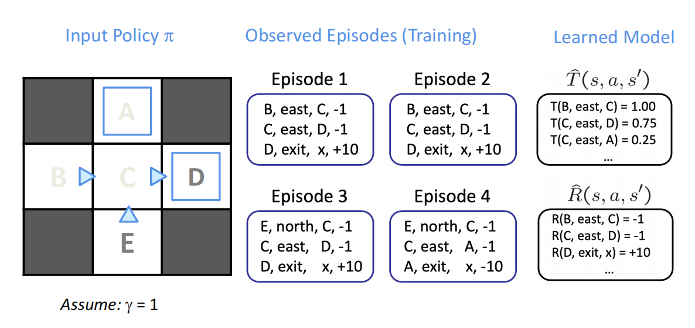

- Advantage:
    - Make good use of data

- Disadvantage:
    - Requires building the sctual MDP model
    - Intractable if state space is too large

### Model-Free Learning
- Remember: we don't know the transition model **T** and reward distribution **R**

Key intuition: Learn while optimizing policy

- Model is unknown but agent observes samples
- Adjust "model" as you observe more samples
- Learn optimal policy by sampling the environment(without the need to create a model beforehand)

#### Differences:
- Model-free reinforcement learning is a category of reinforcement learning algorithms that do not require a model of the environment to operate. Model-free algorithms learn directly from experience or trial-and-error and use the feedback they receive to update their internal policies or value functions. Model-free algorithms operate in the absence of complete knowledge of the environment dynamics or a transition model.
- Model-based reinforcement learning is a category of reinforcement learning algorithms that require a model of the environment to operate. Model-based algorithms learn the dynamics of the environment from experience and use the learned model to predict the outcomes of actions.

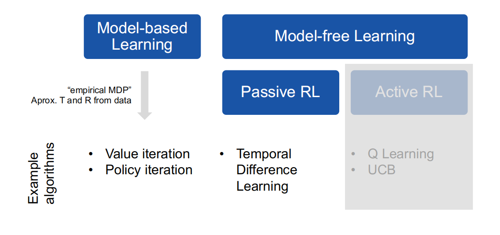

### Passive Reinforcement Learning
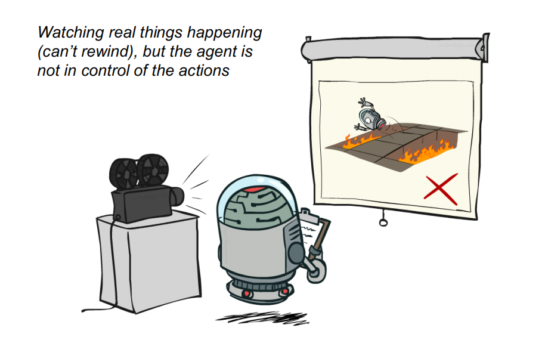

Simplified task: policy evaluation
- Input: a fixed policy $\pi(s)$
- We don't know the transitions T(s,a,s')
- We don't know the rewards R(s,a,s')
- Goal: learn the state values

In this case:
- No choice about what actions to take
- Just executr the policy and learn from experience
- Learned values depend on the policy
(is $pi(s)$ is "bad", the values won't be very useful)

### Temporal Difference(TD) Learning

Key idea: 
- Update V(s) each time we experience a transition(s,a,s',r)
- Likely outcomes s' will contribute more often

Temporal Difference learning of values:
- Policy still fixed, still doing evaluation!
- Move values toward value of whatever successor occurs: running average

**Sample pf V(s):**

$$sample = R(s,\pi(s),s')+\gamma V^{\pi}(s')$$

**Update to V(s):**

$$V^{\pi}(s)\gets (1-\alpha)V^{\pi}(s)+(\alpha)sample$$

**Same Update:**

$$V^{\pi}(s)\gets V^{\pi}(s)+\alpha(sample-V^{\pi}(s))$$

- sample: waht actually did happen(in one experience)

- $V^{\pi}(s)$ : what we thought would happen

##### TD Learning Example

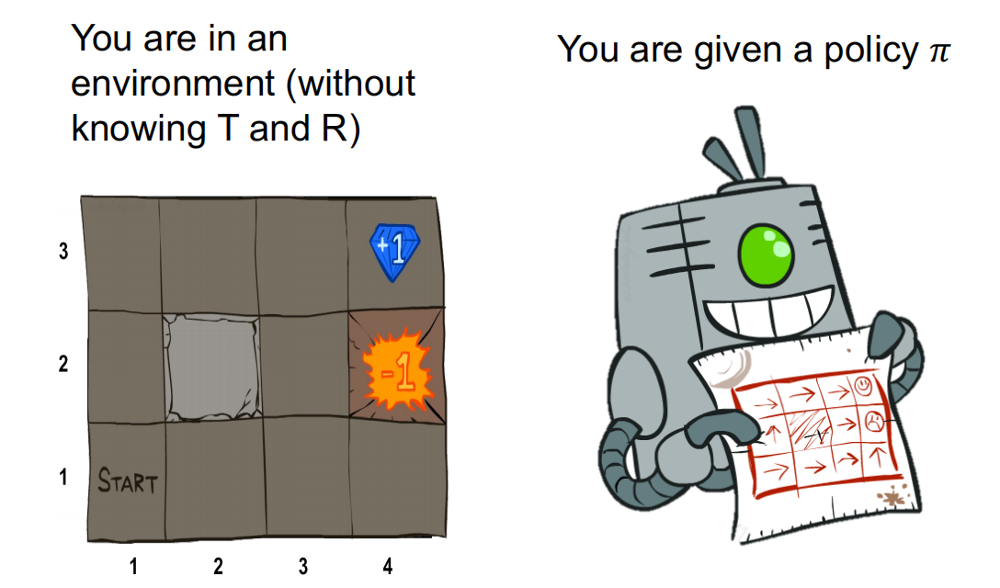

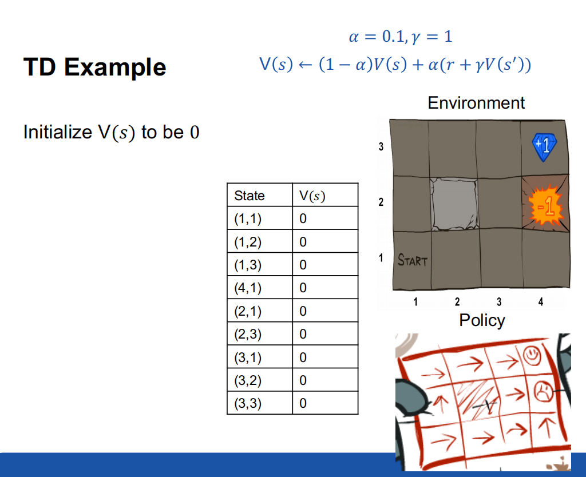

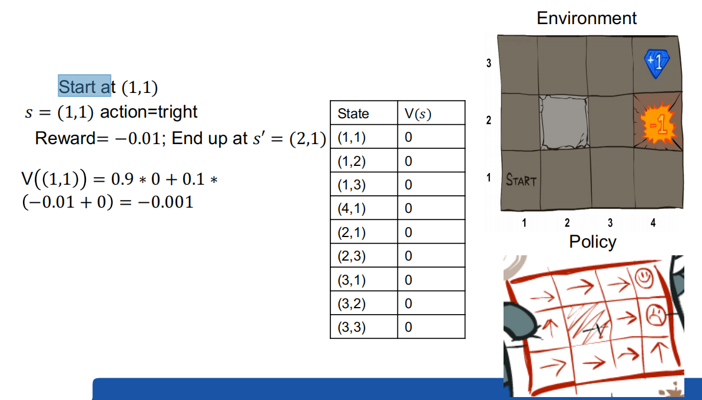

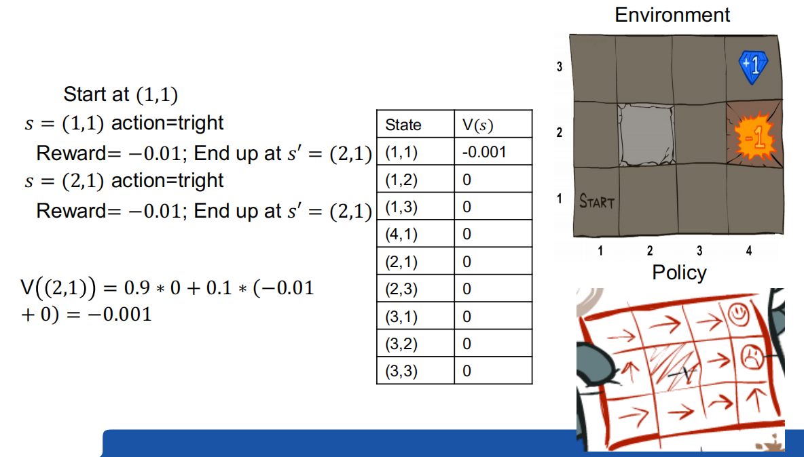

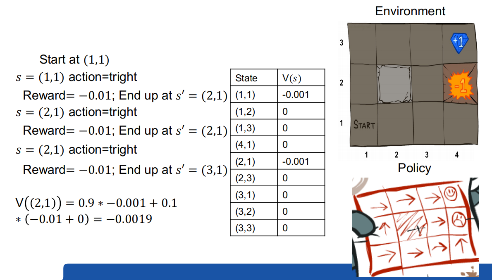

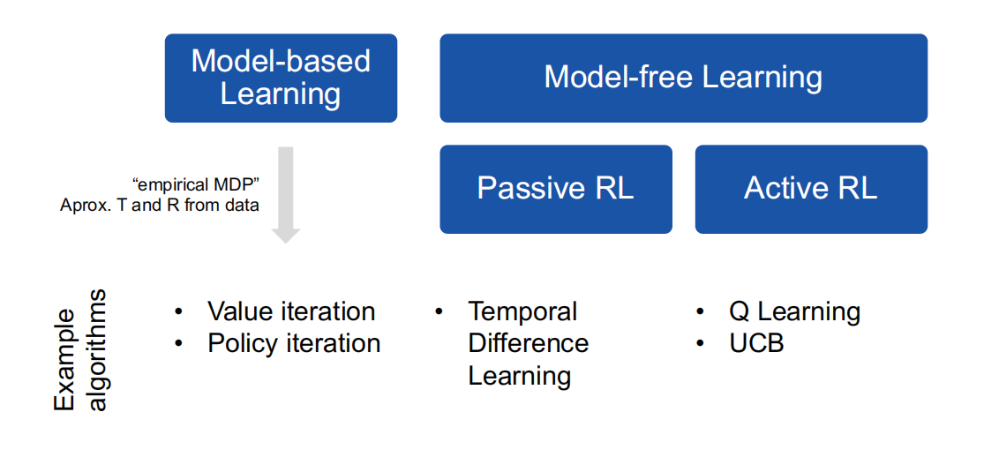

#### Active Reinforcement Learning
- Full reinforcement learning: optimal policies
    - You don't know the transitions T(s,a,s')
    - You don't know the rewards R(s,a,s')
    - You choose the actions now
    - Goal: learn the optimal policy/values
- In this case:
    - Learner makes choices!
    - Unlike passive RL, in active RL the agent needs to learn the outcome probabilites for all actions, not just the model for the fixed policy
    - Fandamental tradeoff(权衡): exploration vs. expoitation
        - Exploration is any action that lets the agent discover new features about the environment, while exploitation is capitalizing on knowledge already gained. 
        - The agent interacts with the environment by selecting actions based on an exploration strategy, such as epsilon-greedy. The exploration strategy balances exploration (trying new actions) and exploitation (choosing actions with the highest Q-values).

#### Active Reinforcement Learning（cont.）

- Choose actions(randomly or in some other way)
- Estimate T and R from the sample trials (average counts)
- Use esimated T and R to compute estimate of optimal values and optimal policy
- Will the computed values and policy converge to the true values and policy in the limit of infinite data?
    - Sufficient condition: if all states are reachable from any other state
    - Be able to visit each state and take each action as many times as we want

### Q-Learning Intuition
- Optimal value functions(used e.g in TD learning) tell us how "good" a state is, but does not explicitly capture how good the actions are

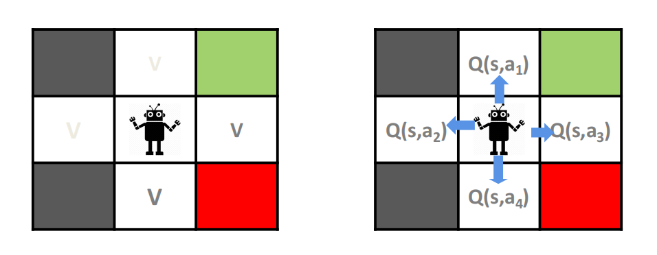

- Instead of evaluating the value of a state, evaluate the actions Q(s,a)

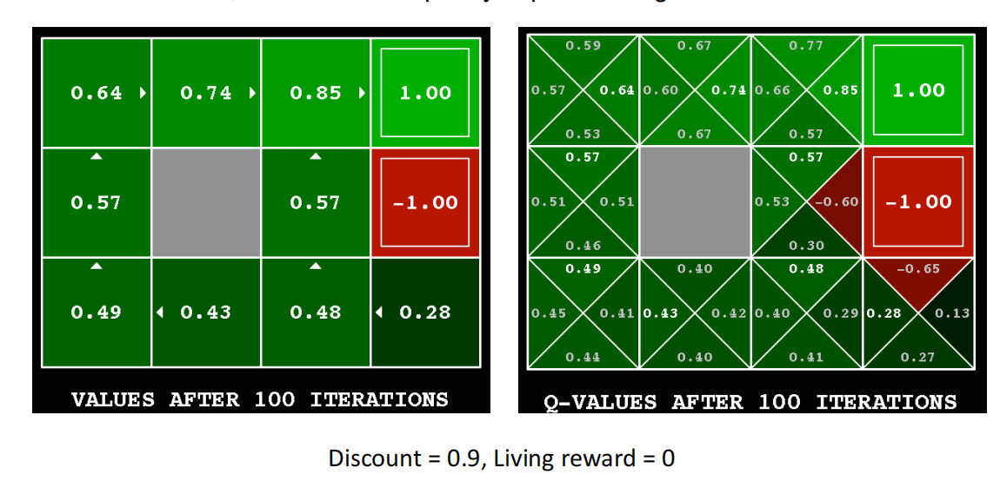

### Q Function

so we define:
Q(s,a): the value of taking action a in state s
Optimal Q function: 

$$Q_{*}(s,a):=\max_{\pi}Q_{\pi}(s,a)$$

If we know $Q_{*}(s,a)$ we can more easily obtain an optimal policy:

$$\pi*(s)=\arg\max_a Q_*(s,a)$$

How do we learn Q*(s,a)?

### Q-Learning updates

- Q-value updates to each Q-state
    - Receive a sample transition(s,a,r,s')
    - This sample suggests:

$$Q(s,a)\approx r + \gamma \max_{a'}Q(s',a')$$

- But we want to average over results from (s,a)

$$Q(s,a)\gets (1-\alpha)Q(s,a)+(alpha)[r+\gamma max_{a'}Q(s',a')]$$