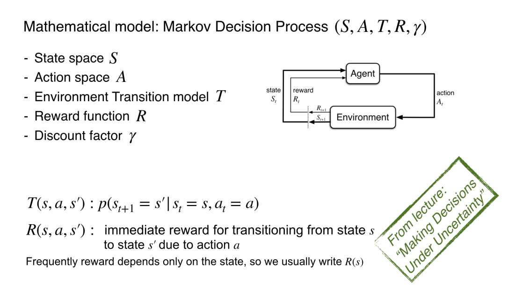

# Reinforcement Learning

### What is Reinforcement Learning？
- Rewards provide a positive reinforcement to our actions.
- Reinforcement Learning (RL) is the science of decision making. It is about learning the optimal behavior in an environment to obtain maximum reward.

- Goal directed learning from interaction
- Feedback in the form of rewards
- Agent must (learn to) act so as to maximize expected rewards
- Learning is based on observed samples of outcomes

#### Characteristics of Reinforcement Learning

- Unlike other forms of supervised learning
    - No supervisor showing the best action to take
    - Actions affect observations - agent decides based on its past observations

- Sequential decisions - time matters!
- Feedback is often delayed

### RL Applications
- Automated vehicle control (e.g  drones)
- Game playing
    - Playing Atari(雅达利) games, Tetris(俄罗斯方块), etc.
- Medical treatment
    - Planning a sequence of treatments based on the effect of past treatments
- Chat bots(e.g. Siri, Alexa,...)
    - Learning the right thing to say at the right time

### MDP Formulation

### RL Formulation
- Still assume a Markov Decision Process(MDP):
    - State space S
    - Action space A
    - Environment Transition model T
    - Reward Function R

- Still looking for a policy $\pi(s)$

- In RL, new twist: don't know T or R, so:
    - we don't know which states are good or what the actions do 
    - Agent must actually try actions and states to learn

- Goal: find the optimal policy that maximizes expected rewards
    - Recall the principle of maximum expected utility:
    
$$\pi^*(s) = \arg \max_a \sum_{s'}p(s'|s,a)U(s')$$