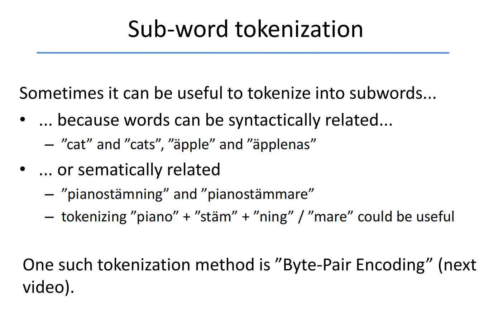
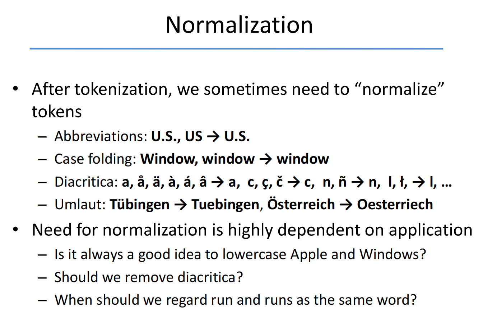
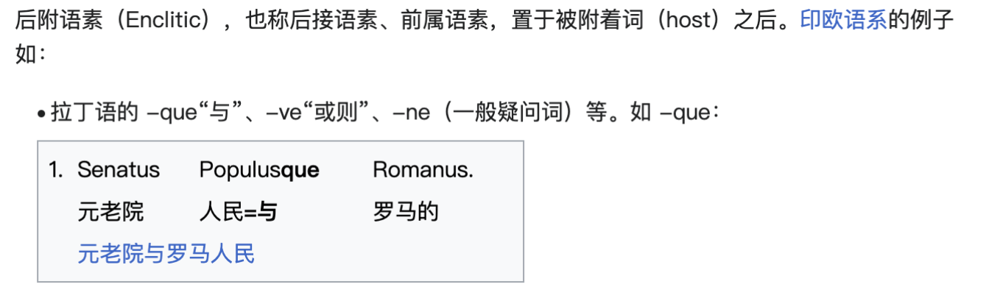
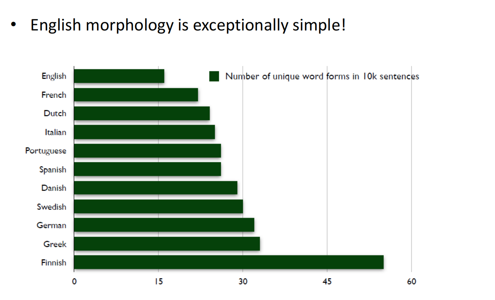
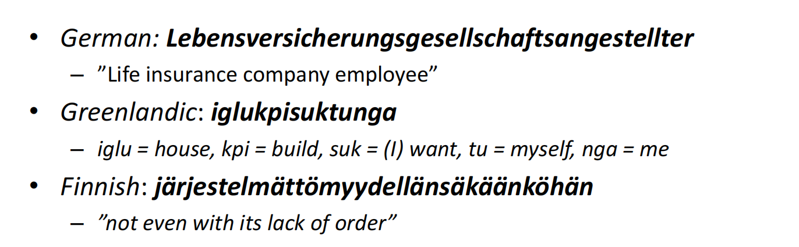
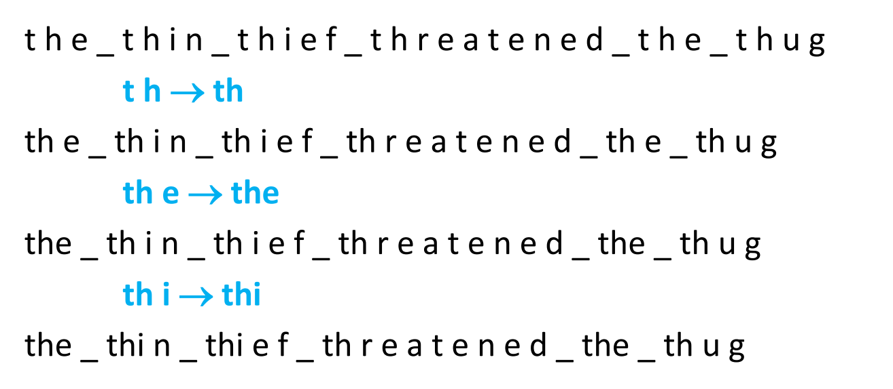
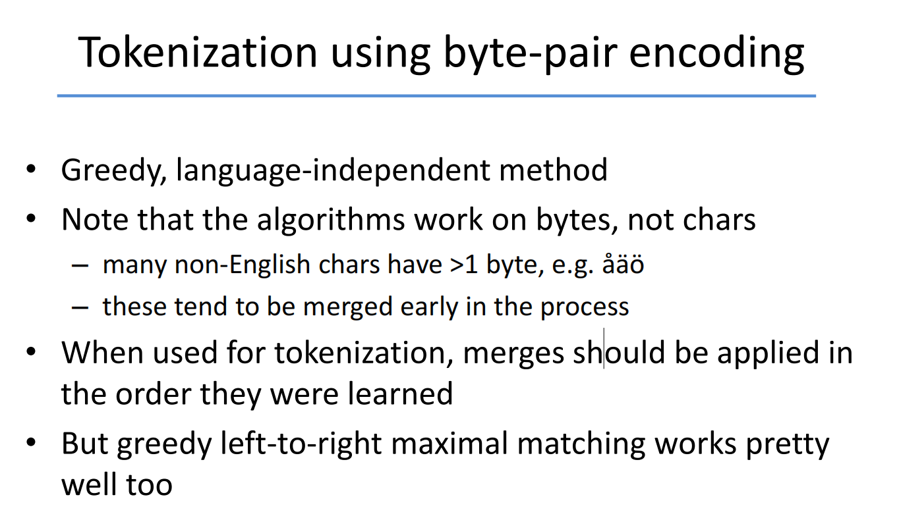
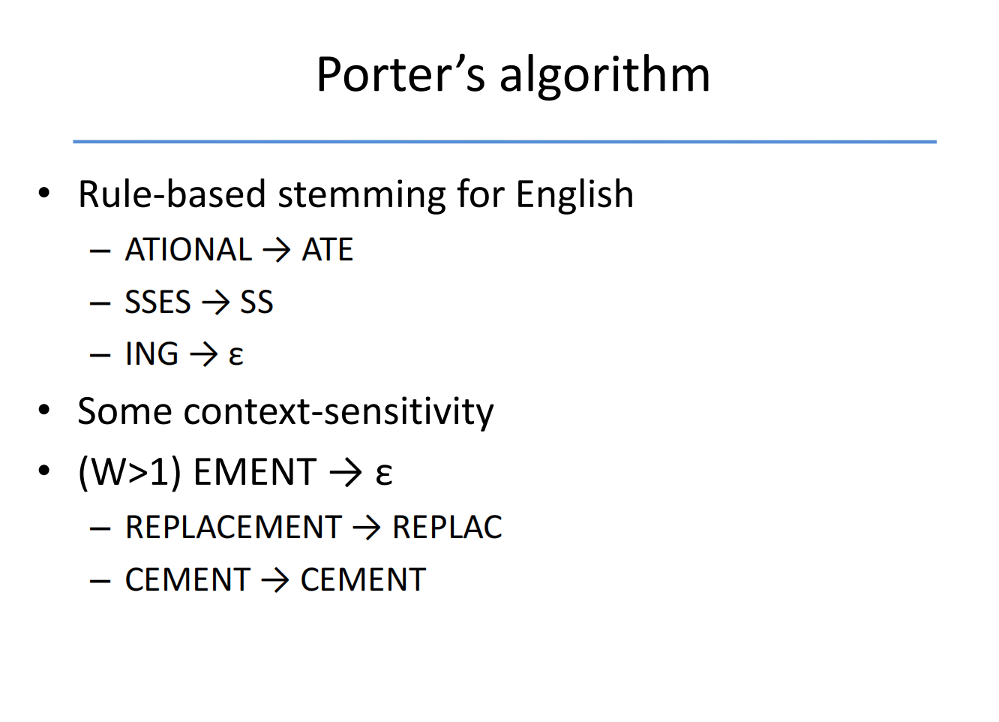

# The Boolean Search Model

### A first IR example


We can use the following commands:

```
grep -il caesar *.txt
grep -il brutus *.txt
grep -il calpurnia *.txt
```

There's nothing wrong with this solution. But it will be to slow if we apply it to the website corpora.


#### Boolean Search: Advantages
- Simple model to understand and implement
- A Boolean query has a (mathematically) precise meaning
- Works well for expert users wroking with a well-defined 


In reality, a large majority of words will only appears in few documents. 


### Tokenization


##### Basic Text Processing
- Text comes in many **different formats** (html, text, Word, Excel, PDF, PostScript, ..., ), **languages** and **character sets**
- It might need be separated from images and other non-textual content
- strip off markup in HTM and XML


-  ASCII and Latin-1 are older character encoding standards with limited character sets, while Unicode and UTF-8 provide comprehensive support for representing text in various languages and scripts around the world. UTF-8 is particularly popular due to its efficiency and compatibility with ASCII.


#### Tokenization
- A token is a meaningful minimal unit of text
- Usually, spaces and punctuation(标点符号) delimit tokens


cd "Desktop/Coursework/2023-2024 Sem2/DD2476 Search Engine and Information Retrieval System/Assignment01/assignment1"



## Text Normalization



### Morphemes

- Words are built from smaller meaningful units called morphemes（词素）

- A morpheme belongs to one of two classes:
    - stem 词干: the core meaning-bearing unit
    - affix词缀: small units glued to the stem to signal various grammatical functions

- An affix can in its turn be classified as a
    - prefix 前缀 (un-)
    - suffix 后缀 (-s, -ed, -ly)
    - infix（中缀） (Swedish korru-m-pera)
    - circumfix（环缀） (German ge-sag-t)


### Word formation
- Words can be inflected to signal grammatical information:
    - play, plays, played, playing
    - cat, cats, cat’s, cats’

- Words can also be derived from other words:
    - friend → friendly → friendliness → unfriendliness

- Words can be compound:
    - smart + phone → smartphone
    - anti + missile → anti-missile（反导弹）

- Clitics 附着语素
    – Le + hôtel → L’hôtel, Ce + est → c’est
    – She is → she’s, She has → she’s



### Language variation




#### Some non-English words



### Tokenization using byte-pair encoding
- Idea:
    - First learn (once) the vocabulary (set of token types) directly from a large corpus 直接从大型语料库中学习（一次）词汇（一组标记类型）。
    - Then tokenize files/sentences using the learned vocabulary使用所学的词汇对文件/句子进行标记化。

- Method:
    1. Initial vocabulary is the set of all bytes (a,b,c,..., A,B,C,...)
    2. Then choose the two symbols that are most frequently adjacent in the training corpus (e.g. ’th’)
    3. Add a new symbol ’th’ to the vocabulary
    4. Replace all adjacent ’t’ ’h’ by ’th’
    5. Repeat from 2 until k merges have been done (typically 25,000)





## More on text normalization

#### Lemmatization 词形还原

- Map inflected（变形后的） form to its lemma (=base form)
- “The boys’ cars are different colours” → ”The boy car be different color”
- Requires language-specific linguistic analysis
    - part-of-speech tagging词性标注
        - Part-of-speech (POS) tagging 是自然语言处理中的一项任务，它的目标是为句子中的每个单词确定其所属的词性或词类。词性标注将每个单词标记为诸如名词、动词、形容词、副词、代词等不同的语言学类别。这个任务对于理解句子的结构和含义至关重要，因为不同的词性在句子中扮演着不同的角色和功能。
        - Part-of-speech tagging 的典型方法是使用机器学习技术，如隐马尔可夫模型 (Hidden Markov Model, HMM)、条件随机场 (Conditional Random Fields, CRF) 或神经网络等，通过对已标记的语料库进行训练，然后将学到的模型应用于新的文本以预测每个单词的词性。这项任务在自然语言处理中被广泛应用，例如在文本分析、信息检索、机器翻译等领域中都有着重要的作用。
    - morphological analysis
        - 形态分析（morphological analysis）是自然语言处理中的一项任务，旨在对单词的内部结构进行分析和解析，以了解其构成要素和形态特征。形态分析通常涉及词素（morpheme）的识别和分析，词素是构成单词的最小意义单位，是语言中具有独立意义的最小单元。
        - 形态分析的主要目标包括：
            - 识别单词中的词素：识别单词中的基本构成要素，例如词根、词缀等。
            - 分析词素的形态特征：了解词素的形态属性，例如词根的词性、词缀的语法功能等。
            - 进行词形还原或词干提取：将单词还原为其原始形式，或提取其词干，以便于后续的文本处理和分析。
- Particularly useful in morphologically rich languages, like Finnish, Turkish, Hungarian

### Stemming 词干提取
- Don’t do morphological(形态分析) or syntactic analysis（句法分析）, just chop off the suffixes
    - No need to know that ”foxes” is plural of ”fox”
    - 句法分析（Syntactic analysis）是自然语言处理中的一项重要任务，旨在分析和理解句子的结构和语法关系。它涉及到对句子的语法结构进行分析，以识别句子中的短语、成分以及它们之间的关系。

- Much less expensive than lemmatization, but can be very wrong sometimes
    - stocks → stock, stockings → stock

- Stemming usually improves recall but lowersprecision
    - Precision (also called positive predictive value) is the fraction of relevant instances among the retrieved instances. Written as a formula:

$$Precision = \frac{Relevant—retrieved-instances}{All-retrieved-instances}$$

- Recall (also known as sensitivity) is the fraction of relevant instances that were retrieved. Written as a formula:

$$Recall = \frac{Relevant-retrieved-instances}{All-relevant-instances}$$

- Improves recall: Stemming reduces words to their common root forms, which means that it's more likely to match different variations of the same word. For example, "running," "runs," and "ran" may all be reduced to the stem "run." By doing so, stemming ensures that more relevant documents containing variations of the same word are retrieved, thereby improving recall.

- Lowers precision: Stemming doesn't consider the semantic or syntactic context of the word, which can lead to unrelated words being stemmed to the same root. This can result in the inclusion of irrelevant words that share the same stem but have different meanings. Consequently, while stemming may retrieve more relevant documents, it may also introduce noise by retrieving irrelevant ones, thus lowering precision.


#### Porter's Algorithm



$\epsilon$ : Empty

