# The Boolean Search Model

### A first IR example

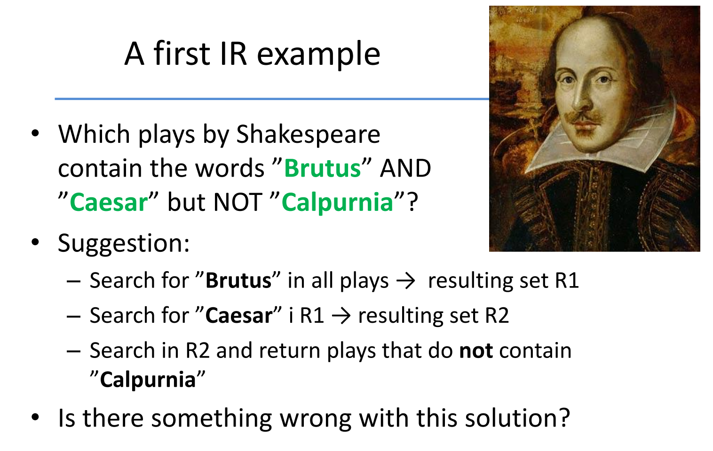

We can use the following commands:

```
grep -il caesar *.txt
grep -il brutus *.txt
grep -il calpurnia *.txt
```

There's nothing wrong with this solution. But it will be to slow if we apply it to the website corpora.

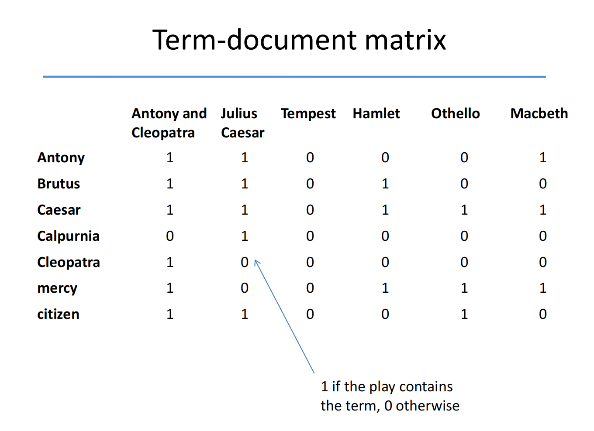

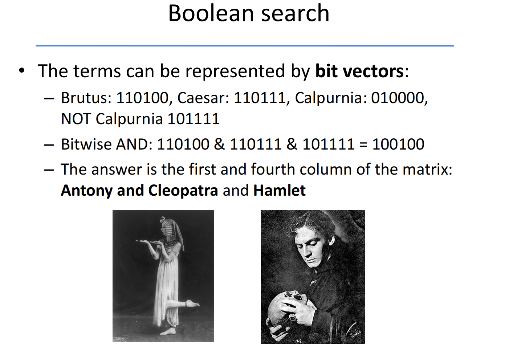

#### Boolean Search: Advantages
- Simple model to understand and implement
- A Boolean query has a (mathematically) precise meaning
- Works well for expert users wroking with a well-defined 

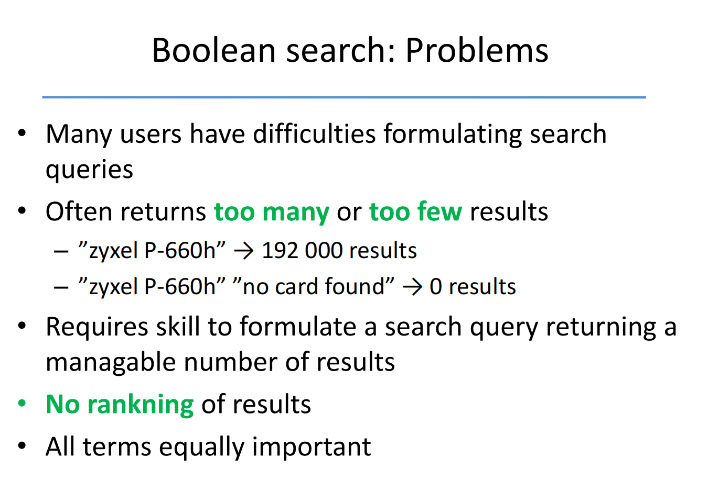

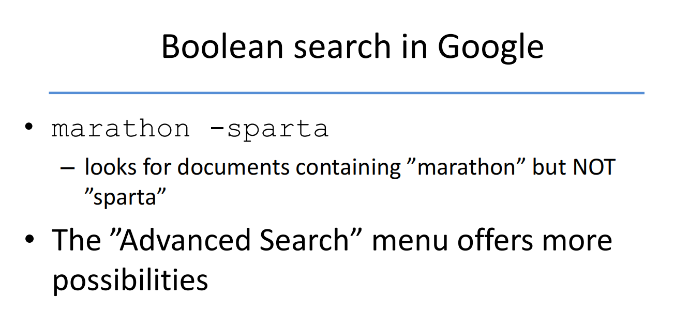

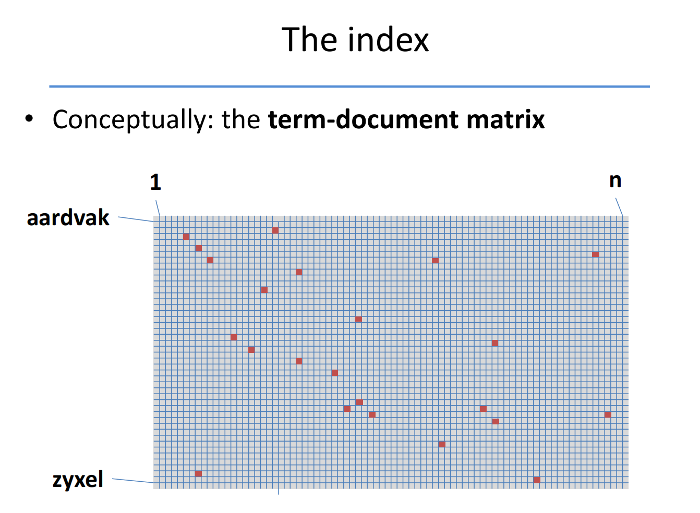

In reality, a large majority of words will only appears in few documents. 

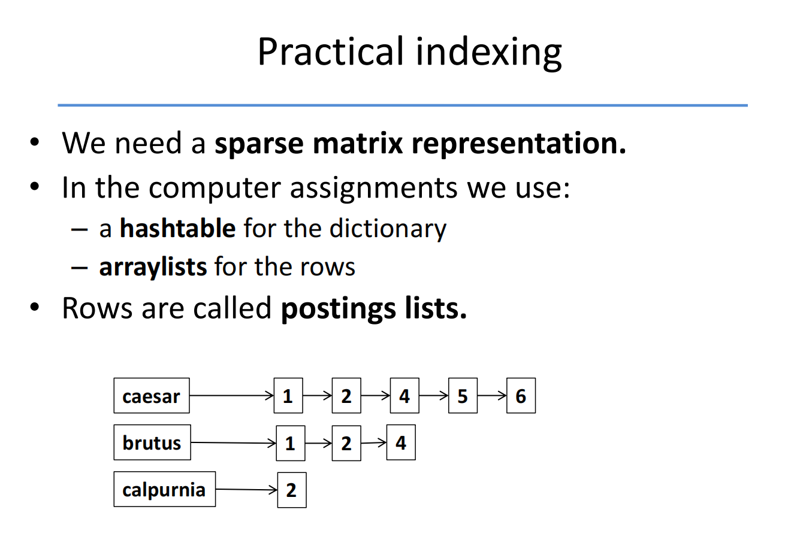

### Tokenization

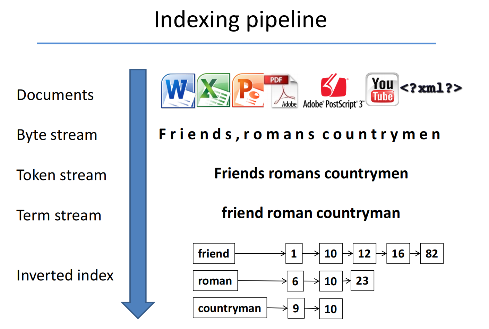

##### Basic Text Processing
- Text comes in many **different formats** (html, text, Word, Excel, PDF, PostScript, ..., ), **languages** and **character sets**
- It might need be separated from images and other non-textual content
- strip off markup in HTM and XML

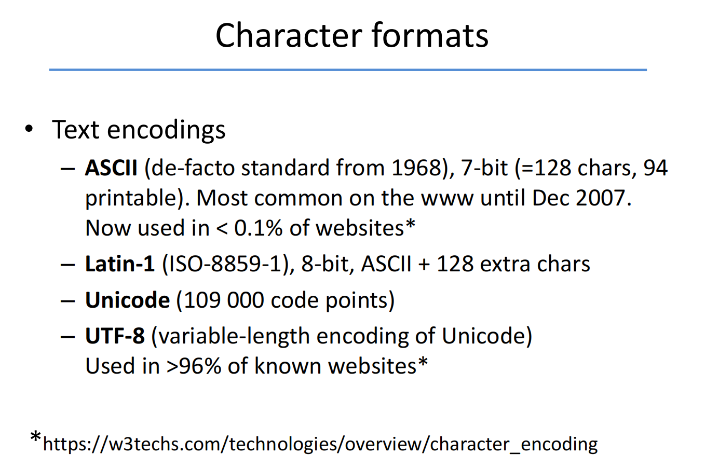

-  ASCII and Latin-1 are older character encoding standards with limited character sets, while Unicode and UTF-8 provide comprehensive support for representing text in various languages and scripts around the world. UTF-8 is particularly popular due to its efficiency and compatibility with ASCII.


#### Tokenization
- A token is a meaningful minimal unit of text
- Usually, spaces and punctuation(标点符号) delimit tokens

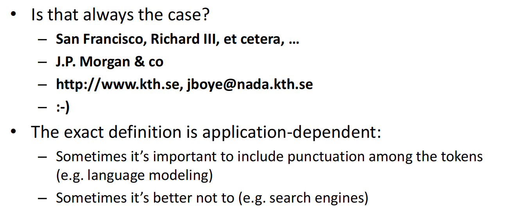

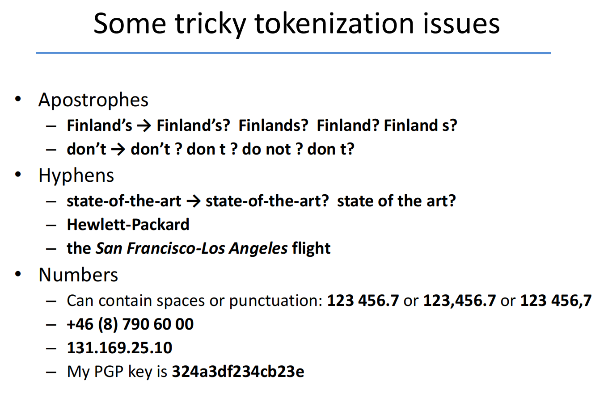