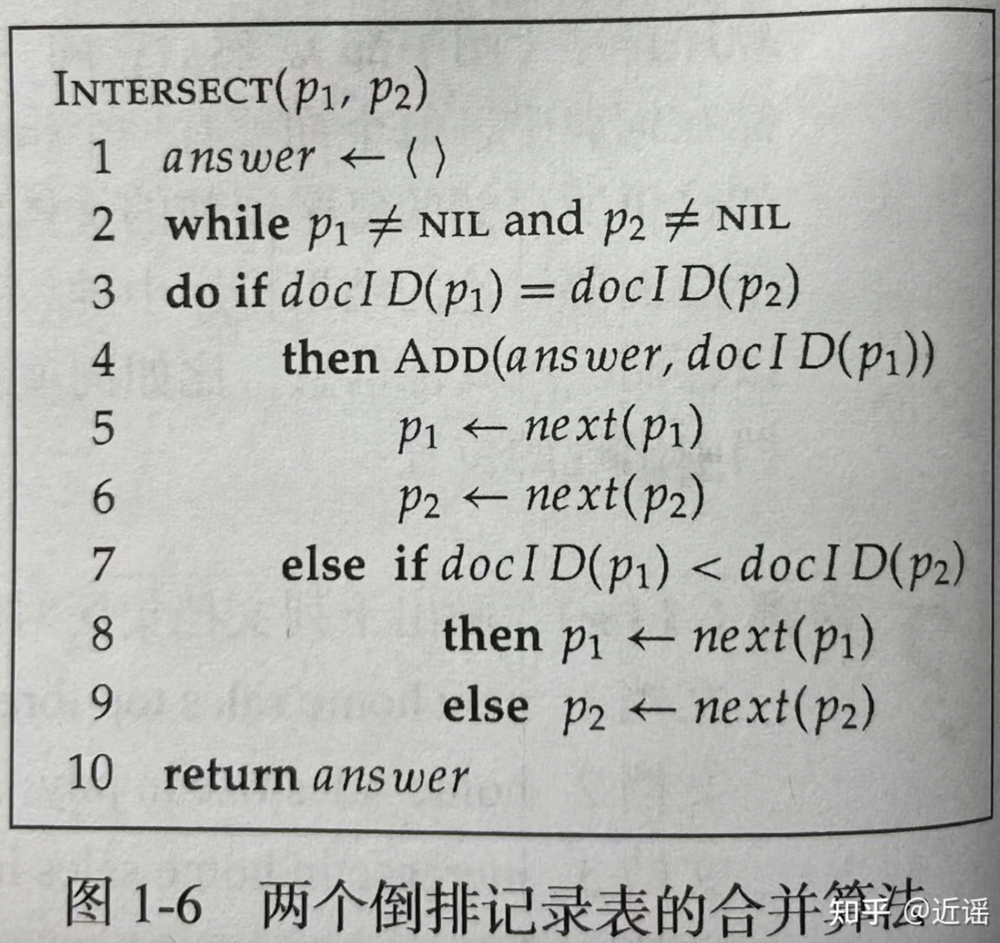

# The Boolean Search Model


信息检索（information retrieval，简称IR）的定义：信息检索是从大规模非结构化数据（通常是文本）的集合（通常保存在计算机上）中找出满足用户信息需求的资料（通常是文档）的过程。

- 非结构化数据的定义：指没有清晰和明显的语义结构的数据，而计算机不易处理这类数据。

- 结构化数据的定义：与非结构化数据相对，例如：关系型数据库

- 半结构化数据的定义：具有格式标记的数据，例如：网页

### A first IR example


We can use the following commands:

```
grep -il caesar *.txt
grep -il brutus *.txt
grep -il calpurnia *.txt
```

There's nothing wrong with this solution. But it will be to slow if we apply it to the website corpora.


#### Boolean Search: Advantages
- Simple model to understand and implement
- A Boolean query has a (mathematically) precise meaning
- Works well for expert users wroking with a well-defined 


In reality, a large majority of words will only appears in few documents. 


### Tokenization


##### Basic Text Processing
- Text comes in many **different formats** (html, text, Word, Excel, PDF, PostScript, ..., ), **languages** and **character sets**
- It might need be separated from images and other non-textual content
- strip off markup in HTM and XML


-  ASCII and Latin-1 are older character encoding standards with limited character sets, while Unicode and UTF-8 provide comprehensive support for representing text in various languages and scripts around the world. UTF-8 is particularly popular due to its efficiency and compatibility with ASCII.


#### Tokenization
- A token is a meaningful minimal unit of text
- Usually, spaces and punctuation(标点符号) delimit tokens


cd "Desktop/Coursework/2023-2024 Sem2/DD2476 Search Engine and Information Retrieval System/Assignment01/assignment1"


## Text Normalization


### Morphemes

- Words are built from smaller meaningful units called morphemes（词素）

- A morpheme belongs to one of two classes:
    - stem 词干: the core meaning-bearing unit
    - affix词缀: small units glued to the stem to signal various grammatical functions

- An affix can in its turn be classified as a
    - prefix 前缀 (un-)
    - suffix 后缀 (-s, -ed, -ly)
    - infix（中缀） (Swedish korru-m-pera)
    - circumfix（环缀） (German ge-sag-t)


### Word formation
- Words can be inflected to signal grammatical information:
    - play, plays, played, playing
    - cat, cats, cat’s, cats’

- Words can also be derived from other words:
    - friend → friendly → friendliness → unfriendliness

- Words can be compound:
    - smart + phone → smartphone
    - anti + missile → anti-missile（反导弹）

- Clitics 附着语素
    – Le + hôtel → L’hôtel, Ce + est → c’est
    – She is → she’s, She has → she’s


### Language variation


#### Some non-English words


### Tokenization using byte-pair encoding
- Idea:
    - First learn (once) the vocabulary (set of token types) directly from a large corpus 直接从大型语料库中学习（一次）词汇（一组标记类型）。
    - Then tokenize files/sentences using the learned vocabulary使用所学的词汇对文件/句子进行标记化。

- Method:
    1. Initial vocabulary is the set of all bytes (a,b,c,..., A,B,C,...)
    2. Then choose the two symbols that are most frequently adjacent in the training corpus (e.g. ’th’)
    3. Add a new symbol ’th’ to the vocabulary
    4. Replace all adjacent ’t’ ’h’ by ’th’
    5. Repeat from 2 until k merges have been done (typically 25,000)


## More on text normalization

#### Lemmatization 词形还原

- Map inflected（变形后的） form to its lemma (=base form)
- “The boys’ cars are different colours” → ”The boy car be different color”
- Requires language-specific linguistic analysis
    - part-of-speech tagging词性标注
        - Part-of-speech (POS) tagging 是自然语言处理中的一项任务，它的目标是为句子中的每个单词确定其所属的词性或词类。词性标注将每个单词标记为诸如名词、动词、形容词、副词、代词等不同的语言学类别。这个任务对于理解句子的结构和含义至关重要，因为不同的词性在句子中扮演着不同的角色和功能。
        - Part-of-speech tagging 的典型方法是使用机器学习技术，如隐马尔可夫模型 (Hidden Markov Model, HMM)、条件随机场 (Conditional Random Fields, CRF) 或神经网络等，通过对已标记的语料库进行训练，然后将学到的模型应用于新的文本以预测每个单词的词性。这项任务在自然语言处理中被广泛应用，例如在文本分析、信息检索、机器翻译等领域中都有着重要的作用。
    - morphological analysis
        - 形态分析（morphological analysis）是自然语言处理中的一项任务，旨在对单词的内部结构进行分析和解析，以了解其构成要素和形态特征。形态分析通常涉及词素（morpheme）的识别和分析，词素是构成单词的最小意义单位，是语言中具有独立意义的最小单元。
        - 形态分析的主要目标包括：
            - 识别单词中的词素：识别单词中的基本构成要素，例如词根、词缀等。
            - 分析词素的形态特征：了解词素的形态属性，例如词根的词性、词缀的语法功能等。
            - 进行词形还原或词干提取：将单词还原为其原始形式，或提取其词干，以便于后续的文本处理和分析。
- Particularly useful in morphologically rich languages, like Finnish, Turkish, Hungarian

### Stemming 词干提取
- Don’t do morphological(形态分析) or syntactic analysis（句法分析）, just chop off the suffixes
    - No need to know that ”foxes” is plural of ”fox”
    - 句法分析（Syntactic analysis）是自然语言处理中的一项重要任务，旨在分析和理解句子的结构和语法关系。它涉及到对句子的语法结构进行分析，以识别句子中的短语、成分以及它们之间的关系。

- Much less expensive than lemmatization, but can be very wrong sometimes
    - stocks → stock, stockings → stock

- Stemming usually improves recall but lowersprecision
    - Precision (also called positive predictive value) is the fraction of relevant instances among the retrieved instances. Written as a formula:

$$Precision = \frac{Relevant—retrieved-instances}{All-retrieved-instances}$$

- Recall (also known as sensitivity) is the fraction of relevant instances that were retrieved. Written as a formula:

$$Recall = \frac{Relevant-retrieved-instances}{All-relevant-instances}$$

- Improves recall: Stemming reduces words to their common root forms, which means that it's more likely to match different variations of the same word. For example, "running," "runs," and "ran" may all be reduced to the stem "run." By doing so, stemming ensures that more relevant documents containing variations of the same word are retrieved, thereby improving recall.

- Lowers precision: Stemming doesn't consider the semantic or syntactic context of the word, which can lead to unrelated words being stemmed to the same root. This can result in the inclusion of irrelevant words that share the same stem but have different meanings. Consequently, while stemming may retrieve more relevant documents, it may also introduce noise by retrieving irrelevant ones, thus lowering precision.


#### Porter's Algorithm


$\epsilon$ : Empty

- Output is not neccessarily a word. 

- Porter's algorithm, or the Porter stemming algorithm, is a widely utilized method in natural language processing for stemming, which involves reducing words to their base or root form. Developed by Martin Porter in 1980, this algorithm employs a series of predefined rules to strip common morphological and inflectional endings from words iteratively, aiming to derive their simplest form. By applying these rules, it helps in simplifying text processing tasks such as information retrieval and text mining by transforming words into their base forms, thus enhancing accuracy and efficiency in linguistic analysis. Despite its simplicity, Porter's algorithm remains a cornerstone in stemming algorithms due to its effectiveness and widespread application in various natural language processing applications.

#### Compound Splitting


- modifier: 修饰语，修饰成分


#### Stop Words

- 在信息检索中，为节省存储空间和提高搜索效率，在处理自然语言数据（或文本）之前或之后会自动过滤掉某些字或词，这些字或词即被称为Stop Words（停用词）。这些停用词都是人工输入、非自动化生成的，生成后的停用词会形成一个停用词表。

- 通常意义上，停用词大致分为两类。一类是人类语言中包含的功能词，这些功能词极其普遍，与其他词相比，功能词没有什么实际含义，比如'the'、'is'、'at'、'which'、'on'等。但是对于搜索引擎来说，当所要搜索的短语包含功能词，特别是像'The Who'、'The The'或'Take The'等复合名词时，停用词的使用就会导致问题。另一类词包括词汇词，比如'want'等，这些词应用十分广泛，但是对这样的词搜索引擎无法保证能够给出真正相关的搜索结果，难以帮助缩小搜索范围，同时还会降低搜索的效率，所以通常会把这些词从问题中移去，从而提高搜索性能。


### Sum-up
- Reading, tokenizing and normalizing ocntents of documents.
    - File types and character encoding
    - Tokenization issues: punctuation, compound words,word order, stop words
    - Normalization issues: diacritica（变音符）, case folding（大小写折叠）, lemmatization（词形还原）, stemming

## Indexing and search

#### Recap
- We want to quickyly find the **most relevant documents** satisfying our **information need**
- The user gives a **search query.**
- The engine searches through the **index** , retrieves the **matching** documents, and possibly **ranks** them. 

### The index
- Conceptually: the **term-document matrix**


### Practical Indexing 
- we need a sparse matrix representation.
- In the computer assignments we use:
    - a hashtable for the dictionary
    - arraylists for the rows
- Rows are called postings lists (倒排记录表)


#### Intersection


- 交集（intersection）操作非常关键，这是因为必须快速将倒排记录表求交集以尽快找到那些文档同时包含两个词项。该操作有时称为合并（merge）



#### Skip pointers

- Add skip pointers at indexing time


- By using skip pointers, we don’t have to compare 41 to 17 or 21


## Positional indexes and phrase queries

- E.g. "Joe Biden"
- Should not match "President Biden"
    - The concept of phrase queries has proven easily understood by users; one of the few "advanced search: ideas that works
    - Many more queries are implicit phrase queries
- For this, it no longer suffices to store only <term : docs> entries. 

- 很多复杂的或技术性的概念、机构名和产品名等都是由多个词语组成的复合词或短语。用户希望能够将类似 Stanford University 的查询中的两个词看成一个整体，从而一篇含有句子 The inventor Stanford Ovshinsky never went to university 的文档不会与该查询匹配。大部分搜索引擎都提供了双引号语法（如“ Stanford University” ）来支持短语查询，这种语法很容易理解并被用户成功使用。大概有 10%的 Web 查询是短语查询，有更多的查询虽然输入时没有加双引号，但实际上是隐式的短语查询（如人名）。要支持短语查询，只列出词项所在的文档列表的倒排记录表已不足以满足要求。

### First attempt: Biword Index
- “Friends, Romans, Countrymen” generates the biwords
    – friends romans
    – romans countrymen
- Each of these biwords is now a dictionary term.
- Two-word phrase query-processing is now immediate. 
- Longer phrases: friends romans countrymen
- Intersect friends romans and romans countrymen?

- 处理短语查询的一个办法就是将文档中每个接续词对看成一个短语。例如，文本 Friends, Romans, Countrymen 会产生如下的二元接续词对（biword）：
    - friends romans 
    - romans countrymen 
- 这种方法将每个接续词对看成词项，这样马上就能处理两个词构成的短语查询，更长的查询可以分成多个短查询来处理。比如，按照上面的方法可以将查询 stanford university palo alto分成如下的布尔查询：
- “stanford university” AND “university palo” AND “palo alto” 
可以期望该查询在实际中效果会不错，但是偶尔也会有错误的返回例子。对于该布尔查询返回的文档，我们并不知道其是否真正包含最原始的四词短语。

##### Biword index: disadvantages

- **False positives(错误的返回例子)**
    - Requires post-processing to avoid
- Index blowup due to bigger dictionary
    - The number of unique word square（n个unique word, 就有 $n^2$ 个Biword
    - Infeasible for more than biwords, big even for them
- 存储更长的短语很可能会大大增加词汇表的大小。穷尽所有长度超过2的短语并维护其索引绝对是一件令人生畏的事情，即使只穷尽所有的二元词也会大大增加词汇表的大小。