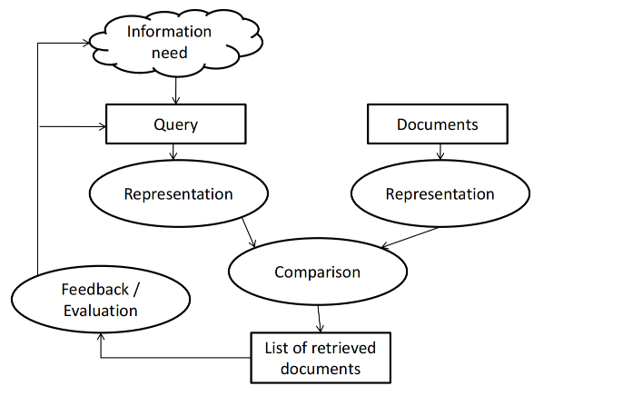
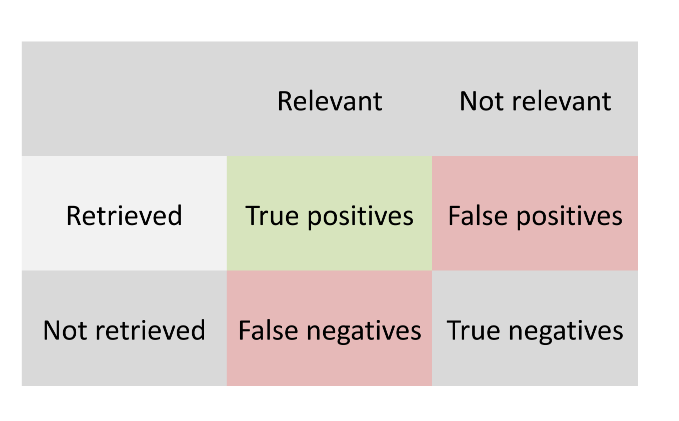
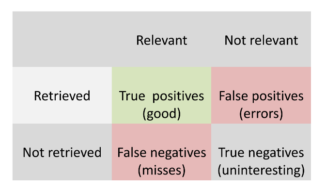
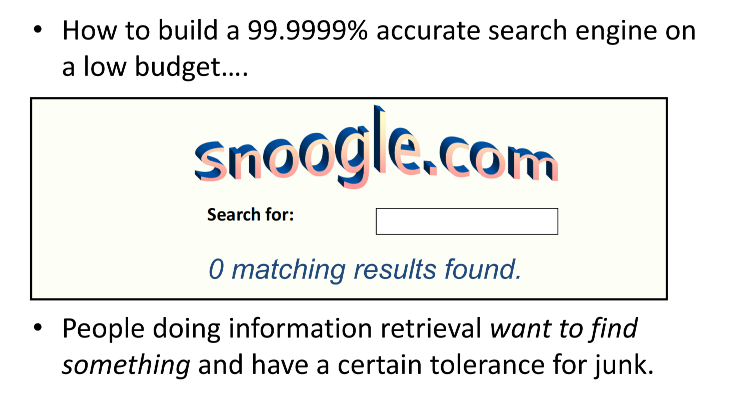

# Evaluation

### Evaluation in Information Retrieval
- How do we know if our search engine is any good?
    - Benchmarks
    - Precision and recall
    - Various measures based on precision and recall

### Measures for a search engine
- How fast does it index
    - Number of documents/hour
    - (Average document size)
- How fast does it search
    - Latency as a function of index size
- Expressiveness of query language
    - ability to express complex information needs
    - Speed on complex queries
- Uncluttered UI整洁的用户界面
- Is it free? Is it open sourse?

### What really matters
- All of the preceding criteria are measurable: we can quantify speed/size
    - we can make expressiveness precise
- The key measure: **user happiness**
    - What is this?
    - Speed of response/size of index are factors
    - But blinding fast useless answers won't make a user happy 盲目迅速的无用答案不会让用户满意
- Need a way of quantifying user happiness

### User happiness
- Web engine:
    - User finds what s/he wants and returns to the engine
        - Can measure rate of return users
    - User completes task – search as a means, not end 让用户去完成一些需要通过搜索来完成的任务，看用户是否能够达到目的
- eCommerce site: user finds what s/he wants and buys
    - Is it the end-user, or the eCommerce site, whose happiness we measure?
    - Measure time to purchase, or fraction of searchers who become buyers?
- Enterprise (company/govt/academic): Care about “user productivity”
    - How much time do my users save when looking for information?我的用户在查找信息时节省了多少时间？
    - Many other criteria having to do with breadth of access, secure access, etc 许多其他与访问范围、安全访问等有关的标准

### Happiness: difficult to measure
- Most common proxy: relevance of search results
- But how do you measure relevance?
- Relevance measurement requires 3 elements:
    1. A benchmark document collection
    2. A benchmark suite of queries
    3. A (usually binary) assessment of either Relevant or Nonrelevant for each query and each document… or a score 0-3 representing degree of relevance

### Evaluating relevance
- Note: the information need is translated into a query
- Relevance is assessed relative to the information need not the query
- For example, information need: "I'm looking for information on whether it is dangerous to buy baby food for my baby, because there might be pesticides in it."
- Query: **baby food dangerous pesticides**
- Evaluate whether the doc addresses the information need, not whether it has these words

### Remember the IR process

### Unranked retrieval evaluation

### Measures

- **Precision** = good/retrieved = tp / (tp+fp)
- **Recall** = good/relevant = good/ (good + misses) = tp / (tp+fn)

- Recall (sv. “täckning”) is sometimes called sensitivity (especially in medical contexts)

### Accuracy

- Accuracy = (tp+tn) / (tp+tn+fp+fn) = (main diagonal)/everything
- Commonly used in machine learning contexts
- Why is it not a suitable measurement when evaluating search engines？
    - 数据不平衡： 在搜索引擎评估中，数据往往存在严重的不平衡，即相关文档的数量可能明显少于不相关文档。在这种情况下，即使是高度不平衡的模型将所有文档预测为不相关，也可能获得很高的准确率，这并不反映搜索引擎在检索相关信息方面的有效性。

### Why not accuracy?

### Precision and Recall

- You can get high recall (but low precision) by retrieving all docs for all queries!
- Recall is a non-decreasing function of the number of docs retrieved
- Precision tends to decrease as the number of docs retrieved increases
    - This is not a theorem, but a result with strong empirical confirmation

### Precision and Recall
- Usually, you can not simultaneously obtain a high recall and a high precision. 
- So when do you prefer high precision?
    - In most search scenarios
- When do you prefer high recall?
    - When searching for that important mail.
    – Attorneys looking for relevant court cases. 律师寻找相关的法院案例时。
    – Intelligence officers looking for suspicious activities 情报人员寻找可疑活动时。

### Difficulties in using Precision and Recall

- Should average over large document collection/query ensembles
- Need human relevance assessments
    – People aren’t reliable assessors
- Assessments have to be binary
    - Nuanced assessments?对细微的评估
- Heavily skewed by collection/authorship 受文档集合/作者身份严重影响
    – Results may not translate from one domain to another

### A combined measure
The F1-score combines precision (P) and recall (R) as their harmonic mean:

$$F_1 = 2/(1/P + 1/R) = 2PR/(P+R)$$

The F1-score is a special case of the more general $F_β-score$.